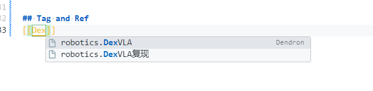

## 工程目录
通常，Dendron 的目录结构如下：
```
.
├── vault/                  # Dendron 知识库根目录
│   ├── notes/              # 默认笔记目录
│   │   ├── root.md         # 根笔记
│   │   ├── project/        # 项目相关笔记
│   │   │   └── design.md   # 设计文档
│   │   ├── area/           # 领域相关笔记
│   │   │   └── tech.md     # 技术笔记
│   │   └── resource/       # 资源相关笔记
│   │       └── books.md    # 书籍推荐
│   ├── assets/             # 资源文件（如图片）
│   └── dendron.yml         # 配置文件
```

## 创建笔记
创建笔记：使用 ctrl+shift+p 打开命令面板，输入 dendron create 便可找到 Dendron: Create Note 的选项，选择回车便可创建新的笔记。

笔记结构：笔记以 . 组织层次结构。比如虚拟层次如下：
```
.
└── project1/
    ├── designs/
    │   └── promotion.png
    ├── paperwork/
    │   └── legal.md
    └── tasks/
        ├── task1.md
        └── task2.md
```

实际层次以 . 分割，文件组织如下：
```
.
├── project1.md
├── project1.designs.md
├── project1.designs.promotion.md
├── project1.paperwork.md
├── project1.paperwork.legal.md
├── project1.tasks.md
├── project1.tasks.task1.md
└── project1.tasks.task2.md
```

### 查找
ctrl+shift+p 打开命令面板，输入 dendron lookup 便可找到 Dendron: Lookup Note 的选项，选择回车即可查找笔记。我在 whichkey 中设置了，使用 space+n+l 便可执行此命令。

支持模糊搜索，比如本 `LearDendron.md` 笔记，可以在查找的文本框输入 `Learn Dend`，便可看到候选的。

### 创建链接 (wikilinks)
鼠标悬停在 wikilinks 上可以预览内容。切回上一个 Note （可以在树状图中单机，或使用 Lookup Note 打开），随后在笔记中输入 `[[`，会弹出提示生成链接，链接为在 workspace 的各个文件。比如：[[tutorial]]。



### 导航链接
在 vim 插件环境，normal 模式可以用 `ctrl+]` 挑战对应文件。或者 `ctrl+click`。

## 粘贴图像文件
使用 Windows 时，使用 Windows 商店的 snipaste 软件 F1 截屏，可以方便地粘贴。

插件：Paste Image 可以做类似工作，但是已经集成到了 Dendron，作为 Dendron Paste Image 插件。搜索并查看用法，常见解释和配置如下：

启用 `pasteImage.showFilePathConfirmInputBox`，可以在粘贴图片和保存文件前修改路径。


用法：ctrl+shift+p 打开命令面板，输入 Dendron: Paste Image 的选项，选择回车即可粘贴图片。默认当前路径，修改会使用相对路径。在 whichkey 中，使用 space+n+p 绑定此命令。

其他配置：
* `pasteImage.defaultName` 默认图片文件名。
* `pasteImage.path` 图片文件路径。可以使用 `${currentFileDir}` 表示当前文件所在目录，并且这是默认的；`${projectRoot}` 表示当前打开的项目路径；`${currentFileName}` 表示当前包含扩展明的文件名，`${currentFileNameWithoutExt}` 则不带扩展名。
* `pasteImage.basePath` 图片的 base 路径，可以用变量和默认选择同 `pasteImage.path`。
* `pasteImage.insertPattern` 粘贴到笔记时的格式，比如：
* 其余的参考插件首页。首页详细解释了变量功能，给出了实用例子。

比如，如果不设置的情况下，我的 workspace 在目录 ~/Dendron 中，各个 .md 后缀的笔记文件在 ~/Dendron/notes 中。从剪贴板粘贴截图时，图像文件保存路径为 ~/Dendron/notes/image.png。那么 `pasteImage.path` 的值就是 `${currentFileDir}`，即 `~/Dendron/notes`，`pasteImage.defaultName` 的值就是 `image.png`。`${projectRoot}`为 ~/Dendron。

例子：
```json
"pasteImage.namePrefix": "${currentFileNameWithoutExt}_",
"pasteImage.path": "${projectRoot}/source/img",
"pasteImage.basePath": "${projectRoot}/source",
"pasteImage.forceUnixStyleSeparator": true,
"pasteImage.prefix": "/"

// 每个图像在对应文件的目录
"pasteImage.path": "${projectRoot}/source/img/${currentFileNameWithoutExt}",
"pasteImage.basePath": "${projectRoot}/source",
"pasteImage.forceUnixStyleSeparator": true,
"pasteImage.prefix": "/"
```

我在 Windwos 下，图像粘贴的路径设置 "pasteImage.path" 一直不起作用，总是保存在 "assets/images" 目录。但是，在 "pasteImage.namePrefix" 上做文章，实现在一个文件一个目录来存储文件的功能。设置为 `"pasteImage.namePrefix": "${currentFileNameWithoutExt}/"` 即可。

#### 连接 Win 和 WSL2 剪贴板
Dendron Paste Image 对剪贴板内容有依赖。Linux 需要安装 xclip，Windows 不用处理。对于 WSL2，查 DeepSeek 后，需要打通 Windows 和 WSL2 剪贴板的依赖，首先在 [link](https://github.com/equalsraf/win32yank/releases) 下载解压 win32yank，放到 /usr/local/bin 下：
```sh
sudo cp /mnt/c/path/to/win32yank.exe /usr/local/bin/win32yank
sudo chmod +x /usr/local/bin/win32yank
# 测试 Win 下复制，在 WSL2 下查看是否粘贴过来
win32yank -o
```

把 win32yank 包装成 xclip 给 Dendron Paste Image 使用：
```sh
sudo vi /usr/local/bin/xclip-wrapper
# 内容如下
#!/bin/bash
if [[ "$1" == "-o" ]]; then
  # 读取 Windows 剪贴板内容
  win32yank -o
else
  # 写入 Windows 剪贴板
  win32yank -i
fi

# 给权限和创建 soft link
sudo chmod +x /usr/local/bin/xclip-wrapper
sudo ln -sf /usr/local/bin/xclip-wrapper /usr/local/bin/xclip

# 测试，Win 下复制
xclip -o
# 在 Win 下粘贴查看是否成功
echo "Hello from WSL2" | xclip
```

但是图片还是无法处理。放弃了，在原生系统上做笔记更为方便。

## Refactor
ctrl+shift+p 打开命令面板，输入 Dendron: Refactor Hierarchy 的选项 (可以模糊搜索)，选择回车即可重命名笔记路径。

可以批量和使用通配符。比如，我有一个上层的笔记为 embody，下层有 3 个笔记，分别是 `embody.1.md，embody.2.md，embody.3.md`，那么在 Refactor Hierarchy 中，输入 `embody`，在修改时输入 `robotics`，回车。embody 则更名为 robotics，其下的笔记都会重命名为 `robotics.1.md，robotics.2.md，robotics.3.md`。

## GraphView: 呈现笔记的链接
* 显示笔记图：打开命令面板并搜索**“Dendron: Show Note Graph”**。
* 显示模式图：打开命令面板并搜索“Dendron: Show Schema Graph”。
* Show Local Graph（仅显示本地图表）：选中后，在图表中仅显示当前打开笔记为中心的本地图表。否则，显示整个工作空间的笔记图。

## Tag: 方便检索
为了保证 tag name 自动补全，在 vscode 的 settings.json 文件添加如下：
```json
"editor.suggest.snippetsPreventQuickSuggestions": false,
"editor.suggest.showSnippets": true,
"editor.tabCompletion": "on",
```

为了自动创建 tag note 文件，在 dendron.yml 文件配置如下为 true，其默认是 false：
```yaml
enableAutoCreateOnDefinition: true
```

创建：直接在笔记文件文末输入 `#tag-name`。按住 ctrl，鼠标悬停，Dendron 会自动创建 tag-name 的文件，完成创建，可以在工作目录看到 tags.<tag-name>.md 文件出现。低层都是一个笔记文件，创造了链接而已。

使用：在笔记文件的 `#tag-name` 处，按住 ctrl，鼠标悬停或点击，会得到标记为 tag-name 的所有笔记列表，并悬停在左侧侧边栏的 BACKLINKS 处。

参考 [Dendron使用教程-01 给你的笔记打上Tag - 走遍山水路的文章 - 知乎](https://zhuanlan.zhihu.com/p/669141439)

## Template
比如，我想要每次创建，都在文件末尾加上 `## Ref and Tag`，用于索引和打标签。可以使用模板实现可复用的工作。创建笔记时选择 `Create New with Template` 即可。

### 创建 Template
把模板看做一个简单的笔记文件即可。创建一个笔记文件后，`Create New with Template` 便可选择此笔记文件作为模板，会生成内容一致的笔记。

命名一般参考 `template.<template_name>.md`。

### 变量替换

## 结合 vim 插件，在 md 笔记输入中文笔记技巧

使用 `<leader>w` 实现插入状态的保存和回到普通状态。编辑笔记后，首先按 `shift` 把输入法切换到英文状态，随后 `<leader>w` 回到 normal 状态，并且英文状态适合操作和执行 vim 各类功能。适应之后，笔记可以操作得丝滑。


## 在新的目录创建 vault
I want to start clean with a new vault at a custom location: Run `Dendron: Initialize Workspace` from the command prompt (or click this link) to start from a clean slate

或者是 `Dendron: Change Workspace`。注意，此操作只能用于切换到初始化后的 Workspace。

## Tag
#入门
#使用Dendrone