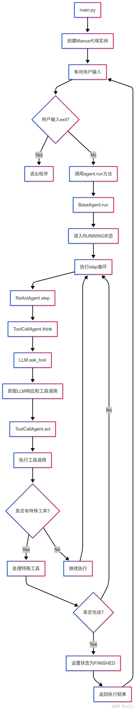
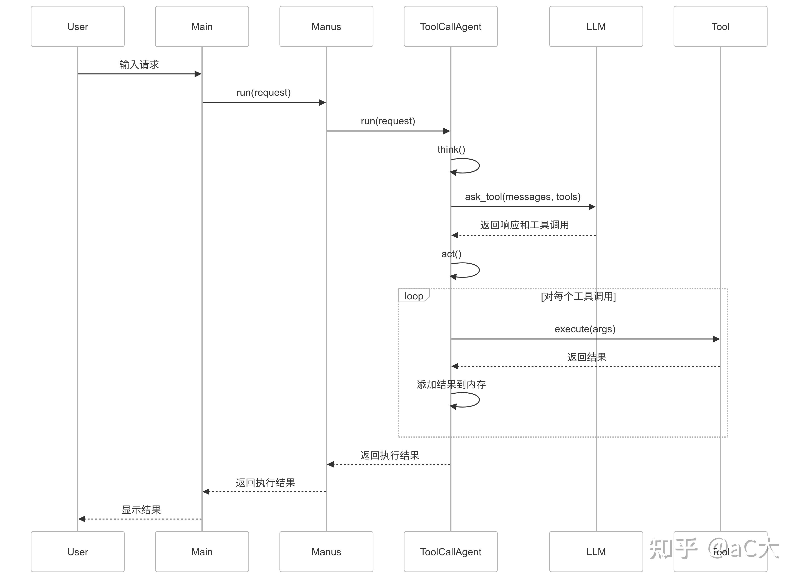
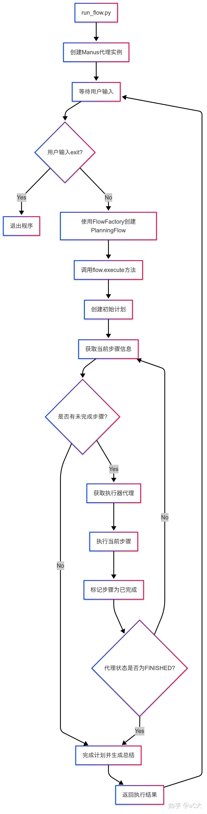
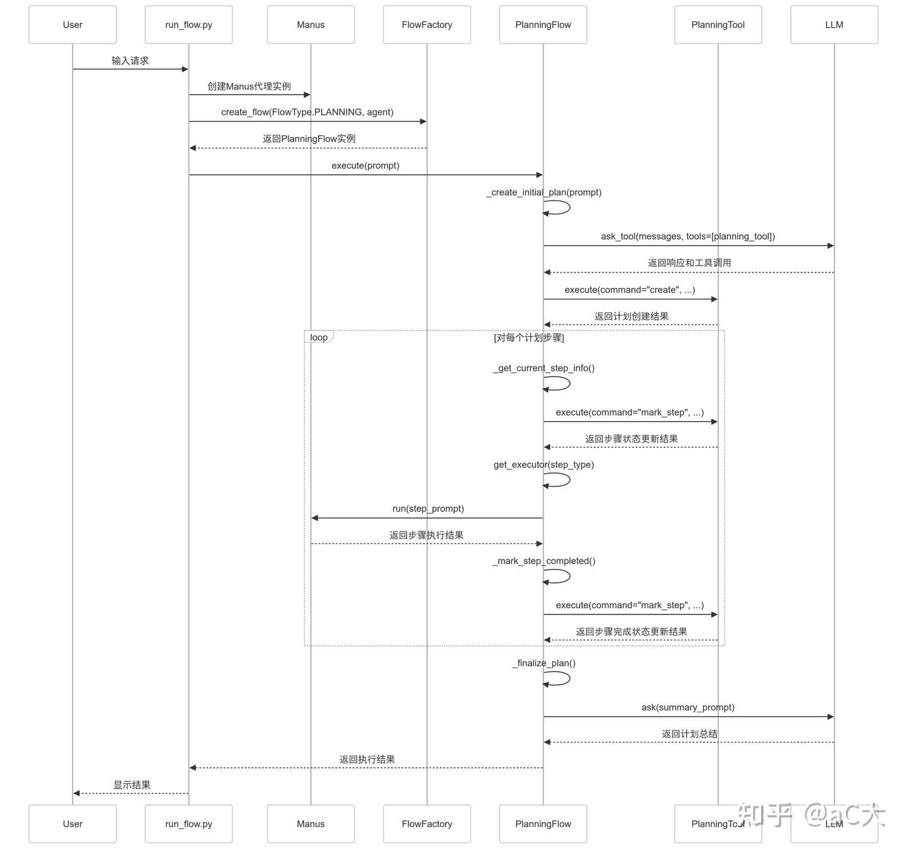
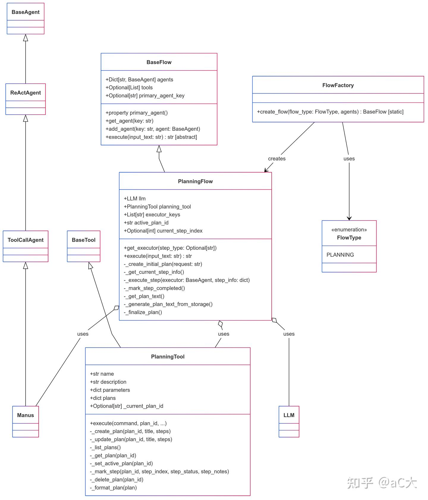
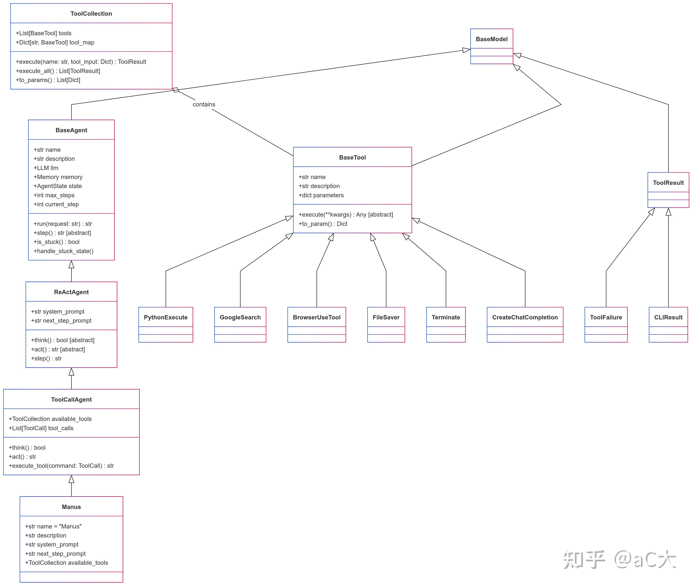

此项目架构清晰，代码优秀，值得学习。能够在 Manus 公布的几小时之后快速实现，证明此架构能够适应快速开发和试错。参考 [Github](https://github.com/mannaandpoem/OpenManus)


## 基础知识：ReAct 模式

Open Manus 实现的是一种 Reactor 模式的单 Agent 系统。Reactor 模式包含两个核心要素：Reason（推理）和 Action（行动）。其基本流程如下：
1. **用户输入 (Query):** 用户提出一个问题或指令。
2. **模型思考 (Think):** 模型对用户输入进行推理，确定需要执行的操作。
3. **行动执行 (Action/Function Call/Tool Call):** 模型选择一个工具或函数，并提供相应的参数。
4. **环境/观察 (Environment/Observation):** 执行选定的行动，并将结果反馈给模型。
5. **最终答案 (Final Answer):** 模型基于思考、行动和观察结果，生成最终的答复。

该过程可以循环进行，直到模型认为任务完成并给出最终答案。

## OpenManus 架构与运行模式

Open Manus 目前有两种运行模式：
1. **`python main` (单 Agent 模式):** 只有一个 Manus Agent，负责接收用户输入、选择工具、执行操作并返回结果。
2. **`python run_flow` (双 Agent 模式):** 包含两个 Agent：
  *  **Planning Agent:** 负责生成任务清单 (Checklist)，将复杂任务分解为多个子任务。
  *  **Manus Agent:** 负责执行 Planning Agent 生成的每个子任务。

### 单 Agent 模式 (`python main`)

用户输入直接传递给 Manus Agent，Agent 决定调用哪些工具（如 Python 代码执行、Google 搜索等），执行工具后将结果返回给 Manus Agent，最终生成并返回结果给用户。

### 双 Agent 模式 (`python run_flow`)

1. 用户输入传递给 Planning Agent。
2. Planning Agent 生成一个任务清单 (Checklist)，包含多个待办事项。
3. 针对 Checklist 中的每个任务：
  *  Manus Agent 执行任务。
  *  Manus Agent 将执行结果返回给 Planning Agent。
  *  Planning Agent 更新 Checklist，标记已完成的任务。
4. 所有任务完成后，Planning Agent 将最终结果返回给用户。

## 代码结构与模块分析

OpenManus 项目主要包含以下几个部分：

### `main.py` 和 `run_flow.py`

*  `main.py`: 单 Agent 模式的入口。
*  `run_flow.py`: 双 Agent 模式的入口。

### `open_Manus` 目录

-  **`app/agents`:** 定义了各种 Agent，其中最重要的是：
    *  `ManusAgent`: 继承自 `ToolCallingAgent`，是单 Agent 模式下的主要 Agent。
    *  `PlanningAgent`: 用于双 Agent 模式，负责任务规划。
-  **`flows`:** 包含双 Agent 模式 (`run_flow.py`) 的相关逻辑，单 Agent 模式下不使用。
-  **`prompts`:** 定义了每个 Agent 的提示信息，包括：
    *  **System Prompt:** 描述 Agent 的角色和职责。
    *  **Next Step Prompt (User Instruction):** 指示 Agent 下一步要做什么。
-  **`tools`:** 定义了 Agent 可以使用的各种工具，例如：
   *  `python_code_executor.py`: 执行 Python 代码。
   *  `google_search.py`: 进行 Google 搜索。
   *  `browser.py`: 模拟浏览器操作。
   *  `file_writer.py`: 保存文件。
   *  `finish.py`: 终止流程。

  每个 Agent 可以使用不同的工具组合。Manus Agent 可以使用上述五个工具。

## 代码执行流程 (以 `main.py` 为例)

### 初始化

*  创建 `ManusAgent` 对象。
*  Agent 对象包含：
   *  `prompt`: Agent 的提示信息。
   *  `allowed_tools`: Agent 可以使用的工具列表。

### 循环执行

1. **接收用户输入:** 等待用户输入下一条指令。
2. **Agent.run()** 调用 Agent 的 `run` 方法。
    * `run` 方法内部调用 `step` 方法。
3. **Step:** 执行单个步骤，包括：
   *  **Think:** 模型思考，决定下一步行动。
      *  获取 Next Step Prompt (用户指令)。
      *  结合 System Prompt。
      *  调用 `client.chat.completions.create` API (底层使用 LLM) 生成思考结果 (Action/Function Call)。
   *  **Act:** 根据思考结果执行相应的工具。
      *  解析思考结果中的 JSON 或 Function Call 信息。
      *  调用相应的工具函数。
      *  将工具执行结果 (Observation) 记录下来。
   *  **更新记忆 (Update Memory):** 将思考结果和工具执行结果添加到 Agent 的历史消息 (History Message) 中。
4. **判断是否终止:** 如果模型认为任务已完成，则调用 `finish.py` 终止流程。
5. **返回结果:** 将最终结果返回给用户。
6. **循环:** 回到步骤 1，等待下一条指令。


### `ToolCallingAgent` 与 `ReActAgent`

*  `ManusAgent` 继承自 `ToolCallingAgent`。
*  `ToolCallingAgent` 实现了 React 模式的具体逻辑。
*  `ReActAgent` 定义了基本的 `run` 和 `step` 方法，实现 Think-Act-Observe 的循环过程。

### 工具执行 (`execute_tool`)

*  解析 Action/Function Call 中的 JSON 数据。
*  根据解析结果调用相应的工具函数。
*  将工具执行结果作为 Observation 返回。
*  将 Observation 添加到 Agent 的历史消息中。

## 双 Agent 模式 (`run_flow.py`) 流程简述

1. **初始化 Planning Agent:** 创建 `PlanningAgent` 对象。
2. **生成 Checklist:** Planning Agent 根据用户输入生成任务清单。
3. **循环执行 Checklist 中的每个任务:**
   *  获取当前步骤 (Step)。
   *  确定执行者 (Executor)，始终为 `ManusAgent`。
   *  `ManusAgent` 执行任务，使用其可用的工具。
   *  `ManusAgent` 将执行结果返回给 `PlanningAgent`。
   *  `PlanningAgent` 更新 Checklist 和状态。
4. **判断是否终止:** 如果 `ManusAgent` 认为任务完成，则触发终止流程。
5. **返回结果:** `PlanningAgent` 将最终结果返回给用户。

双 Agent 模式需要模型具备较强的规划能力。

## 总结

Open Manus 项目提供了一个学习和研究基于 LLM 的 Agent 系统的良好范例。其代码结构清晰，模块化设计良好，易于理解和扩展。通过对 Open Manus 源代码的深入分析，可以掌握 Reactor 模式、Agent 设计、工具调用等关键概念，并了解如何构建一个基于 LLM 的智能 Agent 系统。

## 工作流程

### main.py





- 入口调用: main.py 创建 Manus 实例并调用 run方法处理用户输入。
- 代理层次: BaseAgent -> ReActAgent -> ToolCallAgent -> Manus，每一层增加特定功能。
- 执行流程: 用户输入 -> 代理处理 -> LLM思考 -> 工具调用 -> 结果返回 -> 循环或完成。
- 工具管理: ToolCollection 管理多个 BaseTool 实例，提供统一的执行接口。
- 内存管理: 代理使用 Memory 存储消息历史，用于上下文理解和决策。

### run_flow.py

- 创建Manus代理实例
- 接收用户输入
- 使用FlowFactory创建PlanningFlow实例
- 执行Flow处理用户请求
- 返回执行结果











项目基于 Agent，是一个工作流的自动化框架，支持复杂任务的规划、执行和验证。系统通过可拓展的工具集和提示模板库，实现灵活的任务处理能力。

Agent 系统的集成结构如下：


对于单个 agent，即 main.py，只关心了 Manus 的调用。设计的继承关系是 Manus -> BrowserAgent -> ToolCallAgent -> ReActAgent -> BaseAgent。对于 run_flow.py，需要根据 FlowFactory 创建 FlowType 类型对象，再调用其 execute(prompt) 来执行。目前只涉及到 PlanningFlow。

BaseAgent 定义了 run() 的流程，循环调用 step() 不断执行和更新 AgentState 是否为 Finished。ReActAgent 定义了 step()，先 think() 再 act()。ToolCallAgent 实现了具体的 think() 和 act()。后续的子类继承时，通常只会再修改部分内容。

## agent

### BaseAgent

集成了 BaseModel 和 ABC，是抽象的基类。常用成员有：
- name: 需显式提供
- system_prompt: 系统级别的指令提示
- next_step_prompt: 提示决定下一步动作
- llm: LLM，具体参考 tool 目录。常用的是 ask(), ask_with_images() 和 format_messages() 方法
- memory: List[Message] 保存询问的 Message，提供给子类来询问 LLM。设计为 List，能够保存上下文，有 QA 历史。Message 有不同分类，
- state: 状态包含 AgentState 中的 IDLE, RUNNING, FINISHED, ERROR
- current_step 
- max_steps 当 current_step 的超过 max_steps 时，跳出循环。

initialize_agent() 主要初始化 self.llm。state_context() 是异步上下文管理器，用于切换状态。update_memory() 添加 Message 到 memory。一次仅更新一个角色的 Message。

run() 执行主要的循环。

```py
    async def run(self, request: Optional[str] = None) -> str:
        """Execute the agent's main loop asynchronously.

        Args:
            request: Optional initial user request to process.

        Returns:
            A string summarizing the execution results.

        Raises:
            RuntimeError: If the agent is not in IDLE state at start.
        """
        if self.state != AgentState.IDLE:
            raise RuntimeError(f"Cannot run agent from state: {self.state}")

        if request:
            self.update_memory("user", request)

        results: List[str] = []
        async with self.state_context(AgentState.RUNNING):
            while (
                self.current_step < self.max_steps and self.state != AgentState.FINISHED
            ):
                self.current_step += 1
                logger.info(f"Executing step {self.current_step}/{self.max_steps}")
                step_result = await self.step()

                # Check for stuck state
                if self.is_stuck():
                    self.handle_stuck_state()

                results.append(f"Step {self.current_step}: {step_result}")

            if self.current_step >= self.max_steps:
                self.current_step = 0
                self.state = AgentState.IDLE
                results.append(f"Terminated: Reached max steps ({self.max_steps})")
        await SANDBOX_CLIENT.cleanup()
        return "\n".join(results) if results else "No steps executed"
```

run() 是异步的，执行直到状态切换为 FINISHED 或超过最大步数。在 step() 中执行，操作得到最终的状态。具体由 act() 来切换状态。

prompt 是如何组织的？run() 的参数传入了 request，并存入 memory，在后续的过程中，由 think() 和 act() 取出并使用。注意 self.is_stuck()，当循环出现了与最后一条信息相同的重复内容，需要处理困境。

```py
    @abstractmethod
    async def step(self) -> str:
        """Execute a single step in the agent's workflow.

        Must be implemented by subclasses to define specific behavior.
        """
```

### ReActAgent: think(), act(), step() 分别会做什么？

继承了 BaseAgent，负责思考，执行。step() 方法会先调用 think()，得到是否应该执行的判断。如果可以，则执行，并返回执行后的字符串。如果不该执行，返回 "Thinking complete - no action needed"。

```py
    @abstractmethod
    async def think(self) -> bool:
        """Process current state and decide next action"""

    @abstractmethod
    async def act(self) -> str:
        """Execute decided actions"""

    async def step(self) -> str:
        """Execute a single step: think and act."""
        should_act = await self.think()
        if not should_act:
            return "Thinking complete - no action needed"
        return await self.act()
```

think() 和 act() 在具体子类中实现，比如 class ToolCallAgent 中，实现了 think() 和 act()。子类 BrowserAgent 和 Manus 都在 think() 上额外增加了一些判断工作

### ToolCallAgent(ReActAgent)

此 Agent 用于函数或工具调用，主要关注 think() 和 act()。

#### 字段（初始化）

available_tools: ToolCollection 目前值包含两个工具：CreateChatCompletion(), Terminate()

special_tool_names: List[str] 包含 Terminate().name，标识交互结束，打印状态。

#### think()

总体概念：根据 prompt 和当前工具，向 LLM 请求。如果返回了工具调用的内容，则保存到 self.tool_calls，并且返回 True。否则，返回 False 或抛出异常。

首先，把 self.next_step_prompt 添加到 self.messages。注意，子类可能会覆盖 next_step_prompt。随后向 LLM 询问下一步使用何种工具，即 self.llm.ask_tool()。组织 self.next_step_prompt 为 user message。如果 ask_tool() 出现异常，添加信息到 assistant message，下次请求 LLM 可以提供作为背景。

对于 system prompt 的设置，都会加载到 self.messages 之前，作为第一条对话的上下文设置。

tools 参数中，根据 self.available_tools.to_params() 构造仅包含字符串的 dict，用于作为请求中的 "tools" 对应的数组。即 `"tools": [{...}...]` 部分。

```py
    async def think(self) -> bool:
        """Process current state and decide next actions using tools"""
        if self.next_step_prompt:
            user_msg = Message.user_message(self.next_step_prompt)
            self.messages += [user_msg]

        try:
            # Get response with tool options
            response = await self.llm.ask_tool(
                messages=self.messages,
                system_msgs=(
                    [Message.system_message(self.system_prompt)]
                    if self.system_prompt
                    else None
                ),
                tools=self.available_tools.to_params(),
                tool_choice=self.tool_choices,
            )
            ...
```

response 为 ChatCompletionMessage 类型，tool_calls 的每个对象是 ChatCompletionMessageToolCall，参考 ToolCall 和 Function。

```py
    async def think(self) -> bool:
        ...
        self.tool_calls = tool_calls = (
            response.tool_calls if response and response.tool_calls else []
        )
        content = response.content if response and response.content else ""
        ...
        try:
            ...
            # Handle different tool_choices modes
            if self.tool_choices == ToolChoice.NONE:
                if tool_calls: # 如果有工具
                    logger.warning(
                        f"🤔 Hmm, {self.name} tried to use tools when they weren't available!"
                    )
                if content:
                    self.memory.add_message(Message.assistant_message(content))
                    return True
                return False

            # Create and add assistant message
            assistant_msg = (
                Message.from_tool_calls(content=content, tool_calls=self.tool_calls)
                if self.tool_calls
                else Message.assistant_message(content)
            )
            self.memory.add_message(assistant_msg)

            if self.tool_choices == ToolChoice.REQUIRED and not self.tool_calls:
                return True  # Will be handled in act()

            # For 'auto' mode, continue with content if no commands but content exists
            if self.tool_choices == ToolChoice.AUTO and not self.tool_calls:
                return bool(content)

            return bool(self.tool_calls)
            ...
```

llm 给与 response 后，解析并保存选择到 self.tool_calls，还有 content。根据 self.tool_choices，影响如下：
- ToolChoice.None 不需要调用工具。如果有 content 的回复，组织为 Message 并保存到 self.memory 中，作为 assistant_message，并返回 True。无 content 返回 False。
- 如果 self.tool_calls 中有需要调用的函数，则作为 assistant message 保存到 self.memory 中。tool_calls 保存到 message.tool_calls 字段。如果 self.tool_choices 为 ToolChoice.Required 且 self.tool_calls 有工具可以调用，返回 True。如果 AUTO，根据 content 是否存在内容，返回 True or False。如果以上情况都没有考虑到，则查看 bool(self.tool_calls)。

比如，传入可以调用的工具有 CreateChatCompletion(), Terminate()，并且都序列化为了 dict。大模型能够知道调用这两个。以 CreateChatCompletion() 为例，to_param() 方法调用后，得到：

```json
{
    "type": "function",
    "function": {
        "name": "create_chat_completion",
        "description": "Creates a structured completion with specified output formatting.",
        "parameters": {
                "type": "object",
                "properties": {
                    "response": {
                        "type": "string",
                        "description": "The response text that should be delivered to the user.",
                    },
                },
                "required": ["response"],
            },
    },
}
```

#### act()

根据 think() 更新的 self.tool_calls 准备调用 self.execute_tool 逐个执行 tool_call。如果 self.tool_calls 没有内容，并且要求 self.tool_choices == ToolChoice.REQUIRED，则抛出异常。否则返回 self.messages[-1].content 或 "No content or commends to execute".

具体地，遍历 self.tool_calls，调用 self.execute_tool(command) 来执行 tool_call。返回得到的 result，并且以 tool message 存储到 memory，提供上下文。

最后，使用两个换行符拼接每个 result，作为 act() 方法的返回。

#### execute_tool()

接受参数是 ToolCall，与 openai 返回的 ChatCompletionMessageToolCall 一样。调用比如 CreateChatCompletion 或 PlanningTool 的 execute() 方法。

方法首先判断有效，是否出现 None 等。

由于参数 command.function.arguments 是字符串类型，但是保存的是 JSON 对象。所以使用 json.loads()，得到字典格式。随后调用 self.available_tools.execute()，传入的参数是函数名和 dict 形式的参数。根据 name，函数名获取工具，比如 CreateChatCompletion()。随后会调用它的 execute() 方法来完成，接收参数为 args，即 tool_input=args。

```py
    async def execute_tool(self, command: ToolCall) -> str:
        ...
        name = command.function.name
        ...
        try:
            # Parse arguments
            args = json.loads(command.function.arguments or "{}")
            result = await self.available_tools.execute(name=name, tool_input=args)
            # Handle special tools
            await self._handle_special_tool(name=name, result=result)
            # Check if result is a ToolResult with base64_image
            if hasattr(result, "base64_image") and result.base64_image:
                # Store the base64_image for later use in tool_message
                self._current_base64_image = result.base64_image

                # Format result for display
                observation = (
                    f"Observed output of cmd `{name}` executed:\n{str(result)}"
                    if result
                    else f"Cmd `{name}` completed with no output"
                )
                return observation

            # Format result for display (standard case)
            observation = (
                f"Observed output of cmd `{name}` executed:\n{str(result)}"
                if result
                else f"Cmd `{name}` completed with no output"
            )

            return observation
        ...
```

遇到特殊工具，比如 Terminate()，则更新 AgentState.FINISHED。

执行后反馈结果到字符串。尽管结果 result 可能是 ToolResult 的，但是对齐调用 str() 方法，可以格式化地输出各个字段。

### PlanningAgent(ToolCallAgent)

创建和管理规划来解决问题。使用规划工具，管理结构化的规划，记录进度直到完成。

#### 字段

self.system_prompt 修改为自己版本。使用 PLANNING_SYSTEM_PROMPT 和 NEXT_STEP_PROMPT。注意，子类能修改父类同名的字段，比如父类 ToolCallAgent 使用 self.system_prompt 和 self.next_step_prompt 时，子类 PlanningAgent 也修改了，最后使用子类修改的版本，即 PLANNING_SYSTEM_PROMPT 等。

self.tool_calls: List[ToolCall] 与父类 ToolCallAgent 不同，包含了 PlanningTool() 和 Terminate()。

self.active_plan_id: str | None 当前活跃的 plan_id，可以通过 PlanningTool 的 execute("get")。当初始化 PlanningAgent 后，在 initialize_plan_and_verify_tools() 中初始化为 f"plan_{int(time.time())}"。

#### run()

```py
    async def run(self, request: Optional[str] = None) -> str:
        """Run the agent with an optional initial request."""
        if request:
            await self.create_initial_plan(request)
        return await super().run()
```

根据 request，创建初始化的计划。

##### create_initial_plan()

create_initial_plan() 根据 request，创建 user message，并请求 llm.ask_tool()。得到响应 response: ChatCompleteMessage。

随后组织响应内容的 content 和 tool_calls 到 assistant message，存入 self.memory 中。再遍历 response.tool_calls，找到 function.name 为 "planning" 的工具，由 self.execute_tool() 执行 planning 的 tool_call。最终，执行对应 PlanningTool.execute() 方法，保存结构化的 ToolResult 为 str，以 tool message 形式添加到 self.memory。

#### think()

整合当前 plan 的状态和 next_step_prompt 到 prompt，存入 self.messages。调用上级思考，即 super().think() 来获取 result 判断是否该 act。根据 self.available_tools 判断应该调用的 tool_calls。

_get_current_step_index() 根据 self.active_plan_id 计划，标记计划中第一个未开始或处理中的 step 为 "in_progress"，并返回此下标，同时设置 self.current_step_index。

super().think() 思考应该执行的工具，并且更新到 self.tool_calls 字段。

若 result 为 True，即应该执行 act，且更新了 self.tool_calls，需要执行工具。那么设置 self.step_execution_tracker[latest_tool_call.id]，随后在 self.act() 方法中用到它，以追踪计划的状态。
- "step_index": 下一步 act() 方法该推进的 step 下标
- "tool_name": 应当使用的工具名
- "status": 状态

疑惑，调用 super().think() 时，向 LLM 请求时，传入工具有两个，self.tool_calls 会有多个吗？

```py
    async def think(self) -> bool:
        """Decide the next action based on plan status."""
        prompt = (
            f"CURRENT PLAN STATUS:\n{await self.get_plan()}\n\n{self.next_step_prompt}"
            if self.active_plan_id
            else self.next_step_prompt
        )
        self.messages.append(Message.user_message(prompt))

        # Get the current step index before thinking
        self.current_step_index = await self._get_current_step_index()

        result = await super().think()

        # After thinking, if we decided to execute a tool and it's not a planning tool or special tool,
        # associate it with the current step for tracking
        if result and self.tool_calls:
            latest_tool_call = self.tool_calls[0]  # Get the most recent tool call
            if (
                latest_tool_call.function.name != "planning"
                and latest_tool_call.function.name not in self.special_tool_names
                and self.current_step_index is not None
            ):
                self.step_execution_tracker[latest_tool_call.id] = {
                    "step_index": self.current_step_index,
                    "tool_name": latest_tool_call.function.name,
                    "status": "pending",  # Will be updated after execution
                }

        return result
```

##### get_plan(): 获取当前 plan 的状态

self.active_plan_id 默认是 None，需要有设置和 create。如果非 None 则报错。获取 plan 的状态。调用的 PlanningTool._get_plan()，返回格式化的整个 plan 的状态。

#### act()

执行一次推进，如果执行后，将 self.step_execution_tracker 中，对应 step 的状态设置为 "completed"，记录结果 "result" 为执行工具后的结果。

如果工具调用不是 "planning" 和特殊工具，调用 self.update_plan_status() 方法更新。

```py
    async def act(self) -> str:
        """Execute a step and track its completion status."""
        result = await super().act()

        # After executing the tool, update the plan status
        if self.tool_calls:
            latest_tool_call = self.tool_calls[0]

            # Update the execution status to completed
            if latest_tool_call.id in self.step_execution_tracker:
                self.step_execution_tracker[latest_tool_call.id]["status"] = "completed"
                self.step_execution_tracker[latest_tool_call.id]["result"] = result

                # Update the plan status if this was a non-planning, non-special tool
                if (
                    latest_tool_call.function.name != "planning"
                    and latest_tool_call.function.name not in self.special_tool_names
                ):
                    await self.update_plan_status(latest_tool_call.id)

        return result
```

##### update_plan_status()

根据 tool_call.id，从 self.step_execution_tracker 取出对应的 "step_index"，通过 self.available_tools 执行 planning 工具，调用 "mark_step" 更新对应 step 状态为 "completed"。

```py
    async def update_plan_status(self, tool_call_id: str) -> None:
        ...
        try:
            # Mark the step as completed
            await self.available_tools.execute(
                name="planning",
                tool_input={
                    "command": "mark_step",
                    "plan_id": self.active_plan_id,
                    "step_index": step_index,
                    "step_status": "completed",
                },
            )
        ...
```

####  总结计划创建到完结的状态变化过程

"not started" 或 "in_progress" -> "in_progress": 在 think() 调用 _get_current_step_index() 中，将第一个未开始或推进中的 step 标记为 "in_progress"。

"in_progress" -> "completed"：在 act() 调用 update_plan_status() 中，将对应 step 完成。

## tool 目录

### Base

ToolCallAgent 用到的工具等，在这里定义。

#### BaseTool

BaseTool 是抽象类，主要包含三个字段。方法主要使用 to_param() -> Dict，用于组织 OpenAI 的 API 请求主体的 "tools" 字段。description 要尽可能详细，提供给 LLM，方便规划调用的内容。

```py
class BaseTool(ABC, BaseModel):
    name: str
    description: str
    parameters: Optional[dict] = None

    async def __call__(self, **kwargs) -> Any:
        """Execute the tool with given parameters."""
        return await self.execute(**kwargs)

    @abstractmethod
    async def execute(self, **kwargs) -> Any:
        """Execute the tool with given parameters."""

    def to_param(self) -> Dict:
        """Convert tool to function call format."""
        return {
            "type": "function",
            "function": {
                "name": self.name,
                "description": self.description,
                "parameters": self.parameters,
            },
        }}
```

#### ToolResult

工具调用结果：

```py
class ToolResult(BaseModel):
    output: Any = Field(default=None)
    error: Optional[str] = Field(default=None)
    base64_image: Optional[str] = Field(default=None)
    system: Optional[str] = Field(default=None)
    ...

class CLIResult(ToolResult):
    """A ToolResult that can be rendered as a CLI output."""

class ToolFailure(ToolResult):
    """A ToolResult that represents a failure."""
```

最后两个 CLIResult 和 ToolFailure 用于标识，提高工具调用结果可读性。

### ToolCollection

提供工具的容器，通常放到 Agent 的字段中。通常调用 execute() 方法，将 name 对应的 tool，传入字典参数 tool_input，随后会展开并传给 `tool(**tool_input)`，最后调用 tool.execute(**tool_input)。

```py
class ToolCollection:

    class Config:
        arbitrary_types_allowed = True

    def __init__(self, *tools: BaseTool):
        self.tools = tools
        self.tool_map = {tool.name: tool for tool in tools}

    def __iter__(self):
        return iter(self.tools)

    def to_params(self) -> List[Dict[str, Any]]:
        return [tool.to_param() for tool in self.tools]

    async def execute(
        self, *, name: str, tool_input: Dict[str, Any] = None
    ) -> ToolResult:
        tool = self.tool_map.get(name)
        if not tool:
            return ToolFailure(error=f"Tool {name} is invalid")
        try:
            result = await tool(**tool_input)
            return result
        except ToolError as e:
            return ToolFailure(error=e.message)

    async def execute_all(self) -> List[ToolResult]:
        """Execute all tools in the collection sequentially."""
        results = []
        for tool in self.tools:
            try:
                result = await tool()
                results.append(result)
            except ToolError as e:
                results.append(ToolFailure(error=e.message))
        return results

    def get_tool(self, name: str) -> BaseTool:
        return self.tool_map.get(name)

    def add_tool(self, tool: BaseTool):
        self.tools += (tool,)
        self.tool_map[tool.name] = tool
        return self

    def add_tools(self, *tools: BaseTool):
        for tool in tools:
            self.add_tool(tool)
        return self
```

### PlanningTool

允许 Agent 创建和管理复杂任务，此工具提供创建任务，更新任务步和追踪进度的功能。执行的功能不会在此处运行，PlanningTool 旨在更新工具的状态。比如 step

#### 字段

```py
class PlanningTool(BaseTool):
    name: str = "planning"
    description: str = _PLANNING_TOOL_DESCRIPTION
    parameters: dict = {
        "type": "object",
        "properties": {
            "command": {
                "description": "The command to execute. Available commands: create, update, list, get, set_active, mark_step, delete.",
                "enum": [
                    "create",
                    "update",
                    "list",
                    "get",
                    "set_active",
                    "mark_step",
                    "delete",
                ],
                "type": "string",
            },
            "plan_id": {
                "description": "Unique identifier for the plan. Required for create, update, set_active, and delete commands. Optional for get and mark_step (uses active plan if not specified).",
                "type": "string",
            },
            "title": {
                "description": "Title for the plan. Required for create command, optional for update command.",
                "type": "string",
            },
            "steps": {
                "description": "List of plan steps. Required for create command, optional for update command.",
                "type": "array",
                "items": {"type": "string"},
            },
            "step_index": {
                "description": "Index of the step to update (0-based). Required for mark_step command.",
                "type": "integer",
            },
            "step_status": {
                "description": "Status to set for a step. Used with mark_step command.",
                "enum": ["not_started", "in_progress", "completed", "blocked"],
                "type": "string",
            },
            "step_notes": {
                "description": "Additional notes for a step. Optional for mark_step command.",
                "type": "string",
            },
        },
        "required": ["command"],
        "additionalProperties": False,
    }

    plans: dict = {}  # Dictionary to store plans by plan_id
    _current_plan_id: Optional[str] = None  # Track the current active plan
```

可以看到，self.parameters 指出的 JSON 对象比较复杂，包含了 key 有：
- type: 指出参数类型
- properties： 对应函数的参数属性，描述了函数接受的具体参数。比如 command，类型是枚举的 string。
- required: 必选的参数

注意，请求 LLM 后，得到的响应体中，tool_calls.function.arguments 是一个字符串，可以解析为 JSON 格式。

#### 状态

一个计划对应几个 step，工作步骤，可以串行或并行推进。每个步骤都会有状态，对应 ["not_started", "in_progress", "completed", "blocked"]，在 PlanningAgent 中不断推进，更新完成状态。

#### execute()

```py
    async def execute(
        self,
        *,
        command: Literal[
            "create", "update", "list", "get", "set_active", "mark_step", "delete"
        ],
        plan_id: Optional[str] = None,
        title: Optional[str] = None,
        steps: Optional[List[str]] = None,
        step_index: Optional[int] = None,
        step_status: Optional[
            Literal["not_started", "in_progress", "completed", "blocked"]
        ] = None,
        step_notes: Optional[str] = None,
        **kwargs,
    ):
```

执行时，根据 command 参数来执行各种任务，并且提供各种可能用到的参数。最后，将 _current_plan_id 设置为 plan_id。

思考此设计方案。通常，一个函数或方法负责太多内容，都会拆开，步入直接使用 _create_plan() 而非通过 execute() 并传入参数的方式。或者为了扩展性，使用 IoC 的方式，注入方法来调用。比如：

```py
class PlanningTool(...):
    @staticmethod
    def create_execute_task(...) -> PlanningTask:
        ...

# 伪代码
self.tool.execute(PlanningTool.CREATE, plan_id = ...)
# 或者直接封装调用
self.tool.execute(PlanningTool.create_execute_task(...))
```

但是，设计为使用 execute() 来 dispatch 任务，能够保持一致，也是设计和现实的一种折中方案。代码也保持了整洁。

#### _create_plan()

创建新的 plan，每个 plan 由 plan_id, title 和 steps 标识。每个 plan 是一个dict，根据 plan_id 保存到 self.plans[plan_id]。更新和创建的 schema 具体如下： 

```py
        plan = {
            "plan_id": plan_id,
            "title": title,
            "steps": steps,
            "step_statuses": ["not_started"] * len(steps),
            "step_notes": [""] * len(steps),
        }

        self.plans[plan_id] = plan
        self._current_plan_id = plan_id  # Set as active plan
```

#### _update_plan()

根据 plan_id，更新 title 和 step_status, step_notes 等 key 对应的 value。创建 plan 后，如果需要修改 steps: List[str]。比如扩充长度，或者截断来选取部分。对于原来部分，保持不变，新扩充部分的 step_statuses 部分全部为 "not_started", step_notes 新扩充部分全部为空字符串。

```py
            old_steps = plan["steps"]
            old_statuses = plan["step_statuses"]
            old_notes = plan["step_notes"]

            # Create new step statuses and notes
            new_statuses = []
            new_notes = []

            for i, step in enumerate(steps):
                # If the step exists at the same position in old steps, preserve status and notes
                if i < len(old_steps) and step == old_steps[i]:
                    new_statuses.append(old_statuses[i])
                    new_notes.append(old_notes[i])
                else:
                    new_statuses.append("not_started")
                    new_notes.append("")

            plan["steps"] = steps
            plan["step_statuses"] = new_statuses
            plan["step_notes"] = new_notes

        return ToolResult(
            output=f"Plan updated successfully: {plan_id}\n\n{self._format_plan(plan)}"
        )
```

#### _get_plan() -> ToolResult

传入 plan_id 如果为 None，返回 _current_plan_id 对应的 plan 的状态。若 plan_id 不为 None，返回对应的 plan 的状态。

ToolResult.output 时字符串，报告了此 plan 的详细状态。例如：

```py
ToolResult(
    output="""Plan: Summer Vacation Plan (ID: vacation_plan)
============================

Progress: 1/3 steps completed (33.3%)
Status: 1 completed, 1 in progress, 0 blocked, 1 not started

Steps:
0. [✓] Book flight tickets
1. [→] Pack luggage
   Notes: Remember to bring sunscreen
2. [ ] Reserve hotel"""
)
```

输出格式说明：
1. 标题行显示计划名称和 ID
2. 进度条显示完成百分比
3. 状态统计行显示各状态步骤数
4. 步骤列表使用符号表示状态：
    - `[✓]` 已完成
    - `[→]` 进行中
    - `[!]` 被阻塞
    - `[ ]` 未开始
5. 如果有备注 (notes) 会显示在步骤下方缩进，如例子 1

#### _format_plan() -> str

报告了 plan_id 对应计划的进度。从总体情况描述了进度，包括完成、处理中、阻塞和未开始状态的 steps 数量。最后再逐个 step 报告进度。

#### _mark_step(): 更新状态

根据 plan_id (如果为 None，操作 _current_plan_id)，更新对应 step_index 的 plan，将 status 和 notes 更新。最后返回 ToolResult，报告状态。

状态可以是 ["not_started", "in_progress", "completed", "blocked"] 之一。


### CreateChatCompletion

根据 LLM 输出，创建结构化的 completion。

```py
class CreateChatCompletion(BaseTool):
    name: str = "create_chat_completion"
    description: str = (
        "Creates a structured completion with specified output formatting."
    )
    # Type mapping for JSON schema
    type_mapping: dict = {
        str: "string",
        int: "integer",
        float: "number",
        bool: "boolean",
        dict: "object",
        list: "array",
    }
    response_type: Optional[Type] = None
    required: List[str] = Field(default_factory=lambda: ["response"])

    def __init__(self, response_type: Optional[Type] = str):
        super().__init__()
        self.response_type = response_type
        self.parameters = self._build_parameters()
```

type_mappping 根据 Python 的基础类型，映射到 JSON 的类型。类型也可以作为函数或方法的参数传入。self.response_type 默认为 str。而 self._build_parameters() 根据 self.response_type 构建 dict。得到：

```py
{
    "type": "object",
    "properties": {
        "response": {
            "type": "string",
            "description": "The response text that should be delivered to the user.",
        },
    },
    "required": self.required,
}
```

execute() 方法则执行 chat completion。从 required 列表中的 key，选取到后面 kwargs 对应的值。比如 `execute(["key1"], key1="Value1")`。如果没有指定，则从 "response" 中选取 "response" 不分，若不存在则用空字符串返回。最后，将回答阻值为 self.response_type 的类型。

```py
    async def execute(self, required: list | None = None, **kwargs) -> Any:
        # 等价于 required = required if required is not None else self.required
        required = required or self.required

        if isinstance(required, list) and len(required) > 0:
            if len(required) == 1:
                required_field = required[0]
                result = kwargs.get(required_field, "")
            else:
                # Return multiple fields as a dictionary
                return {field: kwargs.get(field, "") for field in required}
        else:
            required_field = "response"
            result = kwargs.get(required_field, "")

        # Type conversion logic
        if self.response_type == str:
            return result

        if isinstance(self.response_type, type) and issubclass(
            self.response_type, BaseModel
        ):
            return self.response_type(**kwargs)

        if get_origin(self.response_type) in (list, dict):
            return result  # Assuming result is already in correct format

        try:
            return self.response_type(result)
        except (ValueError, TypeError):
            return result
```

### Terminal

请求 CLI 命令到系统。

### Terminate

```py
class Terminate(BaseTool):
    name: str = "terminate"
    description: str = _TERMINATE_DESCRIPTION
    parameters: dict = {
        "type": "object",
        "properties": {
            "status": {
                "type": "string",
                "description": "The finish status of the interaction.",
                "enum": ["success", "failure"],
            }
        },
        "required": ["status"],
    }

    async def execute(self, status: str) -> str:
        """Finish the current execution"""
        return f"The interaction has been completed with status: {status}"
```

标识调用工具链的终止，ToolCallAgent 的。执行 execute() 后，得到交互完成和结束的 status。

## llm.LLM

负责与 LLM 或 VLM 交互，可以看做是一个 Client。OpenManus 耦合了 VLM 和 LLM。提供了询问接口，ask(), ask_tool() 和 ask_with_images() 方法。也许可以再分层，设计为 LLMBase，子类为 RawLLM, VLM, ToolLLM。

字段：
- model: str 标识模型名
- max_tokens: int
- max_input_tokens: int | None，指定上下文长度。
- api_type: str
- api_key: str
- base_url: str
- self.client 在 `__init__` 中使用 self.api_key 和 self.base_url 实例化一个 AsyncOpenAI
- temperature: float

静态方法
- format_messages() 格式化为 OpenAI message format。接收参数是是字典，或 class Message 的实例，随后会转化为字典。通常都会传入 Message 的实例，而非字典。

方法

#### ask()

根据传入的 Message，组织格式后，组织传递给 OpenAI 客户端的并获取内容。

stream 默认为 True，streaming 请求

#### format_messages(): 静态方法

## schema

定义了请求的相关的 schema，就像数据库中，规定表的 schema 一样，用于规定请求语句的 schema。主要包含:
- Role: 决定请求中的 "role" 字段
- ToolChoice: 决定 "tools" 字段
- AgentState: 决定 Agent 状态
- ToolCall 和 Function: 决定 "tool_calls" 字段内容
- ToolChoice: 决定 "tool_choice" 字段内容
- Message: 整合上述所有内容，最后可以调用 to_dict() 获取字典形式的请求信息。子模型也会递归地转化为字典。比如 ToolCall 中的 function 是一个实例，而非字符串，也会由 model_dump() 为字典。比如 {"id": tool_call["id"], ..., "function": {"name": tool_call["function"]["name"], ...}}
- Memory: 存储多条 Message，提供对话历史。

### ToolCall

工具选择相关的内容，都在这几个部分：

```py
class ToolChoice(str, Enum):
    """Tool choice options"""

    NONE = "none"
    AUTO = "auto"
    REQUIRED = "required"

TOOL_CHOICE_VALUES = tuple(choice.value for choice in ToolChoice)
TOOL_CHOICE_TYPE = Literal[TOOL_CHOICE_VALUES]  # type: ignore，用于 typehint，要求必须是 ToolChoice.AUTO 等

class Function(BaseModel):
    name: str
    arguments: str


class ToolCall(BaseModel):
    """Represents a tool/function call in a message"""

    id: str
    type: str = "function"
    function: Function
```

对应 OpenAI 的客户端请求的 tool_call 字段：

```json
{
    "tools": [
        {
            "type": "function",
            "function": {
                "name": "get_current_weather",
                "description": "Get the current weather in a given location",
                "parameters": {
                "type": "object",
                "properties": {
                    "location": {
                    "type": "string",
                    "description": "The city and state, e.g. San Francisco, CA"
                    },
                    "unit": {
                    "type": "string",
                    "enum": ["celsius", "fahrenheit"]
                    }
                },
                "required": ["location"]
                }
            }
        }
    ]
}
```

### Message

为不同角色定制了信息和格式。比如，ROLE_TYPE.ASSISTANT 和 ROLE_TYPE.SYSTEM 等。Message 的组织，直接影响如何询问。角色包含：USER, SYSTEM, ASSISTANT, TOOL。设计不同的角色，方便制作格式化的信息，向 VLM 或 LLM 询问。

Message 存储在 BaseAgent.memory.messages 中，向大模型提问时，一并发送。

## 各类 prompt 是如何安排的？

在 app/prompt 目录下的文件，保存了各 agent 对应的提示词。通常包含了两条，分别是 SYSTEM_PROMPT 和 NEXT_STEP_PROMPT，

SYSTEM_PROMPT 是系统级别提示词，规定了角色和场景。

NEXT_STEP_PROMPT 提示下一步动作，即用户指令。

每个 Agent 都有适合自己的提示词，不论是否继承。

大模型请求的 messages 中的 array 数组元素由 Message 组成。

## 配置加载

## 用户接入层


## 另一解读


## Ref and Tag

[B 站：OpenManus 源代码解读和学习，manus 用不了，那就自己实现一个](https://www.bilibili.com/video/BV1SrRhYmEgm/?share_source=copy_web&vd_source=fe1db0b3f565b5940b244b9c7f7b4fa1)

Manus平替OpenManus源码分析系列文章 - aC大的文章 - 知乎
https://zhuanlan.zhihu.com/p/30576651973

