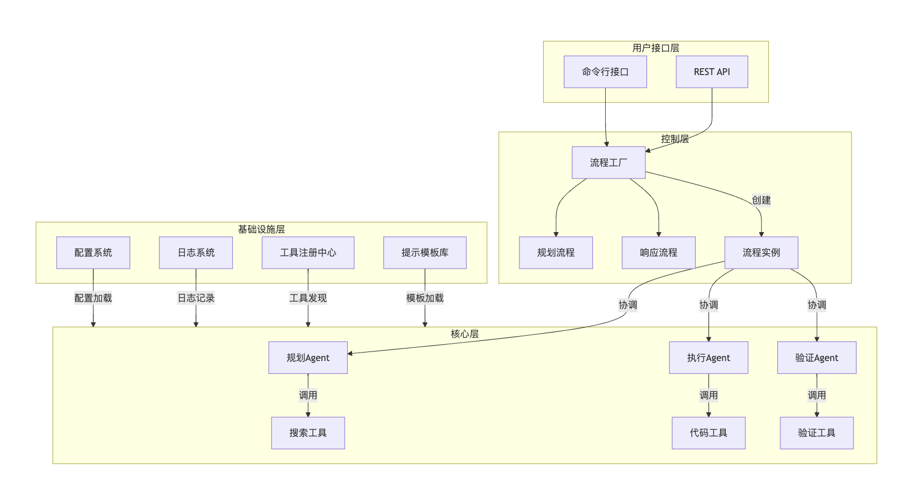
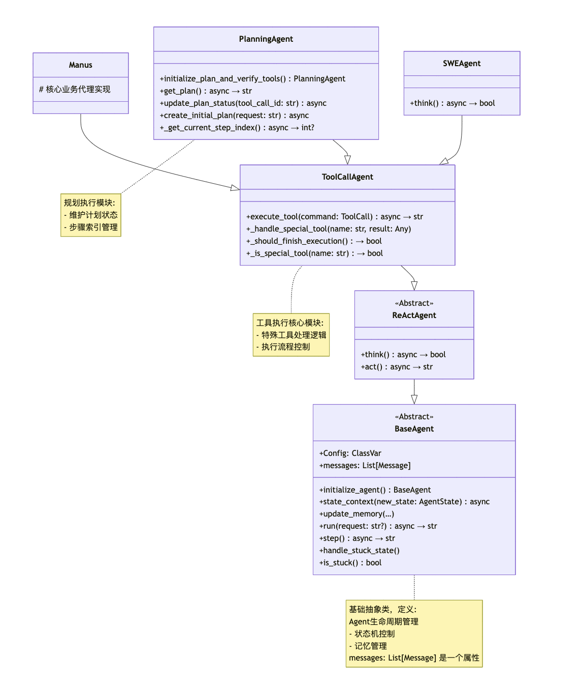
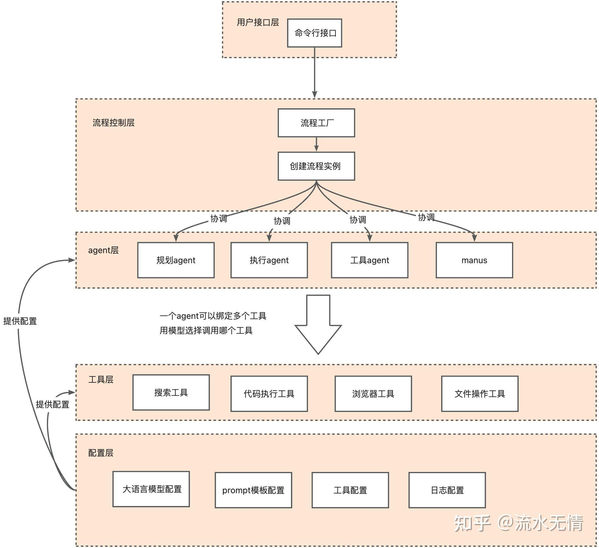
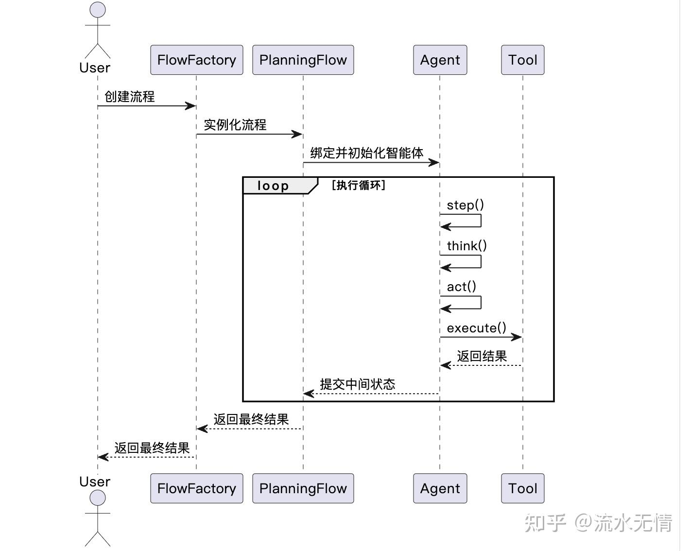

此项目架构清晰，代码优秀，值得学习。能够在 Manus 公布的几小时之后快速实现，证明此架构能够适应快速开发和试错。参考 [Github](https://github.com/mannaandpoem/OpenManus)


## 基础知识：Reactor 模式

Open Manus 实现的是一种 Reactor 模式的单 Agent 系统。Reactor 模式包含两个核心要素：Reason（推理）和 Action（行动）。其基本流程如下：
1. **用户输入 (Query):** 用户提出一个问题或指令。
2. **模型思考 (Think):** 模型对用户输入进行推理，确定需要执行的操作。
3. **行动执行 (Action/Function Call/Tool Call):** 模型选择一个工具或函数，并提供相应的参数。
4. **环境/观察 (Environment/Observation):** 执行选定的行动，并将结果反馈给模型。
5. **最终答案 (Final Answer):** 模型基于思考、行动和观察结果，生成最终的答复。

该过程可以循环进行，直到模型认为任务完成并给出最终答案。

## OpenManus 架构与运行模式

Open Manus 目前有两种运行模式：
1. **`python main` (单 Agent 模式):** 只有一个 Manus Agent，负责接收用户输入、选择工具、执行操作并返回结果。
2. **`python run_flow` (双 Agent 模式):** 包含两个 Agent：
  *  **Planning Agent:** 负责生成任务清单 (Checklist)，将复杂任务分解为多个子任务。
  *  **Manus Agent:** 负责执行 Planning Agent 生成的每个子任务。

### 单 Agent 模式 (`python main`)

用户输入直接传递给 Manus Agent，Agent 决定调用哪些工具（如 Python 代码执行、Google 搜索等），执行工具后将结果返回给 Manus Agent，最终生成并返回结果给用户。

### 双 Agent 模式 (`python run_flow`)

1. 用户输入传递给 Planning Agent。
2. Planning Agent 生成一个任务清单 (Checklist)，包含多个待办事项。
3. 针对 Checklist 中的每个任务：
  *  Manus Agent 执行任务。
  *  Manus Agent 将执行结果返回给 Planning Agent。
  *  Planning Agent 更新 Checklist，标记已完成的任务。
4. 所有任务完成后，Planning Agent 将最终结果返回给用户。

## 代码结构与模块分析

OpenManus 项目主要包含以下几个部分：

### `main.py` 和 `run_flow.py`

*  `main.py`: 单 Agent 模式的入口。
*  `run_flow.py`: 双 Agent 模式的入口。

### `open_Manus` 目录

-  **`app/agents`:** 定义了各种 Agent，其中最重要的是：
    *  `ManusAgent`: 继承自 `ToolCallingAgent`，是单 Agent 模式下的主要 Agent。
    *  `PlanningAgent`: 用于双 Agent 模式，负责任务规划。
-  **`flows`:** 包含双 Agent 模式 (`run_flow.py`) 的相关逻辑，单 Agent 模式下不使用。
-  **`prompts`:** 定义了每个 Agent 的提示信息，包括：
    *  **System Prompt:** 描述 Agent 的角色和职责。
    *  **Next Step Prompt (User Instruction):** 指示 Agent 下一步要做什么。
-  **`tools`:** 定义了 Agent 可以使用的各种工具，例如：
   *  `python_code_executor.py`: 执行 Python 代码。
   *  `google_search.py`: 进行 Google 搜索。
   *  `browser.py`: 模拟浏览器操作。
   *  `file_writer.py`: 保存文件。
   *  `finish.py`: 终止流程。

  每个 Agent 可以使用不同的工具组合。Manus Agent 可以使用上述五个工具。

## 代码执行流程 (以 `main.py` 为例)

### 初始化

*  创建 `ManusAgent` 对象。
*  Agent 对象包含：
   *  `prompt`: Agent 的提示信息。
   *  `allowed_tools`: Agent 可以使用的工具列表。

### 循环执行

1. **接收用户输入:** 等待用户输入下一条指令。
2. **Agent.run()** 调用 Agent 的 `run` 方法。
    * `run` 方法内部调用 `step` 方法。
3. **Step:** 执行单个步骤，包括：
   *  **Think:** 模型思考，决定下一步行动。
      *  获取 Next Step Prompt (用户指令)。
      *  结合 System Prompt。
      *  调用 `client.chat.completions.create` API (底层使用 LLM) 生成思考结果 (Action/Function Call)。
   *  **Act:** 根据思考结果执行相应的工具。
      *  解析思考结果中的 JSON 或 Function Call 信息。
      *  调用相应的工具函数。
      *  将工具执行结果 (Observation) 记录下来。
   *  **更新记忆 (Update Memory):** 将思考结果和工具执行结果添加到 Agent 的历史消息 (History Message) 中。
4. **判断是否终止:** 如果模型认为任务已完成，则调用 `finish.py` 终止流程。
5. **返回结果:** 将最终结果返回给用户。
6. **循环:** 回到步骤 1，等待下一条指令。


### `ToolCallingAgent` 与 `ReActAgent`

*  `ManusAgent` 继承自 `ToolCallingAgent`。
*  `ToolCallingAgent` 实现了 React 模式的具体逻辑。
*  `ReActAgent` 定义了基本的 `run` 和 `step` 方法，实现 Think-Act-Observe 的循环过程。

### 工具执行 (`execute_tool`)

*  解析 Action/Function Call 中的 JSON 数据。
*  根据解析结果调用相应的工具函数。
*  将工具执行结果作为 Observation 返回。
*  将 Observation 添加到 Agent 的历史消息中。

## 双 Agent 模式 (`run_flow.py`) 流程简述

1. **初始化 Planning Agent:** 创建 `PlanningAgent` 对象。
2. **生成 Checklist:** Planning Agent 根据用户输入生成任务清单。
3. **循环执行 Checklist 中的每个任务:**
   *  获取当前步骤 (Step)。
   *  确定执行者 (Executor)，始终为 `ManusAgent`。
   *  `ManusAgent` 执行任务，使用其可用的工具。
   *  `ManusAgent` 将执行结果返回给 `PlanningAgent`。
   *  `PlanningAgent` 更新 Checklist 和状态。
4. **判断是否终止:** 如果 `ManusAgent` 认为任务完成，则触发终止流程。
5. **返回结果:** `PlanningAgent` 将最终结果返回给用户。

双 Agent 模式需要模型具备较强的规划能力。

## 总结

Open Manus 项目提供了一个学习和研究基于 LLM 的 Agent 系统的良好范例。其代码结构清晰，模块化设计良好，易于理解和扩展。通过对 Open Manus 源代码的深入分析，可以掌握 Reactor 模式、Agent 设计、工具调用等关键概念，并了解如何构建一个基于 LLM 的智能 Agent 系统。

## 工作流程



项目基于 Agent，是一个工作流的自动化框架，支持复杂任务的规划、执行和验证。系统通过可拓展的工具集和提示模板库，实现灵活的任务处理能力。

Agent 系统的集成结构如下：



对于单个 agent，即 main.py，只关心了 Manus 的调用。设计的继承关系是 Manus -> BrowserAgent -> ToolCallAgent -> ReActAgent -> BaseAgent。对于 run_flow.py，需要根据 FlowFactory 创建 FlowType 类型对象，再调用其 execute(prompt) 来执行。目前只涉及到 PlanningFlow。

BaseAgent 定义了 run() 的流程，循环调用 step() 不断执行和更新 AgentState 是否为 Finished。ReActAgent 定义了 step()，先 think() 再 act()。ToolCallAgent 实现了具体的 think() 和 act()。后续的子类继承时，通常只会再修改部分内容。

## agent

### BaseAgent

集成了 BaseModel 和 ABC，是抽象的基类。常用成员有：
- name: 需显式提供
- system_prompt: 系统级别的指令提示
- next_step_prompt: 提示决定下一步动作
- llm: LLM，具体参考 tool 目录。常用的是 ask(), ask_with_images() 和 format_messages() 方法
- memory: List[Message] 保存询问的 Message，提供给子类来询问 LLM。设计为 List，能够保存上下文，有 QA 历史。Message 有不同分类，
- state: 状态包含 AgentState 中的 IDLE, RUNNING, FINISHED, ERROR
- current_step 
- max_steps 当 current_step 的超过 max_steps 时，跳出循环。

initialize_agent() 主要初始化 self.llm。state_context() 是异步上下文管理器，用于切换状态。update_memory() 添加 Message 到 memory。一次仅更新一个角色的 Message。

run() 执行主要的循环。

```py
    async def run(self, request: Optional[str] = None) -> str:
        """Execute the agent's main loop asynchronously.

        Args:
            request: Optional initial user request to process.

        Returns:
            A string summarizing the execution results.

        Raises:
            RuntimeError: If the agent is not in IDLE state at start.
        """
        if self.state != AgentState.IDLE:
            raise RuntimeError(f"Cannot run agent from state: {self.state}")

        if request:
            self.update_memory("user", request)

        results: List[str] = []
        async with self.state_context(AgentState.RUNNING):
            while (
                self.current_step < self.max_steps and self.state != AgentState.FINISHED
            ):
                self.current_step += 1
                logger.info(f"Executing step {self.current_step}/{self.max_steps}")
                step_result = await self.step()

                # Check for stuck state
                if self.is_stuck():
                    self.handle_stuck_state()

                results.append(f"Step {self.current_step}: {step_result}")

            if self.current_step >= self.max_steps:
                self.current_step = 0
                self.state = AgentState.IDLE
                results.append(f"Terminated: Reached max steps ({self.max_steps})")
        await SANDBOX_CLIENT.cleanup()
        return "\n".join(results) if results else "No steps executed"
```

run() 是异步的，执行直到状态切换为 FINISHED 或超过最大步数。在 step() 中执行，操作得到最终的状态。具体由 act() 来切换状态。

prompt 是如何组织的？run() 的参数传入了 request，并存入 memory，在后续的过程中，由 think() 和 act() 取出并使用。注意 self.is_stuck()，当循环出现了与最后一条信息相同的重复内容，需要处理困境。

```py
    @abstractmethod
    async def step(self) -> str:
        """Execute a single step in the agent's workflow.

        Must be implemented by subclasses to define specific behavior.
        """
```

### ReActAgent: think(), act(), step() 分别会做什么？

继承了 BaseAgent，负责思考，执行。step() 方法会先调用 think()，得到是否应该执行的判断。如果可以，则执行，并返回执行后的字符串。如果不该执行，返回 "Thinking complete - no action needed"。

```py
    @abstractmethod
    async def think(self) -> bool:
        """Process current state and decide next action"""

    @abstractmethod
    async def act(self) -> str:
        """Execute decided actions"""

    async def step(self) -> str:
        """Execute a single step: think and act."""
        should_act = await self.think()
        if not should_act:
            return "Thinking complete - no action needed"
        return await self.act()
```

think() 和 act() 在具体子类中实现，比如 class ToolCallAgent 中，实现了 think() 和 act()。子类 BrowserAgent 和 Manus 都在 think() 上额外增加了一些判断工作

### ToolCallAgent(ReActAgent)

此 Agent 用于函数或工具调用，主要关注 think() 和 act()。

#### 字段

available_tools: ToolCollection 目前值包含两个工具：CreateChatCompletion(), Terminate()

#### think()

处理当前状态，决定下一步使用工具的动作。首先，把 ToolCallAgent.next_step_prompt 添加到 messages。随后向 LLM 询问下一步使用何种工具，即 self.llm.ask_tool()。

对于 system prompt 的设置，都会加载到 self.messages 之前，作为第一条对话的上下文设置。

llm 给与 response 后，解析并保存选择到 self.tool_calls，交给 act() 来执行。

#### act()

根据 think() 更新的 self.tool_calls 执行。每次执行后，将执行的结果整理为 Message，并添加到 self.memory，以便下次 LLM 决策。

#### execute_tool()

执行后反馈结果到字符串。

### PlanningAgent(ToolCallAgent)

创建和管理规划来解决问题。使用规划工具，管理结构化的规划，记录进度直到完成。

self.system_prompt 修改为自己版本。使用 PLANNING_SYSTEM_PROMPT 和 NEXT_STEP_PROMPT。注意，子类能修改父类同名的字段，比如父类 ToolCallAgent 使用 self.system_prompt 和 self.next_step_prompt 时，子类 PlanningAgent 也修改了，最后使用子类修改的版本，即 PLANNING_SYSTEM_PROMPT 等。

self.tool_calls: List[ToolCall] 

#### think()

整合当前状态和 next_step_prompt 到 prompt，存入 self.messages。调用上级思考，即 super().think() 来获取 result。

```py
    async def think(self) -> bool:
        """Decide the next action based on plan status."""
        prompt = (
            f"CURRENT PLAN STATUS:\n{await self.get_plan()}\n\n{self.next_step_prompt}"
            if self.active_plan_id
            else self.next_step_prompt
        )
        self.messages.append(Message.user_message(prompt))

        # Get the current step index before thinking
        self.current_step_index = await self._get_current_step_index()

        result = await super().think()

        # After thinking, if we decided to execute a tool and it's not a planning tool or special tool,
        # associate it with the current step for tracking
        if result and self.tool_calls:
            latest_tool_call = self.tool_calls[0]  # Get the most recent tool call
            if (
                latest_tool_call.function.name != "planning"
                and latest_tool_call.function.name not in self.special_tool_names
                and self.current_step_index is not None
            ):
                self.step_execution_tracker[latest_tool_call.id] = {
                    "step_index": self.current_step_index,
                    "tool_name": latest_tool_call.function.name,
                    "status": "pending",  # Will be updated after execution
                }

        return result
```

self.active_plan_id 默认初始化 None，

## tool

### llm.LLM

负责与 LLM 或 VLM 交互，可以看做是一个 Client。OpenManus 耦合了 VLM 和 LLM。提供了询问接口，ask(), ask_tool() 和 ask_with_images() 方法。也许可以再分层，设计为 LLMBase，子类为 RawLLM, VLM, ToolLLM。

字段：
- model: str 标识模型名
- max_tokens: int
- max_input_tokens: int | None，指定上下文长度。
- api_type: str
- api_key: str
- base_url: str
- self.client 在 `__init__` 中使用 self.api_key 和 self.base_url 实例化一个 AsyncOpenAI
- temperature: float

静态方法
- format_messages() 格式化为 OpenAI message format。接收参数是是字典，或 class Message 的实例，随后会转化为字典。通常都会传入 Message 的实例，而非字典。

方法

#### ask()

根据传入的 Message，组织格式后，组织传递给 OpenAI 客户端的并获取内容。

stream 默认为 True，streaming 请求

#### format_messages(): 静态方法

## schema

### ToolCall

工具选择相关的内容，都在这几个部分：

```py
class ToolChoice(str, Enum):
    """Tool choice options"""

    NONE = "none"
    AUTO = "auto"
    REQUIRED = "required"

TOOL_CHOICE_VALUES = tuple(choice.value for choice in ToolChoice)
TOOL_CHOICE_TYPE = Literal[TOOL_CHOICE_VALUES]  # type: ignore，用于 typehint，要求必须是 ToolChoice.AUTO 等

class Function(BaseModel):
    name: str
    arguments: str


class ToolCall(BaseModel):
    """Represents a tool/function call in a message"""

    id: str
    type: str = "function"
    function: Function
```

### Message

为不同角色定制了信息和格式。比如，ROLE_TYPE.ASSISTANT 和 ROLE_TYPE.SYSTEM 等。Message 的组织，直接影响如何询问。角色包含：USER, SYSTEM, ASSISTANT, TOOL。设计不同的角色，方便制作格式化的信息，向 VLM 或 LLM 询问。

Message 存储在 BaseAgent.memory.messages 中，向大模型提问时，一并发送。

## 各类 prompt 是如何安排的？

在 app/prompt 目录下的文件，保存了各 agent 对应的提示词。通常包含了两条，分别是 SYSTEM_PROMPT 和 NEXT_STEP_PROMPT，

SYSTEM_PROMPT 是系统级别提示词，规定了角色和场景。

NEXT_STEP_PROMPT 提示下一步动作，即用户指令。

每个 Agent 都有适合自己的提示词，不论是否继承。

大模型请求的 messages 中的 array 数组元素由 Message 组成。

## 用户接入层


## 另一解读





## Ref and Tag

[B 站：OpenManus 源代码解读和学习，manus 用不了，那就自己实现一个](https://www.bilibili.com/video/BV1SrRhYmEgm/?share_source=copy_web&vd_source=fe1db0b3f565b5940b244b9c7f7b4fa1)