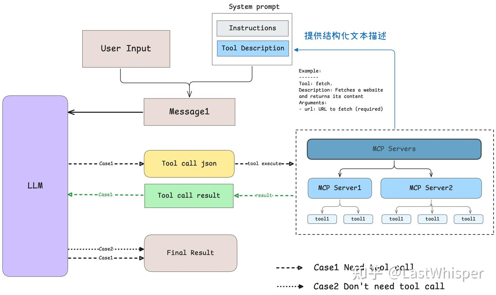

## MCP 协议

MCP 是一种开放协议，定义了应用程序向 AI 模型（特别是 LLMs）提供上下文的标准和方式。开发者可以以一致的方式将各种数据源、工具和功能连接到 AI 模型，就像 USB-C 接口一样。MCP 以更标准的方式让 LLM Chat 使用不同工具。MCP 协议由 Anthropic 在 2024 年 11 月底提出：
- 官方文档：[Introduction](https://modelcontextprotocol.io/introduction)
- GitHub 仓库：github.com/modelcontextprotocol


### 为什么需要 MCP

#### 背景

MCP 的出现是 prompt 工程发展的产物，规范更结构化的上下文信息来提示表现。构造 prompt 时，我们希望提供具体信息给模型，比如本地文件，数据库等。在过去，通常手动整理信息，手动粘贴到 prompt。但是问题复杂后，需要的数据呈现多样化，引入的工具越发增多。例如使用数据库查询 API，天气查询 API 等等，流程会越发繁琐冗余。

LLM 引入了 `function call` 功能，典型的有 `OpenAI` 的 `tools` 的请求字段，允许模型调用预定义的函数获取数据或执行操作，显著提示自动化水平。

缺点：function call 依赖平台，不同 LLM 平台实现差异巨大，甚至不兼容。

但是，**数据与工具本身是客观存在**，我们需要统一数据连接到模型的方式。MCP 充当 AI 模型的 USB-C 接口，让 LLM 轻松获取数据或调用工具。优势：
- 生态：提供现有插件，AI 直接使用
- 统一：对 AI 模型扩展，只要支持 MCP 的模型都可灵活切换使用
- 数据安全：敏感数据留在本地，不必全部上传

总体感受，就像 Linux 的驱动设计，每个硬件的驱动都写入内核的话，内核会变得十分膨胀，难以保证稳定。于是，抽象出了设备树。还有模块化的方式来加载驱动，就像插件一样。对扩展开放，对修改关闭。代价是精心设计一个管理设备树的抽象层，使用控制反转的方式来处理。

#### Why MCP？

大模型产品有:
- chatbot: 只会聊天，比如 DeepSeek, ChatGPT
- composer: 做具体工作，比如 cursor, copilot
- agent: 私人秘书，输入问题，自动执行，Open Manus

为了实现 Agent，即需要让 LLM 自如灵活地操作软件、物理世界的机器人，需要定义统一的上下文协议和对应的统一工作流。MCP (model context protocol) 是一套基础协议，解决此类问题。感性认识如下：


### 总体架构

引入官方的写入文件例子：MCP 核心使用客户端-服务器架构，host 可以连接到多个服务器：


- **MCP 主机**（MCP Hosts）：希望通过 MCP 访问数据的程序，例如 Claude Desktop、集成开发环境（IDEs）或其他 AI 工具。接受用户的 prompt (桌面有哪些文档？) 来与模型交互。
- **MCP 客户端**（MCP Clients）：MCP 客户端是与服务器保持 1:1 连接的协议客户端，负责与 MCP 服务器通信。当模型决定需要与服务器交互时，MCP 客户端启动，负责向服务器建立链接并请求。
- **MCP 服务器**（MCP Servers）：MCP 服务器是**轻量级程序**，每个服务器通过标准化的 Model Context Protocol 暴露特定的功能。比如，此例子中执行文件扫描并返回文件列表。
- **本地数据源**（Local Data Sources）：本地数据源是指 MCP 服务器可以安全访问的计算机文件、数据库和服务。
- **远程服务**（Remote Services）：远程服务是指 MCP 服务器可以通过互联网连接的外部系统（例如通过 API 访问的服务）。

工作流程：


如果需要调用工具，那么 LLM 会返回一个结构化的 JSON 格式的工具调用请求。MCP 客户端会根据此 JSON 代码执行对应工具。生成响应后，会再次发送给 LLM 进行处理，生成最终的自然语言回复。

此架构使得 LLM 在不同场景下灵活调用不同工具和数据源，开发者专注于对应的 MCP Server，无需关心 Host 和 Client 的实现细节。


### 原理：模型如何确定工具的选用？

对比 `tools` 字段有什么异同和优劣？

模型在什么时候确定使用具体工具？[Anthropic 官方 Intro](https://modelcontextprotocol.io/introduction)：

用户提出问题：
- 客户端发送给 LLM
- LLM 分析可用工具，决定使用哪一个（或多个）
- 客户端向 MCP 服务器请求执行工具
- LLM 结合执行结果，构造最终的 prompt 并生成自然语言回应
- 客户端展示回应

通过 [源码](https://github.com/modelcontextprotocol/python-sdk/tree/main/examples/clients/simple-chatbot/mcp_simple_chatbot) 可以发现调用分为两步骤：
1. LLM 确定请求 MCP 服务器
2. 向服务器发起请求，对执行结果重新处理



## MCP Client

### 模型如何智能选择工具

根据 [client example](https://github.com/modelcontextprotocol/python-sdk/tree/main/examples/clients/simple-chatbot/mcp_simple_chatbot)，模型根据当前可以请求的服务器，组织到系统 prompt 中。

主要参考 ChatSession 类的 start() 方法，代码如下：

```py
... # 省略了无关的代码
 async def start(self):
     # 初始化所有的 mcp server
     for server in self.servers:
         await server.initialize()
 ​
     # 获取所有的 tools 命名为 all_tools
     all_tools = []
     for server in self.servers:
         tools = await server.list_tools()
         all_tools.extend(tools)
 ​
     # 将所有的 tools 的功能描述格式化成字符串供 LLM 使用
     # tool.format_for_llm() 我放到了这段代码最后，方便阅读。
     tools_description = "\n".join(
         [tool.format_for_llm() for tool in all_tools]
     )
 ​
     # 这里就不简化了，以供参考，实际上就是基于 prompt 和当前所有工具的信息
     # 询问 LLM（Claude） 应该使用哪些工具。
     system_message = (
         "You are a helpful assistant with access to these tools:\n\n"
         f"{tools_description}\n"
         "Choose the appropriate tool based on the user's question. "
         "If no tool is needed, reply directly.\n\n"
         "IMPORTANT: When you need to use a tool, you must ONLY respond with "
         "the exact JSON object format below, nothing else:\n"
         "{\n"
         '    "tool": "tool-name",\n'
         '    "arguments": {\n'
         '        "argument-name": "value"\n'
         "    }\n"
         "}\n\n"
         "After receiving a tool's response:\n"
         "1. Transform the raw data into a natural, conversational response\n"
         "2. Keep responses concise but informative\n"
         "3. Focus on the most relevant information\n"
         "4. Use appropriate context from the user's question\n"
         "5. Avoid simply repeating the raw data\n\n"
         "Please use only the tools that are explicitly defined above."
     )
     messages = [{"role": "system", "content": system_message}]
 ​
     while True:
         # Final... 假设这里已经处理了用户消息输入.
         messages.append({"role": "user", "content": user_input})
 ​
         # 将 system_message 和用户消息输入一起发送给 LLM
         llm_response = self.llm_client.get_response(messages)
 ​
     ... # 后面和确定使用哪些工具无关
     
 ​
 class Tool:
     """Represents a tool with its properties and formatting."""
 ​
     def __init__(
         self, name: str, description: str, input_schema: dict[str, Any]
     ) -> None:
         self.name: str = name
         self.description: str = description
         self.input_schema: dict[str, Any] = input_schema
 ​
     # 把工具的名字 / 工具的用途（description）和工具所需要的参数（args_desc）转化为文本
     def format_for_llm(self) -> str:
         """Format tool information for LLM.
 ​
         Returns:
             A formatted string describing the tool.
         """
         args_desc = []
         if "properties" in self.input_schema:
             for param_name, param_info in self.input_schema["properties"].items():
                 arg_desc = (
                     f"- {param_name}: {param_info.get('description', 'No description')}"
                 )
                 if param_name in self.input_schema.get("required", []):
                     arg_desc += " (required)"
                 args_desc.append(arg_desc)
 ​
         return f"""
 Tool: {self.name}
 Description: {self.description}
 Arguments:
 {chr(10).join(args_desc)}
 """
```

Tool 描述的 `input_schema` 如何定义？大部分呢情况下，使用 `@mcp.tool()` 装饰时，`name` 和 `description` 等信息直接来自用户定义函数的函数名时在装饰器的部分。更多参考 [src](https://github.com/modelcontextprotocol/python-sdk/blob/main/src/mcp/server/fastmcp/tools/base.py#L34-L73)。

总结：模型通过 prompt engineering，即提供所有工具的结构化描述和 few-shot 的 example 来确定该使用哪些工具。另一方面，Anthropic 肯定对 Claude 做了专门的训练（毕竟是自家协议，Claude 更能理解工具的 prompt 以及输出结构化的 tool call json 代码）

### 工具执行与结果反馈机制

整合 system prompt 和用户消息发送给模型，模型分析后，决定是否需要调用工具：
- 无需工具时：模型直接生成自然语言回复。
- 需要工具时：模型输出结构化 JSON 格式的工具调用请求。 

当客户端发现回复包含结构化的 JSON 格式的工具调用请求时，会根据此 JSON 代码执行对应工具。逻辑体现子啊 `process_llm_response`，参考 [src code](https://github.com/modelcontextprotocol/python-sdk/blob/main/examples/clients/simple-chatbot/mcp_simple_chatbot/main.py#L295-L338)，逻辑简单。使用 json.loads() 方法直接解析全部的 LLM 响应，如果抛出异常，则说明没有工具调用请求，不是纯 JSON 格式字符，不符合提示的要求，直接返回输入。

执行了 tool call 后，结果 result 会和 system prompt，再加上用户消息一起再重新发送给模型，请求模型生成最终回复。

如果 tool call 的 JSON 代码有幻觉怎么办？阅读 process_llm_response，发现会跳过无效请求。

```py
class ChatSession:
... # 省略无关的代码
 async def start(self):
     ... # 上面已经介绍过了，模型如何选择工具
 ​
     while True:
         # 假设这里已经处理了用户消息输入.
         messages.append({"role": "user", "content": user_input})
 ​
         # 获取 LLM 的输出
         llm_response = self.llm_client.get_response(messages)
 ​
         # 处理 LLM 的输出（如果有 tool call 则执行对应的工具）
         result = await self.process_llm_response(llm_response)
 ​
         # 如果 result 与 llm_response 不同，说明执行了 tool call （有额外信息了）
         # 则将 tool call 的结果重新发送给 LLM 进行处理。
         if result != llm_response:
             messages.append({"role": "assistant", "content": llm_response})
             messages.append({"role": "system", "content": result})
 ​
             final_response = self.llm_client.get_response(messages)
             logging.info("\nFinal response: %s", final_response)
             messages.append(
                 {"role": "assistant", "content": final_response}
             )
         # 否则代表没有执行 tool call，则直接将 LLM 的输出返回给用户。
         else:
             messages.append({"role": "assistant", "content": llm_response})    
```

结合这部分原理分析：
- 工具文档至关重要：模型通过工具描述文本来理解和选择工具，因此精心编写工具的名称、docstring 和参数说明至关重要。
- 无保证：由于 MCP 的选择是基于 prompt 的，所以任何模型其实都适配 MCP，只要你能提供对应的工具描述。但是当你使用非 Claude 模型时，MCP 使用的效果和体验难以保证（没有做专门的训练）。

## MCP Server 中的基本概念

### openai 协议

使用 Python 或 Typescript 开发 app 时，通常安装 openai 库。根据模型厂商的 url 和模型类别，我们可以访问大模型。大模型提供商也需要支持此库与协议。以 deepseek 服务为例：

```py
from openai import OpenAI

client = OpenAI(api_key="<DeepSeek API Key>", base_url="https://api.deepseek.com")

response = client.chat.completions.create(
    model="deepseek-chat",
    messages=[
        {"role": "system", "content": "You are a helpful assistant"},
        {"role": "user", "content": "Hello"},
    ],
    stream=False
)

print(response.choices[0].message.content)
```

查看 create() 方法，可以发现 openai 协议需要大模型厂商支持众多 feature。比如，常见的有 `temperature`, `top_p`。

一次普通调用涉及众多可调控参数。其中有 `tools` 参数：

```py
@overload
    def create(
        self,
        *,
        messages: Iterable[ChatCompletionMessageParam],
        model: Union[str, ChatModel],
        ...
        tools: Iterable[ChatCompletionToolParam] | NotGiven = NOT_GIVEN,
    ) -> ChatCompletion:
```

tools 参数要求大模型厂商必须支持 function calling 特性。我们可以提供部分工具描述（和 MCP 协议完全兼容），在 tools 非空情况下，chat 函数返回值中会包含 `tool_Calls`，描述调用函数的组件：

```py
from openai import OpenAI

client = OpenAI(
    api_key="Deepseek API",
    base_url="https://api.deepseek.com"
)

# 定义 tools（函数/工具列表）
tools = [
    {
        "type": "function",
        "function": {
            "name": "get_current_weather",
            "description": "获取给定地点的天气",
            "parameters": {
                "type": "object",
                "properties": {
                    "location": {
                        "type": "string",
                        "description": "城市，比如杭州，北京，上海",
                    }
                },
                "required": ["location"],
            },
        },
    }
]

response = client.chat.completions.create(
    model="deepseek-chat",
    messages=[
        {"role": "system", "content": "你是一个很有用的 AI"},
        {"role": "user", "content": "今天杭州的天气是什么？"},
    ],
    tools=tools,  # 传入 tools 参数
    tool_choice="auto",  # 可选：控制是否强制调用某个工具
    stream=False,
)

print(response.choices[0].message)
```

运行返回如下：

```py
ChatCompletionMessage(
    content='',
    refusal=None,
    role='assistant',
    annotations=None,
    audio=None,
    function_call=None,
    tool_calls=[
        ChatCompletionMessageToolCall(
            id='call_0_baeaba2b-739d-40c2-aa6c-1e61c6d7e855',
            function=Function(
                arguments='{"location":"杭州"}',
                name='get_current_weather'
            ),
            type='function',
            index=0
        )
    ]
)
```

tool_calls 给出了大模型使用工具的方法。

openai 协议中，tools 仅支持函数类调用。可以对函数类的调用模拟资源获取等工作。

### Quick Start

有了 MCP 组件之后，可以使用官方封装的 SDK 快速开发 MCP 服务器。服务器提供三种主要类型功能：
- Resources: 资源，类似文件内容等
- Tools: 工具
- Prompts: 帮助用户完成特定任务

#### 最佳实践

官网提供了基于 LLM 的 MCP 服务器的 [最佳实践](https://link.zhihu.com/?target=https%3A//modelcontextprotocol.io/tutorials/building-mcp-with-llms)，总结如下：
- 引入 domain knowledge （说人话就是，告诉他一些 MCP Server 开发的范例和资料）
    - 访问 https://modelcontextprotocol.io/llms-full.txt 并复制完整的文档文本。（实测这个太长了，可以忽略）
    - 导航到 MCP TypeScript SDK 或 Python SDK Github 项目中并复制相关内容。
    - 把这些作为 prompt 输入到你的 chat 对话中（作为 context）。
- 描述你的需求
    - 你的服务器会开放哪些资源
    - 它会提供哪些工具
    - 它应该给出哪些引导或建议
    - 它需要跟哪些外部系统互动

安装：

```bash
pip install mcp "mcp[cli]" uv
```

```py
# server.py
from mcp.server.fastmcp import FastMCP

mcp = FastMCP('锦恢的 MCP Server', version="11.45.14")

@mcp.tool(
    name='add',
    description='对两个数字进行实数域的加法'
)
def add(a: int, b: int) -> int:
    return a + b

@mcp.resource(
    uri="greeting://{name}",
    name='greeting',
    description='用于演示的一个资源协议'
)
def get_greeting(name: str) -> str:
    # 访问处理 greeting://{name} 资源访问协议，然后返回
    # 此处方便起见，直接返回一个 Hello，balabala 了
    return f"Hello, {name}!"

@mcp.prompt(
    name='translate',
    description='进行翻译的prompt'
)
def translate(message: str) -> str:
    return f'请将下面的话语翻译成中文：\n\n{message}'

if __name__ == "__main__":
    mcp.run()
```

mcp server 便完成了。

## insihgts

RobotMCP？

## Ref and Tag

MCP (Model Context Protocol)，一篇就够了。 - LastWhisper的文章 - 知乎
https://zhuanlan.zhihu.com/p/29001189476

Agent 时代基础设施 | MCP 协议介绍 - 锦恢的文章 - 知乎
https://zhuanlan.zhihu.com/p/28859732955

优雅地开发 MCP 服务器（一）MCP 中的 Resources，Prompts，Tools 和基本调试方法 - 锦恢的文章 - 知乎
https://zhuanlan.zhihu.com/p/32593727614

www.anthropic.com/news/model-context-protocol

https://github.com/modelcontextprotocol/python-sdk