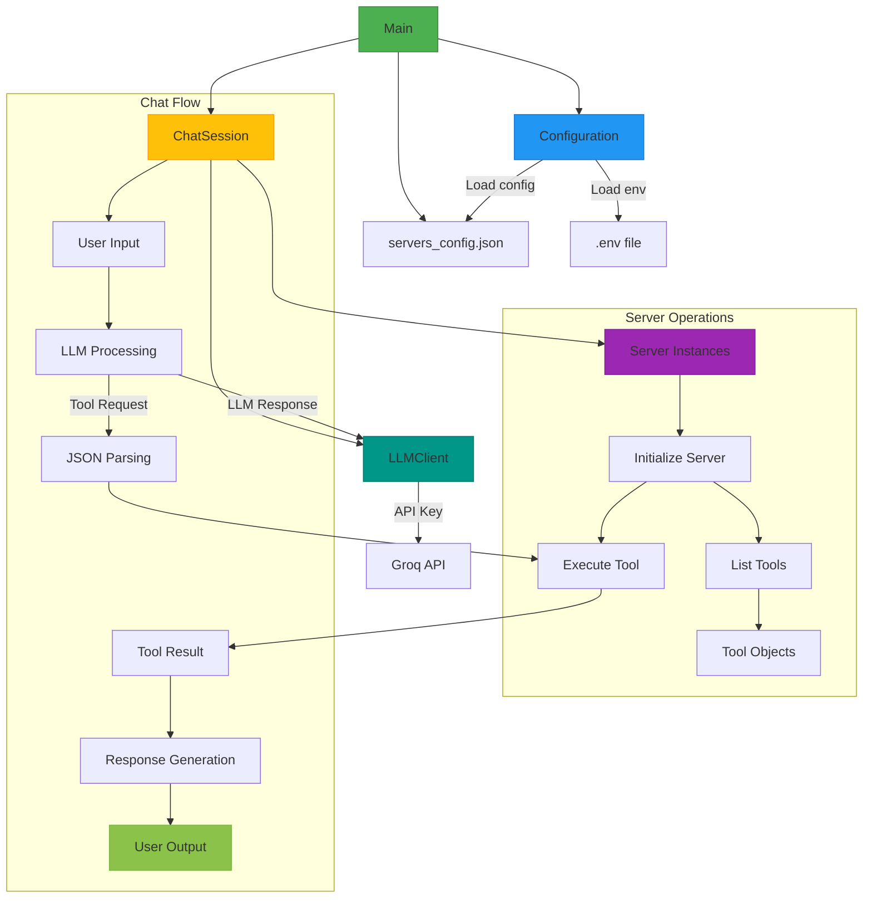
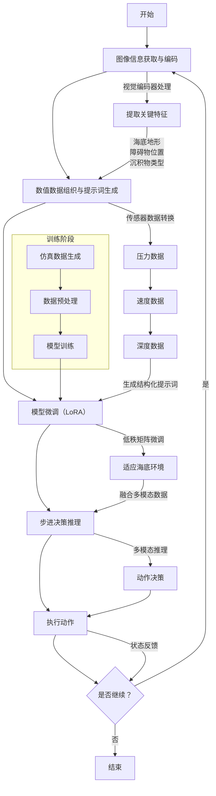

## Overview



## Configuration: 配置加载

配置文件决定了 MCP 客户端中，可以看见 MCP 服务器功能，还有 LLM 的 API key。

```py
from dotenv import load_dotenv

class Configuration:
    """Manages configuration and environment variables for the MCP client."""
    def __init__(self) -> None:
        """Initialize configuration with environment variables."""
        self.load_env()
        self.api_key = os.getenv("LLM_API_KEY")

    @staticmethod
    def load_env() -> None:
        """Load environment variables from .env file."""
        load_dotenv()

    @staticmethod
    def load_config(file_path: str) -> dict[str, Any]:
        """Load server configuration from JSON file.

        Args:
            file_path: Path to the JSON configuration file.

        Returns:
            Dict containing server configuration.

        Raises:
            FileNotFoundError: If configuration file doesn't exist.
            JSONDecodeError: If configuration file is invalid JSON.
        """
        with open(file_path, "r") as f:
            return json.load(f)

    @property
    def llm_api_key(self) -> str:
        """Get the LLM API key.

        Returns:
            The API key as a string.

        Raises:
            ValueError: If the API key is not found in environment variables.
        """
        if not self.api_key:
            raise ValueError("LLM_API_KEY not found in environment variables")
        return self.api_key
```

其中，load_env() 方法加载 .env 文件的内容到环境变量，样例中：

```bash
LLM_API_KEY=gsk_1234567890
```

紧接着是配置服务的 JSON 文件，每个 mcpServers 字段下的字典的键值对，定义了一个服务，一个 Server 对象管理的服务：

```json
{
  "mcpServers": {
    "sqlite": {
      "command": "uvx",
      "args": ["mcp-server-sqlite", "--db-path", "./test.db"]
    },
    "puppeteer": {
      "command": "npx",
      "args": ["-y", "@modelcontextprotocol/server-puppeteer"]
    }
  }
}
```

最终使用如下：

```py
async def main() -> None:
    """Initialize and run the chat session."""
    config = Configuration()
    server_config = config.load_config("servers_config.json")
    servers = [
        Server(name, srv_config)
        for name, srv_config in server_config["mcpServers"].items()
    ]
    llm_client = LLMClient(config.llm_api_key)
    chat_session = ChatSession(servers, llm_client)
    await chat_session.start()
```

可以看到，在 servers_config.json 中，mcpServers 字段下的每个字典都会作为 Server 的参数传入。每个 Server 都有一个 name 和 config 字典，config 字典中包含了 command 和 args 字段，所以每个 Server 对应一个服务器，由命令行参数的形式发起。

## 连接 MCP Server 并使用其工具

管理 MCP 客户端能够连接的 MCP Server。能够列出每个服务器提供的工具，执行对应的工具。最后，MCP Client 的 ChatSession 负责与 LLM 客户端交互，随后使用一个或者多个 Server 执行。基本上，一个 Server 对应一个 MCP Server，一个服务器可以提供一个或者多个工具。

```py
class Server:
    """Manages MCP server connections and tool execution."""
    def __init__(self, name: str, config: dict[str, Any]) -> None:
        self.name: str = name
        self.config: dict[str, Any] = config
        self.stdio_context: Any | None = None
        self.session: ClientSession | None = None
        self._cleanup_lock: asyncio.Lock = asyncio.Lock()
        self.exit_stack: AsyncExitStack = AsyncExitStack()
```

### initialize()：初始化 Server

在 ChatSession 调用 start() 方法时，先初始化对应的 Server 列表，逐个调用 Server 的 initialize() 方法，确保正确初始化后，再根据要求执行后续的逻辑，比如 list_tools() 和 execute_tool()。

以配置文件的 uvx 和 npx 命令为例。uvx 是 uv tool run 的命令，启动查询 Sqlite 数据库查询。而 npx 则是 puppeteer 的命令，启动查询 Chrome 的页面。初始化方法中，针对两种命令，使用不同的方式传给 StdioServerParameters 类的构造器，以 command 变量作为命令的路径，以 args 部分的内容作为具体参数传入。特别区分了 npx 命令，具体如下：

```py
    async def initialize(self) -> None:
        """Initialize the server connection."""
        # 命令文件的路径，就像 shell 的 which npx 来找到可执行文件路径
        command = (
            shutil.which("npx")
            if self.config["command"] == "npx"
            else self.config["command"]
        )
        if command is None:
            raise ValueError("The command must be a valid string and cannot be None.")

        server_params = StdioServerParameters(
            command=command,
            args=self.config["args"],
            env={**os.environ, **self.config["env"]}
            if self.config.get("env")
            else None,
        )
        try:
            stdio_transport = await self.exit_stack.enter_async_context(
                stdio_client(server_params)
            )
            read, write = stdio_transport
            session = await self.exit_stack.enter_async_context(
                ClientSession(read, write)
            )
            await session.initialize()
            self.session = session
        except Exception as e:
            logging.error(f"Error initializing server {self.name}: {e}")
            await self.cleanup()
            raise
```

使用上下文退出管理器来控制 Server 的资源清理工作。具体处理 stdio_client 和 ClientSession 的。

#### ClientSession

ClientSession 类是 MCP 客户端与 MCP Server 之间的通信通道，负责管理会话生命周期、处理请求/响应流程，并维护与 MCP 服务器的双向通信。
- **初始化协商**：通过 `initialize` 方法协商协议版本和服务器能力，建立会话基础配置
- **工具调用**：提供 `call_tool()` 方法执行服务器端注册的工具函数（如数据库查询、文件操作等），并返回结构化数据
- **资源发现**：通过 `list_tools()` 动态获取服务器端可用工具列表，支持运行时扩展
- **会话管理**：使用异步上下文管理器（`async with`）自动处理连接建立/关闭，确保资源安全释放

#### StdioServerParameters

用于定义通过 **标准输入输出（stdio）** 启动本地 MCP 服务器的配置细节，适用于本地进程间通信场景。主要参数为：
- command: 命令行的启动命令
- args: 参数
- env: 环境变量

进程管理​​：客户端通过 subprocess 模块启动服务器进程，建立父子进程关系

**​​典型应用场景​​**
- ​​开发调试​​：快速启动本地测试服务器（如文件系统操作工具）
- ​​安全隔离​​：通过限制 args 参数控制服务器可访问资源范围
- ​​环境定制​​：通过 env 传递敏感信息（如数据库凭证），避免硬编码

#### ClientSession 与 StdioServerParameters 协作

使用 StdioServerParameters 定义启动连接 MCP 服务器的进程参数。使用 stdio_client() 函数生成连接的客户端。最后，使用 ClientSession 生成实例，由 initialize() 连接 MCP 服务器。

```py
        ...
        server_params = StdioServerParameters(
            command=command,
            args=self.config["args"],
            env={**os.environ, **self.config["env"]}
            if self.config.get("env")
            else None,
        )
        try:
            stdio_transport = await self.exit_stack.enter_async_context(
                stdio_client(server_params)
            )
            read, write = stdio_transport
            session = await self.exit_stack.enter_async_context(
                ClientSession(read, write)
            )
            await session.initialize()
            self.session = session
        ...
```

### cleanup()：清理 Server

```py
    async def cleanup(self) -> None:
        """Clean up server resources."""
        async with self._cleanup_lock:
            try:
                await self.exit_stack.aclose()
                self.session = None
                self.stdio_context = None
            except Exception as e:
                logging.error(f"Error during cleanup of server {self.name}: {e}")

```

### 查看和执行可用的工具

一个 MCP Server 可以提供多个工具，使用 ClientSession，从对话的 list_tools() 方法列出所有可用的工具。使用 execute_tool() 方法执行对应的工具。

```py
    async def list_tools(self) -> list[Any]:
        if not self.session:
            raise RuntimeError(f"Server {self.name} not initialized")

        tools_response = await self.session.list_tools()
        tools = []

        for item in tools_response:
            if isinstance(item, tuple) and item[0] == "tools":
                tools.extend(
                    Tool(tool.name, tool.description, tool.input_schema)
                    for tool in item[1]
                )

        return tools
```

每个工具都由 Tool 类来描述，包含了工具的名称、描述和输入参数的 schema。

```py
    async def execute_tool(
        self,
        tool_name: str,
        arguments: dict[str, Any],
        retries: int = 2,
        delay: float = 1.0,
    ) -> Any:
        if not self.session:
            raise RuntimeError(f"Server {self.name} not initialized")

        attempt = 0
        while attempt < retries:
            try:
                logging.info(f"Executing {tool_name}...")
                result = await self.session.call_tool(tool_name, arguments)

                return result

            except Exception as e:
                attempt += 1
                logging.warning(
                    f"Error executing tool: {e}. Attempt {attempt} of {retries}."
                )
                if attempt < retries:
                    logging.info(f"Retrying in {delay} seconds...")
                    await asyncio.sleep(delay)
                else:
                    logging.error("Max retries reached. Failing.")
                    raise
```

## Tool

描述 MCP Server 提供的工具，包含了工具的名称、描述和输入参数的 schema。使用 Tool 类来描述一个工具。

这些描述，会提供给 LLM 来帮助生成合理的工具调用规划。

```py
class Tool:
    """Represents a tool with its properties and formatting."""

    def __init__(
        self, name: str, description: str, input_schema: dict[str, Any]
    ) -> None:
        self.name: str = name
        self.description: str = description
        self.input_schema: dict[str, Any] = input_schema

    def format_for_llm(self) -> str:
        """Format tool information for LLM.

        Returns:
            A formatted string describing the tool.
        """
        args_desc = []
        if "properties" in self.input_schema:
            for param_name, param_info in self.input_schema["properties"].items():
                arg_desc = (
                    f"- {param_name}: {param_info.get('description', 'No description')}"
                )
                if param_name in self.input_schema.get("required", []):
                    arg_desc += " (required)"
                args_desc.append(arg_desc)

        return f"""
Tool: {self.name}
Description: {self.description}
Arguments:
{chr(10).join(args_desc)}
"""
```



比如：

```
Tool: sqlite_query
Description: Execute a SQL query on the SQLite database.
Arguments:
- query: The SQL query to execute (required)
- db_path: The path to the SQLite database
```

## LLMClient: 向 LLM 询问

负责与 LLM 交互，发送请求并接收响应。

```py
class LLMClient:
    """Manages communication with the LLM provider."""

    def __init__(self, api_key: str) -> None:
        self.api_key: str = api_key

    def get_response(self, messages: list[dict[str, str]]) -> str:
        """Get a response from the LLM.

        Args:
            messages: A list of message dictionaries.

        Returns:
            The LLM's response as a string.

        Raises:
            httpx.RequestError: If the request to the LLM fails.
        """
        url = "https://api.groq.com/openai/v1/chat/completions"

        headers = {
            "Content-Type": "application/json",
            "Authorization": f"Bearer {self.api_key}",
        }
        payload = {
            "messages": messages,
            "model": "llama-3.2-90b-vision-preview",
            "temperature": 0.7,
            "max_tokens": 4096,
            "top_p": 1,
            "stream": False,
            "stop": None,
        }

        try:
            with httpx.Client() as client:
                response = client.post(url, headers=headers, json=payload)
                response.raise_for_status()
                data = response.json()
                return data["choices"][0]["message"]["content"]

        except httpx.RequestError as e:
            error_message = f"Error getting LLM response: {str(e)}"
            logging.error(error_message)

            if isinstance(e, httpx.HTTPStatusError):
                status_code = e.response.status_code
                logging.error(f"Status code: {status_code}")
                logging.error(f"Response details: {e.response.text}")

            return (
                f"I encountered an error: {error_message}. "
                "Please try again or rephrase your request."
            )
```

## ChatSession

管理用户、LLM 和工具之间的交互。一个 ChatSession 对应一个 LLMClient，负责与 LLM 交互；一个或多个 Server，执行 MCP Server 的工具。

```py
class ChatSession:
    """Orchestrates the interaction between user, LLM, and tools."""

    def __init__(self, servers: list[Server], llm_client: LLMClient) -> None:
        self.servers: list[Server] = servers
        self.llm_client: LLMClient = llm_client
```

创建清理任务，执行后等待所有服务器的资源释放。

```py
    async def cleanup_servers(self) -> None:
        """Clean up all servers properly."""
        cleanup_tasks = [
            asyncio.create_task(server.cleanup()) for server in self.servers
        ]
        if cleanup_tasks:
            try:
                await asyncio.gather(*cleanup_tasks, return_exceptions=True)
            except Exception as e:
                logging.warning(f"Warning during final cleanup: {e}")
```

### process_llm_response(): 处理 LLM 回复

处理 LLM 响应。如果 LLM 回复的内容不是纯 JSON 格式，代表没有规划工具调用，直接返回即可。如果仅仅回复了 JSON 内容，json.loads() 不会报错，代表内容是工具调用，准备执行。

参考 start() 方法，工具调用格式是:
```json
{
    "tool": "tool-name",
    "arguments": {
        "argument-name": "value"
    }
}
```

参数是一个字典，其中key是参数名，value是参数值。遍历服务器列表，如果找到对应的工具，开始执行。

```py

    async def process_llm_response(self, llm_response: str) -> str:
        """Process the LLM response and execute tools if needed.

        Args:
            llm_response: The response from the LLM.

        Returns:
            The result of tool execution or the original response.
        """
        import json

        try:
            tool_call = json.loads(llm_response)
            if "tool" in tool_call and "arguments" in tool_call:
                logging.info(f"Executing tool: {tool_call['tool']}")
                logging.info(f"With arguments: {tool_call['arguments']}")

                for server in self.servers:
                    tools = await server.list_tools()
                    if any(tool.name == tool_call["tool"] for tool in tools):
                        try:
                            result = await server.execute_tool(
                                tool_call["tool"], tool_call["arguments"]
                            )

                            if isinstance(result, dict) and "progress" in result:
                                progress = result["progress"]
                                total = result["total"]
                                percentage = (progress / total) * 100
                                logging.info(
                                    f"Progress: {progress}/{total} "
                                    f"({percentage:.1f}%)"
                                )

                            return f"Tool execution result: {result}"
                        except Exception as e:
                            error_msg = f"Error executing tool: {str(e)}"
                            logging.error(error_msg)
                            return error_msg

                return f"No server found with tool: {tool_call['tool']}"
            return llm_response
        except json.JSONDecodeError:
            return llm_response
```

### start(): 执行入口

```py
    async def start(self) -> None:
        """Main chat session handler."""
        try:
            for server in self.servers:
                try:
                    await server.initialize()
                except Exception as e:
                    logging.error(f"Failed to initialize server: {e}")
                    await self.cleanup_servers()
                    return

            all_tools = []
            for server in self.servers:
                tools = await server.list_tools()
                all_tools.extend(tools)

            tools_description = "\n".join([tool.format_for_llm() for tool in all_tools])

            system_message = (
                "You are a helpful assistant with access to these tools:\n\n"
                f"{tools_description}\n"
                "Choose the appropriate tool based on the user's question. "
                "If no tool is needed, reply directly.\n\n"
                "IMPORTANT: When you need to use a tool, you must ONLY respond with "
                "the exact JSON object format below, nothing else:\n"
                "{\n"
                '    "tool": "tool-name",\n'
                '    "arguments": {\n'
                '        "argument-name": "value"\n'
                "    }\n"
                "}\n\n"
                "After receiving a tool's response:\n"
                "1. Transform the raw data into a natural, conversational response\n"
                "2. Keep responses concise but informative\n"
                "3. Focus on the most relevant information\n"
                "4. Use appropriate context from the user's question\n"
                "5. Avoid simply repeating the raw data\n\n"
                "Please use only the tools that are explicitly defined above."
            )

            messages = [{"role": "system", "content": system_message}]

            while True:
                try:
                    user_input = input("You: ").strip().lower()
                    if user_input in ["quit", "exit"]:
                        logging.info("\nExiting...")
                        break

                    messages.append({"role": "user", "content": user_input})

                    llm_response = self.llm_client.get_response(messages)
                    logging.info("\nAssistant: %s", llm_response)

                    result = await self.process_llm_response(llm_response)

                    if result != llm_response:
                        # 需要工具调用
                        messages.append({"role": "assistant", "content": llm_response})
                        messages.append({"role": "system", "content": result})

                        final_response = self.llm_client.get_response(messages)
                        logging.info("\nFinal response: %s", final_response)
                        messages.append(
                            {"role": "assistant", "content": final_response}
                        )
                    else:
                        # 不需要工具调用
                        messages.append({"role": "assistant", "content": llm_response})

                except KeyboardInterrupt:
                    logging.info("\nExiting...")
                    break

        finally:
            await self.cleanup_servers()
```

## Ref and Tag

[mcp_simple_chatbot](https://github.com/modelcontextprotocol/python-sdk/tree/main/examples/clients/simple-chatbot/mcp_simple_chatbot)