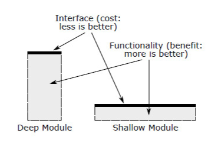
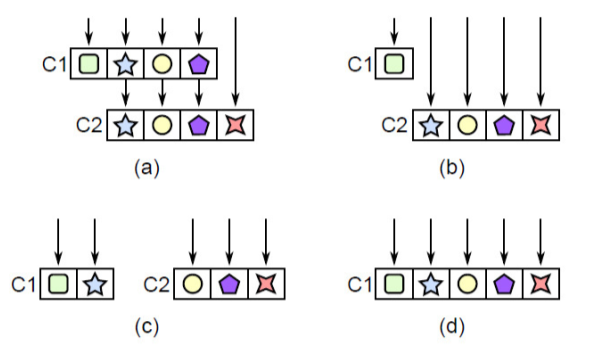
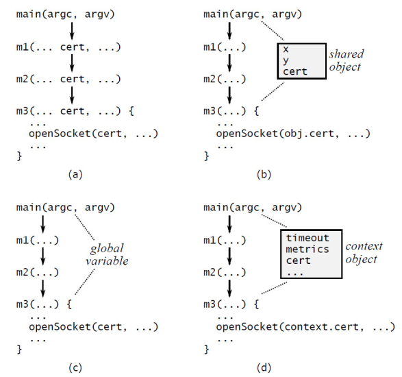

## Ch4 模块应该如何设计

最好的模块是“深”模块，接口简单、参数少，但是隐藏了许多功能，是很好的抽象，用户仅知道一小部分的复杂度即可使用。

浅模块接口复杂，暴露较多复杂性。

模块的深度时对成本与收益的取舍。模块的优势是封装功能。模块的成本（就系统复杂性而言）是接口。接口代表模块强加给系统其余部分的复杂性：接口越小越简单，引入的复杂性就越小。最好的模块是那些收益最大、成本最低的模块。接口是个好东西，但更多或更大的接口不一定更好！

最佳实践：避免浅模块。浅模块是不好的封装，不能够隐藏复杂度。类似的误区还有写很多的类和小函数。应当关注模块的复杂度。

## Ch7 Different Layer, Different Abstraction

软件系统由不同的层级组成，其中较高的层级使用较低的层级提供的功能。比如网络栈的架构，IO 系统架构。

### 透传方法

当相邻的层级具有相似的抽象时，问题通常以透传方法（Pass-through methods）的形式表现出来。透传方法除了调用有类似或相同签名的另一个方法之外，几乎不做任何操作的方法。它让类变得浅，增加接口复杂性，但是带来的功能是微乎其微的。

解决方案：重构这些类，使得每个类有不同职责，职责隔离粒度适当，抽象适当。有几种方法如下：

- 如（b）所示，是将较低层级的类直接暴露给较高层级的类的调用者，而从较高层级的类中移除对该功能的所有责任。
- 如（c），在类之间重新分配功能，
- 如（d），如果无法解开这些类，最好的解决方案可能是**合并**它们。

最佳实践：透传方法是浅模块，要避免。

### 透传变量

跨层级 API 重复的另一种形式是透传变量，该变量是通过一长串方法向下传递的变量。透传变量增加了复杂性，因为它们强迫所有中间方法知道它们的存在。

解决方案：
- 如图（b），查看最顶层和最底层方法之间是否已共享对象，有则不必传递给中间方法。
- 如图（c），存储变量到全局变量。但是需要注意访问冲突等并发问题。
- 如图（d），常用的方法是引入上下文（Context）对象。

不幸的是，在许多地方可能都需要上下文，因此它有可能成为透传变量。为了减少必须知道上下文存在的方法数量，可以将上下文的引用保存在系统的大多数主要对象中。创建新对象时，ctor 从其对象中取得上下文的引用，并将其传递给新对象的构造函数。比如传递给 ctor 一个对象，此对象带有 Context 对象，ctor 可以提取此对象的引用，获取并记录上下文。使用这种方法，上下文随处可用，但仅在构造函数中作为显式参数出现。

存储在上下文中的变量具有全局变量的大多数缺点。例如，为什么存在特定变量或在何处使用特定变量可能并不明显。如果不加以必要的管理，上下文会变成巨大的数据混杂包，从而在整个系统中创建不明显的依赖关系。上下文也可能产生线程安全问题；避免问题的最佳方法是使上下文中的变量不可变。不幸的是，作者没有找到比上下文更好的解决方案。

## Ref and Tag

https://yingang.github.io/aposd2e-zh

A Philosophy of Software Design