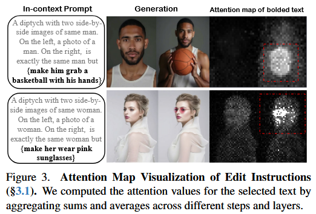
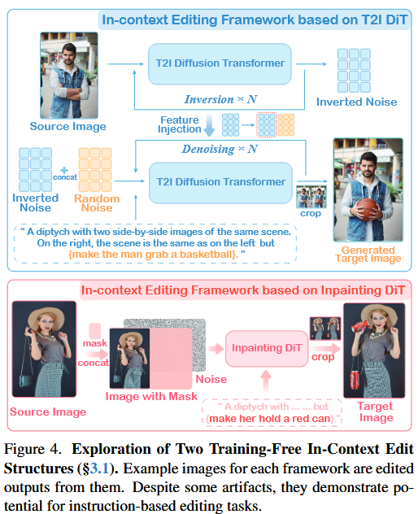

关注只需修改很小的参数，便有强悍的效果。是如何达到的？


## 论文总结

### 作者、团队信息、论文标题、论文链接、项目主页

*   **作者：** Zechuan Zhang, Ji Xie, Yu Lu¹, Zongxin Yang², Yi Yang¹†
*   **团队信息：**
    *   ¹ ReLER, CCAI, Zhejiang University (浙江大学)
    *   ² DBMI, HMS, Harvard University (哈佛大学)
*   **论文标题：** In-Context Edit: Enabling Instructional Image Editing with In-Context Generation in Large Scale Diffusion Transformer (语境编辑：在大型扩散 Transformer 中通过语境生成实现指令图像编辑)
*   **论文链接：** arXiv:2504.20690v1 [cs.CV] 29 Apr 2025 (注意：这是一个未来的日期，根据 OCR 结果记录)
    *   实际ArXiv链接 (基于ID推断)：[https://arxiv.org/abs/2504.20690](https://arxiv.org/abs/2504.20690)
*   **项目主页：** [https://river-zhang.github.io/ICEdit-gh-pages](https://river-zhang.github.io/ICEdit-gh-pages)

### 主要贡献

1.  **新颖的语境编辑框架 (In-Context Editing Framework)：** 提出了一种基于大型扩散 Transformer (DiT) 的语境编辑范式。该方法通过精心设计的“语境编辑提示 (IC Prompt)”，使模型能够在无需修改网络结构或大量微调的情况下，理解并执行编辑指令，实现零样本指令遵循。
2.  **高效的 LoRA-MoE 混合微调策略：** 结合了参数高效的 LoRA 适配器和专家混合 (MoE) 路由机制。这种策略能够在极少的训练数据 (公开数据的 0.5%) 和可训练参数 (先前 SOTA 方法的 1%) 下，有效提升模型在多样化编辑任务上的适应性和性能，实现了动态专家路由。
3.  **早期滤波器推理时缩放策略 (Early Filter Inference Time Scaling)：** 利用视觉语言模型 (VLM)作为评估器，在去噪过程的**早期阶段筛选出与文本指令更匹配的初始噪声候选**，从而提高编辑的鲁棒性和最终输出质量。
4.  **实现了精度与效率的平衡：** 该方法在多个基准测试中取得了最先进的编辑效果，同时显著降低了对训练数据和计算资源的需求，有效解决了现有方法在编辑精度和效率之间的权衡难题。

### 研究背景

*   **研究问题：** 基于指令的图像编辑允许用户通过自然语言提示修改图像，具有广泛应用前景。然而，现有方法在编辑的**精度 (precision)** 和 **效率 (efficiency)** 之间存在难以调和的矛盾。
*   **研究难点：**
    1.  **微调方法 (Finetuning-based methods)：** 虽然能实现较精确的指令遵循，但通常需要大规模的编辑数据集 (如 450K 到 10M 样本)进行训练，计算成本高昂，且模型结构可能需要针对编辑任务进行修改。
    2.  **免训练方法 (Training-free techniques)：** 通过图像反演、提示词替换或注意力操控等方式避免了重新训练，但往往难以理解复杂的编辑指令，导致编辑精度不足，实用性受限。
    3.  **DiT 的潜力挖掘：** 近期的大型扩散 Transformer (DiT) 模型展现出强大的生成能力和固有的语境理解能力，但如何将其有效应用于指令图像编辑，并平衡精度与效率，是一个值得探索的问题。

*   **相关工作：**

    | 领域研究           | 已有方法                                                    | 局限性                                                                                                   | 本文改进                                                                                                                                                   |
    | :----------------- | :---------------------------------------------------------- | :------------------------------------------------------------------------------------------------------- | :--------------------------------------------------------------------------------------------------------------------------------------------------------- |
    | **免训练编辑**     | RF-Solver [43], StableFlow [1], MasaCtrl [5]                | 依赖手动设计的模块限制生成能力，难以理解复杂指令，需要精心设计的提示词，通用性和可扩展性差。             | 提出语境编辑框架，利用 DiT 的原生语境理解能力，通过 IC Prompt 实现零样本指令遵循，避免结构修改。                                                           |
    | **基于微调的编辑** | InstructPix2Pix [3], MGIE [10], EmuEdit [39], FluxEdit [34] | 需要修改模型架构，依赖大规模高质量数据集进行微调 (450K-10M 样本)，计算资源消耗大，编辑结果仍有提升空间。 | 提出 LoRA-MoE 混合微调，仅需极少数据 (50K 样本) 和参数即可高效适应编辑任务，提升多样编辑场景下的成功率和质量。结合早期滤波器推理时缩放策略进一步提升效果。 |

*   **Mermaid 总结相关工作：**
    ```mermaid
    graph TD
        A[指令图像编辑] --> B{现有方法};
        B --> C[微调方法];
        C --> C1[InstructPix2Pix, EmuEdit];
        C1 --> C_Lim[高精度但数据/计算量大];
        B --> D[免训练方法];
        D --> D1[RF-Solver, StableFlow];
        D1 --> D_Lim[高效但指令理解/精度不足];
        A --> E[本文In-ContextEdit];
        E --> E1[基于 DiT 的语境编辑];
        E1 --> E_Sol1[IC Prompt 实现零样本遵循];
        E --> E2[LoRA-MoE 混合微调];
        E2 --> E_Sol2[少量数据高效适应];
        E --> E3[早期滤波器推理时缩放];
        E3 --> E_Sol3[VLM 优化初始噪声];
        C_Lim --> E;
        D_Lim --> E;
    ```

### 方法

本文提出的 In-Context Edit (ICEdit) 方法主要包含三个核心部分：

1.  **基于 DiT 的语境编辑能力探索与框架构建 (§3.1)：**
    *   **语境编辑提示 (In-Context Edit Prompt, IC Prompt)：** 核心思想是利用 DiT 的语境生成能力。设计一种特殊的提示词格式，例如：“一个并排包含同一{主体}的两张图片的双联画。左边是一张{主体}的{原始描述}照片。右边和左边完全一样，但是{应用编辑指令}。”最后，正确且有效的提示词如下：
        *   A diptych with two side-by-side images of same {subject}. On the left, a photo of a {subject} with {original description}. On the right, is exactly the same {subject} but {edit instruction}.
        *   例子：A diptych with two side-by-side images of the same scene. On the right, the scene is exactly the same as on the left but {Put glasses on the girl}. 只需要修改{}内的部分即可
    *   **框架选择：** 探索了基于 T2I DiT 和 Inpainting DiT 的两种训练无关框架。
        *   T2I DiT 框架：通过图像反演注入参考图像特征，计算成本较高。
        *   **Inpainting DiT 框架 (最终选用)：** 将源图像放在双联画的左侧作为参考，右侧区域被掩码 (mask)，然后使用 IC Prompt 指导 DiT 在右侧区域生成编辑后的图像。此方案更直接且计算效率更高。
            *   最终的编辑过程可以表示为：$I_t = \mathcal{E}(I_s, T_e) = \mathcal{D}(I_{IC}, M, T_{IC})$，其中 $I_t$ 是编辑后图像，$\mathcal{D}$ 是 Inpainting DiT 模型，$I_{IC}$ 是包含源图像和掩码区域的语境输入图像，$M$ 是掩码，$T_{IC}$ 是语境编辑提示。

设计了如此的 Prompt 形式："a side-by-side image of the same {subject}: the left depicts the original {description}, while the right mirrors the left but applies {edit instruction}."，称为 **in-context edit prompt (IC prmpt)**。使用 T5 text encoder 作为语义层次的理解，可以有效且准确的保证理解的连贯性。



IC prompt 强化了 DiT 模型，模型以双联画的形式生成编辑后的内容：左侧图像特征匹配了描述部分的内容，对应 prompt 的描述部分。右侧展示根据编辑指令调整后的图像，对应 prompt 的 but 部分。Fig 3 展示了注意力图。这些实验展示了 DiT 模型能够适应和执行嵌入到 IC prompt 的编辑指令，使其能够理解编辑指令，不需要大量微调便可执行。

基于这些 insights，作者提出 In-Context Edit 框架，将左侧图像视作参考图像，右侧作为编辑后的图像。作者引入两个 training-free 框架，基于 text-to-image (T2I) DiT 和 inpaiting DiT。



对于 T2I DiT 框架，设计了隐式参考图像注入方法。消耗计算资源，被作者放弃使用。采用 inpainting DiT framework，此方法更直观。

扩散的优势在于将输入条件（比如文本）与连续的输入（图像）联系起来，最后生成原来输入的内容。

2.  **LoRA-MoE 混合微调 (§3.2)：**
    *   **动机：** 单纯的 LoRA 微调在处理多样化编辑任务时能力有限，因为不同编辑任务可能需要不同的潜在特征操作。
    *   **结构：** 在 Inpainting DiT 模型的多模态注意力模块 (MM Attention block) 的输出投影层中集成并行的 LoRA 专家。
    *   **路由机制：** 一个可训练的路由分类器 `G` 根据输入的视觉 token 和文本嵌入语义动态选择 Top-K (本文 K=1) 个最合适的 LoRA 专家来处理特征转换。
    *   **优势：** 实现了参数高效的自适应，增强了模型处理多样化编辑任务的能力，同时避免了为每个任务训练独立模型的开销。

为了加强编辑能力，作者从公开资源集成了紧凑的编辑数据集（50K 样本），应用了 LoRA 微调到多模态 DiT block 上。尽管数据集较小，但是这个方法获取了显著的效果，具体体现在编辑成功率和质量上。但在一些任务上存在挑战，比如改变风格和移除。作者认为是能力限制，还有定位不同任务的不充分所导致。不同任务需要不同的潜特征表示。

Mixutre of LoRAs: MoE 范式有两个优势：1. 定制化地处理。每个专家关注独有的操作；2. 动态计算，通过路由机制选择特定专家。

作者使用混合 LoRA-MoE 结构，用于 DiT block。包含了平行 LoRA 专家，集成到了多模态注意力模块的输出投影层 (FFN)。一共有 N 个LoRA 专家，rank r 和 scaling factor $\alpha$。对于每个输入 token，通过路由分类器 $G$ 选择最合适的专家。

3.  **早期滤波器推理时缩放 (Early Filter Inference Time Scaling, §3.3)：**
    *   **动机：** **初始噪声**对最终编辑结果质量**影响显著**。对于指令编辑任务，编辑成功与否往往在去噪过程的早期少数几步就能显现。
    *   **流程：**
        1.  **候选生成：** 采样 `m` 个不同的初始噪声候选。
        2.  **初步编辑：** 对每个噪声候选执行 `m` 步（`m` 远小于总去噪步数 `n`）的初步去噪，得到 `M` 个早期编辑结果。
        3.  **VLM 评估：** 使用一个视觉语言模型 (VLM，如 Qwen-VL) 评估这 `M` 个早期结果与编辑指令的符合程度。
        4.  **最优选择：** 通过类似冒泡排序的成对比较选出最佳的噪声候选。
        5.  **最终生成：** 使用选出的最优噪声，执行完整的 `n` 步去噪过程，生成最终编辑图像。
    *   **优势：** 提高了编辑的稳定性和输出质量，使得结果更符合人类偏好。

*   **Mermaid 流程图：**
    ```mermaid
    graph TD
        A[输入: 源图像 I_s, 编辑指令 T_e] --> B{构建语境输入};
        B --> B1[创建语境图像 I_IC 左:I_s, 右:Mask M];
        B --> B2[转换 T_e 为语境提示 T_IC];
        B1 & B2 --> C{早期滤波器推理时缩放};
        C --> C1[1. 采样 M 个初始噪声 Z_1..Z_M];
        C1 --> C2[2. 对每个 Z_i, 执行 m 步初步去噪];
        C2 --> C3[得到 M 个早期编辑结果 I'_1..I'_M];
        C3 --> C4[3. VLM 评估 I'_i 与 T_IC 的符合度];
        C4 --> C5[4. 选择最优初始噪声 Z_opt];
        C5 --> D{Inpainting DiT 模型 FLUX.1 Fill + LoRA-MoE 微调};
        D -- 输入 Z_opt, I_IC, T_IC --> E[执行 n 步去噪];
        E --> F[输出: 编辑后图像 I_t];
    ```

### 实验与结论

*   **实验设置：**
    *   **骨干模型：** FLUX.1 Fill (一个开源的基于 DiT 的 Inpainting 模型)。
    *   **训练数据：** 约 50K 样本，主要来自 MagicBrush (9K) 和 OmniEdit (约 40K) 数据集。
    *   **评估数据集：** MagicBrush, Emu Edit。
    *   **评估指标：**
        *   MagicBrush: L1 距离, CLIP-I, DINO (与 GT 比较)。
        *   Emu Edit: CLIP-I, CLIP-Out, DINO, GPT-4o (评估编辑成功率)。
        *   通用: VIE-Score (包含 SC 指令遵循/区域保持得分 和 PQ 视觉质量得分)。
*   **主要结果：**
    1.  **SOTA 性能：** 在 MagicBrush 和 Emu Edit 测试集上，ICEdit 均取得了与 SOTA 方法相当或更优的性能，尤其在保持图像真实性和文本对齐方面表现突出。
    2.  **数据和参数效率：** 仅使用约 0.5% 的训练数据 (0.05M vs SOTA 的 10M) 和 1% 的可训练参数，达到了 SOTA 水平，显著优于其他基于 DiT 的方法。
    3.  **VIE-Score 评估：** 在 VIE-Score 上显著优于其他开源 SOTA 方法，在使用早期滤波器推理时缩放策略后，其整体得分甚至超过了顶级的闭源商业模型 SeedEdit。
    4.  **消融实验：**
        *   **IC Prompt 的重要性：** 证明了语境编辑提示对于提升编辑能力至关重要。
        *   **LoRA-MoE 的有效性：** LoRA-MoE 设计优于标准的 LoRA 微调，且对模型所有模块进行微调（而非仅输出层）是必要的。
        *   **推理时缩放的增益：** 早期滤波器推理时缩放策略显著提升了编辑性能 (SC 得分提高 19%，整体 VIE-Score 提高 16%)。
*   **应用展示：**
    *   **和谐编辑 (Harmonious Editing)：** 能够生成与原始图像风格、光照等无缝融合的编辑结果。
    *   **多样化任务 (Diverse Tasks)：** 无需额外调整即可应用于手部细节修复、图像重打光等多种实际任务。
*   **结论：**
    论文提出的 In-Context Edit (ICEdit) 方法，通过创新的语境编辑框架、高效的 LoRA-MoE 微调策略以及智能的早期滤波器推理时缩放技术，成功地在大型扩散 Transformer 上实现了高精度且高效率的指令图像编辑。它在大幅减少数据和参数需求的同时，达到了 SOTA 性能，为指令图像编辑领域提供了一个兼顾精度与效率的新范式。

### 不足

论文本身未明确列出其方法的局限性，但根据其描述和通用图像编辑领域的挑战，可能存在的不足或未来可改进的方向包括：

1.  **特定复杂任务的挑战：** 尽管 LoRA-MoE 旨在处理多样化任务，但在论文的 LoRA 微调部分提到“对于某些任务（如风格转换和物体移除）仍然存在挑战，这会降低整体成功率 (challenges persist with certain tasks, e.g. style-changing and removal, which reduce the overall success rate)”。虽然 LoRA-MoE 对此有所改进，但这些本质上困难的任务可能仍是瓶颈。
2.  **泛化能力：** 虽然使用了约 50K 样本，但对于非常罕见或高度抽象的指令，模型的泛化能力可能仍有提升空间。
3.  **对VLM评估器的依赖：** 早期滤波器推理时缩放策略的效果依赖于 VLM 的评估准确性。VLM 本身的偏见或理解能力可能会影响最终噪声选择。
4.  **计算开销（推理时）：** 虽然训练高效，但早期滤波器推理时缩放策略需要在推理时对多个噪声候选进行初步去噪和 VLM 评估，这会增加单次编辑的推理时间。
5.  **主观性指令的处理：** 对于带有强烈主观色彩的编辑指令（例如“让图片看起来更悲伤”），如何准确量化和执行仍然是一个开放性挑战。


## Ref and Tag

【Ai绘画进阶170-IcEdit图像编辑进阶（二），Moe与Normal lora详解，进一步提高成功率的提示词编写方式，新版工作流-T8 Comfyui教程】 https://www.bilibili.com/video/BV11HVhz1Eky/?share_source=copy_web&vd_source=fe1db0b3f565b5940b244b9c7f7b4fa1