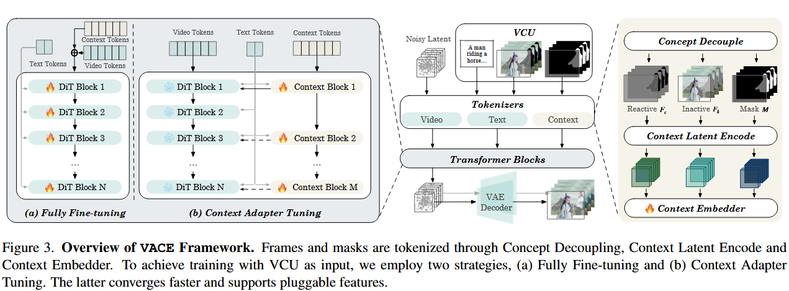

使用了一个叫 VCU (Video Condition Unit) 的核心模块，这玩意就像一个翻译官，把不同任务的 “指令” 统一成模型能听懂的格式。对模型来说，就是一个【文、图、蒙版】的三元组。

如果用户只输入了文字指令，模型发现有文字，但图片和蒙版都没要求，就知道是文生视频指令；要是参考图生成视频，那输入里肯定会有参考图和提示词，模型看见参考图和文字，就理解要让它干图生视频的活儿了。

这样，模型不用为每个任务单独学习，而是通过这三个要素的排列组合，灵活处理各种需求。实现了一个模型顶多个用的效果。

## 论文总结

### 作者、团队信息、论文标题、论文链接、项目主页
- **作者**: Zeyinzi Jiang*, Zhen Han*, Chaojie Mao*, Jingfeng Zhang, Yulin Pan, Yu Liu  
- **团队**: Tongyi Lab, Alibaba Group  
- **论文标题**: VACE: All-in-One Video Creation and Editing  
- **论文链接**: 未直接提供（通常需通过 arXiv 或会议页面获取）  
- **项目主页**: [VACE Project Page](https://ali-vilab.github.io/VACE-Page/)

### 主要贡献
1. **统一框架 VACE**: 首次提出基于 Diffusion Transformer (DiT) 的统一视频生成与编辑框架，支持多任务（文本生成视频、参考生成视频、视频编辑、掩码编辑等）和任务组合。
2. **Video Condition Unit (VCU)**: 提出统一的多模态输入接口，将文本、图像、视频、掩码整合为标准化表示，支持跨时空维度的条件控制。
3. **Context Adapter 结构**: 通过可插拔的上下文适配器注入时空维度特征，实现任务概念的灵活解耦与融合。
4. **VACE-Benchmark**: 构建包含 12 种任务的评估数据集（480 样本），填补视频多任务评估的空白。

### 方法
#### 核心组件
1. **Video Condition Unit (VCU)**:
   - 输入格式: $V = [T; F; M]$（文本 $T$、视频帧序列 $F=\{u_1,u_2,\dots u_n\}$、掩码序列 $M=\{m_1,m_2,\dots m_n\}$）。u 是 RGB 的，归一化到 [-1, 1]。m 是二值的，1 和 0 分别代表编辑与不编辑（比如指定首尾帧，或者指定中间帧，则不预测和推理那几帧，只是参与模型预测）。F 和 M 的空间尺寸为 h x w，时间尺寸为 n。F 和 M 都是针对像素级的，所以有针对特定像素内容修改的能力。
   - 任务编码: 通过空帧（0）和全掩码（1）统一不同任务的输入（如表 1）。
2. **Context Adapter**:
   - **Concept Decoupling**: 将输入分解为反应帧（$F_c = F \times M$）和非活动帧（$F_k = F \times (1-M)$），分别处理需修改和保留的内容。
   - **Context Tokenization**: 将 $F_c$、$F_k$ 和 $M$ 编码为与噪声视频隐变量对齐的时空特征。
   - **Adapter Tuning**: 通过旁路 Transformer Blocks 注入任务特征到主 DiT 分支，支持参数高效微调。

输入通常只有 4 个模态：文本、图像、视频和掩码，整理出 5 种任务类型：
- Text-to-Video Generation (T2V): 不需要 context frame 和 mask，为了一致，全部设置为 0，即 $0_{h\times w}$，代表空白输入；mask 设为 $1_{h \times w}$，代表全部都需要重新生成
- Reference-to-Video Generation (R2V): 使用图像作为参考输入，假设有 l 张图像，前面作为参考。mask 的前 l 位也对应 0，代表这些像素不用修改或编辑，1 则对应需要生成的。
- Video-to-Video Generation
- Masked Video-to-Video Editing (MV2V): F 和 M 都需要显示提供，根据 3D region of interest (ROI)，仅对 ROI 部分像素修改。
- Task Composition: 
   - reference-inpaiting 任务的 context frames $\{r_1, r_2, \dots, r_l, u_1, u_2, \dots, u_n\}$，context masks $\{0_{h \times w}\} \times l + \{m_1, m_2, \dots, m_n\}$。用户可以指定修改视频中 l 个物体，基于此来生成视频

| Tasks | Frames (F's) & Masks (Ms)                                       |
| ----- | --------------------------------------------------------------- |
|  T2V  | $F = \{0_{h \times w}\} \times n \\ M = \{1_{h \times w}\} \times n$                               |
| R2V   | $F = \{r_1, r_2, ..., r_l\} + \{0_{h \times w}\} \times n \\ M = \{0_{h \times w}\} \times l + \{1_{h \times w}\} \times n$      |
| V2V   | $F = \{u_1, u_2, ..., u_n\} \\ M = \{1_{h \times w}\} \times n$                                    |
| MV2V  | $F = \{u_1, u_2, ..., u_n\} \\ M = \{\dot{m}_1, m_2, ..., \dot{m}_n\}$                                    |

可以看到，F 中的 0 代表空白，需要生成图像，通常伴随 mask 为 1。

### 模型结构

重新构造了 DiT 结构，以支持 VCU 输入。文本的 token 化已经很成熟，所以只考虑 context frames 和 masks 的 tokenization。随后，the context tokens 与 noisy video tokens 组合，微调 DiT 模型。作者提出一个 Context Adapter Tuning 策略，the context tokens 可以通过 Context Blocks，并添加到原来的 DiT Block。

#### Context Tokenization

需要将 VCU 输入 tokenize，需要 Concept Decoupling, Context Latent Encode and Context Embedder 来处理。

**Concept Decoupling**: 对输入的视频内容进行语义层面的分解与重组，以支持多任务条件下的灵活视频生成与编辑。其核心思想是：​​将输入的视频帧划分为需修改的“反应帧”（Reactive Frames）和需保留的“非活动帧”（Inactive Frames）​​，从而分离需要编辑的部分与需要保持连贯性的部分。

给定视频帧序列 F 和掩码序列 M（掩码标识需编辑的区域），通过逐帧逐像素的掩码操作：
- ​​反应帧 F_c ​= F×M​​：提取需修改的区域（如被掩码覆盖的物体、需要重绘的背景）。后续，此部分会发生改变。
- ​​非活动帧 F_k ​= F×(1−M)​​：保留未被掩码覆盖的区域（如背景、不需要编辑的物体）。后续此部分保留。特别地，reference images 通常在 F_k 部分。

在 ​​文本生成视频（T2V）​​ 任务中，掩码 M 为全零矩阵，所有帧均为非活动帧，模型完全依赖文本生成。
在 ​​视频编辑​​ 任务中，掩码 M 标记编辑区域（如替换物体），模型仅修改 F_c ​ 对应的内容。

**Context Latent Encoding**: 将视频的时空上下文信息编码为紧凑的潜在表示，为后续生成或编辑任务提供全局一致的语义约束。其核心目标是：​​通过隐式建模视频的时空依赖关系，保留需保留区域（非活动帧）的连贯性，并为需生成区域（反应帧）提供上下文感知的生成条件​​。

DiT 处理 noisy video latents $X \in \mathbb{R}^{n' \times h' \times w' \times d'}$，n' 是时间维度，对应帧数量，h' 和 w' 是高和宽，d' 是潜向量维度。类似地，F_c, F_k, M 也会编码到高维特征空间，以恰当地处理时空关系。F_c 与 F_k 后续都会在 VAE 中处理，映射 F_c 和 F_k 到与噪声 X 的相同潜空间，保持时空一致性。为了保证 reference image 不被杂糅，会单独编码它，之后按照原有的时序维度关系拼接回来。Mask M 直接 reshape 和插值即可。最终，与 X 在时空上对齐，都有形状 n'x h' x w'。

接收来自 ​​Concept Decoupling​​ 的解耦结果：
- ​​非活动帧潜在特征​​ Z_k​: 对应需保留区域的潜在编码（如背景、未修改物体的特征）。
- ​​反应帧潜在特征​​ Z_c: 对应需生成/编辑区域的潜在编码（如待修改物体的外观、动作）。

跨帧注意力机制​​：
通过 ​​Cross-Frame Attention​​ 模块建模帧间依赖：$Z_{out} = \text{Softmax}(\frac{QK^T}{\sqrt{d_k}}) V$

- 在 ​​视频生成（T2V）​​ 中，Z_k​ 为空，模型完全依赖文本生成潜在编码。
- 在 ​​视频编辑​​ 中，Z_k ​提供保留区域的上下文锚点，确保生成内容与原始视频无缝衔接。

**​​Context Embedder**: 将多模态输入（如视频、文本、掩码）编码为统一的潜在表示，concatenate F_c, F_k 和 M，再 tokenizing 为 context tokens。Tokenize F_c 和 F_k 的权重与原 video embedder 相同，而 M 部分则初始化为 0。其核心目标是：​​通过联合建模视频内容与用户指令（如文本提示），提取任务相关的上下文特征，并抑制无关噪声​​。

### 微调方式

Fully Fine-Tuning and Context Adapter Tuning

Fully fine-tuning 是简单且容易想到的方式，相加 context tokens 与 noisy tokens。

Context Adapter 思想类似 ResNet，

Insights：是否可以通过输入视频模态，让机械臂决定从上抓或下抓。实现 In-Context Learning。还有，如何考虑机械臂动作的 token 化，也很重要。

是否可以训练自注意力的抓取，然后用 Context Adapter 适配下游？甚至是不同具身？

## Ref and Tag