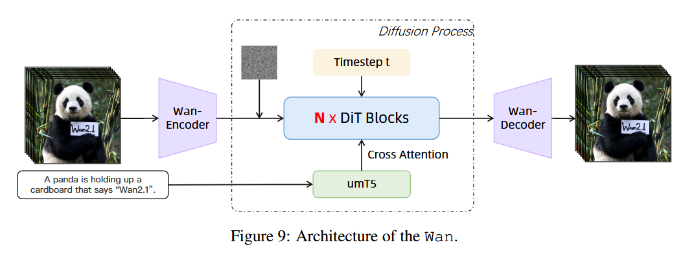
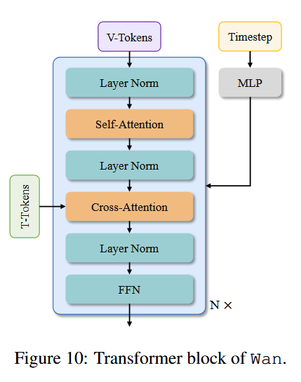
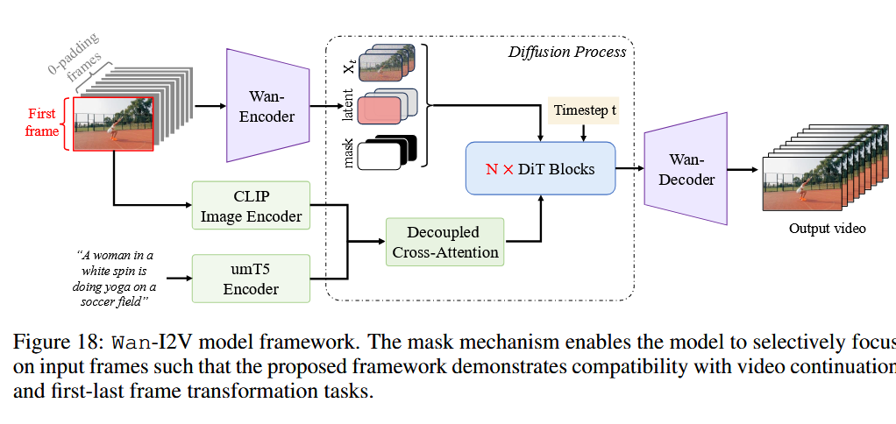
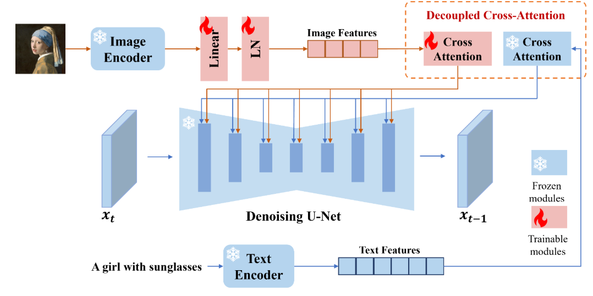

观点：大厂做的大模型的效果，**数据清洗的精细度和数据量**往往决定了最终模型的效果，模型结构侧改动各大厂虽然有细微区别，但是目前并不是最终影响模型性能的决定性因素。

## 模型架构



Wan2.1的所有任务基本是完全采用了VACE的范式（也是阿里提出的all in one视频模型，具体参考 https://github.com/ali-vilab/VACE）。



DiT 块如图，文本通过 umT5 编码再用CrossAttention融合到DiT中，时间步通过MLP编码乘condition然后通过AdaLN-zero学习缩放系数。这里MLP在所有的DiT块中都是共用的参数，也减少了一部分需要训练的参数。在Wan2.1之前用的比较多的CogVideoX-1.5和hunyuanI2V都是采用了MMDiT，而Wan2.1并没有才用MMDiT的信息交互方式，而是直接用 **CrossAttention** 去做信息交互。

## 代码实现

### WanT2V

```py
# wan/text2video.py
class WanT2V:
    def __init__(...):
        ...
        self.text_encoder = T5EncoderModel(...)
        ...
        self.model = WanModel.from_pretrained(checkpoint_dir)
        self.model.eval().requires_grad_(False)

    def generate(self,
                 input_prompt,
                 size=(1280, 720),
                 frame_num=81,
                 shift=5.0,
                 sample_solver='unipc',
                 sampling_steps=50,
                 guide_scale=5.0,
                 n_prompt="",
                 seed=-1,
                 offload_model=True):
        """
        Args:
            input_prompt (`str`):
                Text prompt for content generation
            ...
            n_prompt (`str`, *optional*, defaults to ""):
                Negative prompt for content exclusion. If not given, use `config.sample_neg_prompt`
            ...

        """
        ...
        else:
            context = self.text_encoder([input_prompt], torch.device('cpu'))
            context_null = self.text_encoder([n_prompt], torch.device('cpu'))
            context = [t.to(self.device) for t in context]
            context_null = [t.to(self.device) for t in context_null]
            latents = noise

        with ...:
            ...
            arg_c = {'context': context, 'seq_len': seq_len}
            arg_null = {'context': context_null, 'seq_len': seq_len}

            for _, t in enumerate(tqdm(timesteps)):
                latent_model_input = latents
                timestep = [t]

                timestep = torch.stack(timestep)

                self.model.to(self.device)
                noise_pred_cond = self.model(
                    latent_model_input, t=timestep, **arg_c)[0]
                noise_pred_uncond = self.model(
                    latent_model_input, t=timestep, **arg_null)[0]

                noise_pred = noise_pred_uncond + guide_scale * (
                    noise_pred_cond - noise_pred_uncond)

                temp_x0 = sample_scheduler.step(
                    noise_pred.unsqueeze(0),
                    t,
                    latents[0].unsqueeze(0),
                    return_dict=False,
                    generator=seed_g)[0]
                latents = [temp_x0.squeeze(0)]
```

可以看到，使用 umT5 编码后，再送文本输入给模型。

**Classifier-free Guidance (条件控制的扩散模型)**：这是推理技术，而不是训练技术。生成视频时，有两个部分，一部分是 uncond，不带有 condition 的输入，或者说 context_null 就是 "" 编码而来的，没有文本内容的输入。另一部分则是有条件的输入。无条件预测的噪声加上缩放后的两者噪声只差，得到最终噪声，用于去噪。

参数 guide_scale 的作用​​
- ​​γ=0​​：完全使用无条件预测，生成与条件无关的内容（高多样性，低控制性）。
- ​​γ=1​​：等价于直接使用条件预测，可能保留较多噪声（条件影响不足）。
- ​​γ>1​​（如 γ=7.5）：显著增强条件信号，生成结果更贴合输入条件，但可能降低多样性。

```py
# wan/modules/model.pywan/modules/model.py
class WanModel(ModelMixin, ConfigMixin):
    def forward(self, x, t, context, seq_len, clip_fea=None, y=None): 
        ...
        kwargs = dict(
            e=e0,
            seq_lens=seq_lens,
            grid_sizes=grid_sizes,
            freqs=self.freqs,
            context=context,
            context_lens=context_lens)

        for block in self.blocks:
            x = block(x, **kwargs)
        ...

class WanAttentionBlock(nn.Module):
    def forward(...):
        assert e.dtype == torch.float32
        with amp.autocast(dtype=torch.float32):
            e = (self.modulation + e).chunk(6, dim=1)
        assert e[0].dtype == torch.float32

        # self-attention
        y = self.self_attn(
            self.norm1(x).float() * (1 + e[1]) + e[0], seq_lens, grid_sizes,
            freqs)
        with amp.autocast(dtype=torch.float32):
            x = x + y * e[2]

        # cross-attention & ffn function
        def cross_attn_ffn(x, context, context_lens, e):
            x = x + self.cross_attn(self.norm3(x), context, context_lens)
            y = self.ffn(self.norm2(x).float() * (1 + e[4]) + e[3])
            with amp.autocast(dtype=torch.float32):
                x = x + y * e[5]
            return x

        x = cross_attn_ffn(x, context, context_lens, e)
        return x
```

x 是噪声；t 是时间步；context 是文本编码后的向量。在 Block 模块，使用了自动混合精度 amp。先进行自注意力，此时不涉及文本部分。再使用交叉注意力，嵌入 context 文本部分呢内容。

### I2V

图文生视频模型结构主要就是采用了VACE的范式。



用和 latent 一样维度的 mask 来控制模型理解哪些帧和像素点需要去生成（像素点这部分就是editing 那边做的，I2V 这边主要还是直接控制帧）。mask 的维度和 latent 是一样的，也具有空间分辨率和时间维度，在首帧和首尾帧生成的过程中，mask 就是将时间维度第一帧或首尾帧（用户可能提供首帧或同时提供首尾帧的图像来指定生成任务）设置为 1，代表不用对此帧去噪和 decode。其他帧设置为 0，0 就代表了这一帧是需要模型生成的，这种范式确实能够达到目前视频任务的 all in one 效果。

图中，Xt 就是第一帧的图像，加上后面拼接的 0 帧经过 encoder 的条件潜在变量Xt，

Decoupled CrossAttention和IP-Adapter一样，在源码中，经过CLIP的img token和经过umT5的text token拼接在一起，然后前image_context_length长度是img token，后面剩下的长度就是text token，两边的token分别经过不同的 CrossAttention 去融合到DiT中。



```py
###I2V使用的CrossAttention

class WanI2VCrossAttention(WanSelfAttention):

    def __init__(self,
                 dim,
                 num_heads,
                 window_size=(-1, -1),
                 qk_norm=True,
                 eps=1e-6):
        super().__init__(dim, num_heads, window_size, qk_norm, eps)

        self.k_img = nn.Linear(dim, dim)
        self.v_img = nn.Linear(dim, dim)
        # self.alpha = nn.Parameter(torch.zeros((1, )))
        self.norm_k_img = WanRMSNorm(dim, eps=eps) if qk_norm else nn.Identity()

    def forward(self, x, context, context_lens):
        r"""
        Args:
            x(Tensor): Shape [B, L1, C]
            context(Tensor): Shape [B, L2, C]
            context_lens(Tensor): Shape [B]
        """
        image_context_length = context.shape[1] - T5_CONTEXT_TOKEN_NUMBER
        context_img = context[:, :image_context_length]
        context = context[:, image_context_length:]
        b, n, d = x.size(0), self.num_heads, self.head_dim

        # compute query, key, value
        q = self.norm_q(self.q(x)).view(b, -1, n, d)
        k = self.norm_k(self.k(context)).view(b, -1, n, d)
        v = self.v(context).view(b, -1, n, d)
        k_img = self.norm_k_img(self.k_img(context_img)).view(b, -1, n, d)
        v_img = self.v_img(context_img).view(b, -1, n, d)
        img_x = flash_attention(q, k_img, v_img, k_lens=None)
        # compute attention
        x = flash_attention(q, k, v, k_lens=context_lens)

        # output
        x = x.flatten(2)
        img_x = img_x.flatten(2)
        x = x + img_x
        x = self.o(x)
        return x
```

## 数据

Wan2.1 的数据处理 pipeline 也较为复杂，这也是 Wan2.1 能够取得较大成功的原因，有一个较为负面的例子也是不久之前开源的Open-Sora2.0。它的数据处理流程相比与Wan2.1相对粗糙，加上OpenSora2.0的VAE压缩程度太狠，这一点也导致了它的性能并没有那么好。

为什么要讲数据怎么造的？大部分刚入门大模型的人（包括我）在学习的初期都会认为清洗数据是 Dirty work，但随着学习和对模型的调研，我们会发现**数据的质量几乎决定了基座模型的性能**，一个好的数据清洗 pipeline 值得我们学习，在对模型进行微调的过程中也会有大量的清洗数据工作，这个时候如果有一个优秀的pipeline进行对齐，对于我们训练一个表现良好且适应业务场景的大模型是非常有利的。

预训练数据主要从三个维度进行清洗和挑选，包括基本维度、视觉质量、动作质量。

## Ref and Tag

1 月 9 日阿里云通义万相推出万相 2.1 视频生成模型，你怎么看？ - PACE7的回答 - 知乎
https://www.zhihu.com/question/9145862684/answer/1902873622961459735

https://arxiv.org/pdf/2503.203141932

https://github.com/Wan-Video/Wan2.1