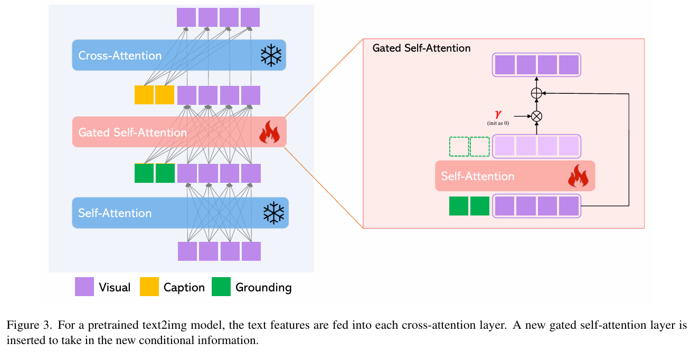

## SYNCAMMASTER: 多机位同步视频生成

https://arxiv.org/abs/2412.07760, ICLR 2025

根据 prompt 生成多机位的视频。难点是同步。多机位如何保证相同的目标或主角？对双臂协作有用。

机器人也是多视角的图像，比如头部和腕部。可以学习如何融合数据和提取特征。根据用户输入的文本描述及相机位姿生成多段时序同步视频，在保证同步性的同时支持大幅度的视角变化。

### 方法和创新点

基于预训练的 “文本 - 视频” 生成模型，在每个 Transformer Block 中插入两个新组件：
- **相机编码器**：将归一化的相机外部参数投影到嵌入空间；使用 element-wise 的方式添加到 spatial features。
- **多视角同步模块**：在相机相对位姿的指导下进行多视角特征融合。

训练时只更新新组件参数，预训练的文本 - 视频生成模型保持冻结状态。创新点：
- SynCamMaster **率先实现了多机位真实世界视频生成**。设计了一种即插即用的 “多视角同步” 模块以实现任意视角下的同步视频生成。
- 提出了一种**多种数据混合的训练范式**，以克服多机位视频数据的稀缺性并使得模型具备较好的泛化能力。**公开了多视角同步视频数据集 SynCamVideo-Dataset** 用于多视角视频生成的研究。

在 Wan2.1 中，使用了 umT5(arXiv:2304.09151) 作为文本编码器。

什么是 Spatial-attn, 3D-attn, View-attn？都是自注意力机制等。


Multi-View Synchronization Module reshape 自注意力的输出，再 element-wise 的加上编码后的相机外参特征。

相机位姿用 3x4 的矩阵表示，3x3 是旋转矩阵，3x1 是平移向量。b 代表批次，n 代表相机数量，即视角数量。f 代表帧数，即视频长度。s 代表 token sequence size  s = h ∗ w。

对于 Prompt，使用交叉注意力机制融合。Prompt 作为交叉注意力中的 K 和 V，视频特征作为 Q。

### 代码实现

参考 diffsynth/models/wan_video_dit.py，作者是如何添加模块到 DiT。

```py
class DiTBlock(nn.Module):
    def __init__(
        self,
        has_image_input: bool,
        dim: int,
        num_heads: int,
        ffn_dim: int,
        eps: float = 1e-6,
    ):
        super().__init__()
        self.dim = dim
        self.num_heads = num_heads
        self.ffn_dim = ffn_dim

        self.self_attn = SelfAttention(dim, num_heads, eps)
        self.cross_attn = CrossAttention(
            dim, num_heads, eps, has_image_input=has_image_input
        )
        self.norm1 = nn.LayerNorm(dim, eps=eps, elementwise_affine=False)
        self.norm2 = nn.LayerNorm(dim, eps=eps, elementwise_affine=False)
        self.norm3 = nn.LayerNorm(dim, eps=eps)
        self.ffn = nn.Sequential(
            nn.Linear(dim, ffn_dim),
            nn.GELU(approximate="tanh"),
            nn.Linear(ffn_dim, dim),
        )
        # 类似注意力中 softmax 除以根号 dim 的部分
        # 直接保存缩放参数，而非接受 context 来预测的网络。Wan2.1 的设计认为应当节省参数，context 仅仅在外层使用一个 MLP 来加入交叉注意力。
        self.modulation = nn.Parameter(torch.randn(1, 6, dim) / dim**0.5)

    def forward(self, x, context, cam_emb, t_mod, freqs, freqs_mvs):
        # x 时视频 token，context 通常是文本，cam_emb 是视频的相机参数，t_mod 是视频的 temporal modulator，freqs_mvs 是 rope 的频率

        # 注释的是原版的 wan2.1
        # wan2.1 forward
        # shift_msa, scale_msa, gate_msa, shift_mlp, scale_mlp, gate_mlp = (
        #     self.modulation.to(dtype=t_mod.dtype, device=t_mod.device) + t_mod).chunk(6, dim=1)
        # input_x = modulate(self.norm1(x), shift_msa, scale_msa)
        # x = x + gate_msa * self.self_attn(input_x, freqs)
        # x = x + self.cross_attn(self.norm3(x), context)
        # input_x = modulate(self.norm2(x), shift_mlp, scale_mlp)
        # x = x + gate_mlp * self.ffn(input_x)

        # Spatial attn 部分。在 x norm 之后使用 scale shift，再经过自注意力后，
        # 使用一个 gate 来 scale。加上残差连接
        # msa: multi-head self-attention
        shift_msa, scale_msa, gate_msa, shift_mlp, scale_mlp, gate_mlp = (
            self.modulation.to(dtype=t_mod.dtype, device=t_mod.device) + t_mod
        ).chunk(6, dim=1)
        input_x = modulate(self.norm1(x), shift_msa, scale_msa)
        x = x + gate_msa * self.self_attn(input_x, freqs)

        # 下面是作者添加的模块
        # 注意，self.modulation_mvs 在训练开始时在添加，通常是
        # block.modulation_mvs = nn.Parameter(torch.randn(1, 3, dim) / dim**0.5)
        # 而在推理时，通常将 block.modulation_mvs.data = block.modulation.data[:, :3, :].clone()
        # mvs: multi-view synchronization module
        shift_mvs, scale_mvs, gate_mvs = (
            self.modulation_mvs.to(dtype=t_mod.dtype, device=t_mod.device)
            + t_mod[:, :3, :]
        ).chunk(3, dim=1)
        input_x = modulate(self.norm_mvs(x), shift_mvs, scale_mvs)
        v, f, _ = cam_emb.shape
        h, w = 30, 52  # h, w  hard code
        cam_emb = self.cam_encoder(cam_emb)
        cam_emb = cam_emb.unsqueeze(2).unsqueeze(3).repeat(1, 1, h, w, 1)
        # b batch size; f frame_counts, 视频长度; h, w 代表 latent noise 大小
        cam_emb = rearrange(cam_emb, "b f h w d -> b (f h w) d")
        input_x = input_x + cam_emb
        # v 代表 views，视角数量
        x = rearrange(x, "(b v) (f h w) d -> (b f) (v h w) d", v=v, f=f, h=h, w=w)
        input_x = rearrange(
            input_x, "(b v) (f h w) d -> (b f) (v h w) d", v=v, f=f, h=h, w=w
        )
        x = x + gate_mvs * self.projector(self.mvs_attn(input_x, freqs_mvs))
        x = rearrange(x, "(b f) (v h w) d -> (b v) (f h w) d", v=v, f=f, h=h, w=w)

        # mlp: multi-layer perceptron
        x = x + self.cross_attn(self.norm3(x), context)
        input_x = modulate(self.norm2(x), shift_mlp, scale_mlp)
        x = x + gate_mlp * self.ffn(input_x)

        return x
```

cam_emb 代表相机参数。

在 DiT 模块中，嵌入其他模块的方式通常是:
- 直接相加：简单的内容，比如相机外参在编码后，与输入 x 直接相加
- AdaLN 的思路：在 MHA 和 FNN 之前进行 shift+scale 操作，之后在使用 gate 进行 scale。通常使用 nn.Linear() 或者 nn.Parameter() 来预测这三个参数，做 modulate 操作。

#### 为什么不直接在 `__init__()` 方法添加这些模块？

答案是为了方便加载预训练的模型。

注意，上面只是修改了 forward 函数的方法，并没有直接修改 `__init__` 方法。注入模块体现在训练时，把模块添加到 DiT Block。

如果在 `__init__()` 中添加了新的字段，特别是 `nn.Module` 类型的字段，那么 state_dict() 和 load_state_dict() 会考虑这些新的字段。不在 `__init__()` 方法添加字段的话，我们构造实例后，状态和字段与原来模型保持一致，比如 Wan2.1，我们可以直接使用原模型加载预训练参数的方法加载。加载后，再动态地注入新模块，设置冻结与更新梯度，可以继续训练目标模块。简化了加载模型流程。如果在 `__init__()` 方法添加新的字段，那么可能影响原来加载模型的流程。特别是有些模型会根据字段名字来加载参数，所以需要注意。简单例子如下：

```py
class Block(torch.nn.Module):
    def __init__(self):
        super().__init__()
        self.norm1 = torch.nn.LayerNorm(4)

    def forward(self, x):
        x = self.norm1(x)
        return x

b = Block()
print(b.state_dict())
```

state_dict() 输出仅有 norm1.weight 和 norm1.bias。但是如果动态添加字段后，并且是 nn.Module 的对象，那么 state_dict() 会考虑这些新的字段。梯度也会更新之。

```py
b.fc = torch.nn.Linear(4, 4)
```

#### 训练部分设置

```py
class LightningModelForTrain(pl.LightningModule):
    def __init__(...):
        ...
        dim=self.pipe.dit.blocks[0].self_attn.q.weight.shape[0]
        for block in self.pipe.dit.blocks:
            block.cam_encoder = nn.Linear(12, dim)
            block.projector = nn.Linear(dim, dim)
            block.cam_encoder.weight.data.zero_()
            block.cam_encoder.bias.data.zero_()
            block.projector.weight = nn.Parameter(torch.zeros(dim, dim))
            block.projector.bias = nn.Parameter(torch.zeros(dim))
            block.norm_mvs = nn.LayerNorm(dim, eps=block.norm1.eps, elementwise_affine=False)
            block.modulation_mvs = nn.Parameter(torch.randn(1, 3, dim) / dim**0.5)
            block.mvs_attn = SelfAttention(dim, block.self_attn.num_heads, block.self_attn.norm_q.eps)
            block.modulation_mvs.data = block.modulation.data[:, :3, :].clone()
            # 复制自注意力部分的权重来训练
            block.mvs_attn.load_state_dict(block.self_attn.state_dict(), strict=True)
        ...
```

可以看到，只对相机编码器，投影层，多视角注意力，和生成 scale, shift 的参数训练。

### 训练数据集：SynCamVideo

收集过程。(a) 从镜头运动的视频采样视频帧，构造“多视角图像数据”；(b) 通过 Unreal Engine 5 渲染“多视角视频数据”；(c) 利用通用视频数据来正则化。

SynCamVideo 数据集使用 Unreal Engine 5 渲染的多摄像机同步视频数据集。包含 1,000 个不同的场景，每个场景由 36 个摄像机拍摄，总计 36,000 个视频。

## 3DTrajMaster: 精准控制视频中物体的 3D 轨迹

https://arxiv.org/pdf/2412.07759, ICLR 2025

精准控制视频中多个实体的 3D 时空位置，在拍摄中针对物体的定制化特效。

可灵研究团队提出了 3DTrajMaster 的多物体 3D 位姿可控的视频生成模型。该方法通过逐主体相对应的 3D 轨迹控制视频生成中多个主体在 3D 空间中的运动，相比与传统在 2D 空间的表征 (边界框、点轨迹等) 是一种更本真的物体运动建模方式。这里的 3D 轨迹指可控制 6 个自由度，即控制主体的 3D 位置和朝向。

借鉴：控制物体->控制机械臂。

### 方法和训练

关注文本提示插入的方法。

有两阶段训练。

核心是一个 plug-and-play 3D-motion grounded object injector，通过门控自注意力机制，融合 3D 轨迹给多个输入实体。injector 架构能提供扩散的先验知识，对泛化能力至关重要。

以 Entity 为中心，在机器人中类似 object-centric。



受到 [Open-set grounded text-to-image generation](https://arxiv.org/pdf/2301.07093) 工作启发，门控通常用于处理多输入对的场景。比如，多个 Entities 和轨迹。使用

## ReCamMaster

re-capture in-the-wild videos with noval camera trajectories.

前面两个工作虽然面对多机位，但是相机固定。此工作针对相机运动场景，可以借鉴。机械臂移动时，腕部相机是移动的。可以用于数据增强，增加训练数据。模拟头部移动场景。

## 关注如何制作数据集

他们是如何想到这些很酷的 ideas？如何去设计的？

## Ref and Tag

可灵视频生成可控性为什么这么好？快手又公开了四篇研究 - 快手技术的文章 - 知乎
https://zhuanlan.zhihu.com/p/23467059078

https://arxiv.org/pdf/2412.07760，多视角图像生成视频。