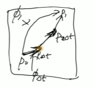

## 前置知识

有随机变量和分布 $z \sim \pi(z)$，有可逆变换 $f: x = f(z)$，有可逆变换 $g: z = f^{-1}(x)$。

我们知道了 z 和 x 的变换和 z 的概率密度，但是不知道 x 的概率密度。现在有两个随机变量的关系，且知道其中一个分布，那么，可作概率密度的变量变换，以求得 x 的概率密度，进而得到 x 的分布：

$$
p(x) = \pi(z) |\frac{dz}{dx}| = \pi(f^{-1}(x)) |\frac{d f^{-1}}{dz}| = \\
\pi(f^{-1}(x))|(f^{-1})'(x)|
$$

x 的概率密度，为 z 的概率密度乘以 z 对 x 求导的绝对值。这是可以用变限积分求导推得。证明放到后面部分。

flow 的概念，将一个分布不断地加上可逆变换，变为另一个分布的过程。类似扩散的概念，将图像不断加噪得到高斯噪声，或是将高斯噪声不断去噪得到图像。

建模两个分布之间的关系，即可逆变换。比如标准正态分布到我们数据的分布。就像：

$$
x_t = (f_t \circ f_{t-1} \circ \cdots \circ f_1)(x_0)
$$

论文把变换部分记为：

$$
\phi_t = (f_t \circ f_{t-1} \circ \cdots \circ f_1) \\
$$

或者

$$
\psi_t = (f_t \circ f_{t-1} \circ \cdots \circ f_1) 
$$

$\phi_t$ 或 $\psi_t$ 就是 flow。我们对 $t \in [0, T]$，T 为整数，进行归一化，使得 $t \in [0, 1]$，从而认为 t 是连续的。有了连续的变量，我们可以借助常微分方程来设计 flow，称为 continuous normalizing flows：

$$
\frac{d}{dt}\phi_t(x) = v_t (\phi_t(x)) \\
\phi_0 (x) = x
$$

上面揭示了如此关系。式子左侧代表在 t 时刻，对 t 的变化，式子右侧得到向量场，对应左侧的值。结果是矢量。

有了 ODE，可以用 Euler 法采样，比如 $x_{t+\Delta{t}}=x_t + \Delta t v_t$，式子两侧可以对应为分布，比如 $p_0 \leftrightarrow p_1$，$x_0 \leftrightarrow x_t$；与 DDPM 不同，$x_0$ 是噪声，$x_t$ 是去噪后的图像。

关键词：
- Flow: $\phi_t$ 或 $\psi_t$
- Time dependent vector field: 时间依赖向量场，对应 ODE 中的 $v_t$
- Probability density path: 对应最终图像的分布 $p_t$

可以先设定路径 p_t，再给定变换 $\phi_t$，就能求出 v_t。



**Push forward equation**。$\phi_t$ 作用于随机变量，需要表达分布的变换，有：

$$
p_t = [\phi_t] * p_0 = p_0 (\phi_t^{-1}(x))|(\phi_t^{-1})'(x)| \tag{3}
$$

将初始分布变为 t 时刻的分布。0 时刻，$p_0$ 通常代表标准高斯分布。

**Continuity equation**：给定了向量场，v_t，可以生成概率路径 p_t，参考如下：

$$
\frac{d}{dt} p_t(x) + \text{div} (p_t(x) v_t(x)) = 0
$$

这是从物理学含义出发，此式子可以证明一些性质。满足此式子，代表可以从 v_t 求出 p_t，解微分方程即可。即模型 v_t 能够预测出分布。利用此性质，可以从高斯噪声逐步预测目标图像。

总结联系：有了向量场，可以使用 continuity equation 求得分布 p_t；有了分布 p_t，可以根据 flow 来求出去噪后的图像。

之所以称为概率路径，是为了强调这些不同的分布随着时间连续演化的特性，以及连接两个分布的过程中，所扮演的角色。

## Flow Matching

类似 Score matching，

$$
\mathcal{L}_{\mathtt{FM}}(\theta) = \mathbb{E}_{t, p_t(x)} \| v_t(x) - u_t(x) \|^2
$$

其中，v_t(x) 是模型预测的值，u_t(x) 是真实值，GT。上面的 Loss，可以对应每个时刻 t，约束和更新参数，使得模型预测的 v_t 拟合到 GT u_t 上。有了 u_t 的值，或者是模型拟合预测 u_t 的值，可以求解出分布 p_t，从而求出 x_0。保证了每个样本沿着向量场 u_t 移动到想要的分布上。$t \in [0,1]$，x_0 是噪声，x_1 是图像。

有此 Loss 后，还是求不了，因为 GT 未知。类似地，在 DDPM 中，每一个中间步的 GT，$p(x_{t-1}|x_t) $ 也是未知。

为了解决此问题，附加条件可以解决。比如 DDPM 选择用高斯噪声来加噪，并且每一步是基于上一步和第一步得来的，所以两个条件都已知，即 $p(x_{t-1}|x_t,x_0)$ 已知，并且 p(x_t|x_0) 已知，从而可以求出 GT。

既然预测不出来 GT，无条件的向量场 u_t(x)；所以，加上原图像 x_1 作为条件，即可知道。u_t(x|x_1)，有了 GT，可以训练模型，让其拟合此 GT。因为加噪是我们做的，那么我们自然知道加噪的过程的参数，知道其分布或变换。作者用很大篇幅阐述了，带条件的向量场可以预测出来，可以等价于不带条件的向量场。

### 定理 1：可预测的带条件的向量场能够替代不带条件的向量场

这是为什么模型能够起作用的原因。作者探讨了 u_t(x|x_1) 和 u_t(x) 的关系。

根据 u_t(x|x_1)，能够得到 p_t(x|x1)，可以证明边缘向量场 u_t(x) 也能够走向 p_t(x)，即不带条件的情况也成立。

证明的式子提出了，使用加权求和的形式，可以得出此结论。详见论文附录的 Theorem Proofs，用到了 continuity equation 来证明性质。

### 定理 2：带条件的损失函数等价于不带条件的损失函数

直接用条件向量场求 Loss，证明与不带条件的 Loss 等价。直观上，把边缘向量场替换为条件向量场。

### 定理 3：求 mu_t，CONDITIONAL PROBABILITY PATHS AND VECTOR FIELDS

根据加噪，有 t 时刻的高斯条件概率路径分布如下：

$$
p_t(x|x_1) = \mathcal{N}(x|\mu_t(x_1),\sigma_t(x_1)^2 I) \tag{10}
$$

计算时，到 t=0 时刻，得到分布 $p(x) = \mathcal{N}(x|0,I)$，即高斯分布。也就是 $x_0$ 在 0 时刻，等价与高斯分布采样的噪声。此思想类似 DDPM。

在 t=1 时刻，自然地，期望 $\mu_1(x_1) = x_1$，但是不可能把方差设置为 0，但是可以设置为很小的数，有 $\sigma_1(x_1) = \sigma_{min}$。

在 t 时刻，服从高斯分布，期望和方差与 $x_1$ 有关。

加噪过程，即变换过程，流的过程，具体如下：

$$
\psi_t(x) = \sigma_t(x_1)x + \mu_t(x_1) \tag{11}
$$

注意，此处的 x 是标准高斯分布采样而来的，就像 DDPM 加噪的 $\epsilon$。

$\psi_t$ 推动噪声分布 $p_0(x|x_1)=p(x)$ 到 $p_t(x|x_1)$。即上述变换，揭示了加噪和去噪的过程。根据 ODE 可以计算 $u_t$，即神经网络需要预测的速度场。

需要证明定理 3，(10) 的高斯概率路径可以通过 (11) 变换得到。于是，唯一的向量场可由高斯路径计算如下：

$$
u_t(x|x_t) = \frac{\sigma_t'(x_1)}{\sigma_t(x_1)}(x - \mu_t(x_1)) + \mu_t'(x_1)
$$

$\sigma_t$ 和 $\sigma_t'$ 的形式，可以根据具体加噪形式决定。

注意，$\mu_t, \sigma_t$ 不是求解得到的，而是设计的。先有它们的设计，才能求出 $\psi_t$，才能求解出 $u_t$。它们是作者根据想要的，理想的概率路径设计而来的关于时间 t 的函数。设计之后，导数就可以计算出来了。

### 具体设计方案

回顾目标，为了训练一个向量场 $v_t$，把简单的噪声分布 $p_0(x)=\mathcal{N}(x|0,I)$ 平滑地推送到 t=1 时刻的目标数据分布 $p_1(x)$。

注意边界条件，t=0 时刻，要满足两个参数服从标准高斯分布；t=1 时刻有 $\mu_1 = x_1, \sigma_1 = \sigma_{min}$。

#### 方案一：Diffusion conditional VFs

$$
\mu_t(x_1) = \alpha_{1-t} x_1 \\
\sigma_t(x_1) = \sqrt{1 - \alpha_{1-t}^2}
$$

求得：

$$
u_t(x|x_1) = \frac{\alpha_{1-t}' - t}{1 - \alpha_{1-t}^2} (\alpha_{1-t} x - x_1) = -\frac{T'(1-t)}{2} \left[ \frac{e^{-T(1-t)x} - e^{-\frac{1}{2}T(1-t)x_1}}{1 - e^{-T(1-t)}} \right]
$$

#### 方案二：Optimal Transport (OT) conditional VFs（作者推荐）

此路径更简单、高效。设计思路是让均值和标准差都进行线性插值。设计如下，令：

$$
\mu_t(x_1) = t * x_1 \\
\sigma_t(x_1) = 1 - (1 - \sigma_{min}) * t
$$

有

$$
\psi_t(x) = x - (1 - \sigma_{min}) t x + t x_1 \\
\overset{\sigma_{min} \rightarrow 0}{=} (1 - t)x + t x_1
$$

其中，x 服从标准高斯分布，

分别对 t 求导，有：

$$
\mu_t'(x_1) = x_1 \\
\sigma_t'(x_1) = - (1 - \sigma_{min})
$$

利用定理 3，求得向量场：

$$
\mu_t(x|x_1) = \frac{x_1 - (1 - \sigma_{min})x}{1 - (1 - \sigma_{min}) t}
$$

使用 Euler step 还原：有了 v_t，使用 Euler step 从噪声还原。若推理 10 步，有每个时间步长度 dt = 1/10 = 0.1，于是欧拉步进如下：

```py
num_steps = 10
dt = -1.0 / num_steps
# 从高斯噪声采样
x_t = noise
time = 1.0
# time 从 1.0 -> 0.0，共执行 10 次
while time = -dt / 2:
   v_t = denoise_step(...)
   x_t += dt * v_t
   time += dt
```

最终执行，x_t 逼近 $\mu_0(x_1)$。

## 证明

### 概率密度函数的变量替换

证明 $p(x) = \pi(z) |\frac{dz}{dx}|$

要证明概率密度函数在可逆变换下的变化公式 \(p(x) = \pi(z) \left|\frac{dz}{dx}\right|\)，我们需要从基本的概率论原理出发，特别是考虑累积分布函数（CDF）和它们之间的关系。

#### 假设条件

- \(z\) 是一个随机变量，并且其概率密度函数为 \(\pi(z)\)。
- \(f: x = f(z)\) 是一个可逆变换，即存在逆变换 \(g: z = f^{-1}(x)\)。
- 目标是找到随机变量 \(x\) 的概率密度函数 \(p(x)\)。

#### 证明步骤

1. **定义累积分布函数 (CDF)**：对于随机变量 \(z\) 和 \(x\)，分别定义它们的累积分布函数 \(F_z(z)\) 和 \(F_x(x)\)。根据定义，我们有：
   \[
   F_z(z) = P(Z \leq z), \quad F_x(x) = P(X \leq x)
   \]

2. **利用变换关系**：由于 \(x = f(z)\)，我们可以将 \(X\) 的累积分布函数表示为 \(Z\) 的累积分布函数的形式。具体来说，因为 \(f\) 是单调（作为可逆变换的假设），我们有：
   \[
   F_x(x) = P(X \leq x) = P(f(Z) \leq x) = P(Z \leq f^{-1}(x)) = F_z(f^{-1}(x))
   \]

3. **求导得到概率密度函数**：为了从累积分布函数得到概率密度函数，我们对两边关于 \(x\) 求导。注意到链式法则的应用，以及 \(\frac{d}{dx}f^{-1}(x) = \frac{1}{f'(f^{-1}(x))}\) 或者更一般地写作 \((f^{-1})'(x)\)，我们得到：
   \[
   p(x) = \frac{d}{dx}F_x(x) = \frac{d}{dx}F_z(f^{-1}(x)) = \pi(f^{-1}(x)) \cdot \frac{d}{dx}f^{-1}(x) = \pi(f^{-1}(x)) \cdot |(f^{-1})'(x)|
   \]
   注意到绝对值符号是因为概率密度必须非负，而导数的符号取决于 \(f^{-1}\) 的斜率，所以我们取绝对值确保结果非负。

4. **结论**：因此，我们得到了 \(x\) 的概率密度函数 \(p(x)\) 与 \(z\) 的概率密度函数 \(\pi(z)\) 之间的关系：
   \[
   p(x) = \pi(f^{-1}(x))|(f^{-1})'(x)|
   \]
   这就完成了所需的证明，也展示了如何通过已知的 \(z\) 的概率密度函数和变换 \(f\) 来计算 \(x\) 的概率密度函数。

## Ref and Tag

【【NeurIPS 2024 Tutorial】Flow Matching for Generative Modeling】 https://www.bilibili.com/video/BV1cRwJeREgk/?share_source=copy_web&vd_source=fe1db0b3f565b5940b244b9c7f7b4fa1