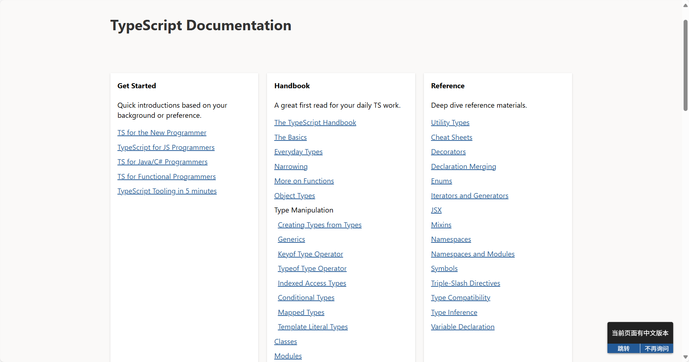

加强工程能力，把算法、想法用代码快速实现的能力。需要多阅读，多实现。关注两个方面：
- **理论基础要扎实**，要在工程问题中灵活运用，以洞察问题关键。需要掌握基础知识，常用的算法，经典的论文、博客和文章。多阅读思考，窥探细节，加深印象，提出见解。
- **掌握常用的工具**。比如用好常用编程语言，能够有阅读和梳理工程项目。这需要掌握方法和技巧，比如阅读时，关注数据流；再比如，从文档了解各个模块之间关系。通过多尝试 LeetCode，开源项目，提升编程能力，能够正确实现，快速实现。
- **加强抽象工程问题和解决问题的能力**，把问题抽象为数字、模型等抽象概念，再用工具尝试解决。
- **关注效率**。边干边学，而不是学了再干。比如，某些工具的各类参数，在实践中去查阅和了解，而不是一蹴而就。
- **梳理知识、总结经验**。通过梳理和总结，加深对知识、对项目理解。抽丝剥茧时，往往会发现各个技术点之间的联系，可以排查低效和冗余，有时候创新便是对这些联系的改进。及时整理或安排时间整理笔记和总结经验，是高效学习的方法。
- **整理工作流程，形成制度**。约束能够促进规范操作，对着条目逐步执行和排查，可以避免忘记细节和遗漏。特别是琐碎的工作和细节，很难全部记忆，整理称为工作流程后，对照执行能够避免记忆和梳理负担。

## 关注效率

合理规划时间。时间比较重要，特别是有任务和目的时，要科学制定下一步工作。比如，目前需要复现 DexVLA，需要用在机器人上。梳理脉络后，比如，我想要再探究 Fusion 模块是如何融合大模型隐藏状态和文本到 action_hidden_states的，但这可能过于刨根问底。另一个选择，先有大致了解即可，知道它用了什么方法。

先有全局认识，先梳理完脉络，高屋建瓴。运行起来，再逐个分析，逐个模块学习。时间成本可能较贵，需要合理安排，有时只用了解输入输出的规范，先当做黑盒，知道功能即可。后续再挑选合适的模块学习。当务之急是先打通所有模块，把各个模块接口的通信方式，数据路径梳理清楚。

看项目用到什么参数，就查阅参数用法，作笔记记录。

## 关注学习新技术

### 信心和保持学习新领域的开放的心态

要有能够掌握不同学科的自信。每个一段时间，学习新的领域。打好数学和英文的基础，这是极大的支撑。

现在有 LLM，学习已经变得方便。

### 学习的方式

以学习新语言 Types传入为例。首先从官网文档入手，先理解**概念、设计和原理**。官网通常会详细阐述，学习后能有高屋建瓴的认识，深入细节时，具体学习会更流畅，更容易组织和联系碎片化的知识，事半功倍。这是良莠不齐的博客通常忽略的部分，局限于只见树木不见森林。比如，有的博客只会给出 git reset --hard xxx，不说明原理。官方文档会更准确，更适合初学者。

阅读文档技巧：
1. 先阅读 What is XXX，知道解决了什么问题，核心设计是什么，有哪些概念和术语。
2. 不需要一次读完官方文档，容易厌倦和打退堂鼓。首先了解入门概念，在结合实战风格更浓厚的博客，边学变实践，加深印象。博客或视频资料图文并茂，更能展现新技术的吸引力。
3. 在实践中，经常回参考官方文档的概念和设计。在不断实践和回顾官网文档中，逐步读完（或是大部分读完）官网文档的内容。，

实践需要注意以下问题，结合各种资料弄懂：
1. 代码为什么不按预期执行？
2. 多种写法达到同样效果，比较异同，比较优势和缺点。
3. 为什么实际生产中，没有遵循官网样例代码的写法？

工作流程：**学习抽象的概念和设计->实践->遇到问题->根据概念和设计来提出解决方案->分析效果->总结和整理，改进甚至提出新的概念和设计->实践。**

最后，可能需要读源码来了解各种细节。

参考：
- [程序员如何系统学习新技术](https://zhuanlan.zhihu.com/p/104769413)

入门学习时，要着重了解概念和设计，不要落入细节的陷阱。了解和学习细节应当推至到实践的部分。生僻的 API 和复杂的设计通常难以一次弄懂，反复学习，用一点一点吃透难点。对于共性较多的部分，比如 if else，数组、字符串常见用法，通常可以一目十行。

笔记和工作也同理，先做零碎和推动进步，再调整和重构。

#### 以学习 Typescript 为例

在官网 https://www.typescriptlang.org/docs，组织如下：

可以看到左侧有 Get Started，类比不同语言来介绍宏观概念和设计。中间部分是具体内容。包含了更多的概念和设计，样例和细节。

### 关注阅读效率：有的放矢，用好意群（chunks）阅读法

拆分句子为块（chunks），而非逐词，从而克服英文与中文不同的表达方式。千万避免心里默念地读法。目光聚焦的地方即一个 chunk，包含构成同一思想或是表达部分意思的少量单词。比如：

After the conference（时间）| the research team（主语）| presented their findings（动作）| to a panel of experts (对象).

读完段落，要猜测和推测下文大意。用模糊的理解节省阅读时间，有时候通篇仅包含部分紧扣业务内容，或是感兴趣内容时，能够提升获取信息效率。熟练后，可以提高预测段落大意的能力。

遇到难点，重要的点，可以仔细、反复思考，甚至利用 LLM 等工具询问。学习到新概念和内容时，便有裨益。

## 关于论文调研：紧扣当前业务

调研时，要结合业务场景，有针对性地去阅读和总结，才能高效发掘潜在方案。关注总结和整理，以文档形式记录。避免跑完模型，发现不适合场景，**浪费大量时间成本**，拉低工作效率。

先看业务场景，弄清模型算法服务的方向，研究目前跑在生产环境的算法不足之处，分析不足是因为业务场景哪些问题导致的，再去技术文章论文找思路。

比如，多模态调研，需要识别复杂文档内容。以前，使用传统 CV 方法，需要用 MLLM。调研需要整理 MLLM 解决不好的问题，找到能力边界，比如图表、公式、手写体的跨模态对齐，长文档上下文逻辑，特殊符号干扰等等。有了具体问题，把各论文提出的解决方案一一列出，挑几个靠谱的尝试，查看效果。这是解决问题的一般思路，也是保证解决问题过程的思路，工作应当用好。

## 关注总结和整理

形成结构化的、联系起来的知识，会理解得更深入和透彻，更容易记住。

总结经验和写记录时，尽量使用总分总结构，文章会更易懂。使用分总，容易在顺着读时，对全盘认识不够，不了解此工作的影响，容易忽略至关重要的细节，让人难以抓重点。比如，查看 CLIPVisionModel 时，应当先总结，ViT 部分包含了哪些组件，再一一分析，最后再总结作用和特点。

在总结和整理中，可以关注如下方面：
1. 知识树（图）。任何知识，只在点上学习不够的，需要在面上学习，这叫系统地学习，这需要我们去总结并归纳知识树或知识图，一个知识面会有多个知识板块组成，一个板块又有各种知识点，一个知识点会导出另外的知识点，各种知识点又会交叉和依赖起来，学习就是要系统地学习整个知识树（图）。而我们都知道，对于一棵树来说，“根基”是非常重要的，所以，学好基础知识也是非常重要的，对于一个陌生的地方，有一份地图是非常重要的，没有地图的你只会乱窜，只会迷路、练路、走冤枉路！
2. **知识缘由**。任何知识都是有缘由的，**了解一个知识的来龙去脉和前世今生，会让你对这个知识有非常强的掌握**，而不再只是靠记忆去学习。靠记忆去学习是一件非常糟糕的事。而对于一些操作性的知识（不需要了解由来的），我把其叫操作知识，就像一些函数库一样，这样的知识只要学会查文档就好了。能够知其然，知其所以然的人自然会比识知识到表皮的人段位要高很多。
3. 方法套路。学习不是为了找到答案，而是找到方法。就像数学一样，你学的是方法，是解题思路，是套路，会用方程式解题的和不会用方程式解题的在解题效率上不可比较，而在微积分面前，其它的解题方法都变成了渣渣。你可以看到，掌握高级方法的人比别人的优势有多大，学习的目的就是为了掌握更为高级的方法和解题思路。
4. 坚持和勤快。

学习技能要**精益求精**。如果你想拥有专业的技能，不仅仅是拼命地重复一遍又一遍的训练，而是在每一次重复训练时你都要**找到更好的方法，总结经验**，让新的一遍能够更好，更漂亮，更有效率，否则，用相同的方法重复，那你只不过在搬砖罢了。

https://coolshell.cn/articles/19464.html

### 关注复盘

尽可能每日，或者每周复盘，评估进步程度，当前时间完成的工作或生活。

## 关注设计和架构

这是 AI 做不到的，开发者要关心架构设计。功能定义好了，写代码是容易的使其。架构设计是难点。应当多关注架构设计和思考，这是开发中应当花更多时间的部分，后续的功能细节便水到渠成的写出来了。

## 关注 Debug

### 缩小错误范围

「最小复现」的一个方法论，一个非常有用的工程学小技巧：通过复制粘贴官方例程来排除「自己写的bug」这个错误情况，从而缩小错误范围。排除掉「自己写的bug」这个错误情况，从而缩小错误范围。每次遇到陌生案例时，个人建议先不要动脑子，原封不动把代码复制粘贴运行

特别是如果你未来要去操手大型复杂系统的开发，为了降低心智负担，你需要尽可能缩小错误范围，不断增加限制条件来缩小错误范围，是一项工程学的最佳实践

解死锁也需要此技巧。

### 教程类和经验类文字

先写出总体的和概览的概念解释，随后再引入一个简单直观的样例（参数、命名直观，用法新内容负担最小），随后再展开详细解释，最后总结。这样的文章在逻辑理解上更加平滑。

### 边学习边记录的学习方法

边学边记录，梳理和总结要点，笔记写完的同时也就学懂了。最好是以写讲义的态度对待笔记，这样会捕捉到技术细节，也是深入学习和思考的机会。

1. 勤做笔记，层次化总结:读书的过程中把,当时的所思所想记下来，到了一定时候(比如章节未尾)把这些零散的草稿笔记结构化地做一个总结，要达到这样的目的:总结完之后，之前的笔记就可以作废了，所有有价值的信息都在总结里。然后再到一个更大的节点(比如一个Part读完，或者全书读完)，在把之前的各小节的总结拿出来，再结构化地提炼一遍，自然形成一种金字塔的结构。

2. 练习复述：复述不出来，说明你平时给别人讲的少，这个技术也是可以通过练习来成长的。我最近比较喜欢的一个手段是写教程，写的差没有关系，先写一个垃圾出来。

### 笔记要简练，有自己的看法，不能摘抄教程

笔记要**尽可能简单**，只要有提纲和骨架即可。难点部分用自己的话重新组织、复述，填充到骨架部分。简单的则不做笔记。最精华的部分有**自己的看法，总结**。可以省略某些上下文，精简内容。不要把官方文档抄下来或者翻译一遍，而是写一写看到的关键字、反复出现的术语、阅读过程中产生的困惑等。切记不要花大量的时间写详尽的笔记，会**分散你的精力和时间**。有些人反而是因为因为做繁杂的笔记而导致学习半途而废。

自己的看法和总结，包含以下几个方面：
- 优势和缺点
- 与其他技术的联系，包括异同，如何协同

比如，不做琐碎的 API 使用细节，在官网查询即可。当然，为了阐述概念和设计，记录大致 API 用法也可以，不落入参数细节，记录会用到哪些 API 即可，以便快速了解。

当然，写教程和使用费曼学习法时，尽可能写得详尽，提高读者体验。

### 参考 Tomsheep 读论文

### 建立知识间的联系

学习有三个阶段：
1. 从 0 到 1，只要具备少量前置知识可以学懂，这部分通常被忽略，而引入门的过程同样重要
2. 从 1 到 10，开始动手实践和复现，涉及大量细节
3. 从 10 到 100，解决产业难题

学习的顺序是先建立框架，再补充细节。这一点非常重要，因为违背这个规律，基本等于失败。

整理思维导图、画各个知识的联系，是高效的学习手段。从侧面印证，学习的结果是长期记忆的建立，长期记忆是关联记忆。死记硬背是短期记忆，能否转化为长期记忆，取决于是否建立有效关联。比如，越是频繁使用，越容易建立新的关联。但即便如此，死记硬背效率十分低下。瞬时记忆就是去快递驿站取快递时报一串取件码。在整理知识和笔记、画图时，不停在脑海建立上下文关联，厘清前因后果，加深了短期记忆转化为长期记忆的进程。

知识和细节，可以从三个层面去讲：what、how、why。死记硬背，主要是在 what 层面，和部分 how 层面，所以效率低。同长期记忆相关性最强的是 why，而违背先建立框架再补充细节的规律，基本等于失败。可以更进一步，如果不知道为什么要学习一样东西，大概率的结果就是学不会。

学习知识和技能，一定要找到 **WHY**，认识到意义。把知识和技能联系到实际来，才能激发最好的老师——兴趣。也只有关心了 why，才能洞察当前难点、缺陷和遗漏的地方。

抽象和具象之间，如果不建立关联，难以理解所学内容。这正是学习阶段从 0 到 1 过程的意义。强行跳跃到 1 至 10 的过程，没有感性认识，会消耗很多精力做无用功。轻则效率低下，重则死胡同。也就是新手直接看 mannual 的感觉，内容太多，难以厘清该从哪儿学，该如何下手，甚至把实践性特点很强的理工科学成了记忆为主的“文科”；看 tutorial 才能快速了解，符合学习的规律。不走弯路，才是最高效的学习思路。比如 CSAPP 的编排符合如此规律。

识别优秀材料，以平滑、不走弯路地方式上手。不能以学懂后，以云淡风轻的感觉来忽略刚入门时的崎岖坎坷，特别是轻视简单的问题会忽视来时路的学习曲线。比如，vim、shell、ide、tmux 等内容，不会放到课堂上教学，但它们能够提升效率。所以，良好的入门能够帮助快速上手。写博客和计数总结应当参考优秀教材的编排。

[那些编程水平很高的程序员是怎么训练出来的? - 周克曼的回答](https://www.zhihu.com/question/351504112/answer/1908380706725422282)

## 关注文档撰写

### 关注英文能力

读写听口语十分重要。有很多资料通过英文表达，接触一手资料，锻炼通过英文学习知识技术的能力，能推动掌握新技术的进度和拓宽交流的平台。如果能读懂，非必要别用翻译软件。大量的阅读和接触英文训练，能够提高英文能力。

## 关注沟通

学习雷军，本身是积极活跃，善于主动沟通，但是能够给人留下踏实内敛的印象。

## 关注灵感

怎么找灵感？博取众长，找到联系，尝试改变等等。需要及时跟进新的趋势，新的潮流，才能激发。

## 扩展工作能力的方式

### 技术的深度和广度抉择

很多同学包括我自己，在工作初期都有一种疑问，就是在工作过程中，自己在一个方向深挖以方向深度为首要目标，还是多接触多了解不同的方向，多一名多面手更好一些？

1.在项目外钻研技术深度，项目内了解技术广度。2.对于一个执行层的同学来说，先深度，再广度。

1.1 首先，期望通过项目来积累技术深度，是相对比较困难的：因为作为应用算法工程师，大多数还是围绕项目或者指标服务，而数据和指标的优化源头则是原始数据。在业务发展期，最有效的方法还是围绕原始数据的清洗，预处理和高效利用上，模型的优先级是排在数据之后的。而在业务处于稳定期的时候，模型的优先级提高，但也会快速陷入迭代的瓶颈，此时需要一波大更新让项目重新获得潜力，更新后又变成发展期，周而复始。这也是很多同学抱怨：我又在做CURD/在查数据/在写逻辑的原因。

1.2 项目中注意技术广度的积累：目前在大厂中，作为执行层的同学，个人的工作方向越来越精细化，会负责一个小而具体的领域。举个简单的例子，推荐系统被分为冷启动，召回，精排，甚至还有粗排的模块，各自独立研究。而图像处理的任务也可能被划为为检测，分类，分割，超分，甚至再细分为数据的前后处理等。所以我们尽量还是要了解到其他方向的同学的具体方向，从这边可以扩展自己的技术广度，比如周报，分享等。

1.3 项目外注重技术深度的积累：

个人理解所谓的技术壁垒有两块：1.高质量数据积累。2.信息差。数据积累作为公司资产与个人无关。而技术人员个人给公司带来的价值，就是个人信息增量对于项目的边际效应。在这里并不是说把自己的技术藏着掖着。。目前存在大批量的开源项目中这种方法已经很难行得通了。反而我们需要关注的是：1.**其他领域的知识能不能用到自己的细分领域**。举个大的例子，比如CLIP就把NLP的大规模预训练用在图像任务中，最终产生了颠覆性的成果。2.自己领域最新的进展，这个更多的是知己知彼，对于自己所在方向有深度的了解之后，才会有足够的发言权。

1.4 对于一个执行层的同学来说，先深度，再广度：

1.打造个人的品牌。在别人提到你的时候，会第一时间想到：啊，这位同学是做xxx方向很厉害的，有印象。而不是模糊的项目成员。2.在成为项目负责人的很长一段时间内，需要从子方向中脱颖而出。

### 方向，项目，乃至公司的选择

1.关注方向=小组>其他。很多同学包括我自己在内，都会纠结我到底选什么方向，什么公司发展很好。但实际上最后真正关系到职业发展的，一个是你选择的方向， 另一个往往是你的直接领导和带你的小组长。（这点和找研究生/博士生导师 道理是一样的，研究方向很重要，导师也同样重要）。最好的方法当然是询问了解熟悉的人，这个组的发展前如何，领导性格如何。当然如果没有对应的消息，可以直接问一个简单的问题：这个组今年招多少人？未来有没有扩招的打算。在目前的环境下，各个公司的HC都在缩减，因此我们尽量横向对比。

### 其他技术能力

1.写文档总结。我们可以不做PPT工程师，但是基本的总结能力还是很重要的。如何很好的直观的把工作表达好，凝练成半年度总结/专利/内部分享/中英文文章等。让别人知道你的能力。

2.多交流，不要埋头嗯做，多提升交流能力。

与非技术同学交流：在一个项目中，我建议有时间的话可以多和项目的产品，运营等非技术同学聊聊，掌握项目的重点方向，进展和变化，能更明确自己在其中的定位。

与技术同事沟通：提升自己影响力的同时，提升技术广度。

与领导沟通：阶段性的进展和困难还是多和直接领导交流下，一个是能得到一些不同的思路，另外就是也能提供最新的进展。

算法工程师/程序员有哪些优秀的职业习惯和工作心得？ - 曾天真的回答 - 知乎
https://www.zhihu.com/question/360263727/answer/2747205766

## 关注沟通和报告

多关注 What, Why & How，这样容易吸引注意力，让对方有主动的参与感，带动思考。避免平铺直叙琐碎的细节，容易让人抓不住重点，从而看不到作用。

比如，排查问题后，报告和沟通要以问题为中心，技术应当体现在 How，不要着急着放到 What。

数字容易让人评估进度、复杂程度、难度，适当使用数字，会更有说服力。

## 关注影响力、号召力和领导力

最直观的体现是号召力。平常要做好口碑和信任基础，帮助和反馈团队，影响其他成员。努力成为核心贡献成员，影响力自然水到渠成。

### 关注珍惜机会：时刻做好准备，及时交付

机会可能只有一次，很难重来。定时整理总结工作，及时交付，培养个人的信誉和形象，这些都是影响力的部分。

## 关注管理

对于不懂技术的客户或老板，可以把贡献体现在功能上，体现在程序、算法运行的稳定上。做好预期管理。

## 关注运营

特别是字节团队，有运营经验。

## 关于缓解焦虑

社交和沟通是良好的方式。站在不同角度思考，听取不同意见，可能会有新的思路，或是新的心境。社交是思想的泉水。