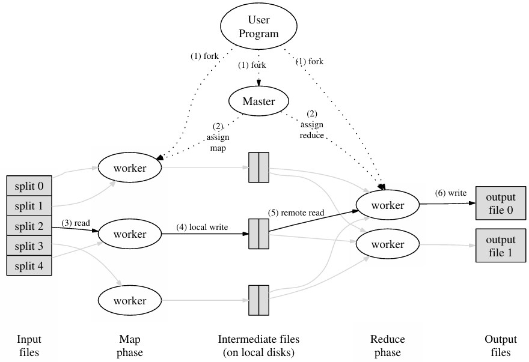
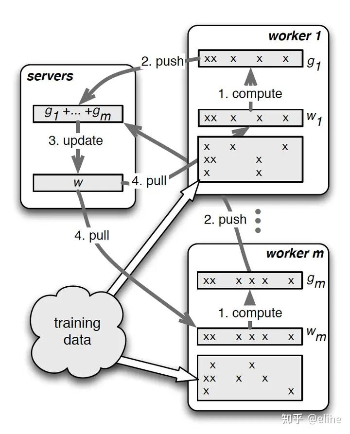
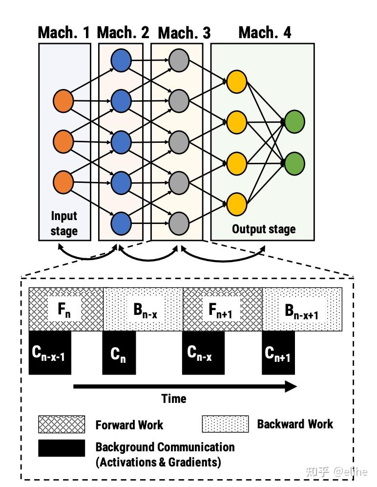
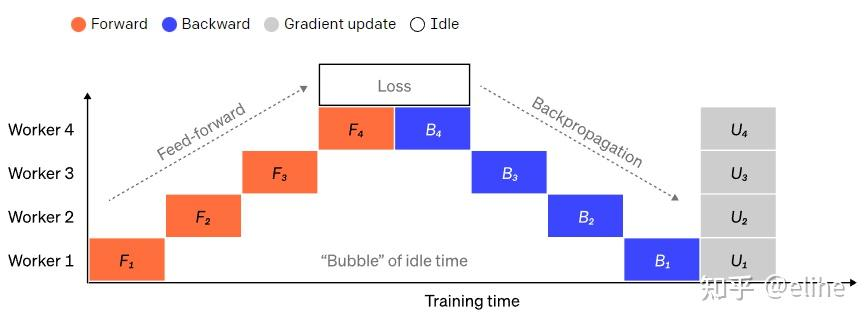
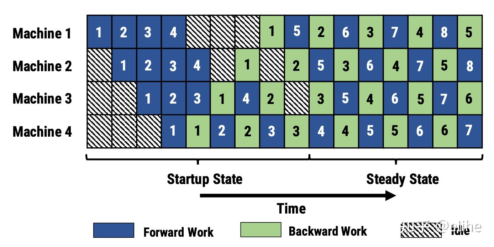
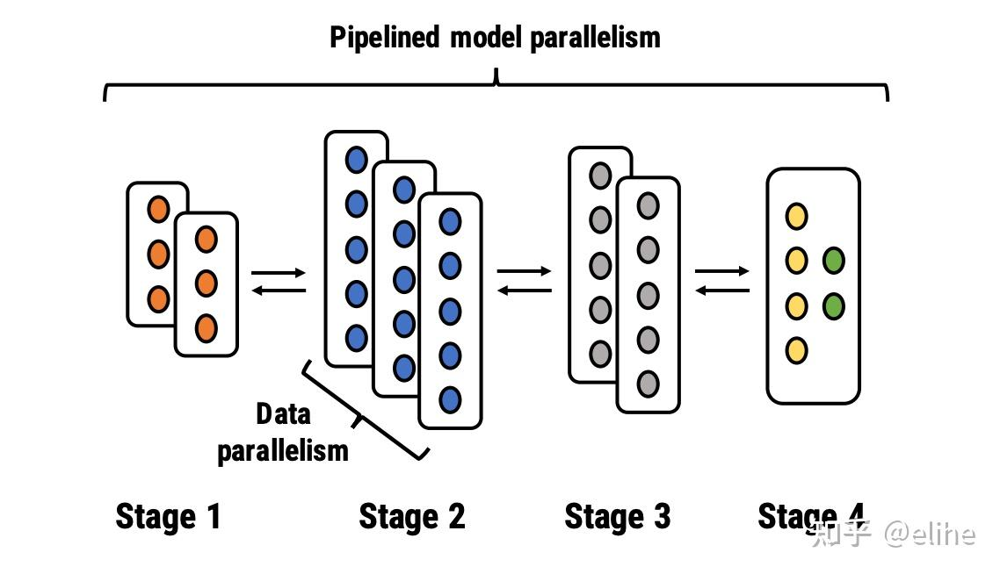
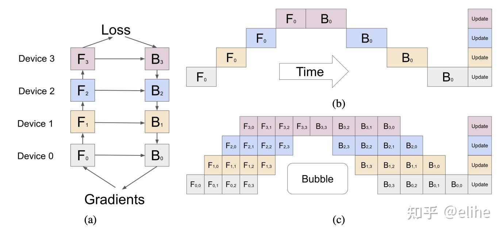
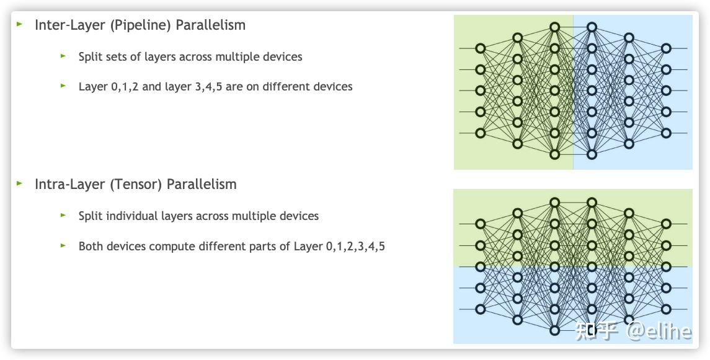
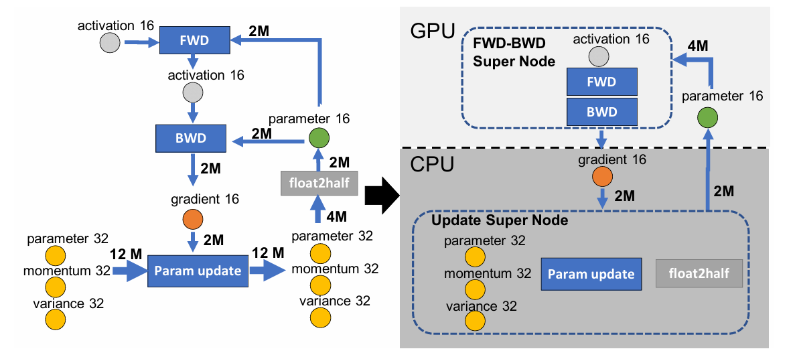
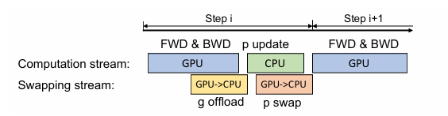

## 背景
### 为什么需要分布式训练？
主要有两点： 对小模型而言训练速度更快，对大模型而言，其所需内存太大，单机装不下。

### 分布式训练的加速
对于一些单卡可以装载的模型，我们可以通过多个卡数据并行的方法训练，把一轮数据算出来的梯度求和更新参数进行下一轮的梯度下降。这个范式比较经典的例子就是 Parameter Server，后续的章节会定量的介绍。

### 大模型内存开销

比如 1.5B 参数的 GPT-2 模型，我们使用 $\Psi$ 指代参数量，即 $\Psi = 1.5B$。在 FP16 精度情况，每个参数占内存两字节，于是模型大小为 $2 \Psi B$。

训练时，按照 DeepSpeed 提出的 Adam Optimizer + 混合精度训练。训练时，模型存储自身参数和梯度，需要 $2 \Psi + 2 \Psi$ 内存，混合精度 FP32 训练时，Adam 需要一份 FP32 大小模型拷贝，momentum 和 variance 存储模型的优化状态，需要 $4 \Psi + 4 \Psi + 4 \Psi$，最终需要 $16 \Psi B$ 内存。对于 3GB 的 GPT-2，需要 24GB 内存。175B 的 GPT-3，单卡明显装不下。

## 展开内容
分布式知识前置：
- Data Parallelism：模型一台设备装得下，同一个模型同时用多个数据分开训练。
- Pipeline Parrallelism: 模型装不下，模型的一层或多层一台设备装得下，所以同一个模型按层拆开训练。
- Tensor Parallelism: 模型一层也装不下，同一个模型层内拆开训练。
- DeepSpeed: 大参数大模型分布式训练终极方法。

### MapReduce
[论文](https://static.googleusercontent.com/media/research.google.com/zh-CN//archive/mapreduce-osdi04.pdf) 提出，使用 `map` 函数处理 key/value 对并生成中间状态的 key/value 对，而 `reduce` 函数合并所有中间状态中同一 key 对应的所有 values。

MapReduce 工作流：
- 将输入文件分成 M 个小文件（每个文件的大小大概 16M-64M），在集群中启动 MapReduce 实例，其中一个 Master 和多个 Worker；
- 由 Master 分配任务，将 Map 任务分配给可用的 Worker；
- Map Worker 读取文件，执行用户自定义的 map 函数，输出 key/value 对，缓存在内存中；
- 内存中的 (key, value) 对通过 partitioning function() 例如 hash(key) mod R 分为 R 个 regions，然后写入磁盘。完成之后，把这些文件的地址回传给 Master，然后 Master 把这些位置传给 Reduce Worker；
- Reduce Worker 收到数据存储位置信息后，使用 RPC 从 Map Worker 所在的磁盘读取这些数据，根据 key 进行排序，并将同一 key 的所有数据分组聚合在一起（由于许多不同的 key 值会映射到相同的 Reduce 任务上，因此必须进行排序。如果中间数据太大无法在内存中完成排序，那么就要在外部进行排序）；
- Reduce Worker 将分组后的值传给用户自定义的 reduce 函数，输出追加到所属分区的输出文件中；
- 当所有的 Map 任务和 Reduce 任务都完成后，Master 向用户程序返回结果；

例子：词频统计：这里 Map 函数可以将每个单词统计输出 <word, count>，然后 Reduce 函数同一单词的所有计数相加，得到：<word, total count>。

## 数据并行
这是早期模型训练方法，用数据并行加速收敛。数据并行主要使用 Ring All Reduce (无 Master 节点) 和 Parameter Server (有 Master 节点)。

### Ring All-Reduce
Ring All-reduce 在 Pytorch 里的实现就是 DistributedDataParallel，Ring All-reduce 本身流程也是 reduce-scatter+all-gather 的组合。RAR 是数据并行训练中一轮迭代完成后的参数流程。

### Parameter Server
[论文](https://link.zhihu.com/?target=https%3A//www.cs.cmu.edu/~muli/file/ps.pdf)，随便找了篇[中文解读](https://www.zhihu.com/tardis/zm/art/82116922?source_id=1003)。

PS 设计了一套分布式训练框架，拆分 master 节点和多个 worker 节点。worker 每轮迭代执行：从 master pull 参数 -> 加载训练数据 -> 计算梯度训练 -> push 梯度到 master -> 等待 master 完成一次全 worker 同步。

简单的基于“同步阻断”训练会导致同步时间占比较大，于是有了“异步非阻断式”训练过程，每个 worker 用本地模型参数完成多次梯度计算后再 pull。直观上感觉梯度下降变慢，实际论文测试速度影响没那么大。

## 管线并行
把模型按层切分到多个机器上。

这是最初的方案，但是训练效率大打折扣，每张卡在大部分时间都是空闲的。因此，管线并行主要解决下图问题：

有两个知名的工作，PipeDream 和 GPipe。

### PipeDream
[Paper](https://link.zhihu.com/?target=https%3A//arxiv.org/pdf/1806.03377.pdf) 和[解读](https://zhuanlan.zhihu.com/p/336849279)。

将模型根据层拆分到多个机器，训练时允许机器在反向传播第一个批次数据的梯度前，执行第二个或更多后续批次的数据计算，实现流水线并行。此方法可能导致梯度收敛不稳定，但是可以限制反向传播最多执行打多少批次，从而控制梯度不确定性。同时，PipeDream 还将数据并行结合起来，每层使用数据并行训练。

梯度下降时，机器用保存好的参数备份计算梯度，不会用当前最新的参数计算梯度。如果使用最新参数计算梯度，那么图中 1 和 3 号任务计算梯度时，其实使用 2 号任务梯度更新之后的参数，3 号任务正向传播时用到的是原始参数，从而导致大量误差。

通过保存参数备份，可以实现近似数据并行效果，但是也会放大模型内存占用，与倍率和备份参数量有关。

### GPipe
[论文](https://link.zhihu.com/?target=https%3A//arxiv.org/pdf/1811.06965.pdf) 和[解读](https://zhuanlan.zhihu.com/p/648346058)。

GPipe 与 PipeDream 类似。GPipe 将一个 batch 拆违 micro-batch，每个 batch 完成后等待全局同步梯度。同时，用到 Re-materialization 技术，用时间换来显存降低，所以 GPipe 更慢，但收敛更稳定。

### 张量并行
集中在多层神经网络架构训练，但是在 Transformer 架构下，单层可能都难以装载，要求更高显存，所以同一层模型都需要切分。

知名工作为 DeepSpeed 和 Megatron。

## DeepSpeed
DeepSpeed 融合了数据并行、管线并行和内存节省等方法，可以看做整合以上三个方法。

### ZeRO-DP
[论文](https://arxiv.org/pdf/1910.02054.pdf) 和 [解读: ZeRO: Zero Redundancy Optimizer](https://zhuanlan.zhihu.com/p/663517415)。

简单来说，ZeRO-DP 就是想办法在数据并行的管线上，把模型的参数分配给不同显卡，不用所有显卡都装在所有参数。论文指出，把训练期间内存消耗归结三类：
- OS: 优化器状态，如 Adam 的  momentum 和 variance
- G: 梯度
- P: 模型参数

前面提到，混合精度下，Adam 上面三种消耗大约为 $12 \Psi, 2 \Psi, 2 \Psi$。同样的，ZERO-DP 根据显存优化粒度氛围三种：$P_{os}, P_g, P_p$。

TODO：进一步阅读。

结论：使用 ZeRO-DP 提出的策略，120GB 单卡的需求可以压缩到单卡所求为 1.9GB。

### ZeRO-R
与 ZeRO-DP 在同一论文提出。主要贡献为单节点显存节约。

### ZeRO-Offload
[Paper](https://link.zhihu.com/?target=https%3A//www.usenix.org/system/files/atc21-ren-jie.pdf) 和 [解读](https://zhuanlan.zhihu.com/p/513571706)。

 ZeRO-Offload 的核心思路就是让 CPU 和内存也参与到训练中去，回顾一下前文用到的训练流程的图，ZeRO-Offload 就是把这个流程用上图的方式把 fp32 参数的更新和 float2half 操作拆分到了 CPU 和内存上计算，而前向和后向传播依然由 GPU 负责。 在单卡场景下，流程大概如下图所示：

## offload：处理显存不够问题

## 补充材料
[从啥也不会到DeepSpeed————一篇大模型分布式训练的学习过程总结 - elihe的文章 - 知乎](https://zhuanlan.zhihu.com/p/688873027)
[Hugging Face: DeepSpeed 集成](https://huggingface.co/docs/transformers/v4.28.1/en/main_classes/deepspeed)
[Doc: getting-started](https://www.deepspeed.ai/getting-started/)
[deepspeed多机多卡训练踏过的坑 - 100110的文章 - 知乎](https://zhuanlan.zhihu.com/p/624223085)
[Deepspeed详解与训练使用（单机单卡，单机多卡）](https://zhuanlan.zhihu.com/p/698631348)

## Link and Tag
[[llm.Megatron]]

#MLLM
#LLM
#Train