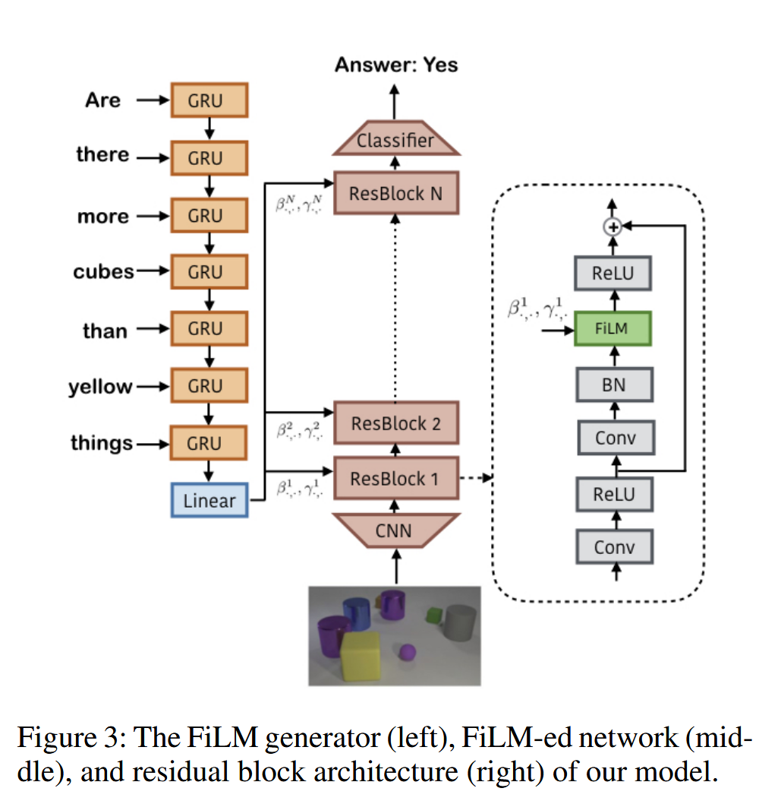

用于视觉推理和视觉问答，用于结合文本模态与图片模态。根据图片，给出回答：

FiLM 可以理解为在feature的层面上，对特征做了一次线性变换。具体做法如下：

FiLM learns functions $f$ and $h$ which output $γ_{i,c}$ and $β_{i,c}$ as a function of input $x_i$:

架构如下：

## QA

Q:  我们要讨论的论文是FiLM: Visual Reasoning with a General Conditioning Layer，链接是  https://arxiv.org/pdf/1709.07871  ，已有的FAQ链接是  https://papers.cool/arxiv/kimi?paper=1709.07871  。请以此为基础，继续回答我后面的问题。

这篇论文是 2017 年的，现在融合都有哪些更常用的工作？

## Ref and Tag

[arxive](https://arxiv.org/abs/1709.07871)

#MLLM
#Paper