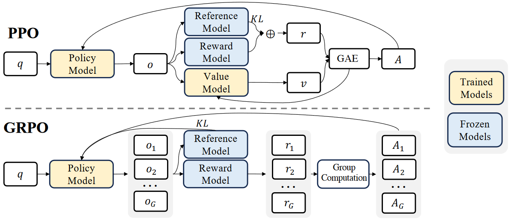
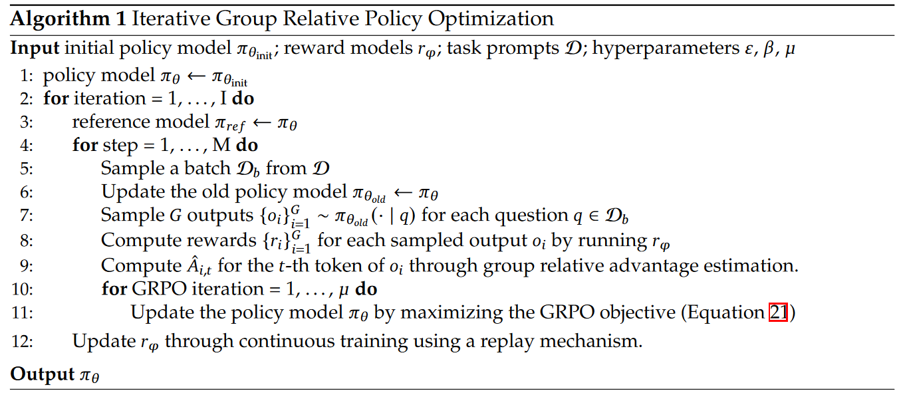

爬取了 120B math-related tokens，提出了 Group Relative Policy Optimization (GRPO) 算法，对比 PPO，优化了内存使用。

## Introduction
构建了高质量数据集，包含 120B 数学 tokens。这些数据集由 the Common Crawl (CC) using a fastText-based classfier 实现。也就是说，网上的数据不够好。

## Math Pre-training
### Data Collection and Decontamination
To explain the DeepSeekMath Corpus from CC, 作者提出了 an iterative pipeline，

## RL
### PPO

PPO 计算如下：
$$
\mathcal{J}_{\text{PPO}}(\theta) = \mathbb{E} \left[ q \sim P(Q), o \sim \pi_{\theta_{\text{old}}}(O|q) \right]
$$

$$
\mathcal{J}_{\text{PPO}}(\theta) = \frac{1}{|o|} \sum_{t=1}^{|o|} \min \left[ \frac{\pi_\theta(o_t|q, o_{<t})}{\pi_{\theta_{\text{old}}}(o_t|q, o_{<t})} A_t, \text{clip} \left( \frac{\pi_\theta(o_t|q, o_{<t})}{\pi_{\theta_{\text{old}}}(o_t|q, o_{<t})}, 1 - \varepsilon, 1 + \varepsilon \right) A_t \right]
$$

在强化学习的策略优化中，与训练 LLM 不太相同，训练模型一般是求梯度下降，RL 要使得奖励最大化，需要求梯度上升。使用两个基座模型，一个模型（Policy Model）在强化学习训练过程不断更新参数，另一个则作为参考模型（Reference Model），约束更新的幅度。

注意，Policy Model 和 Reference Model 都是相同的模型，比如两个都是 DeepSeek-V3。Policy Model 在训练过程不断更新参数，强化思考能力，而 Reference Model 则作为原模型，给与参考，避免一次更新太多。可以看出，基座模型的能力会影响强化学习的效果。



PPO 中，q 是给模型的问题，输入到 Policy Model (一个 LLM 或 VLM)，采样得到输出 o。Reference Model (原 LLM 或 VLM) 和 Reward Model 冻结，不训练。参考模型和奖励模型根据输出 o 计算后，再经过 KL 算出奖励 r。价值模型需要训练，根据 o 输出 v。优势函数采用 Generalized Advantage Estimation (GAE)，根据 r 和 v 计算 A，再更新价值模型。最后根据 A 求目标函数期望，按照梯度上升更新 Policy Model。或者是对目标函数取负值，再用梯度下降求目标函数最小值。新的模型即训练后的 Policy Model。PPO 需要同时训练 Policy Model 与 Value Model，训练量比较大。

参考模型和奖励模型对每个 token 计算 KL penalty，具体如下：

$$
r_t = r_{\varphi}(q, o_{\le t}) - \beta \log \frac{\pi_{\theta}(o_t | q, o_{<t})}{\pi_{\text{ref}}(o_t | q, o_{<t})}
$$

$r_\phi$ 是奖励模型（R1 工作使用 rule-based 的奖励系统，放弃了模型的方案）。$\pi_\theta$ 是当前 Policy Model，$\pi_{\theta_\text{old}}$ 是前一个 Policy Model。两个 $\pi$ 相等时，log 部分为 0，代表不需要惩罚。$\pi_\text{ref}$ 通常是最初的 SFT 模型，比如 R1 中的 V3。$\beta$ 是超参数。

Tips：在 ML 中，数值或概率之比通常都会加上 log，以便缩小数值到较小范围，保证稳定更新。

#### GAE

[arxiv](https://arxiv.org/abs/1506.02438)

优势函数就像 value-based 的强化学习方法，保存了一张表，有状态。GAE 用于估计优势函数（Advantage Function），旨在平衡估计中的偏差和方差，通过结合时序差分（TD）和蒙特卡洛（MC）方法的优点，提供了一种灵活的方式来调整估计中的偏差-方差权衡。核心思想是利用多个时序差分（TD）步骤的加权和来估计优势，从而在保证方差较低的同时，尽量减少偏差。


$$
A_t^{GAE} = \Sigma_{n=0}^\infin (\gamma \lambda)^n \delta_{t+n}
$$

其中：
- $\delta_t = r_t + \gamma V(s_{t+1}) - V(s_t)$ 是时序差分误差。可以参考 RL 中的 TD 算法。参考 [[rl.TD_Learning]]。
- $\gamma$ 是折扣因子
- $\lambda$ 是 GAE 衰减因子，平衡短期和长期贡献

可以写成递推形式：
$$
A_t^{GAE} = \delta_t + (\gamma \lambda) A_{t+1}^{GAE}
$$

这种递推形式使得计算 GAEs 只需一次向前遍历数据，不需要累积全部未来奖励，从而大大提高了计算效率。也就是，初始化所有优势 $A_{\le t} = 0$ 之后，从末尾向前地更新 $A_i^{GAE}$，即从 i=t, t-1, ..., 0 地更新。

GAE 在近端策略优化（PPO）算法中被广泛使用，为策略梯度的更新提供了一个高效的工具。在 PPO 中，GAE 用于估计优势函数，这在策略更新和值函数更新中都起到了关键作用。

代码实现：

```py
import numpy as np

def compute_gae(rewards, values, gamma=0.99, lam=0.95):
    """
    Compute Generalized Advantage Estimation (GAE).
    Args:
        rewards: List of rewards at each timestep.
        values: List of value function estimates at each timestep.
        gamma: Discount factor.
        lam: GAE decay factor.
    Returns:
        advantages: GAE-based advantage estimates.
    """
    advantages = np.zeros_like(rewards)
    gae = 0  # Initialize GAE
    for t in reversed(range(len(rewards))):
        delta = rewards[t] + gamma * (values[t + 1] if t < len(rewards) - 1 else 0) - values[t]
        gae = delta + gamma * lam * gae
        advantages[t] = gae
    return advantages

# Example usage
rewards = [1, 1, 1, 1, 1]  # Reward at each timestep
values = [0.5, 0.6, 0.7, 0.8, 0.9]  # Value function estimates
advantages = compute_gae(rewards, values)
print("GAE Advantages:", advantages)
```

Q: GAE 需要的奖励 r 是最后一个奖励 $r_t$，还是所有奖励 $r_{\le t}$ 的

#### GRPO

GRPO 仅训练 Policy Model，抛弃 critic model (常与 policy model 同一参数量级)，降低了训练量。比如训练推理模型时，query q 是一道数学题，经过 Policy Model 得到一系列的 QA 对样本 （R1-ZERO 中，G=64）。直接输入给两个 Model。在 R1 中，Reference Model 是 V3 模型，Reward Model 是专门训练的给与奖励值的模型。分别输出 r1, r2, ...。分组后，与 KL 值一起反馈并更新 Policy Model。更新参数的幅度，不需要通过在线训练的模型拿到，而是根据计算结果拿到。具体来说，需要最大化如下目标函数：

$$
\mathcal{J}_{GRPO}(\theta) = \mathbb{E} \left[ q \sim P(Q), \{o_i\}_{i=1}^G \sim \pi_{\theta_{\text{old}}}(O|q) \right]
$$

$$
\frac{1}{G} \sum_{i=1}^G \frac{1}{|o_i|} \sum_{t=1}^{|o_i|} \left\{ \min \left[ \frac{\pi_\theta(o_{i,t}|q, o_{i,<t})}{\pi_{\theta_{\text{old}}}(o_{i,t}|q, o_{i,<t})} \hat{A}_{i,t}, \mathrm{clip} \left( \frac{\pi_\theta(o_{i,t}|q, o_{i,<t})}{\pi_{\theta_{\text{old}}}(o_{i,t}|q, o_{i,<t})}, 1-\varepsilon, 1+\varepsilon \right) \hat{A}_{i,t} \right] - \beta \mathbb{D}_{KL} \left[ \pi_\theta || \pi_{\text{ref}} \right] \right\}
$$

注意，GRPO 也要循环，因为有 G 组输出。


### R1-Zero 的最佳实践和优化

在 R1 中，使用 rule-based reward system，主要包含 Accuracy Rewards 和 Format Rewards。基于规则，不再需要 Reward Model。奖励由 $o_i$ 根据规则计算得出。

每个 Group 的优势函数计算如下：
$$
A_i=\frac{r_i-\textit{mean}(r_1,r_2,\ldots,r_G)}{\textit{std}(\{r_1,r_2,\ldots,r_G\})}
$$

KL 惩罚中，计算如下：
$$
\mathbb{D}_{KL} \left[ \pi_{\theta} || \pi_{\text{ref}} \right] = \frac{\pi_{\text{ref}}(o_{i,t} | q, o_{i,<t})}{\pi_{\theta}(o_{i,t} | q, o_{i,<t})} - \log \frac{\pi_{\text{ref}}(o_{i,t} | q, o_{i,<t})}{\pi_{\theta}(o_{i,t} | q, o_{i,<t})} - 1,
$$

再回到整个目标函数的式子：
1. 模型 $\pi_\theta$ 根据问题 q，采样生成多个回答 $o_i, i=1,2,3, \cdots G$，G 为 group 数量。每个回答长度为可能不尽相同的 $| o_i |$
2. $\pi_\theta(o_{i,t}|q,o_{i,<t})$ 为在 1 的采样解答 $o_{i,t}$ 解码的第 t 个 token 的策略概率。$o_{i,<t}$ 即输出了 t-1 个 token 后的回答，接下来继续输出第 t 个输出。 
3. KL 项约束策略 $\pi_\theta$ 分布与原始策略 $\pi_{ref}$ 分布不能差异太大。GRPO 采用优化后的 KL 项，具有无偏且方差小的特性。
4. $\bold{r}=\{r_1,r_2,\cdots,r_G\}$，其中 $\bold{\hat{A}}_{i,t}$ 为组相对的优势，$t$ 代表一个回答的每个 token 的优势一样。


模型 $\pi_\theta$ 是什么模型？

### 4.1.2 Outcome Supervision RL with GRPO
只利用最终的一个奖励模型。

### 4.1.3 Process Supervision RL with GRPO
过程奖励模型，奖励过程。

### 4.1.4. Iterative RL with GRPO
前面训练的方式中，Reward Model 已经预训练完毕，冻结参数。此思路中，认为旧的 reward model 不足以监督当前的 policy model，于是 policy model 与 reward model 两者在迭代训练中不断地互相交换。

## 5.2. Insights of Reinforcement Learning
### 5.2.1. Towards to a Unified Paradigm
RL 范式朝向统一，比如 SFT、RFT、DPO、PPO、GRPO，都是求出最大的梯度。

## Ref and Tag

https://arxiv.org/abs/2402.03300
https://www.youtube.com/watch?v=bAWV_yrqx4w
【有难度但必读的一篇论文《DeepSeekMath》】 https://www.bilibili.com/video/BV1qUFMeGE2q/?share_source=copy_web&vd_source=fe1db0b3f565b5940b244b9c7f7b4fa1

【手撕LLM-GRPO】你只管给Reward, 剩下的交给RL（附代码） - 小冬瓜AIGC的文章 - 知乎
https://zhuanlan.zhihu.com/p/20812786520

#Paper
#GRPO