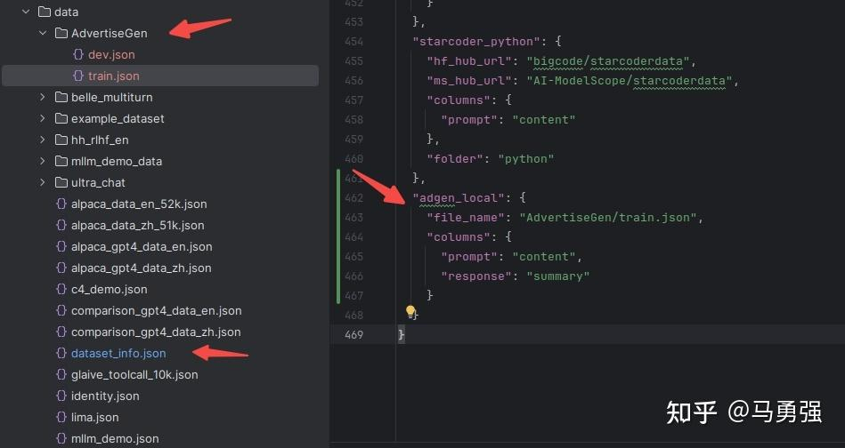

## 教程目标

功能包括：
1. 原始模型直接推理
2. 自定义数据集构建
3. 基于LoRA的sft指令微调
4. 动态合并LoRA的推理
5. 批量预测和训练效果评估
6. LoRA模型合并导出
7. 一站式webui board的使用
8. API Server的启动与调用
9. 大模型主流评测 benchmark
10. 导出GGUF格式，使用Ollama推理

## 检查 CUDA 环境

```py
>>> import torch
>>> torch.cuda.current_device()
0
>>> torch.cuda.get_device_name(0)
'NVIDIA GeForce RTX 4090'
>>> torch.__version__
'2.6.0+cu124'
```

## 下载模型

参考 Hugginface 教程。下载后，运行官方原始的推理 demo，验证模型文件的正确性和 transformers 库是否可用。

## 原始模型直接推理

开始工作之前，先试用推理模式，验证 LLaMA-Factory 推理部分是否正常。LLaMA-Factory 带了基于 gradio 开发的 ChatBot 推理页面，帮助测试，需要执行：

```bash
CUDA_VISIBLE_DEVICES=0 llamafactory-cli webchat --model_name_or_path Qwen/Qwen2-VL-2B-Instruct --template qwen2_vl
```

### template

关于 Qwen2.5-VL-3B-Instruct 模型，也可以沿用 qwen2_vl 模板。类似地，LLaMa 3.X 也是用的 llama3 的模板。于是只用运行如下命令便可以 Qwen2.5-VL-3B-Instruct 启动。

```bash
CUDA_VISIBLE_DEVICES=0 llamafactory-cli webchat --model_name_or_path Qwen/Qwen2.5-VL-3B-Instruct --template qwen2_vl
```

模板支持情况参考 [Supported Models](https://github.com/hiyouga/LLaMA-Factory?tab=readme-ov-file#supported-models)。

### 从 yaml 加载

也可保存在 yaml 中，按照官方的样例 [examples/inference/qwen2_vl.yaml](https://github.com/hiyouga/LLaMA-Factory/blob/main/examples/inference/qwen2_vl.yaml)

```yaml
model_name_or_path: Qwen/Qwen2-VL-7B-Instruct
template: qwen2_vl
infer_backend: huggingface  # choices: [huggingface, vllm]
trust_remote_code: true
```

随后直接执行：`llamafactory-cli webchat examples/inference/qwen2_vl.yaml`

可以通过本机的 IP，比如 http://localhost:7860 访问。对于服务器，可以使用 http://<server addr>:7860 访问。

### 打开防火墙，本地浏览器访问服务器的 webchat 页面

在服务器上查看端口是否正在监听：

```bash
ss -tuln | grep 7860
```

查看防火墙开放的端口端口：

```bash
sudo ufw status
❯ sudo ufw status
Status: active

# 可以看到，允许了比如 5901:5920 的 VNC server 端口等。
To                         Action      From
--                         ------      ----
21/tcp                     ALLOW       Anywhere
80/tcp                     ALLOW       Anywhere
5908/tcp                   ALLOW       Anywhere
5905/tcp                   ALLOW       Anywhere
5901:5920/tcp              ALLOW       Anywhere
22/tcp                     ALLOW       Anywhere
Anywhere                   ALLOW       192.168.123.129
5916                       ALLOW       Anywhere
21/tcp (v6)                ALLOW       Anywhere (v6)
80/tcp (v6)                ALLOW       Anywhere (v6)
5908/tcp (v6)              ALLOW       Anywhere (v6)
5905/tcp (v6)              ALLOW       Anywhere (v6)
5901:5920/tcp (v6)         ALLOW       Anywhere (v6)
22/tcp (v6)                ALLOW       Anywhere (v6)
5916 (v6)                  ALLOW       Anywhere (v6)

# 开放
sudo ufw allow 7860/tcp
# 阻止
sudo ufw deny 7860/tcp
```

## 可选参数

|动作参数枚举|参数说明|
|---|---|
|`version`|显示版本信息|
|`train`|命令行版本训练|
|`chat`|命令行版本推理chat|
|`export`|模型合并和导出|
|`api`|启动API server，供接口调用|
|`eval`|使用mmlu等标准数据集做评测|
|`webchat`|前端版本纯推理的chat页面|
|`webui`|启动LlamaBoard前端页面，包含可视化训练，预测，chat，模型合并多个子页面|

另外两个常用参数包含:
- model_name_or_path 参数名称为 huggingface 或 modelscope 的标准定义，或者是绝对路径。
- template 模型 QA 的模板。


## 自定义数据集构建

数据集格式在不同训练阶段表现不同。更多细节参考 [官方数据集解释](https://github.com/hiyouga/LLaMA-Factory/blob/main/data/README_zh.md)。

系统目前支持 alpaca 和 sharegpt 两种数据格式。以 alpaca 为例，数据集是一个 json 对象的 list，格式如下：

```json
[
  {
    "instruction": "用户指令（必填）",
    "input": "用户输入（选填）",
    "output": "模型回答（必填）",
    "system": "系统提示词（选填）",
    "history": [
      ["第一轮指令（选填）", "第一轮回答（选填）"],
      ["第二轮指令（选填）", "第二轮回答（选填）"]
    ]
  }
]
```

以 alpaca_data_zh_51k.json 为例，在 data/dataset_info.json 注册为 具体如下：

单轮对话场景：

```json
{
  "instruction": "写一个有效的比较语句",
  "input": "篮球和足球",
  "output": "篮球和足球都是受欢迎的运动。"
}
```

多轮对话场景：

```json
{
  "instruction": "谢谢",
  "input": "",
  "output": "不用谢! 很高兴我提供的信息能够帮助到你! 如果还有什么其他问题也可以向我提问。",
  "history": [
    [
      "请你给我写一个面试准备计划，我想要去面试微软的程序员岗位",
      "首先，你可以去微软官网寻找招聘信息并申请面试。\n其次，您可以在社交媒体平台寻找微软公司对程序员的面试问题，并做好准备。\n最后，您可以自己对面试过程进行模拟，熟悉话题并减少紧张感。\n我希望你能面试成功。"
    ]
  ]
}
```

训练的数据最好遵循这种格式，随后在 data/dataset_info.json 中注册。接下来，使用两个具体例子学习。

### 例子 1：官网仓库下的 data/identity.json

在 data/dataset_info.json，此数据集已默认注册。

```json
{
  "identity": {
    "file_name": "identity.json"
  },
  "alpaca_en_demo": {
    "file_name": "alpaca_en_demo.json"
  },
  ...
}
```

identity.json 中，"output" 部分包含了大量 `{{name}}` 和 `{{author}}` ，可以使用 sed 或 perl 工具替换为自己名字，微调以认识自己。

替换前：

```json
[
  {
    "instruction": "hi",
    "input": "",
    "output": "Hello! I am {{name}}, an AI assistant developed by {{author}}. How can I assist you today?"
  },
  ...
]
```

替换后：

```bash
sed -i 's/{{name}}/PonyBot/g'  data/identity.json 
sed -i 's/{{author}}/LLaMA Factory/g'  data/identity.json 
```

```json
{
  "instruction": "Who are you?",
  "input": "",
  "output": "I am PonyBot, an AI assistant developed by LLaMA Factory. How can I assist you today?"
}
```

### 例子 2：商品文案生成数据集

数据集 [链接](https://link.zhihu.com/?target=https%3A//cloud.tsinghua.edu.cn/f/b3f119a008264b1cabd1/%3Fdl%3D1)。格式明显，训练目标输入 content (对应 Alpaca 的 prompt)，输出 summary (对应 response)。

```json
{
    "content": "类型#裤*版型#宽松*风格#性感*图案#线条*裤型#阔腿裤", 
    "summary": "宽松的阔腿裤这两年真的吸粉不少，明星时尚达人的心头爱。毕竟好穿时尚，谁都能穿出腿长2米的效果宽松的裤腿，当然是遮肉小能手啊。上身随性自然不拘束，面料亲肤舒适贴身体验感棒棒哒。系带部分增加设计看点，还让单品的设计感更强。腿部线条若隐若现的，性感撩人。颜色敲温柔的，与裤子本身所呈现的风格有点反差萌。"
}
```

如果需要放到我们系统使用，需要操作：
1. 复制数据集到 data 目录下。
2. 修改 data/dataset_info.json，完成注册。



途中看到，在 dataset_info.json 最后添加了如此一条。注册完成了三件事：
1. 自定义数据集的名称为 `adgen_local`，后续训练时，用来查找数据集。
2. 指出了数据集文件路径。
3. 定义原数据集的输入输出与所需格式的映射关系。

### 数据描述文件格式

```json
"数据集名称": {
  "file_name": "data.json",
  "columns": {
    "prompt": "instruction",
    "query": "input",
    "response": "output",
    "system": "system",
    "history": "history"
  }
}
```

### Alpaca 和 ShareGPT 对比

|| Alpaca | ShareGPT |
|---|---|---|
| 任务类型 | 格式更适合单轮任务，如指令跟随、问答等。 | 格式更适合多轮对话任务，如聊天机器人、交互式对话等。 |
| 数据来源 | 数据通常是通过 Self-Instruct 方法生成的，任务指令明确。 | 数据来源于真实用户与模型的对话，更具自然性和多样性。 |
| 数据结构 | 格式结构简单，适合任务导向的微调。 | 格式结构复杂，适合对话导向的微调。 |

最佳实践：
- 如果你的目标是微调模型以执行特定任务（如翻译、摘要等），Alpaca 格式可能更适合。
- 如果你的目标是微调模型以进行自然对话（如聊天机器人），ShareGPT 格式可能更适合。

## 基于 LoRA 的 SFT 指令微调

准备数据集后，开始训练，让模型学会我们定义的“你是谁”，同时学会商品文案生成。从命令行开始，参数来自 [llama3_lora_sft.yaml](https://link.zhihu.com/?target=https%3A//github.com/hiyouga/LLaMA-Factory/blob/main/examples/train_lora/llama3_lora_sft.yaml)，可以查看其与命令行参数的关系。

```bash
CUDA_VISIBLE_DEVICES=0 llamafactory-cli train \
    --stage sft \
    --do_train \
    --model_name_or_path /media/codingma/LLM/llama3/Meta-Llama-3-8B-Instruct \
    --dataset alpaca_gpt4_zh,identity,adgen_local \
    --dataset_dir ./data \
    --template llama3 \
    --finetuning_type lora \
    --output_dir ./saves/LLaMA3-8B/lora/sft \
    --overwrite_cache \
    --overwrite_output_dir \
    --cutoff_len 1024 \
    --preprocessing_num_workers 16 \
    --per_device_train_batch_size 2 \
    --per_device_eval_batch_size 1 \
    --gradient_accumulation_steps 8 \
    --lr_scheduler_type cosine \
    --logging_steps 50 \
    --warmup_steps 20 \
    --save_steps 100 \
    --eval_steps 50 \
    --evaluation_strategy steps \
    --load_best_model_at_end \
    --learning_rate 5e-5 \
    --num_train_epochs 5.0 \
    --max_samples 1000 \
    --val_size 0.1 \
    --plot_loss \
    --fp16
```

完整参数和解释可以参考 `llamafactory-cli train -h`

### 参数解释


## Ref and Tag
[Github](https://github.com/hiyouga/LLaMA-Factory)
[知乎教程](https://zhuanlan.zhihu.com/p/695287607)
[与 DeepSpeed 训练 Qwen](https://zhuanlan.zhihu.com/p/714707824)

[[llm.huggingface.DeepSpeed集成]]
[[llm.DeepSpeed_核心概念]]
[[llm.Megatron]]

#LLM
 