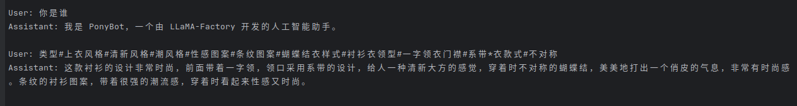
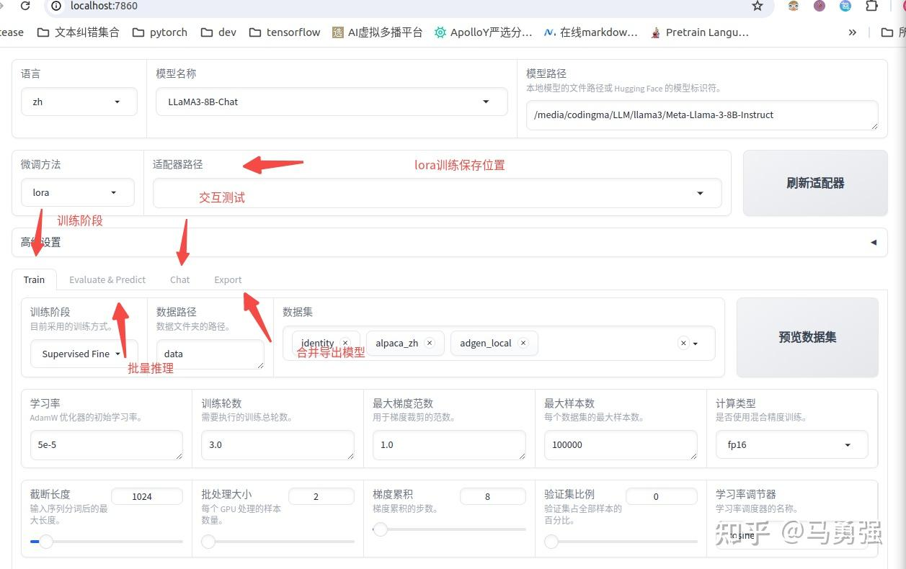
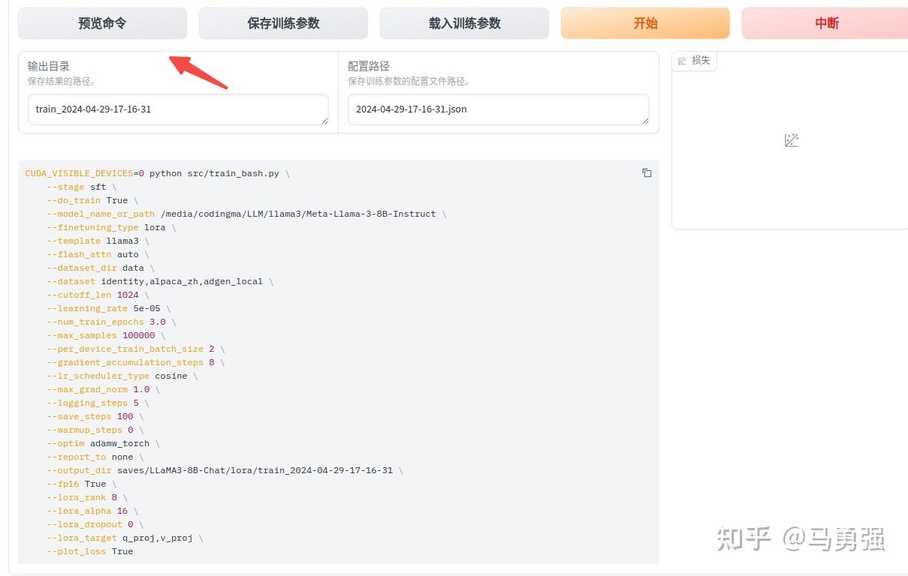
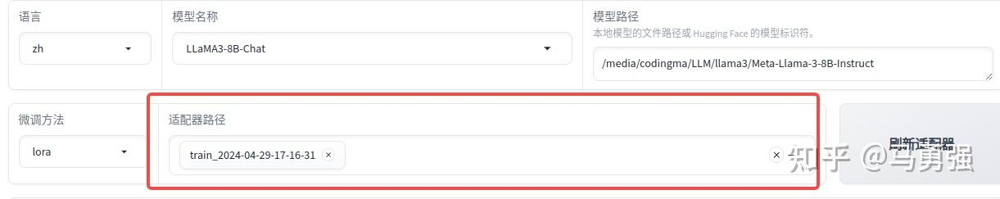

## 教程目标

功能包括：
1. 原始模型直接推理
2. 自定义数据集构建
3. 基于LoRA的sft指令微调
4. 动态合并LoRA的推理
5. 批量预测和训练效果评估
6. LoRA模型合并导出
7. 一站式webui board的使用
8. API Server的启动与调用
9. 大模型主流评测 benchmark
10. 导出GGUF格式，使用Ollama推理

## 检查 CUDA 环境

```py
>>> import torch
>>> torch.cuda.current_device()
0
>>> torch.cuda.get_device_name(0)
'NVIDIA GeForce RTX 4090'
>>> torch.__version__
'2.6.0+cu124'
```

## 下载模型

参考 Hugginface 教程。下载后，运行官方原始的推理 demo，验证模型文件的正确性和 transformers 库是否可用。

## 原始模型直接推理

开始工作之前，先试用推理模式，验证 LLaMA-Factory 推理部分是否正常。LLaMA-Factory 带了基于 gradio 开发的 ChatBot 推理页面，帮助测试，需要执行：

```bash
CUDA_VISIBLE_DEVICES=0 llamafactory-cli webchat --model_name_or_path Qwen/Qwen2-VL-2B-Instruct --template qwen2_vl
```

### template

关于 Qwen2.5-VL-3B-Instruct 模型，也可以沿用 qwen2_vl 模板。类似地，LLaMa 3.X 也是用的 llama3 的模板。于是只用运行如下命令便可以 Qwen2.5-VL-3B-Instruct 启动。

```bash
CUDA_VISIBLE_DEVICES=0 llamafactory-cli webchat --model_name_or_path Qwen/Qwen2.5-VL-3B-Instruct --template qwen2_vl
```

模板支持情况参考 [Supported Models](https://github.com/hiyouga/LLaMA-Factory?tab=readme-ov-file#supported-models)。

### 从 yaml 加载

也可保存在 yaml 中，按照官方的样例 [examples/inference/qwen2_vl.yaml](https://github.com/hiyouga/LLaMA-Factory/blob/main/examples/inference/qwen2_vl.yaml)

```yaml
model_name_or_path: Qwen/Qwen2-VL-7B-Instruct
template: qwen2_vl
infer_backend: huggingface  # choices: [huggingface, vllm]
trust_remote_code: true
```

随后直接执行：`llamafactory-cli webchat examples/inference/qwen2_vl.yaml`

可以通过本机的 IP，比如 http://localhost:7860 访问。对于服务器，可以使用 http://<server addr>:7860 访问。

### 打开防火墙，本地浏览器访问服务器的 webchat 页面

在服务器上查看端口是否正在监听：

```bash
ss -tuln | grep 7860
```

查看防火墙开放的端口端口：

```bash
sudo ufw status
❯ sudo ufw status
Status: active

# 可以看到，允许了比如 5901:5920 的 VNC server 端口等。
To                         Action      From
--                         ------      ----
21/tcp                     ALLOW       Anywhere
80/tcp                     ALLOW       Anywhere
5908/tcp                   ALLOW       Anywhere
5905/tcp                   ALLOW       Anywhere
5901:5920/tcp              ALLOW       Anywhere
22/tcp                     ALLOW       Anywhere
Anywhere                   ALLOW       192.168.123.129
5916                       ALLOW       Anywhere
21/tcp (v6)                ALLOW       Anywhere (v6)
80/tcp (v6)                ALLOW       Anywhere (v6)
5908/tcp (v6)              ALLOW       Anywhere (v6)
5905/tcp (v6)              ALLOW       Anywhere (v6)
5901:5920/tcp (v6)         ALLOW       Anywhere (v6)
22/tcp (v6)                ALLOW       Anywhere (v6)
5916 (v6)                  ALLOW       Anywhere (v6)

# 开放
sudo ufw allow 7860/tcp
# 阻止
sudo ufw deny 7860/tcp
```

## 可选参数

|动作参数枚举|参数说明|
|---|---|
|`version`|显示版本信息|
|`train`|命令行版本训练|
|`chat`|命令行版本推理chat|
|`export`|模型合并和导出|
|`api`|启动API server，供接口调用|
|`eval`|使用mmlu等标准数据集做评测|
|`webchat`|前端版本纯推理的chat页面|
|`webui`|启动LlamaBoard前端页面，包含可视化训练，预测，chat，模型合并多个子页面|

另外两个常用参数包含:
- model_name_or_path 参数名称为 huggingface 或 modelscope 的标准定义，或者是绝对路径。
- template 模型 QA 的模板。


## 自定义数据集构建

数据集格式在不同训练阶段表现不同。更多细节参考 [官方数据集解释](https://github.com/hiyouga/LLaMA-Factory/blob/main/data/README_zh.md)。

系统目前支持 alpaca 和 sharegpt 两种数据格式。以 alpaca 为例，数据集是一个 json 对象的 list，格式如下：

```json
[
  {
    "instruction": "用户指令（必填）",
    "input": "用户输入（选填）",
    "output": "模型回答（必填）",
    "system": "系统提示词（选填）",
    "history": [
      ["第一轮指令（选填）", "第一轮回答（选填）"],
      ["第二轮指令（选填）", "第二轮回答（选填）"]
    ]
  }
]
```

以 alpaca_data_zh_51k.json 为例，在 data/dataset_info.json 注册为 具体如下：

单轮对话场景：

```json
{
  "instruction": "写一个有效的比较语句",
  "input": "篮球和足球",
  "output": "篮球和足球都是受欢迎的运动。"
}
```

多轮对话场景：

```json
{
  "instruction": "谢谢",
  "input": "",
  "output": "不用谢! 很高兴我提供的信息能够帮助到你! 如果还有什么其他问题也可以向我提问。",
  "history": [
    [
      "请你给我写一个面试准备计划，我想要去面试微软的程序员岗位",
      "首先，你可以去微软官网寻找招聘信息并申请面试。\n其次，您可以在社交媒体平台寻找微软公司对程序员的面试问题，并做好准备。\n最后，您可以自己对面试过程进行模拟，熟悉话题并减少紧张感。\n我希望你能面试成功。"
    ]
  ]
}
```

训练的数据最好遵循这种格式，随后在 data/dataset_info.json 中注册。接下来，使用两个具体例子学习。

### 例子 1：官网仓库下的 data/identity.json

在 data/dataset_info.json，此数据集已默认注册。

```json
{
  "identity": {
    "file_name": "identity.json"
  },
  "alpaca_en_demo": {
    "file_name": "alpaca_en_demo.json"
  },
  ...
}
```

identity.json 中，"output" 部分包含了大量 `{{name}}` 和 `{{author}}` ，可以使用 sed 或 perl 工具替换为自己名字，微调以认识自己。

替换前：

```json
[
  {
    "instruction": "hi",
    "input": "",
    "output": "Hello! I am {{name}}, an AI assistant developed by {{author}}. How can I assist you today?"
  },
  ...
]
```

替换后：

```bash
sed -i 's/{{name}}/PonyBot/g'  data/identity.json 
sed -i 's/{{author}}/LLaMA Factory/g'  data/identity.json 
```

```json
{
  "instruction": "Who are you?",
  "input": "",
  "output": "I am PonyBot, an AI assistant developed by LLaMA Factory. How can I assist you today?"
}
```

### 例子 2：商品文案生成数据集

数据集 [链接](https://link.zhihu.com/?target=https%3A//cloud.tsinghua.edu.cn/f/b3f119a008264b1cabd1/%3Fdl%3D1)。格式明显，训练目标输入 content (对应 Alpaca 的 prompt)，输出 summary (对应 response)。

```json
{
    "content": "类型#裤*版型#宽松*风格#性感*图案#线条*裤型#阔腿裤", 
    "summary": "宽松的阔腿裤这两年真的吸粉不少，明星时尚达人的心头爱。毕竟好穿时尚，谁都能穿出腿长2米的效果宽松的裤腿，当然是遮肉小能手啊。上身随性自然不拘束，面料亲肤舒适贴身体验感棒棒哒。系带部分增加设计看点，还让单品的设计感更强。腿部线条若隐若现的，性感撩人。颜色敲温柔的，与裤子本身所呈现的风格有点反差萌。"
}
```

### 把例子 1 和 2 组织为 Alpaca 格式
如果需要放到我们系统使用，需要操作：
1. 复制数据集到 data 目录下。
2. 修改 data/dataset_info.json，完成注册。


途中看到，在 dataset_info.json 最后添加了如此一条。注册完成了三件事：
1. 自定义数据集的名称为 `adgen_local`，后续训练时，用来查找数据集。
2. 指出了数据集文件路径。
3. 定义原数据集的输入输出与所需格式的映射关系。

### Alpaca 数据描述文件格式

```json
"数据集名称": {
  "file_name": "data.json",
  "columns": {
    "prompt": "instruction",
    "query": "input",
    "response": "output",
    "system": "system",
    "history": "history"
  }
}
```

### Alpaca 多模态数据集格式

目前仅仅支持单张图像输入，放到 `images` 列。数据集格式如下：

```json
[
  {
    "instruction": "人类指令（必填）",
    "input": "人类输入（选填）",
    "output": "模型回答（必填）",
    "images": [
      "图像路径（必填）"
    ]
  }
]
```

注册如下：

```json
"数据集名称": {
  "file_name": "data.json",
  "columns": {
    "prompt": "instruction",
    "query": "input",
    "response": "output",
    "images": "images"
  }
}
```

### ShareGPT 例子：官网的多模态数据集 mllm_demo.json

我们主要关注数据集 [mllm_demo.json](https://github.com/hiyouga/LLaMA-Factory/blob/main/data/mllm_demo.json) 如何注册到 [data/dataset_info.json](https://github.com/hiyouga/LLaMA-Factory/blob/main/data/dataset_info.json)。

```json
[
  {
    "messages": [
      {
        "content": "<image>Who are they?",
        "role": "user"
      },
      {
        "content": "They're Kane and Gretzka from Bayern Munich.",
        "role": "assistant"
      },
      {
        "content": "What are they doing?",
        "role": "user"
      },
      {
        "content": "They are celebrating on the soccer field.",
        "role": "assistant"
      }
    ],
    "images": [
      "mllm_demo_data/1.jpg"
    ]
  },
  {
    "messages": [
      {
        "content": "<image>Who is he?",
        "role": "user"
      },
      {
        "content": "He's Thomas Muller from Bayern Munich.",
        "role": "assistant"
      },
      {
        "content": "Why is he on the ground?",
        "role": "user"
      },
      {
        "content": "Because he's sliding on his knees to celebrate.",
        "role": "assistant"
      }
    ],
    "images": [
      "mllm_demo_data/2.jpg"
    ]
  },
  ...
]
```

images 可以是相对路径，可以是绝对路径。接下来查看如何注册到 data/dataset_info.json。

```json
{
  "mllm_demo": {
    "file_name": "mllm_demo.json",
    "formatting": "sharegpt",
    "columns": {
      "messages": "messages",
      "images": "images"
    },
    "tags": {
      "role_tag": "role",
      "content_tag": "content",
      "user_tag": "user",
      "assistant_tag": "assistant"
    }
  },
  ...
}
```

columns 中的各条解释：
- `message` 代表列中的信息，默认值是 conversations。
- `images` 代表图像输入，默认 None。

tags 解释：
- `role_tag` 指出 `message` 列的每一条内容中，代表身份的字段 (key)，默认值 from。
- `content_tag` 指出 `message` 列的每一条内容中，代表内容的 key，默认值是 value。
- `user_tag` 指出 `role_tag`，用户 (提问者) 的角色标识符，即默认是 human。
- `assistant_tag` 指出 `role_tag` 的助手 (模型) 的橘色标识符，默认 gpt。其他常见值有 `"assistant"`， `"bot"` 等，需要与实际值一致。

### ShareGPT 格式

`ShareGPT` 格式支持更多的角色种类，比如 human, gpt, observation, function 等等。他们构成对象列表，放置在 `conversations` 列。例子：

```json
{
  "conversations": [
    {
      "from": "human",
      "value": "你好，我出生于1990年5月15日。你能告诉我我今天几岁了吗？"
    },
    {
      "from": "function_call",
      "value": "{\"name\": \"calculate_age\", \"arguments\": {\"birthdate\": \"1990-05-15\"}}"
    },
    {
      "from": "observation",
      "value": "{\"age\": 31}"
    },
    {
      "from": "gpt",
      "value": "根据我的计算，你今天31岁了。"
    }
  ],
  "tools": "[{\"name\": \"calculate_age\", \"description\": \"根据出生日期计算年龄\", \"parameters\": {\"type\": \"object\", \"properties\": {\"birthdate\": {\"type\": \"string\", \"description\": \"出生日期以YYYY-MM-DD格式表示\"}}, \"required\": [\"birthdate\"]}}]"
}
```

框架要求 human 和 observation 必须出现在奇数位置，gpt 和 function 出现在偶数位置。可能代表一问一答。比如：

```json
[
  {
    "conversations": [
      {
        "from": "human",
        "value": "人类指令"
      },
      {
        "from": "function_call",
        "value": "工具参数"
      },
      {
        "from": "observation",
        "value": "工具结果"
      },
      {
        "from": "gpt",
        "value": "模型回答"
      }
    ],
    "system": "系统提示词（选填）",
    "tools": "工具描述（选填）"
  }
]
```

描述上述为：

```json
"数据集名称": {
  "file_name": "data.json",
  "formatting": "sharegpt",
  "columns": {
    "messages": "conversations",
    "system": "system",
    "tools": "tools"
  }
}
```

### 注册的描述格式

[data](https://github.com/hiyouga/LLaMA-Factory/tree/main/data)

```json
"dataset_name": {
  "hf_hub_url": "the name of the dataset repository on the Hugging Face hub. (if specified, ignore script_url and file_name)",
  "ms_hub_url": "the name of the dataset repository on the Model Scope hub. (if specified, ignore script_url and file_name)",
  "script_url": "the name of the directory containing a dataset loading script. (if specified, ignore file_name)",
  "file_name": "the name of the dataset folder or dataset file in this directory. (required if above are not specified)",
  "formatting": "the format of the dataset. (optional, default: alpaca, can be chosen from {alpaca, sharegpt})",
  "ranking": "whether the dataset is a preference dataset or not. (default: False)",
  "subset": "the name of the subset. (optional, default: None)",
  "split": "the name of dataset split to be used. (optional, default: train)",
  "folder": "the name of the folder of the dataset repository on the Hugging Face hub. (optional, default: None)",
  "num_samples": "the number of samples in the dataset to be used. (optional, default: None)",
  "columns (optional)": {
    "prompt": "the column name in the dataset containing the prompts. (default: instruction)",
    "query": "the column name in the dataset containing the queries. (default: input)",
    "response": "the column name in the dataset containing the responses. (default: output)",
    "history": "the column name in the dataset containing the histories. (default: None)",
    "messages": "the column name in the dataset containing the messages. (default: conversations)",
    "system": "the column name in the dataset containing the system prompts. (default: None)",
    "tools": "the column name in the dataset containing the tool description. (default: None)",
    "images": "the column name in the dataset containing the image inputs. (default: None)",
    "videos": "the column name in the dataset containing the videos inputs. (default: None)",
    "audios": "the column name in the dataset containing the audios inputs. (default: None)",
    "chosen": "the column name in the dataset containing the chosen answers. (default: None)",
    "rejected": "the column name in the dataset containing the rejected answers. (default: None)",
    "kto_tag": "the column name in the dataset containing the kto tags. (default: None)"
  },
  "tags (optional, used for the sharegpt format)": {
    "role_tag": "the key in the message represents the identity. (default: from)",
    "content_tag": "the key in the message represents the content. (default: value)",
    "user_tag": "the value of the role_tag represents the user. (default: human)",
    "assistant_tag": "the value of the role_tag represents the assistant. (default: gpt)",
    "observation_tag": "the value of the role_tag represents the tool results. (default: observation)",
    "function_tag": "the value of the role_tag represents the function call. (default: function_call)",
    "system_tag": "the value of the role_tag represents the system prompt. (default: system, can override system column)"
  }
}
```

columns 中的各条解释：
- `message` 代表列中的信息，默认值是 conversations。
- `images` 代表图像输入，默认 None。

tags 解释：
- `role_tag` 指出 `message` 列的每一条内容中，代表身份的字段 (key)，默认值 from。
- `content_tag` 指出 `message` 列的每一条内容中，代表内容的 key，默认值是 value。
- `user_tag` 指出 `role_tag`，用户 (提问者) 的角色标识符，即默认是 human。
- `assistant_tag` 指出 `role_tag` 的助手 (模型) 的橘色标识符，默认 gpt。其他常见值有 `"assistant"`， `"bot"` 等，需要与实际值一致。
- `observation_tag` 标识模型调用外部工具或函数后的执行结果。当模型生成工具调用（如查询天气）后，返回到结果保存在此 tag 指出的字段。
- `function_tag` 表示模型生成的工具调用请求（如函数名称、参数等），通常用于触发外部调用工具的执行。
- `system_tag` 标识系统级别的控制信息或上下文指令，引导模型行为或提供全局信息（如角色设定、任务背景、安全约束等）。这类信息不直接参与对话，但会影响回复风格或逻辑。

observation_tag 例子，指出观察结果：
```json
{
  "conversations": [
    {"from": "human", "value": "帮我订一张明天北京到上海的机票。"},
    {"from": "gpt", "value": "<function>book_flight(from=北京, to=上海, date=明天)</function>"},  // 函数调用
    {"from": "observation", "value": "已成功预订：北京→上海，2023-10-20 08:00"},
    {"from": "gpt", "value": "机票已为您预订成功！"}
  ]
}
```

system_tag 例子，省去了数据描述部分：
```json
{
  "conversations": [
    {"from": "system", "value": "你是一个严谨的医学助手，只回答专业问题，不提供猜测。"},  // 系统指令
    {"from": "human", "value": "感冒了怎么办？"},
    {"from": "gpt", "value": "建议多休息、补充水分，如症状持续请就医。"}
  ]
}
```

### Alpaca 和 ShareGPT 对比

|| Alpaca | ShareGPT |
|---|---|---|
| 任务类型 | 格式更适合单轮任务，如指令跟随、问答等。 | 格式更适合多轮对话任务，如聊天机器人、交互式对话等。 |
| 数据来源 | 数据通常是通过 Self-Instruct 方法生成的，任务指令明确。 | 数据来源于真实用户与模型的对话，更具自然性和多样性。 |
| 数据结构 | 格式结构简单，适合任务导向的微调。 | 格式结构复杂，适合对话导向的微调。 |

最佳实践：
- 如果你的目标是微调模型以执行特定任务（如翻译、摘要等），Alpaca 格式可能更适合。
- 如果你的目标是微调模型以进行自然对话（如聊天机器人），ShareGPT 格式可能更适合。

### 官网

## 基于 LoRA 的 SFT 指令微调

准备数据集后，开始训练，让模型学会我们定义的“你是谁”，同时学会商品文案生成。从命令行开始，参数来自 [llama3_lora_sft.yaml](https://link.zhihu.com/?target=https%3A//github.com/hiyouga/LLaMA-Factory/blob/main/examples/train_lora/llama3_lora_sft.yaml)，可以查看其与命令行参数的关系。

```bash
CUDA_VISIBLE_DEVICES=0 llamafactory-cli train \
    --stage sft \
    --do_train \
    --model_name_or_path /media/codingma/LLM/llama3/Meta-Llama-3-8B-Instruct \
    --dataset alpaca_gpt4_zh,identity,adgen_local \
    --dataset_dir ./data \
    --template llama3 \
    --finetuning_type lora \
    --output_dir ./saves/LLaMA3-8B/lora/sft \
    --overwrite_cache \
    --overwrite_output_dir \
    --cutoff_len 1024 \
    --preprocessing_num_workers 16 \
    --per_device_train_batch_size 2 \
    --per_device_eval_batch_size 1 \
    --gradient_accumulation_steps 8 \
    --lr_scheduler_type cosine \
    --logging_steps 50 \
    --warmup_steps 20 \
    --save_steps 100 \
    --eval_steps 50 \
    --evaluation_strategy steps \
    --load_best_model_at_end \
    --learning_rate 5e-5 \
    --num_train_epochs 5.0 \
    --max_samples 1000 \
    --val_size 0.1 \
    --plot_loss \
    --fp16
```

完整参数和解释可以参考 `llamafactory-cli train -h`

### 参数解释

| 参数名称 | 参数说明 |
|---|--------|
| stage | 当前训练的阶段，枚举值，有“sft”,"pt","rm","ppo"等，代表了训练的不同阶段，这里我们是有监督指令微调，所以是sft |
| do_train | 是否是训练模式 |
| dataset | 使用的数据集列表，所有字段都需要按上文在data_info.json里注册，多个数据集用","分隔 |
| dataset_dir | 数据集所在目录，这里是 data，也就是项目自带的data目录 |
| finetuning_type | 微调训练的类型，枚举值，有"lora","full","freeze"等，这里使用 lora |
| output_dir | 训练结果保存的位置 |
| cutoff_len | 训练数据集的长度截断 |
| per_device_train_batch_size | 每个设备上的batch size，最小是1，如果GPU 显存够大，可以适当增加 |
| fp16 | 使用半精度混合精度训练 |
| max_samples | 每个数据集采样多少数据 |
| val_size | 随机从数据集中抽取多少比例的数据作为验证集 |

精度相关的参数还有bf16 和pure_bf16，但是要注意有的老显卡，比如V100就无法支持bf16，会导致程序报错或者其他错误。

### 执行训练

训练时，按照 logging_steps 参数设置定时输出训练日志，包含当前 loss，进度等。完成后，可以在 output_dir 下看到内容，主要包含三个部分：
1. adapter 开头的是 LoRA 保存的结果，后续用于模型推理融合。
2. training_loss 和 trainer_log 记录训练过程指标。
3. 其他是训练的参数备份。

## 动态合并 LoRA 的推理

参数改自 [llama3_lora_sft.yaml](https://link.zhihu.com/?target=https%3A//github.com/hiyouga/LLaMA-Factory/blob/main/examples/inference/llama3_lora_sft.yaml)。训练结束后，向左动态验证，可以尝试推理，但是需要通过参数 `--finetuning_type lora` 告诉系统，使用了 LoRA 训练，并将 LoRA 模型路径指出：

```bash
CUDA_VISIBLE_DEVICES=0 llamafactory-cli webchat \
    --model_name_or_path /media/codingma/LLM/llama3/Meta-Llama-3-8B-Instruct \
    --adapter_name_or_path ./saves/LLaMA3-8B/lora/sft  \
    --template llama3 \
    --finetuning_type lora
```

如果不适用 webui，使用命令行交互，使用：

```bash
CUDA_VISIBLE_DEVICES=0 llamafactory-cli chat \
    --model_name_or_path /media/codingma/LLM/llama3/Meta-Llama-3-8B-Instruct \
    --adapter_name_or_path ./saves/LLaMA3-8B/lora/sft  \
    --template llama3 \
    --finetuning_type lora
```



## 批量预测和训练效果评估

上面的人工交互偏感性，没办法批量预测批量输入，使用自动化的 bleu 和 rouge 等常用文本生成指标评估。需要安装如下库：

```bash
pip install jieba rouoge-chinese nltk
```

参数改自 [llama3_lora_predict.yaml](https://link.zhihu.com/?target=https%3A//github.com/hiyouga/LLaMA-Factory/blob/main/examples/train_lora/llama3_lora_predict.yaml)。

```bash
CUDA_VISIBLE_DEVICES=0 llamafactory-cli train \
    --stage sft \
    --do_predict \
    --model_name_or_path /media/codingma/LLM/llama3/Meta-Llama-3-8B-Instruct \
    --adapter_name_or_path ./saves/LLaMA3-8B/lora/sft  \
    --eval_dataset alpaca_gpt4_zh,identity,adgen_local \
    --dataset_dir ./data \
    --template llama3 \
    --finetuning_type lora \
    --output_dir ./saves/LLaMA3-8B/lora/predict \
    --overwrite_cache \
    --overwrite_output_dir \
    --cutoff_len 1024 \
    --preprocessing_num_workers 16 \
    --per_device_eval_batch_size 1 \
    --max_samples 20 \
    --predict_with_generate
```

与训练脚本主要的参数区别如下两个

| 参数名称 | 参数说明 |
|---|---|
| do_predict | 现在是预测模式 |
| predict_with_generate | 现在用于生成文本 |
| max_samples | 每个数据集采样多少用于预测对比 |

最后可在 output_dir 看到内容。

## LoRA 模型合并到处

把训练的 LoRA 与原始大模型融合并到处，需要使用如下命令。参数改编自 [llama3_lora_sft.yaml](https://github.com/hiyouga/LLaMA-Factory/blob/main/examples/merge_lora/llama3_lora_sft.yaml)。

```bash
CUDA_VISIBLE_DEVICES=0 llamafactory-cli export \
    --model_name_or_path /media/codingma/LLM/llama3/Meta-Llama-3-8B-Instruct \
    --adapter_name_or_path ./saves/LLaMA3-8B/lora/sft  \
    --template llama3 \
    --finetuning_type lora \
    --export_dir megred-model-path \
    --export_size 2 \
    --export_device cpu \
    --export_legacy_format False
```

或者在 yaml 中配置后，比如：

```bash
llamafactory-cli export examples/merge_lora/qwen2vl_lora_sft.yaml
```

## 一站式 webui board

仅支持单机<单卡|多卡>。启动如下命令：

```bash
CUDA_VISIBLE_DEVICES=0 llamafactory-cli webui
```



可以看到，多个不同的功能模块在 tab 间整合。配置参数后，在 train 页面，预览命令功能，将训练脚本到处，支持多 GPU 训练。



训练完成后，点击“刷新适配器”，可找到模型历史上的 LoRA 模型文件，后续再训练或执行 chat，会一起加载。



## API Server 启动与调用

基于 vllm 推理时，需要提前将 LoRA 模型 merge，随后指出即可：

```bash
CUDA_VISIBLE_DEVICES=0 API_PORT=8000 llamafactory-cli api \
    --model_name_or_path megred-model-path \
    --template llama3 \
    --infer_backend vllm \
    --vllm_enforce_eager
```

服务启动后，即可按照openai 的API 进行远程访问，主要的区别就是替换 其中的base_url，指向所部署的机器url和端口号即可。

```python
import os
from openai import OpenAI
from transformers.utils.versions import require_version

require_version("openai>=1.5.0", "To fix: pip install openai>=1.5.0")

if __name__ == '__main__':
    # change to your custom port
    port = 8000
    client = OpenAI(
        api_key="0",
        base_url="http://localhost:{}/v1".format(os.environ.get("API_PORT", 8000)),
    )
    messages = []
    messages.append({"role": "user", "content": "hello, where is USA"})
    result = client.chat.completions.create(messages=messages, model="test")
    print(result.choices[0].message)
```

## 分布式训练：DDP，DeepSpeed 和 FSDP

[分布式训练](https://llamafactory.readthedocs.io/zh-cn/latest/advanced/distributed.html)

[Github DeepSpeed 配置示例](https://github.com/hiyouga/LLaMA-Factory/tree/main/examples/deepspeed)

## Ref and Tag
[Github](https://github.com/hiyouga/LLaMA-Factory)
[知乎教程](https://zhuanlan.zhihu.com/p/695287607)
[read the doc](https://llamafactory.readthedocs.io/zh-cn/latest/)
[与 DeepSpeed 训练 Qwen](https://zhuanlan.zhihu.com/p/714707824)

[[llm.huggingface.DeepSpeed集成]]
[[llm.DeepSpeed_核心概念]]
[[llm.Megatron]]

#LLM
 