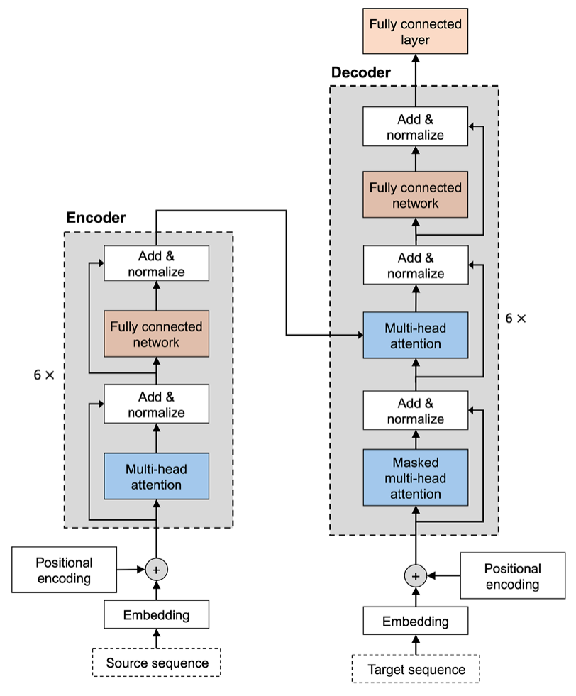
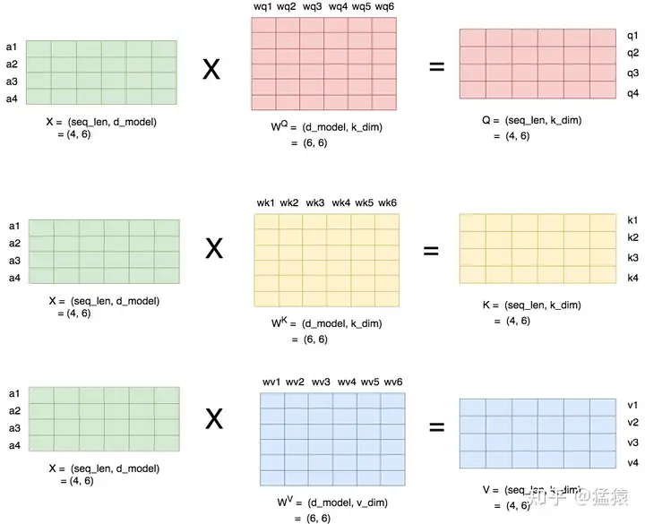
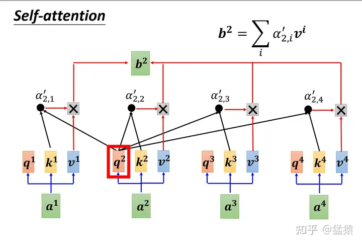
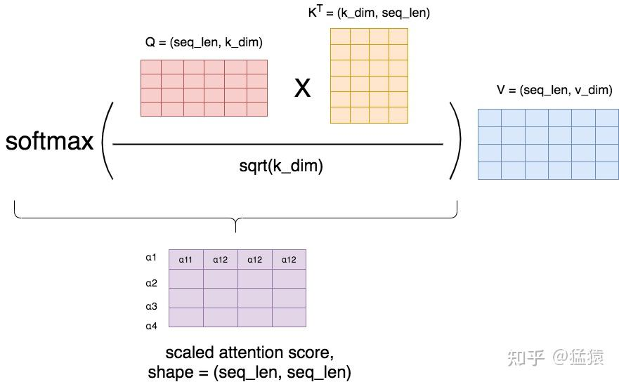

Transformer是如何处理可变长度数据的？ - 猛猿的回答 - 知乎
https://www.zhihu.com/question/445895638/answer/2306274526

## Input Embedding 层和 Positional Embedding 层
输入维度是 (batch_size, seq_len, vocab_size)，经过嵌入层和位置嵌入处理，得到 (batch_size, seq_len, d_modl)。嵌入层只关注 vocab_size 这一维度，与 seq_len 无关。

## Attention

输入 a1, a2, a3, a4 等等，经过 Attention 层的参数处理，得到向量 q, k, v

得到的向量中，每个 q 都与当前批次内的所有 (包括自己) 的 k 向量求内积，经 softmax 处理，得到 attention score，或 attention weight。随后与 v 向量求内积，得到当前的结果。

与长度也无关。

## 为什么在 softmax 中乘以 $1/\sqrt{d_k}$

如此操作，得到的 attention score 矩阵的每一行表示一个 token，每一列表示 token 和对应位置 token 的 α 值。显然，根据计算，每列的 α 值相加总是等于 1。但是，只有进行了 softmax 后，每一行的 α 相加都会得到 1。

之所以 scaling，是为了 softmax 过程中，梯度下降更稳定，避免梯度过小造成参数更新而停滞。

## Tag
#Transformer