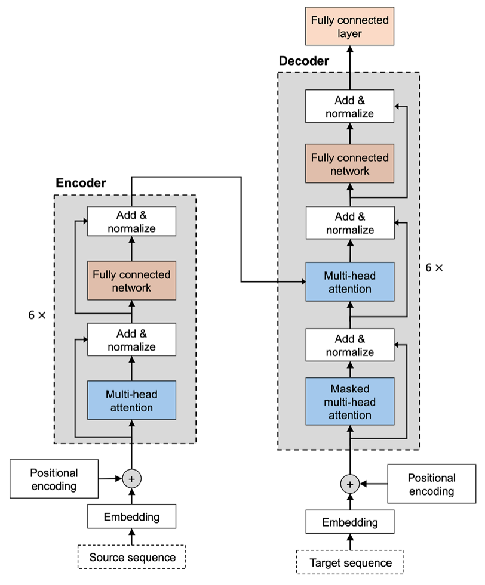
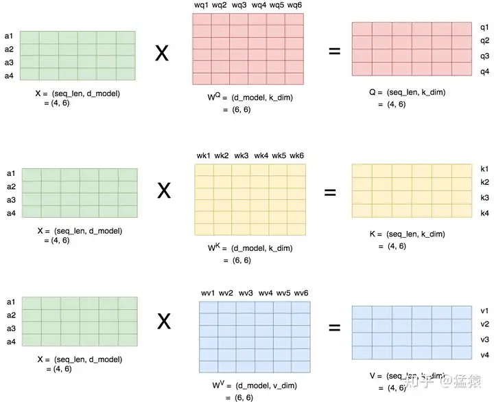
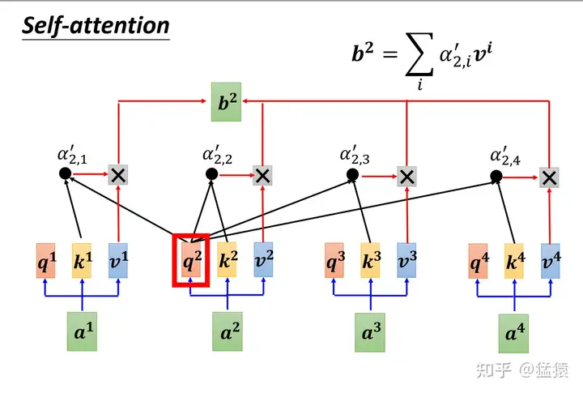
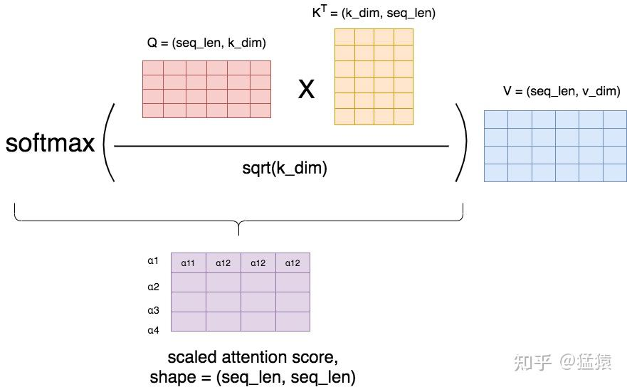

公式参考 Attention is all you need。Q, K 和 V 是输入 X 经过权重矩阵变换后得来的矩阵，形状是 (batch_size, seq_len, dim)。当使用多头时，那么权重矩阵中，out_feature 通常是 dim // num_heads，少于输入的 input_dim。实现时，通常使用一个 nn.Linear 表示这些多头的 Q 的权重矩阵，是合并起来了的权重矩阵，方便一并计算。所以输出的 Q 中，Q[..., i:(i+1)*dim] 对应每个头。注意力和多头注意力公式如下：

$$
\text{Attention}(Q, K, V) = \text{softmax}\left(\frac{QK^T}{\sqrt{d_k}}\right)V
$$

这里只是展现了注意力机制，有了 Q, K 和 V 后，Attention() 计算的细节。传给 Attention 的参数 Q, K 和 V，需要输入 X 经过对应的权重矩阵处理才能得到，具体流程参考多头矩阵部分。

$$
\text{MultiHead}(Q, K, V) = \text{Concat}(\text{head}_1, \dots, \text{head}_h) W^O
$$

$$
\text{head}_i = \text{Attention}(QW_i^Q, KW_i^K, VW_i^V)
$$

nn.Linear() 中的 weight 的形状是 (out_features, in_features)，$W_i^Q$ 对应 weight[i:(i+1)*dim, :]。为方便计算多头，输入和输出的最后一维看作由两维num_heads x head_dim 组成，准备处理注意力前拆分。转置后，执行一系列注意力操作，最后再转置回来，并 reshape，便可省去 Concat 操作。

$$
\text{FFN}(x) = \max(0, xW_1 + b_1)W_2 + b_2
$$

## 直观的理解



### Input Embedding 层和 Positional Embedding 层
输入维度是 (batch_size, seq_len, vocab_size)，经过嵌入层和位置嵌入处理，得到 (batch_size, seq_len, d_modl)。嵌入层只关注 vocab_size 这一维度，与 seq_len 无关。

### Attention

输入 a1, a2, a3, a4 等等，经过 Attention 层的参数处理，得到向量 q, k, v



得到的向量中，每个 q 都与当前批次内的所有 (包括自己) 的 k 向量求内积，经 softmax 处理，得到 attention score，或 attention weight。随后与 v 向量求内积，得到当前的结果。N x N 的 attention score 矩阵，每个 q 与所有 k 求内积，得到 N 个 attention score。有可能交叉注意力机制中，q 与 k 不同长度，会得到 T x N 的得分矩阵。


与长度也无关。

### 为什么在 softmax 中乘以 $1/\sqrt{d_k}$

如此操作，得到的 attention score 矩阵的每一行表示一个 token，每一列表示 token 和对应位置 token 的 α 值。显然，根据计算，每列的 α 值相加总是等于 1。但是，只有进行了 softmax 后，每一行的 α 相加都会得到 1。

之所以 scaling，是为了 softmax 过程中，梯度下降更稳定，避免梯度过小造成参数更新而停滞。

## PyTorch 的表示习惯：将 QKV 批量从 X 转换

注意到是 $\boldsymbol{q}\boldsymbol{k}^T$ 而不是 $\boldsymbol{q}^T\boldsymbol{k}$，这是因为在 PyTorch 中，张量通常看成行向量形式表达，$\boldsymbol{q}\boldsymbol{k}^T$ 得到一个标量，即一个数字。而数学上，向量通常是列向量，所以数学表示通常用 $\boldsymbol{q}^T\boldsymbol{k}$，计算得到一个具体的值。

使用 nn.Linear(dim, dim * 3, bias=qkv_bias) ，一次性处理 qkv，高效利用并行。在 nn.Linear 中，权重矩阵 weight 形状设计为 (out_features, in_features)。Linear 在前向传播时，调用 F.linear(weight, x)，执行了 $x \cdot A^T$。为什么 weight 保存为转置版本？也许是指令级别的把。

这种设计的原因主要有以下几点：

直观的参数组织。每个输出神经元的权重作为矩阵的一行存储。例如，权重矩阵的第i行直接对应第i个输出神经元的参数，便于直接访问和操作特定输出单元的权重。

框架设计的一致性。PyTorch的其他层（如卷积层）的参数排列也遵循“输出维度在前”的约定。例如，卷积层的权重形状为(out_channels, in_channels, ...)。这种一致性简化了参数管理和初始化逻辑。

数学表示的适配。数学中线性变换通常写作 $y = xW + b$，其中W的形状为(in_features, out_features)。PyTorch 将权重存储为转置 W.T，形状为 (out_features, in_features)，使得前向传播可通过x @ weight.T直接实现，无需修改底层数学逻辑。

计算效率的考量。矩阵的行优先存储可能更适配底层硬件加速（如GPU），连续的内存访问模式可提升计算效率。此外，F.linear内部可能优化了转置操作，避免显式转置带来的额外开销。

## 代码实现

```py
class Attention(nn.Module):
    fused_attn: Final[bool]

    def __init__(
        self,
        dim: int,
        num_heads: int = 8,
        qkv_bias: bool = False,
        qk_norm: bool = False,
        attn_drop: float = 0.0,
        proj_drop: float = 0.0,
        norm_layer: nn.Module = nn.LayerNorm,
    ) -> None:
        super().__init__()
        assert dim % num_heads == 0, "dim should be divisible by num_heads"
        self.num_heads = num_heads
        self.head_dim = dim // num_heads
        self.scale = self.head_dim**-0.5
        self.fused_attn = use_fused_attn()

        self.qkv = nn.Linear(dim, dim * 3, bias=qkv_bias)
        self.q_norm = norm_layer(self.head_dim) if qk_norm else nn.Identity()
        self.k_norm = norm_layer(self.head_dim) if qk_norm else nn.Identity()
        self.attn_drop = nn.Dropout(attn_drop)
        self.proj = nn.Linear(dim, dim)
        self.proj_drop = nn.Dropout(proj_drop)

    def forward(self, x: torch.Tensor, attn_mask=None) -> torch.Tensor:
        B, N, C = x.shape
        qkv = (
            self.qkv(x)
            # 3 分别由 Q K V 组成，所以转置后方便 unbind
            # 最后一维由 dim 拆为 num_heads x head_dim，方便多头操作
            .reshape(B, N, 3, self.num_heads, self.head_dim)
            # 转置后，方便使用多头操作，把 N 与 head_dim ,维度放到最后两维即可。
            # (3, B, num_heads, seq_len, head_dim)
            .permute(2, 0, 3, 1, 4)
        )
        q, k, v = qkv.unbind(0)
        q, k = self.q_norm(q), self.k_norm(k)
        if self.fused_attn:
            x = F.scaled_dot_product_attention(
                q,
                k,
                v,
                attn_mask=attn_mask,
                dropout_p=self.attn_drop.p if self.training else 0.0,
            )
        else:
            q = q * self.scale
            # Q * K.T
            # (B num_heads N head_dim) * (B num_heads head_dim N)
            # 得到 (B num_heads N N)
            attn_scores = torch.matmul(q, k.transpose(-2, -1))
            # Add attention mask if provided
            if attn_mask is not None:
                attn_scores += attn_mask
            # Apply softmax to get attention weights (softmax is applied along the last dimension)
            attn_weights = F.softmax(attn_scores, dim=-1)
            # Dropout on attention weights (if dropout is used)
            attn_weights = self.attn_drop(attn_weights)
            # Apply attention weights to value tensor (V)
            # (B num_heads N N) * (B num_heads N head_dim)
            x = torch.matmul(attn_weights, v)
        # 把最后两维连接起来，num_heads 个 head_dim 拼接
        x = x.transpose(1, 2).reshape(B, N, C)
        x = self.proj(x)
        x = self.proj_drop(x)
        return x
```

参考 timm 的 Attention。

### 另外实现

```py
def flash_attention(q, k, v, num_heads):
    q = rearrange(q, "b s (n d) -> b n s d", n=num_heads)
    k = rearrange(k, "b s (n d) -> b n s d", n=num_heads)
    v = rearrange(v, "b s (n d) -> b n s d", n=num_heads)
    x = F.scaled_dot_product_attention(q, k, v)
    x = rearrange(x, "b n s d -> b s (n d)", n=num_heads)
    return x

def sinusoidal_embedding_1d(dim, position):
    sinusoid = torch.outer(
        position.type(torch.float64),
        torch.pow(
            10000,
            -torch.arange(dim // 2, dtype=torch.float64, device=position.device).div(
                dim // 2
            ),
        ),
    )
    x = torch.cat([torch.cos(sinusoid), torch.sin(sinusoid)], dim=1)
    return x.to(position.dtype)


def precompute_freqs_cis_3d(dim: int, end: int = 1024, theta: float = 10000.0):
    # 3d rope precompute
    f_freqs_cis = precompute_freqs_cis(dim - 2 * (dim // 3), end, theta)
    h_freqs_cis = precompute_freqs_cis(dim // 3, end, theta)
    w_freqs_cis = precompute_freqs_cis(dim // 3, end, theta)
    return f_freqs_cis, h_freqs_cis, w_freqs_cis


def precompute_freqs_cis(dim: int, end: int = 1024, theta: float = 10000.0):
    # 1d rope precompute
    freqs = 1.0 / (theta ** (torch.arange(0, dim, 2)[: (dim // 2)].double() / dim))
    freqs = torch.outer(torch.arange(end, device=freqs.device), freqs)
    # 根据笛卡尔坐标系的绝对值和角度，计算出复数的表示。
    # 比如 (1, pi / 2)，对应在 y 坐标轴上，可以得到复数 0+1j，对应坐标 (0, 1)
    # 下面得到 r cos theta + r sin theta j
    # 使用复数，让 x 的加法更容易
    freqs_cis = torch.polar(torch.ones_like(freqs), freqs)  # complex64
    return freqs_cis

def rope_apply(x, freqs, num_heads):
    x = rearrange(x, "b s (n d) -> b s n d", n=num_heads)
    x_out = torch.view_as_complex(
        x.to(torch.float64).reshape(x.shape[0], x.shape[1], x.shape[2], -1, 2)
    )
    x_out = torch.view_as_real(x_out * freqs).flatten(2)
    return x_out.to(x.dtype)


class RMSNorm(nn.Module):
    def __init__(self, dim, eps=1e-5):
        super().__init__()
        self.eps = eps
        self.weight = nn.Parameter(torch.ones(dim))

    def norm(self, x):
        return x * torch.rsqrt(x.pow(2).mean(dim=-1, keepdim=True) + self.eps)

    def forward(self, x):
        dtype = x.dtype
        return self.norm(x.float()).to(dtype) * self.weight


class AttentionModule(nn.Module):
    def __init__(self, num_heads):
        super().__init__()
        self.num_heads = num_heads

    def forward(self, q, k, v):
        x = flash_attention(q=q, k=k, v=v, num_heads=self.num_heads)
        return x


class SelfAttention(nn.Module):
    def __init__(self, dim: int, num_heads: int, eps: float = 1e-6):
        super().__init__()
        self.dim = dim
        self.num_heads = num_heads
        self.head_dim = dim // num_heads

        self.q = nn.Linear(dim, dim)
        self.k = nn.Linear(dim, dim)
        self.v = nn.Linear(dim, dim)
        self.o = nn.Linear(dim, dim)
        self.norm_q = RMSNorm(dim, eps=eps)
        self.norm_k = RMSNorm(dim, eps=eps)

        self.attn = AttentionModule(self.num_heads)

    def forward(self, x, freqs):
        q = self.norm_q(self.q(x))
        k = self.norm_k(self.k(x))
        v = self.v(x)
        q = rope_apply(q, freqs, self.num_heads)
        k = rope_apply(k, freqs, self.num_heads)
        x = self.attn(q, k, v)
        return self.o(x)


class CrossAttention(nn.Module):
    def __init__(
        self, dim: int, num_heads: int, eps: float = 1e-6, has_image_input: bool = False
    ):
        super().__init__()
        self.dim = dim
        self.num_heads = num_heads
        self.head_dim = dim // num_heads

        self.q = nn.Linear(dim, dim)
        self.k = nn.Linear(dim, dim)
        self.v = nn.Linear(dim, dim)
        self.o = nn.Linear(dim, dim)
        self.norm_q = RMSNorm(dim, eps=eps)
        self.norm_k = RMSNorm(dim, eps=eps)
        self.has_image_input = has_image_input
        if has_image_input:
            self.k_img = nn.Linear(dim, dim)
            self.v_img = nn.Linear(dim, dim)
            self.norm_k_img = RMSNorm(dim, eps=eps)

        self.attn = AttentionModule(self.num_heads)

    def forward(self, x: torch.Tensor, y: torch.Tensor):
        if self.has_image_input:
            img = y[:, :257]
            ctx = y[:, 257:]
        else:
            ctx = y
        q = self.norm_q(self.q(x))
        k = self.norm_k(self.k(ctx))
        v = self.v(ctx)
        x = self.attn(q, k, v)
        if self.has_image_input:
            k_img = self.norm_k_img(self.k_img(img))
            v_img = self.v_img(img)
            y = flash_attention(q, k_img, v_img, num_heads=self.num_heads)
            x = x + y
        return self.o(x)
```

## Ref and Tag

#Transformer

Transformer是如何处理可变长度数据的？ - 猛猿的回答 - 知乎
https://www.zhihu.com/question/445895638/answer/2306274526