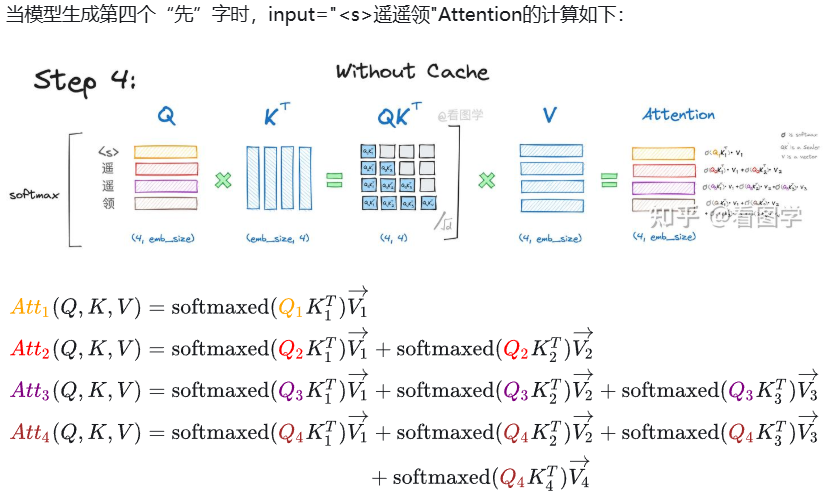

在 Decoder 中，可以缓存 K、V 提速。不缓存 Q，因为要用 Q 的各个向量来迭代地计算 K 的所有向量计算注意力得分，再与所有的 V 的向量计算生成 logits。Q 的向量，只会使用一次来计算注意力权重。K 和 V 的各个向量都会需要多次访问，Q 的每个向量需要计算注意力分数时，需要访问一整个 K，根据注意力计算输出时，需要访问所有的 V 向量。可以通过复用历史计算结果，避免重复计算已生成部分的注意力权重。



在没有用 KV Cache 时，生成式的 Decoder 中，每次输入如下：
1. `<s>` 开始
2. `<s>遥`
3. `<s>遥遥`
4. `<s>遥遥领`

这几次，都需要分别计算 Q K V。可以简化，避免重复计算前面的 K 和 V。比如，`<s>遥遥领` 这 4 个 token，分别计算 4 个 K 和 V 的向量。但是前面 3 个已经计算过了，可以直接使用。


每次计算时，仅计算当前 K 和 V 向量，与 cache concat 即可。但是会消耗显存。

```py
# 传入 layer_past 即 KV cache
if layer_past is not None:
        past_key, past_value = layer_past
        key = torch.cat((past_key, key), dim=-2)
        value = torch.cat((past_value, value), dim=-2)
    
    if use_cache is True:
        present = (key, value)
    else:
        present = None
    
    if self.reorder_and_upcast_attn:
        attn_output, attn_weights = self._upcast_and_reordered_attn(query, key, value, attention_mask, head_mask)
    else:
        attn_output, attn_weights = self._attn(query, key, value, attention_mask, head_mask)
```

## 例子

比如，在 transformers 库中的 Qwen2VLModel 中，在 forward() 时，如果指定 use_cache：

```py
class Qwen2VLModel(Qwen2VLPreTrainedModel):
    def forward(
        self,
        input_ids: torch.LongTensor = None,
        ...
        use_cache: Optional[bool] = None,
        output_attentions: Optional[bool] = None,
        ...
    ) -> Union[Tuple, BaseModelOutputWithPast]:
        ...
        for decoder_layer in self.layers:
            ...
            if self.gradient_checkpointing and self.training:
                layer_outputs = self._gradient_checkpointing_func(
                    decoder_layer.__call__,
                    hidden_states,
                    causal_mask,
                    position_ids,
                    past_key_values,
                    output_attentions,
                    use_cache,
                    cache_position,
                    position_embeddings,
                )
            else:
                layer_outputs = decoder_layer(
                    hidden_states,
                    attention_mask=causal_mask,
                    position_ids=position_ids,
                    past_key_value=past_key_values,
                    output_attentions=output_attentions,
                    use_cache=use_cache,
                    cache_position=cache_position,
                    position_embeddings=position_embeddings,
                )
               
            hidden_states = layer_outputs[0]

            if use_cache:
                # 示例：一个两层的解码器的缓存结构
                # next_decoder_cache = (
                #     (layer1_key, layer1_value),  # 第1层的键值对
                #     (layer2_key, layer2_value),  # 第2层的键值对
                #     ...
                # )
                next_decoder_cache = layer_outputs[2 if output_attentions else 1]

            if output_attentions:
                # 如果输出注意力，那么 layer_outputs 便是求得的注意力分数
                all_self_attns += (layer_outputs[1],) 

        hidden_states = self.norm(hidden_states)

        # add hidden states from the last decoder layer
        if output_hidden_states:
            all_hidden_states += (hidden_states,)

        next_cache = next_decoder_cache if use_cache else None

        if not return_dict:
            return tuple(v for v in [hidden_states, next_cache, all_hidden_states, all_self_attns] if v is not None)
        return BaseModelOutputWithPast(
            last_hidden_state=hidden_states,
            past_key_values=next_cache,
            hidden_states=all_hidden_states,
            attentions
```

### next_decoder_cache 的作用

复用历史计算：在生成下一个token时，模型直接使用缓存的键值对，避免重新计算已生成部分的注意力权重。

逐步扩展缓存：每次生成新token后，当前步骤的键值对会被追加到缓存中，形成 next_decoder_cache，供下一步使用。

支持长序列生成：通过缓存机制，模型能够高效处理长序列生成任务（如生成多段文本或复杂动作序列）。

## Ref and Tag

[[llm.Qwen2_5-VL]]

大模型推理加速：看图学KV Cache - 看图学的文章 - 知乎
https://zhuanlan.zhihu.com/p/662498827