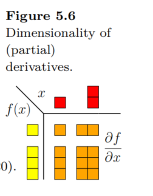

## 梯度

梯度指向了函数增长最快的方向。希望损失减少，需要沿着梯度负方向更新参数。即：

$$
\theta_{new} = \theta_{old} - \eta \nabla_\theta L
$$

当前参数 $\theta$ 包含了所有的参数，比如权重 W 和偏置 b。

### 微分和梯度的区别

微分是函数，梯度是向量。微分是函数在某一点的切线斜率，梯度是函数在某一点的切线斜率向量。

### 向量形式的多元函数

$$
\boldsymbol{f}(\boldsymbol{x}) = \left[ \begin{array}{c}
f_1(\boldsymbol{x}) \\
\vdots \\
f_m(\boldsymbol{x})
\end{array} \right] \in \mathbb{R}^m.
$$

接下来研究求微分。$\bold{x}$ 由多个变量组成，比如 $x_1, x_2, \cdots$。使用矩阵乘法的方式表达求梯度的过程。矩阵的一行代表统一函数对各个自变量求梯度的部分，一列代表不同函数对一自变量求梯度的部分。

$
\frac{\mathrm{d} \boldsymbol{f}(\boldsymbol{x})}{\mathrm{d} \boldsymbol{x}} = 
\begin{bmatrix}
\boxed{\frac{\partial \boldsymbol{f}(\boldsymbol{x})}{\partial x_1}} & \cdots & \boxed{\frac{\partial \boldsymbol{f}(\boldsymbol{x})}{\partial x_n}}
\end{bmatrix}
$

$ =
\begin{bmatrix}
\boxed{\frac{\partial f_1(\boldsymbol{x})}{\partial x_1}} & \cdots & \boxed{\frac{\partial f_1(\boldsymbol{x})}{\partial x_n}} \\
\vdots & \ddots & \vdots \\
\boxed{\frac{\partial f_m(\boldsymbol{x})}{\partial x_1}} & \cdots & \boxed{\frac{\partial f_m(\boldsymbol{x})}{\partial x_n}}
\end{bmatrix} \in \mathbb{R}^{m \times n}.
$

$ J = \nabla_{\boldsymbol{x}} \boldsymbol{f} = \frac{\mathrm{d} \boldsymbol{f}(\boldsymbol{x})}{\mathrm{d} \boldsymbol{x}} = 
\begin{bmatrix}
\frac{\partial \boldsymbol{f}(\boldsymbol{x})}{\partial x_1} & \cdots & \frac{\partial \boldsymbol{f}(\boldsymbol{x})}{\partial x_n}
\end{bmatrix}
$

$ =
\begin{bmatrix}
\frac{\partial f_1(\boldsymbol{x})}{\partial x_1} & \cdots & \frac{\partial f_1(\boldsymbol{x})}{\partial x_n} \\
\vdots & \ddots & \vdots \\
\frac{\partial f_m(\boldsymbol{x})}{\partial x_1} & \cdots & \frac{\partial f_m(\boldsymbol{x})}{\partial x_n}
\end{bmatrix},
$

$
\boldsymbol{x} = 
\begin{bmatrix}
x_1 \\ \vdots \\ x_n
\end{bmatrix}, \quad J(i, j) = \frac{\partial f_i}{\partial x_j}.
$

m 维的函数向量 $\boldsymbol{f}$ 对 n 维的自变量向量 $\boldsymbol{x}$ 求微分，得到 mxn 维的矩阵。



### Chain RUle

$$
\frac{\mathrm{d}h}{\mathrm{d}t} = \frac{\partial f}{\partial \boldsymbol{x}} \frac{\partial \boldsymbol{x}}{\partial t} = \left[ \frac{\partial f}{\partial x_1} \quad \frac{\partial f}{\partial x_2} \right] \begin{bmatrix} \frac{\partial x_1}{\partial t} \\ \frac{\partial x_2}{\partial t} \end{bmatrix}
$$

### 矩阵微分

函数由矩阵形式表示：

$$
\boldsymbol{f}(\boldsymbol{x}) = \boldsymbol{A}\boldsymbol{x}, \qquad \boldsymbol{f}(\boldsymbol{x}) \in \mathbb{R}^M, \quad \boldsymbol{A} \in \mathbb{R}^{M \times N}, \quad \boldsymbol{x} \in \mathbb{R}^N.
$$

可以看到，值域是 M 维的，可以分解为 f_i, i=1,2,...,M。而自变量有 N 个。

$$
f_i(\boldsymbol{x}) = \sum_{j=1}^N A_{ij} x_j \Rightarrow \frac{\partial f_i}{\partial x_j} = A_{ij}
$$

对向量 x 求微分。，需要具体分析每个 f_i 的成分，再求微分。

$$
\frac{\mathrm{d} \boldsymbol{f}}{\mathrm{d} \boldsymbol{x}} = \left[ \begin{array}{ccc}
\frac{\partial f_1}{\partial x_1} & \cdots & \frac{\partial f_1}{\partial x_N} \\
\vdots & \ddots & \vdots \\
\frac{\partial f_M}{\partial x_1} & \cdots & \frac{\partial f_M}{\partial x_N}
\end{array} \right] = \left[ \begin{array}{ccc}
A_{11} & \cdots & A_{1N} \\
\vdots & \ddots & \vdots \\
A_{M1} & \cdots & A_{MN}
\end{array} \right] = \boldsymbol{A} \in \mathbb{R}^{M \times N}.
$$

对矩阵求微分：Gradient of Vectors with Respect to Matrices。
$$
\frac{\mathrm{d} \boldsymbol{f}}{\mathrm{d} \boldsymbol{A}} \in \mathbb{R}^{M \times (M \times N)}
$$

$$
\frac{\mathrm{d} \boldsymbol{f}}{\mathrm{d} \boldsymbol{A}} = \left[ \begin{array}{c}
\frac{\partial f_1}{\partial \boldsymbol{A}} \\
\vdots \\
\frac{\partial f_M}{\partial \boldsymbol{A}}
\end{array} \right], \quad \frac{\partial f_i}{\partial \boldsymbol{A}} \in \mathbb{R}^{1 \times (M \times N)}
$$

而

$$
f_i = \sum_{j=1}^N A_{ij} x_j, \quad i = 1, \ldots, M, \\
\frac{\partial f_i}{\partial A_{iq}} = x_q
$$

研究完一维分量的场景后，推广到向量、矩阵的形式：

$$
\frac{\partial f_i}{\partial A_{i,:}} = x^\top \in \mathbb{R}^{1 \times N}
$$

$$
\frac{\partial f_i}{\partial A_{k \neq i,:}} = 0^\top \in \mathbb{R}^{1 \times N}
$$

仅当 f_i 对 A_i,: 求微分时不为 0，其余情况为 0。观察到 A 分量的规律后，可以推广到 A 为矩阵的情况：

$$
\frac{\partial f_i}{\partial \boldsymbol{A}} = 
\begin{bmatrix}
\boldsymbol{0}^\top \\
\vdots \\
\boldsymbol{0}^\top \\
\boldsymbol{x}^\top \\
\boldsymbol{0}^\top \\
\vdots \\
\boldsymbol{0}^\top
\end{bmatrix} \in \mathbb{R}^{1 \times (M \times N)}
$$

### 求微分规律

可以看到，研究方法是拆分每个函数向量来研究分量，随后再把自变量从向量形式拆分为分量，从而研究一维因变量对一维自变量求偏微分的场景。随后再推广自变量到向量的形式，得到向量形式的结果。再升维，推广到矩阵的形式，得到矩阵的结果。再把因变量也推广到向量的形式，最后得到向量对矩阵求到的形式。

求微分时，得到结果的张量中，自变量的维度即结果矩阵最后的维度，因变量（函数）部分则占前面的维度。比如，对 $\frac{\partial f_i}{\partial \boldsymbol{A}}, \boldsymbol{A} \in \mathbb{R}^{M \times N}$，得到结果的维度是 $\mathbb{R}^{1 \times (M \times N)}$，其中最后部分 $(M \times N)$ 代表自变量张量的维度，1 代表因变量的维度。

接下来可以推广到函数为矩阵的情况，比如函数是 $(N \times N)$ 维度的，自变量是 $(M \times N)$ 的。微分后，结果是一个张量，维度为 $(N \times N) \times (M \times N)$ 的。后面每自变量的张量的维度即每个自变量对应求微分的结果。

### 函数是矩阵，对自变量矩阵求微分

$$
f(\pmb{R}) = \pmb{R}^\top \pmb{R} =: K \in \mathbb{R}^{N \times N}
$$

$$
\frac{\mathrm{d} K_{pq}}{\mathrm{d} \pmb{R}} \in \mathbb{R}^{1 \times M \times N}
$$

$$
K_{pq} = r_p^\top r_q = \sum_{m=1}^M R_{mp} R_{mq}
$$

$$
\frac{\partial K_{pq}}{\partial R_{ij}} = \sum_{m=1}^M \frac{\partial}{\partial R_{ij}} (R_{mp} R_{mq}) = \partial_{pqij}
$$

$$
\partial_{pqij} = 
\begin{cases} 
R_{iq} & \text{if } j = p, p \neq q \\
R_{ip} & \text{if } j = q, p \neq q \\
2R_{iq} & \text{if } j = p, p = q \\
0 & \text{otherwise}
\end{cases}
$$

## 计算梯度

模型通常由成百上千简单函数层层嵌套，错综复杂。如何高效计算梯度？可以通过链式法则，不断求微分，得到每个参数的梯度公式。但是复杂度十分高，维护困难。应该使用自动微分方法。

### 自动微分（Automatic Differentiation, AD）

任何复杂的数值计算构成，可以分解为基本运算（加减乘除，指数，对数，三角函数等）组合。根据基本运算求到法则，使用链式法则，自动地、精准地计算复杂函数的导数。

AD 主要有两种模式：
- 前向模式（Forward Mode）：与计算值的方向相同，从输入到输出，逐步计算中间变量和导数。
- 反向模式（Reverse Mode）：完整的前向计算后，得到最终输出值（通常是 Loss 函数的值），从最终输出开始，反向地、逐层地计算每个中间变量和输入变量对最终输出的梯度。

反向模式的自动微分计算效率远远高于前向模式。通常，深度学习模型的输入有很多维度，但是输出通常维度较小，甚至是标量。比如最终输出是 Loss 函数。反向模式只需一次前向计算和一次反向计算来求梯度，计计算复杂度与原始函数计算相当。如果是前向模式，输入维度高时，每个输入维度需要一次完整的计算，才可求得梯度。

反向模式 AD 是反向传播算法的数学本质，其中蕴含了动态规划算法思想。

### 计算图：分解复杂函数

比如，$L = (wx + b - y)^2$，可以分解为：
- a = wx
- p = a + b
- d = p - y
- L = d^2

计算可以看做一个有向无环图，称为计算图。节点代表变量（输入、中间结果、输出），边代表基本运算（操作）。


神经网络的前向传播过程，也可以表示为如此的计算图。深度学习框架，在执行模型代码时，会动态地、或静态地构建如此的计算图。

### 链式法则的优雅应用

如何求 L 对某个输入的导数？比如 w。可以使用链式法则，沿着计算图反向传播梯度信息。核心思想：求解最终输出（损失） L 对计算图中任何节点 u 的偏导数 $\frac{\partial L}{\partial u}$，具体步骤如下：若 u 通过操作 f 生成了节点 v，有 v = f(u,...)，v 为后续节点。根据链式法则，有：

$$
\frac{\partial L}{\partial u} = \frac{\partial L}{\partial v} \cdot \frac{\partial v}{\partial u}
$$

如果节点 u 直接参与了后续多个节点的生成，看做 u 与下一层 v_i 的关系。采用多元链式法则：

$$
\frac{\partial L}{\partial u} = \sum_{i=1}^k \frac{\partial L}{\partial v_i} \cdot \frac{\partial v_i}{\partial u}
$$

### 反向传播 AD 执行步骤

#### 前向计算

按照计算图拓扑顺序，计算每个节点的值，并存储中间结果。以损失函数为例，假设 w=2，x=3，b=1，y=5：


灰色部分，比如 a, p, d, L 等节点是虚拟的，由框架来自动生成和保存。

#### 反向传播

初始化：由于最终输出的 L 对自身导数为 1，有 $\frac{\partial L}{\partial L}=1$，从此节点开始反向传播，计算梯度。

反向遍历：按照计算图的逆拓扑顺序（输出到输入），计算每个阶段 u 对最终输出 L 的梯度 $\frac{\partial L}{\partial u}$。需要注意：
- 所有 u 的直接后续节点 $v_i$ 的梯度为 $\frac{\partial L}{\partial v_i}$ 在前一步反向传播过程计算出来了（由 $\frac{\partial L}{\partial u}$ 开始）。
- 当前操作（从 $u$ 到 $v_i$）的局部梯度 $\frac{\partial v_i}{\partial u}$ 根据基本运算类型来计算。
  
梯度累积：反向遍历后，有了直接后续节点的梯度，当前操作的局部梯度，使用多元链式法则计算 L 对 u 的梯度，并存储起来。$\frac{\partial L}{\partial u} = \sum_i \frac{\partial L}{\partial v_i} \cdot \frac{\partial v_i}{\partial u}$，并存储起来供下轮遍历使用。


比如，$L=d^2, \frac{\partial L}{\partial d} = 2 \cdot d = 2 * 2 = 4$

### 从标量到向量

神经网络含有大量参数，当处理矩阵时，链式法则依然使用，形式转变为雅可比矩阵的形式。

假设有函数组合 $z=f(y), y=g(x), x \in \mathbb{R}^n, y \in \mathbb{R}^m, z \in \mathbb{R}^p$，链式法则的向量形式：

$$
\frac{\partial z}{\partial x} = \frac{\partial z}{\partial y} \cdot \frac{\partial y}{\partial x}
$$

这里，$\frac{\partial z}{\partial y}$ 是一个 $p \times m$ 的雅可比矩阵，$J_f = \begin{bmatrix} \frac{\partial z_i}{\partial y_j} \end{bmatrix}$。 $\frac{\partial y}{\partial x}$ 是一个 $m \times n$ 的雅可比矩阵，$J_g = \begin{bmatrix} \frac{\partial y_j}{\partial x_k} \end{bmatrix}$。 $\frac{\partial z}{\partial x}$ 是一个 $p \times n$ 的雅可比矩阵，$J_{f \circ g} = \begin{bmatrix} \frac{\partial z_i}{\partial x_k} \end{bmatrix}$。

要特别注意矩阵或向量的形状。在反向传播中，我们通常计算的是损失函数 $L$ (标量, $p = 1$) 对某一层参数 $W$ (矩阵) 或激活 $y$ (向量) 的梯度。例如：

$$
\nabla_y L = \left( \frac{\partial L}{\partial y} \right)^T
$$

当我们说「梯度」这个词时，可能指的是行向量 $\frac{\partial L}{\partial y}$ （形状是 $1 \times m$），也可能指的是列向量 $\nabla_y L$ （形状是 $m \times 1$），取决于符号表示和上下文场景。其中，$\frac{\partial L}{\partial y}$ 形状为 $1 \times m$，表示对 $y$ 的偏导数，雅克比矩阵特例（函数仅有单个），通常用于反向传播中。$\nabla_y L$ 形状为 $m \times 1$，表示梯度向量，通常用于优化算法中。

记住这两个符号约定俗成的形状：

| 符号表示                        | 数学含义                           | 默认形状 | 使用场景               |
| ------------------------------- | ---------------------------------- | -------- | ---------------------- |
| $\nabla_y L$                    | 梯度向量                           | 列向量   | 优化算法、物理建模     |
| $\frac{\partial L}{\partial y}$ | 雅可比矩阵的特例（标量对向量求导） | 行向量   | 反向传播、链式法则计算 |

反向传播的核心计算，可以看作是雅可比矩阵 - 向量的积 (Jacobian-Vector Product, JVP) 或向量 - 雅可比矩阵的积 (Vector-Jacobian Product, VJP)。

- **前向模式 AD** 本质上是在计算 JVP：$\left( \frac{\partial y}{\partial x} \right) v$
  - 其中 $v$ 是输入扰动方向（轮流选择坐标系的标准基向量）。相当于在 $n$ 维输入空间中，依次沿着每个坐标轴方向探测导数。
  - 前向模式不是在一次性计算完整的雅可比矩阵，需要 $n$ 次前向传播才能得到完整雅可比矩阵。

- **反向模式 AD** 本质上是在计算 VJP：$u^T \left( \frac{\partial y}{\partial x} \right)$
  - 其中 $u^T$ 是后续传来的梯度（行向量），即 $\frac{\partial z}{\partial y}$。对于损失函数 $L$ (标量)，这简化为 $\left( \frac{\partial L}{\partial y} \right) \left( \frac{\partial y}{\partial x} \right)$，再次提醒其中 $\frac{\partial L}{\partial y}$ 形状是 $1 \times m$ 的

在反向模式 AD 中，如果我们想要的是行向量（理论推导常用），参考下面这个公式（行向量梯度右乘雅克比矩阵）：

$$
\underbrace{\frac{\partial L}{\partial x}}_{1 \times n} = \underbrace{\frac{\partial L}{\partial y}}_{1 \times m} \cdot \underbrace{\frac{\partial y}{\partial x}}_{m \times n}
$$

如果最终要的是列向量（工程实现常用），那么参考这个公式（列向量梯度左乘雅可比矩阵的转置）：

$$
\underbrace{\nabla_x L}_{n \times 1} = \left( \underbrace{\frac{\partial y}{\partial x}}_{n \times m} \right)^T \cdot \underbrace{\nabla_y L}_{m \times 1}
$$

## PyTorch 中的自动微分

torch.Tensor 能够追踪操作和计算梯度，设置 requires_grad 属性为 True 即可。

```py
import torch

# 创建需要计算梯度的张量 (通常是模型参数)
w = torch.tensor([2.0], requires_grad=True)
b = torch.tensor([1.0], requires_grad=True)

# 输入数据 (通常不需要计算对输入的梯度)
x = torch.tensor([3.0])
y_hat = torch.tensor([5.0]) # 假设这是目标值

# 前向计算 (PyTorch 会自动构建计算图)
a = w * x       # 操作 '*' 被记录
p = a + b       # 操作 '+' 被记录
d = p - y_hat   # 操作 '-' 被记录
L = d.pow(2)    # 操作 'pow' 被记录 (这里用 .pow(2) 代替 **2)

print(f"Intermediate 'a': {a}")
print(f"Intermediate 'p': {p}")
print(f"Intermediate 'd': {d}")
print(f"Final Loss 'L': {L}")

# L 现在是一个包含计算图信息的标量 Tensor
# L = (w*x + b - y_hat)^2

# 现在，触发反向传播
# 因为 L 是标量，可以直接调用 .backward()
L.backward()

# 梯度会自动累积到 .grad 属性中
print(f"Gradient dL/dw: {w.grad}") # 对应我们之前手动计算的 dL/dw
print(f"Gradient dL/db: {b.grad}") # 对应我们之前手动计算的 dL/db

# 对于 x 和 y_hat，因为 requires_grad=False (默认)，所以没有梯度
# print(x.grad) # 会返回 None
# print(y_hat.grad) # 会返回 None
```

注意，叶子节点 (Leaf Nodes)， 只有 requires_grad=True 且由用户直接创建（而非运算结果）的 Tensor（即计算图的叶子节点，通常是模型参数）的 .grad 才会被保留下来。中间节点的梯度在反向传播过程中计算出来后，默认会被释放以节省内存。比如 x，没有要求梯度。

### 优化器

梯度是累加的，如果训练多次调用 backward()，不清空梯度，新的梯度会累加到旧梯度上。需要在每次迭代前调用优化器来清空梯度：`optimizer.grad.zero_()`。随后再反向传播计算新梯度 `L.backward()`。最后，参数更新：`optimizer.step()`。

## Ref and Tag

【深度学习数学基础 15】微分几何与自动微分 - tomsheep的文章 - 知乎
https://zhuanlan.zhihu.com/p/1893763010419458911