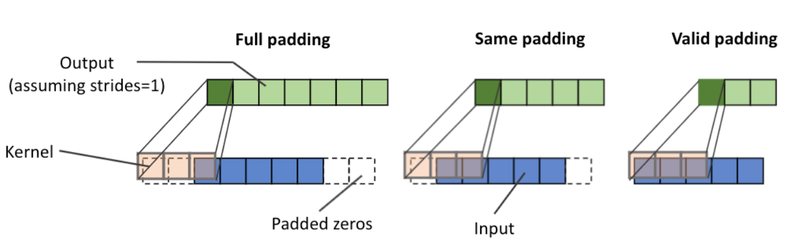
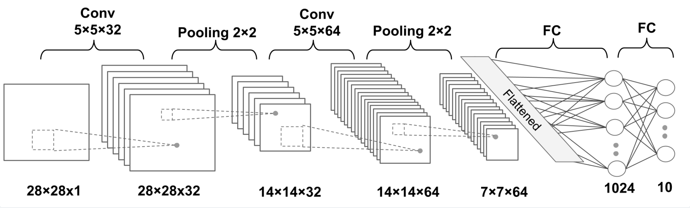

CNN 用于提取特征。定义 filter 或 kernel 为权重张量，滑动式地与输入进行卷积操作。卷积核移动的补偿称为 stride。根据 stride 选择，还有卷积核开始区域选择，是否对原输入 x 进行 zero-padding 或简称 padding。

定义上的卷积方向，是从输入的 x 末尾方向往前遍历，kernel 则相反，从前往后遍历，各取对应元素相乘并求和。即 $y = x * w \rightarrow y[i] = \sum_{k=-\infty}^{+\infty} x[i - k] w[k]$。为了方便实现，现在常用的等价方式是 [cross-correlation](https://en.wikipedia.org/wiki/Cross-correlation) ，与卷积类似的操作，但是不翻转，即 $y = x \star w \rightarrow y[i] = \sum_{k=-\infty}^{+\infty} x[i + k] w[k]$。

二维 cross-correlation 计算输入特征图 $X$ 高和宽为 $(H_{in},W_{in})$，卷积核 $W$ 高和宽为 $(H_{kernel},W_{kernel})$，输出二维的特征图中，每个位置 $(h,w)$ 计算如下：

$$
output[h, w] = bias + ∑_{r=0}^{H_{\text{kernel}}-1} ∑_{c=0}^{W_{\text{kernel}}-1} X[h + r - \text{padding}, w + c - \text{padding}] * W[r, c]
$$

$$
H_{\text{out}} = floor((H_{\text{in}} + 2 * \text{padding} - H_{\text{kernel}}) / \text{stride}) + 1 \\
W_{\text{out}} = floor((W_{\text{in}} + 2 * \text{padding} - W_{\text{kernel}}) / \text{stride}) + 1
$$

其中：
- $h,w$ 是输出特征图高和宽

使用卷积核滑动地提取特征，所有看到求和符号是遍历卷积核的内容。如果没有 padding，卷积核对应左上角的值是最终结果所在位置。展开如下：

$$
output[h, w] = bias \\
              + X[h - \text{padding}, w - \text{padding}] * W[0, 0] \\
              + X[h - \text{padding}, w - \text{padding} + 1] * W[0, 1] \\
              + ... \\
              + X[h - \text{padding} + H_{\text{kernel}} - 1, w - \text{padding} + W_{\text{kernel}} - 1] * W[H_{\text{kernel}} - 1, W_{\text{kernel}} - 1]
$$

padding 有三种模式:
- full：从 kernel 只对应第一个输入元素开始，padding 数量为 m - 1，m 为 kernel 大小。
- same：最常见选择，保证了输出与输入的 shape 一致。
- valid：不做 padding



通常，使用快速傅里叶变换完成卷积操作，高效实现算法。此外，kernel size 常为 1x1, 3x3, 5x5.

## PyTorch 的 API

### Conv1d

torch.nn.Conv1d(in_channels, out_channels, kernel_size, stride=1, padding=0, dilation=1, groups=1, bias=True, padding_mode='zeros', device=None, dtype=None)

输入形状：(N, in_channels, L_in)。输出形状 (N, out_channel, L_out)。N 即 batch_size。L_in 是输入序列长度，通常是 sequence_length。而 L_out 可能因为 padding 选择而不同。

$$
L_{\text{out}} = \left\lfloor \frac{L_{\text{in}} + 2 \times \text{padding} - \text{dilation} \times (\text{kernel\_size} - 1) - 1}{\text{stride}} + 1 \right\rfloor
$$

所以，除了指定前三个参数，后面使用默认的 stride=1, padding=0, dilation=1，会使得 L_out 为 L_in + 1 - kernel_size。

$$
\text{out}(N_i, C_{\text{out}_j}) = \text{bias}(C_{\text{out}_j}) + \sum_{k=0}^{C_{\text{in}}-1} \text{weight}(C_{\text{out}_j}, k) \star \text{input}(N_i, k)
$$

groups 通常不指定，使用 1。于是权重矩阵形状为 (out_channels, in_channels, kernel_size)。

### Conv2d

```py
torch.nn.Conv2d(in_channels, out_channels, kernel_size, stride=1, padding=0,
    dilation=1, groups=1, bias=True, padding_mode='zeros', device=None, dtype=None)
```

通常指定 in_channels, out_channels, kernel_size 和 stride。输入形状为 (N, C_in, H_in, W_in)，输出形状为 (N, C_out, H_out, W_out)。

groups 通常不指定，使用 1。于是权重矩阵 weight 形状为 (out_channels, in_channels, kernel_size[0], kernel_size[1]), bias 形状为 (out_channels,)。

$$
H_{\text{out}} = \left\lfloor \frac{H_{\text{in}} + 2 \times \text{padding}[0] - \text{dilation}[0] \times (\text{kernel\_size}[0] - 1) - 1}{\text{stride}[0]} + 1 \right\rfloor
$$

$$
W_{\text{out}} = \left\lfloor \frac{W_{\text{in}} + 2 \times \text{padding}[1] - \text{dilation}[1] \times (\text{kernel\_size}[1] - 1) - 1}{\text{stride}[1]} + 1 \right\rfloor
$$

- 通常使用默认的 padding=0 和 dialation=0，从而 H_out 为 (H_in - kernel_size / stride) + 1。W_out 同理。
- 通常选择 kernel_size == stride，比如 ViT 常选的 14，从而有 H_out == H_in // kernel_size。常用于提取 patch 信息。典型例子是 ViT 的工作。首先使用 nn.Conv2d，提取每个 patch 的特征，且 kernel_size 即 patch_size。但是 CLIPVisionEmbeddings 使用的 nn.Conv2d 指定了 bias=False。另一个例子，如：

```py
# 使用随机初始化的 ViT 处理输入为 (N, 1, H, W) 的掩码，但是输入没有用 cls_token。
        self.mask_process_net = nn.ModuleDict({
            # Convert 1-channel mask to patch embeddings
            'patch_embed': nn.Sequential(
                # Input shape: (B, 1, H, W)
                # nn.Conv2d output shape (B, head_feature_dim, H//patch_size, W//patch_size)
                nn.Conv2d(1, head_feature_dim, kernel_size=14, stride=14),
                nn.Flatten(2),  # Flatten H,W into patches
                Rearrange('b c n -> b n c'),
                nn.LayerNorm(head_feature_dim),
            ),
            # Process patch sequence with transformer blocks
            'transformer': nn.TransformerEncoder(
                encoder_layer=nn.TransformerEncoderLayer(
                    d_model=head_feature_dim,
                    nhead=8,
                    dim_feedforward=head_feature_dim*4,
                    dropout=0.0,
                    activation=nn.GELU(),
                    batch_first=True,
                    norm_first=True
                ),
                num_layers=4
            )
        })
```

$$
\text{out}(N_i, C_{\text{out}_j}) = \text{bias}(C_{\text{out}_j}) + \sum_{k=0}^{C_{\text{in}}-1} \text{weight}(C_{\text{out}_j}, k) \star \text{input}(N_i, k)
$$

对于每个批次，每个输出频道的特征图，计算如上式。kernel，也就是 weight，特定的输出 channel 对应的所有输入 channel 个两维的 kernel，用它们与输入的特定批次，对应的所有输入 channel 的二维输入，计算输入 channel 次 cross-correlation，得到输入 channel 张二维特征图。最后相加，再与 bias 相加，得到最后的特定批次特征图。

二维的 cross-correlation 计算与卷积类似，但是不翻转。

## 池化层

传统池化层是不可学习的参数，不会增加和减少 channel，但会减少特征图的维度。

典型的多层 CNN 结构如下。



第一层卷积有 32 个输出的 feature map。

## Ref and Tag