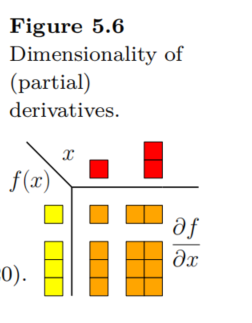
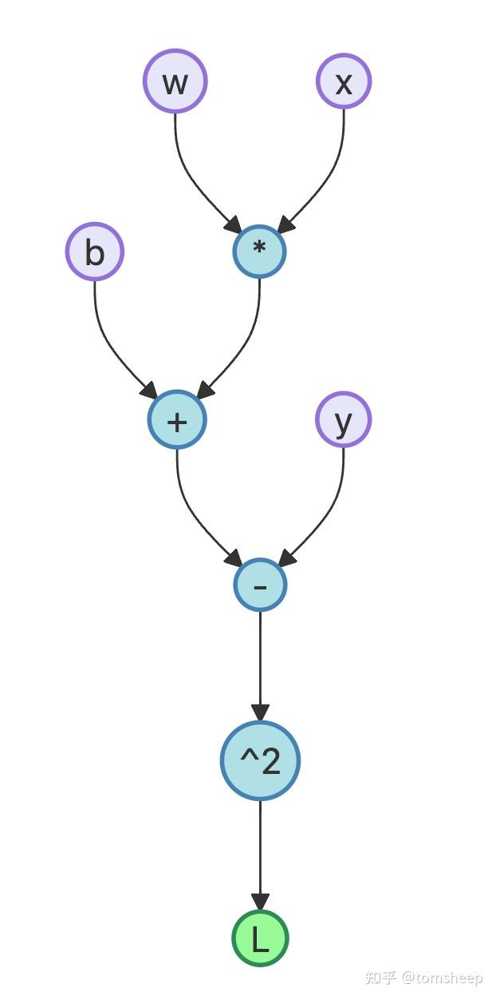

## 梯度

梯度指向了函数增长最快的方向。希望损失减少，需要沿着梯度负方向更新参数。即：

$$
\theta_{new} = \theta_{old} - \eta \nabla_\theta L
$$

当前参数 $\theta$ 包含了所有的参数，比如权重 W 和偏置 b。

### 向量形式的多元函数

$$
\boldsymbol{f}(\boldsymbol{x}) = \left[ \begin{array}{c}
f_1(\boldsymbol{x}) \\
\vdots \\
f_m(\boldsymbol{x})
\end{array} \right] \in \mathbb{R}^m.
$$

接下来研究求微分。$\bold{x}$ 由多个变量组成，比如 $x_1, x_2, \cdots$。使用矩阵乘法的方式表达求梯度的过程。矩阵的一行代表统一函数对各个自变量求梯度的部分，一列代表不同函数对一自变量求梯度的部分。

$$
\frac{\mathrm{d} \boldsymbol{f}(\boldsymbol{x})}{\mathrm{d} \boldsymbol{x}} = 
\begin{bmatrix}
\boxed{\frac{\partial \boldsymbol{f}(\boldsymbol{x})}{\partial x_1}} & \cdots & \boxed{\frac{\partial \boldsymbol{f}(\boldsymbol{x})}{\partial x_n}}
\end{bmatrix}
$$

$$
=
\begin{bmatrix}
\boxed{\frac{\partial f_1(\boldsymbol{x})}{\partial x_1}} & \cdots & \boxed{\frac{\partial f_1(\boldsymbol{x})}{\partial x_n}} \\
\vdots & \ddots & \vdots \\
\boxed{\frac{\partial f_m(\boldsymbol{x})}{\partial x_1}} & \cdots & \boxed{\frac{\partial f_m(\boldsymbol{x})}{\partial x_n}}
\end{bmatrix} \in \mathbb{R}^{m \times n}.
$$

$$
J = \nabla_{\boldsymbol{x}} \boldsymbol{f} = \frac{\mathrm{d} \boldsymbol{f}(\boldsymbol{x})}{\mathrm{d} \boldsymbol{x}} = 
\begin{bmatrix}
\frac{\partial \boldsymbol{f}(\boldsymbol{x})}{\partial x_1} & \cdots & \frac{\partial \boldsymbol{f}(\boldsymbol{x})}{\partial x_n}
\end{bmatrix}
$$

$$
=
\begin{bmatrix}
\frac{\partial f_1(\boldsymbol{x})}{\partial x_1} & \cdots & \frac{\partial f_1(\boldsymbol{x})}{\partial x_n} \\
\vdots & \ddots & \vdots \\
\frac{\partial f_m(\boldsymbol{x})}{\partial x_1} & \cdots & \frac{\partial f_m(\boldsymbol{x})}{\partial x_n}
\end{bmatrix},
$$

$$
\boldsymbol{x} = 
\begin{bmatrix}
x_1 \\ \vdots \\ x_n
\end{bmatrix}, \quad J(i, j) = \frac{\partial f_i}{\partial x_j}.
$$

m 维的函数向量 $\boldsymbol{f}$ 对 n 维的自变量向量 $\boldsymbol{x}$ 求微分，得到 mxn 维的矩阵。

### Chain RUle

$$
\frac{\mathrm{d}h}{\mathrm{d}t} = \frac{\partial f}{\partial \boldsymbol{x}} \frac{\partial \boldsymbol{x}}{\partial t} = \left[ \frac{\partial f}{\partial x_1} \quad \frac{\partial f}{\partial x_2} \right] \begin{bmatrix} \frac{\partial x_1}{\partial t} \\ \frac{\partial x_2}{\partial t} \end{bmatrix}
$$

### 矩阵微分

函数由矩阵形式表示：

$$
\boldsymbol{f}(\boldsymbol{x}) = \boldsymbol{A}\boldsymbol{x}, \qquad \boldsymbol{f}(\boldsymbol{x}) \in \mathbb{R}^M, \quad \boldsymbol{A} \in \mathbb{R}^{M \times N}, \quad \boldsymbol{x} \in \mathbb{R}^N.
$$

可以看到，值域是 M 维的，可以分解为 f_i, i=1,2,...,M。而自变量有 N 个。

$$
f_i(\boldsymbol{x}) = \sum_{j=1}^N A_{ij} x_j \Rightarrow \frac{\partial f_i}{\partial x_j} = A_{ij}
$$

对向量 x 求微分。，需要具体分析每个 f_i 的成分，再求微分。

$$
\frac{\mathrm{d} \boldsymbol{f}}{\mathrm{d} \boldsymbol{x}} = \left[ \begin{array}{ccc}
\frac{\partial f_1}{\partial x_1} & \cdots & \frac{\partial f_1}{\partial x_N} \\
\vdots & \ddots & \vdots \\
\frac{\partial f_M}{\partial x_1} & \cdots & \frac{\partial f_M}{\partial x_N}
\end{array} \right] = \left[ \begin{array}{ccc}
A_{11} & \cdots & A_{1N} \\
\vdots & \ddots & \vdots \\
A_{M1} & \cdots & A_{MN}
\end{array} \right] = \boldsymbol{A} \in \mathbb{R}^{M \times N}.
$$

对矩阵求微分：Gradient of Vectors with Respect to Matrices。
$$
\frac{\mathrm{d} \boldsymbol{f}}{\mathrm{d} \boldsymbol{A}} \in \mathbb{R}^{M \times (M \times N)}
$$

$$
\frac{\mathrm{d} \boldsymbol{f}}{\mathrm{d} \boldsymbol{A}} = \left[ \begin{array}{c}
\frac{\partial f_1}{\partial \boldsymbol{A}} \\
\vdots \\
\frac{\partial f_M}{\partial \boldsymbol{A}}
\end{array} \right], \quad \frac{\partial f_i}{\partial \boldsymbol{A}} \in \mathbb{R}^{1 \times (M \times N)}
$$

而

$$
f_i = \sum_{j=1}^N A_{ij} x_j, \quad i = 1, \ldots, M, \\
\frac{\partial f_i}{\partial A_{iq}} = x_q
$$

研究完一维分量的场景后，推广到向量、矩阵的形式：

$$
\frac{\partial f_i}{\partial A_{i,:}} = x^\top \in \mathbb{R}^{1 \times N}
$$

$$
\frac{\partial f_i}{\partial A_{k \neq i,:}} = 0^\top \in \mathbb{R}^{1 \times N}
$$

仅当 f_i 对 A_i,: 求微分时不为 0，其余情况为 0。观察到 A 分量的规律后，可以推广到 A 为矩阵的情况：

$$
\frac{\partial f_i}{\partial \boldsymbol{A}} = 
\begin{bmatrix}
\boldsymbol{0}^\top \\
\vdots \\
\boldsymbol{0}^\top \\
\boldsymbol{x}^\top \\
\boldsymbol{0}^\top \\
\vdots \\
\boldsymbol{0}^\top
\end{bmatrix} \in \mathbb{R}^{1 \times (M \times N)}
$$

### 求微分规律

可以看到，研究方法是拆分每个函数向量来研究分量，随后再把自变量从向量形式拆分为分量，从而研究一维因变量对一维自变量求偏微分的场景。随后再推广自变量到向量的形式，得到向量形式的结果。再升维，推广到矩阵的形式，得到矩阵的结果。再把因变量也推广到向量的形式，最后得到向量对矩阵求到的形式。

求微分时，得到结果的张量中，自变量的维度即结果矩阵最后的维度，因变量（函数）部分则占前面的维度。比如，对 $\frac{\partial f_i}{\partial \boldsymbol{A}}, \boldsymbol{A} \in \mathbb{R}^{M \times N}$，得到结果的维度是 $\mathbb{R}^{1 \times (M \times N)}$，其中最后部分 $(M \times N)$ 代表自变量张量的维度，1 代表因变量的维度。

接下来可以推广到函数为矩阵的情况，比如函数是 $(N \times N)$ 维度的，自变量是 $(M \times N)$ 的。微分后，结果是一个张量，维度为 $(N \times N) \times (M \times N)$ 的。后面每自变量的张量的维度即每个自变量对应求微分的结果。

### 函数是矩阵，对自变量矩阵求微分

$$
f(\pmb{R}) = \pmb{R}^\top \pmb{R} =: K \in \mathbb{R}^{N \times N}
$$

$$
\frac{\mathrm{d} K_{pq}}{\mathrm{d} \pmb{R}} \in \mathbb{R}^{1 \times M \times N}
$$

$$
K_{pq} = r_p^\top r_q = \sum_{m=1}^M R_{mp} R_{mq}
$$

$$
\frac{\partial K_{pq}}{\partial R_{ij}} = \sum_{m=1}^M \frac{\partial}{\partial R_{ij}} (R_{mp} R_{mq}) = \partial_{pqij}
$$

$$
\partial_{pqij} = 
\begin{cases} 
R_{iq} & \text{if } j = p, p \neq q \\
R_{ip} & \text{if } j = q, p \neq q \\
2R_{iq} & \text{if } j = p, p = q \\
0 & \text{otherwise}
\end{cases}
$$

## 计算梯度

模型通常由成百上千简单函数层层嵌套，错综复杂。如何高效计算梯度？可以通过链式法则，不断求微分，得到每个参数的梯度公式。但是复杂度十分高，维护困难。应该使用自动微分方法。

### 自动微分（Automatic Differentiation, AD）

任何复杂的数值计算构成，可以分解为基本运算（加减乘除，指数，对数，三角函数等）组合。根据基本运算求到法则，使用链式法则，自动地、精准地计算复杂函数的导数。

AD 主要有两种模式：
- 前向模式（Forward Mode）：与计算值的方向相同，从输入到输出，逐步计算中间变量和导数。
- 反向模式（Reverse Mode）：完整的前向计算后，得到最终输出值（通常是 Loss 函数的值），从最终输出开始，反向地、逐层地计算每个中间变量和输入变量对最终输出的梯度。

反向模式的自动微分计算效率远远高于前向模式。通常，深度学习模型的输入有很多维度，但是输出通常维度较小，甚至是标量。比如最终输出是 Loss 函数。反向模式只需一次前向计算和一次反向计算来求梯度，计计算复杂度与原始函数计算相当。如果是前向模式，输入维度高时，每个输入维度需要一次完整的计算，才可求得梯度。

反向模式 AD 是反向传播算法的数学本质，其中蕴含了动态规划算法思想。

### 计算图：分解复杂函数

比如，$L = (wx + b - y)^2$，可以分解为：
- a = wx
- p = a + b
- d = p - y
- L = d^2

计算可以看做一个有向无环图，称为计算图。节点代表变量（输入、中间结果、输出），边代表基本运算（操作）。

神经网络的前向传播过程，也可以表示为如此的计算图。深度学习框架，在执行模型代码时，会动态地、或静态地构建如此的计算图。

### 链式法则的优雅应用

如何求 L 对某个输入的导数？比如 w。可以使用链式法则，沿着计算图反向传播梯度信息。核心思想是，对计算图的每个节点 u，

## 反向传播和自动微分

以如下函数为例：

$$
f(x) = \sqrt{x^2 + \exp(x^2)} + \cos\left(x^2 + \exp(x^2)\right)
$$

$$
\frac{\mathrm{d}f}{\mathrm{d}x} = \frac{2x + 2x \exp(x^2)}{2\sqrt{x^2 + \exp(x^2)}} - \sin(x^2 + \exp(x^2))(2x + 2x \exp(x^2)) \\
= 2x \left( \frac{1}{2\sqrt{x^2 + \exp(x^2)}} - \sin(x^2 + \exp(x^2)) \right) (1 + \exp(x^2))
$$

最后，通常是在 loss 函数求出结果后，开始计算反向传播，更新梯度。loss 函数通常是计算图汇中最后一个节点。以 mlp 和 mse loss 为例：

$$
l(\pmb{w}, \pmb{b}) = \frac{1}{n} \sum_{i=1}^{n} \frac{1}{t} \sum_{j=1}^{t} \left( y_j^{[i]} - a_j^{(\text{out})[i]} \right)^2
$$

下标 $i$ 代表训练集中第 $i$ 个样本。$t$ 代表最后模型最后一层网络的输出数量。比如多类别分类汇总输出 $t$ 维的向量，对应 $t$ 个目标的 one-hot 编码。；目标是使得损失函数尽可能小。

$\pmb{w}, \pmb{b}$ 代表模型参数。最后一层参数中，一共有 t 个 weight 和 bias，记最后一层的第 j 个权重参数为 $w_{j,l}^{(l)}$，有求微分得：

$$
\begin{align*}
\mathbf{z}^{(h)} &= \mathbf{x}^{(\text{in})}\mathbf{w}^{(h)t} + \mathbf{b}^{(h)} & \text{(net input of the hidden layer)} \\
\mathbf{a}^{(h)} &= \sigma\left(\mathbf{z}^{(h)}\right) & \text{(activation of the hidden layer)} \\
\mathbf{z}^{(\text{out})} &= \mathbf{a}^{(h)}\mathbf{w}^{(\text{out})t} + \mathbf{b}^{(\text{out})} & \text{(net input of the output layer)} \\
\mathbf{a}^{(\text{out})} &= \sigma\left(\mathbf{z}^{(\text{out})}\right) & \text{(activation of the output layer)}
\end{align*}
$$

## Ref and Tag

【深度学习数学基础 15】微分几何与自动微分 - tomsheep的文章 - 知乎
https://zhuanlan.zhihu.com/p/1893763010419458911