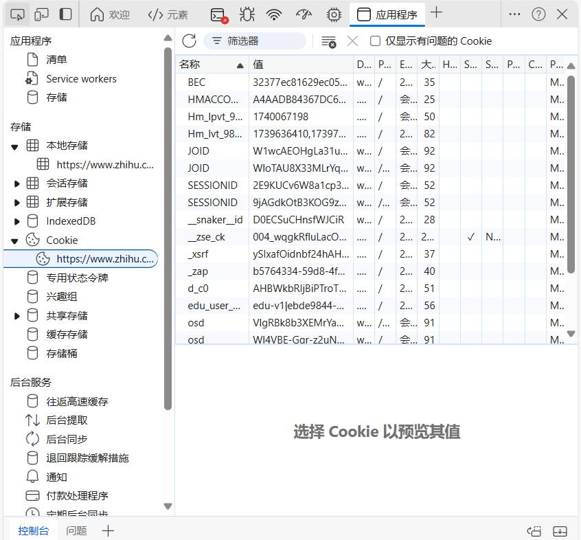

## requests 请求库
```py
r = requests.get(url)
```

## httpx
requests 不支持 HTTP/2.0，有些网站强制使用 HTTP/2.0。httpx 库可以处理，并且与 requests 的 API 有很多相似之处。同时支持 async。

```sh
pip install 'httpx[http2]'
```
注意，`[http2]`必须指定，否则不支持 HTTP/2.0。

```py
headers = {
    "User-Agent": "Mozilla/5.0 (Windows NT 10.0; Win64; x64) AppleWebKit/537.36 (KHTML, like Gecko) Chrome/133.0.0.0 Safari/537.36"
}
response = httpx.get('https://www.baidu.com', headers=headers)

print(response.status_code)
print(response.headers)
print(response.text)
print(response.content) # 二进制内容
print(response.json) # 转换 JSON 对象
```

请求方法：
```py
httpx.get(url, params={'name': 'germey'})
httpx.put(url, data={'name': 'germey'})
```

默认不会使用 HTTP/2.0，需要指定。
```py
client = httpx.Client(http2=True)
response = client.get(url)
```

### Client 对象
Client 对象中，官方推荐使用为 with as 语句，自动调用 close() 方法。给对象传入的参数，所有发起的请求都会默认带上：
```py
with httpx.Client(headers=headers) as client:
    response = client.get(url) # 等同带上了 headers 请求。
    ...
```

### 异步请求
```py
async def fetch(url):
    async with httpx.AsyncClient(http2=True) as client:
        response = await client.get(url)
        ...

if __name__ == "__main__":
    url = "..."
    asyncio.get_event_loop().run_until_complete(fetch(url))
```

## Seesion 和 Cookie
浏览网站时，有时候需要登录后才能访问。登录后可以多次连续访问网站，不再重新登录。甚至有些网站打开浏览器时便自动登录，长时间有效。

HTTP 是无状态的，对事务处理没有记忆。服务器处理请求后，如果后续客户端请求需要处理前面信息，那么产生了重复，这是不必要的。用于保持 HTTP 连接状态的两种技术：Session 和 Cookie。Session 在服务端，保存用户的 Session 信息；Cookie 在客户端，下次访问相同页面时会自动附带，发送给服务器，服务器会甄别用户，不用再输入账号密码登信息。

Session 对象存储特定用户的属性和配置信息。用户在应用程序页面跳转时，Session 对象中的变量保持。用户请求时，如果没有则自动创建；Session 过期或放弃后，服务器终止此 Session。

Cookie 给服务器提供了鉴别用户的依据，从而 Session 跟踪存储本地终端的数据。

### 维持 Session
如何利用 Cookie 保持状态？客户端第一次请求服务器，服务器返回的响应头带有 Set-Cookie 字段给客户端，用于标记用户。客户端浏览器会保存此 Cookie，下次请求时放到请求头一并提交服务器。Cookie 包含着 Session ID 相关信息。


在浏览器开发者工具-Application-Storage-Cookie 中，可以看到 Cookie 条目，伴随这些属性。

会话 Cookie 放置在浏览器，关闭浏览器即失效；持久 Cookie 保存在硬盘，下次继续使用。没有严格之分，只是 Max-Age 或 Expire 决定 Cookie 失效时间。一些持久化登录只是把有效时间设置很长。

一般使用 selenium.webdriver 登录，获取 cookies 后用 httpx 登录。

## Pyppeteer
比 selenium 更方便的工具，不需要安装驱动等工具。`pip install pyppeteer`即可。

```py
import asyncio
from pyppeteer import launch
from pyquery import PyQuery as pq
 
async def main():
    browser = await launch()
    page = await browser.newPage()
    await page.goto('http://quotes.toscrape.com/js/')
    doc = pq(await page.content())
    print('Quotes:', doc('.quote').length)
    await browser.close()
 
asyncio.get_event_loop().run_until_complete(main())
```