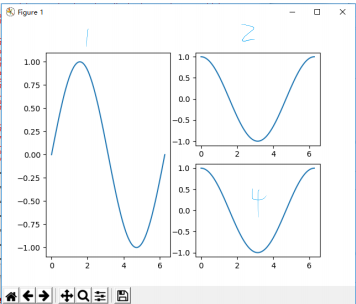

## plt.subplot() 函数

- `subplot(numRows,numCols,plotNum)`
- `subplot(RCN)`

有两种形式绘制几何形状相同的布局。从 1 开始计数，比如 plt.subplot(2, 3, 4) 和 plt.subplot(234) 代表二行三列的 6 个区域中第 4 个，即第二行第一个。

```py
import matplotlib.pyplot as plt
import numpy as np
X=np.linspace(0,2*np.pi,100)
Y1=np.sin(X)
Y2=np.cos(X)
plt.subplot(121) # 注意，可以看到 1 横跨两行
plt.plot(X,Y1)
plt.subplot(222)
plt.plot(X,Y2)
plt.subplot(224)
plt.plot(X,Y2)
plt.show()
```



## 对象

整个图像是一个 Figure 对象。一个 Figure 对象包含一个或多个 Axies 对象。每个 Axies 对象有自己坐标系统的绘图区域。


## 划分画布，直接操作 Figure 和 Axies 对象

plt.gca() 获取当前操作的 Axies 对象。或者使用 plt.subplots(2,2) 的形式操作 Figure 和 Axies 对象或 Axies 轴对象数组 (np.ndarray of Axies objects)。

```py
import matplotlib.pyplot as plt
import numpy as np
X=np.linspace(0,2*np.pi,100)
Y=np.sin(X)
fig,ax=plt.subplots(2,2)
ax[0][0].plot(X,Y)
ax[0][1].plot(X,Y)
ax[1][0].plot(X,Y)
ax[1][1].plot(X,Y)
plt.show()
```


## 展示图像

```py
plt.imshow(image)
plt.imshow(mask)
plt.axis("off") # 不展示轴
plt.title("Image")
plt.show()
```

### 展示边框

```py
def show_box(box, ax):
    x0, y0 = box[0], box[1]
    w, h = box[2] - box[0], box[3] - box[1]
    ax.add_patch(
        plt.Rectangle((x0, y0), w, h, edgecolor="green", facecolor=(0, 0, 0, 0), lw=2)
    )
```

## 获取当前轴

ax 一般使用 plt.gca() 获取当前绘制图像的 axis。

## plt.ginput()：交互式输入函数

交互式输入函数，用于从图形窗口中捕获鼠标点击事件。它在数据标注、图像分割、交互式绘图等场景中非常有用。基本用法如下：

```py
points = plt.ginput(n=2, timeout=0, show_clicks=True, mouse_add=1, mouse_pop=3, mouse_stop=2)
```

1.  **`n`** (整数):
    -   需要收集的点的数量
    -   默认值：1
    -   设为负数时，可以无限次点击，直到按下回车键或鼠标中键
2.  **`timeout`** (浮点数):
    -   等待点击的超时时间（秒）
    -   默认值：0（无限等待）
    -   超时后返回已收集的点
3.  **`show_clicks`** (布尔值):
    -   是否在点击位置显示临时标记
    -   默认值：True（显示）
4.  **`mouse_add`** (整数):
    -   添加点的鼠标按钮
    -   1 = 左键（默认）, 2 = 中键, 3 = 右键
5.  **`mouse_pop`** (整数):
    -   删除上一个点的鼠标按钮
    -   默认值：3（右键）
    -   设为0禁用此功能
6.  **`mouse_stop`** (整数):
    -   提前结束收集的鼠标按钮
    -   默认值：2（中键）
    -   设为0禁用此功能

返回值：返回一个包含元组的列表，每个元组表示一个点的坐标 `(x, y)`

## 展示动画（时间序列的图）


## 远程服务器展示图像需要安装

```bash
sudo apt-get install -y libxcb-xinerama0 libxcb-cursor0 libxcb-icccm4 libxcb-image0 libxcb-keysyms1 libxcb-render-util0 libxcb-xkb1 libxkbcommon-x11-0
```

## Ref and Tag