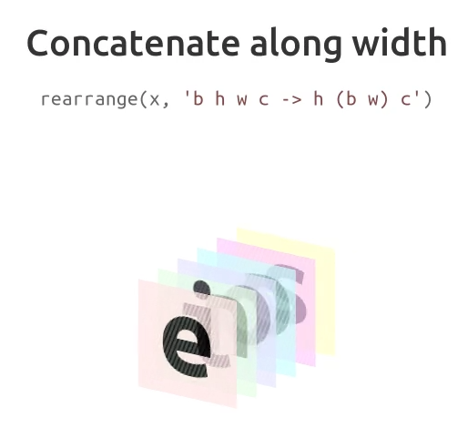
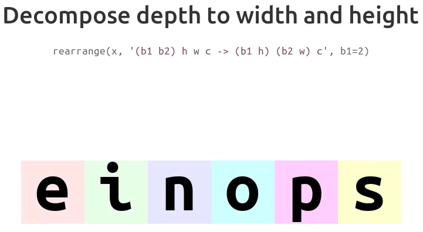
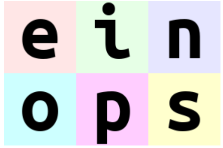
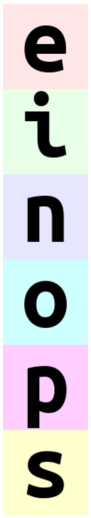

## demo



图中，展示了 b 张 RGB 的图像，所以维度是 (b, h, w, c)。沿着宽度拼接得到如下：



得到 (h, w * b, c)。可以看到，height 部分保持不变。而 width 变为了 b 张图像宽度的拼接，即 b * w。紧接着再分解深度不分，到宽度和高度。



如上图，(b1 b2) 部分中，指定了 b1=2，b2 根据 b 自动求出。将原来的 b 拆分为 (b1 b2) 的两个形状，如上图的 (2 3)。转换后，有 (b1 h) 和 (b2 w) 代表了 (2 h) 和 (3 w)，可以看到后面的六张图像变为两行三列，即每列三张。

指定 ims[0] 为 b 张 RGB 图像的第一张，即字母 e。那么操作如下：

```py
rearrange(ims[0], 'h w c -> w h c')
```


```py
rearrange(ims, 'b h w c -> (b h) w c')
```



## rearrange

使用括号，代表展平和转置对应部分。

多数组拼接

```py
import numpy as np
from einops import rearrange, repeat, reduce

arr1 = np.array([[1, 2, 3], [4, 5, 6]])
arr2 = np.array([[7, 8, 9], [10, 11, 12]])
# r0 是三维的，在 0 维堆叠两个数组
r0 = rearrange([arr1, arr2], 'x y z -> x y z')
```

在转置和交换轴重中，只要把**轴，axis** 对应的数如何变换想清楚，如何索引轴上的数想清楚，rearrange 的操作会变得直观。比如，如下第二维换到第一维，第三维换到第二维，第一维换到最后。即原来有 k 个 i x j 矩阵，变为有 i 个 j x k 矩阵。

原最后一维数据变为第二维，比如 r0[0,0,:] 的 [1,2,3]，变为第二维,即 r1[0,:,0]。可以看做原来的 1 2 3 保存是连续的，但是每个数隔着 k 个数。本质还是在的 axis 是第三，现在放置在第二。其他类似。

```py
r1 = rearrange([arr1, arr2], 'k i j -> i j k')
assert np.allclose(r0[0,0,:], r1[0,:,0])
# 沿着一个新维度，第二维 i，拼接并展平
result = rearrange([arr1, arr2], 'k i j -> i (j k)')
print(result)
```

```py
images = [np.random.randn(30, 40, 3) for _ in range(32)] # (32, 30, 40, 3)
print(rearrange(images, "b h w c -> b w h c").shape) # (32, 40, 30, 3)
# concatenate images along height (vertical axis), 960 = 32 * 30 ：(960, 40, 3)
int(rearrange(images, "b h w c -> (b h) w c").shape)
# concatenated images along horizontal axis, 1280 = 32 * 40 ：(30, 1280, 3)
print(rearrange(images, "b h w c -> h (b w) c").shape)
# reordered axes to "b c h w" format for deep learning ：(32, 3, 30, 40)
print(rearrange(images, "b h w c -> b c h w").shape)
# flattened each image into a vector, 3600 = 30 * 40 * 3 ：(32, 3600)
print(rearrange(images, "b h w c -> b (c h w)").shape)
print(rearrange(images, "b h w (c ph) -> b (c h) (w ph)", ph=1).shape)
```

注意拼接中的顺序：
```py
t1 = torch.arange(24).reshape(2, 3,4)
print(t1)
# 注意后两维度拼接顺序，w在前，所以不再是0 1 2 3 ...，
# 而是先交换两个维度，再 flatten。即 b w h 再 flatten.
print(rearrange(t1, 'b h w -> b (w h)'))
```

在原有维度上，可以添加一个 ph，但是需要保持左右两边维度相同，不能出现左右有不同的维度。新的维度只能用其他方法添加。和上面结果一样，交换 h 和 w 而已。但是新的 ph 维度已经计算。
```py
print(rearrange(t1, 'b h (ph w) -> b w (h ph)', ph=1))
```

使用 ... 表示剩余部分，比如展平剩余部分：

```py
print(rearrange(t1, "b ... -> b (...)"))
```

## repeat 增加维度

注意 h repeat 与 repeat h 代表不同，repeat 代表重复所在维度，repeat 所在前后，会代表所在轴的位置不同。从而拼接起来，(h repeat) 与 (repeat h) 不同。(h repeat) 中，每连续的 repeat 个都是相同元素，以 repeat 个一组，连续的重复 h 次。(repeat h) 中，每连续 h 个代表原来的张量，以 h 组为单位重复 repeat 次。

```py
import numpy as np
from einops import rearrange, repeat, reduce
# a grayscale image (of shape height x width)
image = np.random.randn(30, 40)
# change it to RGB format by repeating in each channel：(30, 40, 3)
# 最后会产生新的维度，将原来最后一维重复 c 次，作为新的最后一维。
# c 所在维度复制，即最后一维复制，最后是连续 c 个相同的数字
print(repeat(image, "h w -> h w c", c=3).shape) # 最后一维是重复的，得到 (h, w, 3)
# c 所在维度复制，即第二维，连续 c 个 w 维张量相同（复制而来），即 [i, :c, ...] 全是相同的。
print(repeat(image, "h w -> h c w", c=3).shape) # (h, 3, w)
print(repeat(image, "h w -> h (c w)", c=3).shape) # 展平两维，最后一维是重复的 c 次 w
# repeat image 2 times along height (vertical axis)：(60, 40)
print(repeat(image, "h w -> (repeat h) w", repeat=2).shape)
# repeat image 2 time along height and 3 times along width：(30, 120)
print(repeat(image, "h w -> h (repeat w)", repeat=3).shape)
# convert each pixel to a small square 2x2. Upsample image by 2x：(60, 80)
# (w w2) 部分即最后一维重复两次并且拼接。(h h2) 代表 h h2 的拼接。重复 h2 组 (w w2) 后，
# 再拼接起来如此的 h 组。
print(repeat(image, "h w -> (h h2) (w w2)", h2=2, w2=2).shape)
# pixelate image first by downsampling by 2x, then upsampling：(30, 40)
downsampled = reduce(image, "(h h2) (w w2) -> h w", "mean", h2=2, w2=2)
print(repeat(downsampled, "h w -> (h h2) (w w2)", h2=2, w2=2).shape)

# (b repeat h w) 后，最后两维度 (h w) 重复 repeat 次，形成新的一维。
# 再 flatten 中间的 (repeat h)
print(repeat(t1, 'b h w -> b (repeat h) w', repeat=2))
# (b h repeat w) 后再 flatten 中间的 (h repeat)
print(repeat(t1, 'b h w -> b (h repeat) w', repeat=2))
```

## reduce

$$
x = x 
$$

```py
import numpy as np
from einops import rearrange, reduce
x = np.random.randn(100, 32, 64)
# perform max-reduction on the first axis:(32, 64)
print(reduce(x, "t b c -> b c", "max").shape)
# same as previous, but with clearer axes meaning:(32, 64)
print(reduce(x, "time batch channel -> batch channel", "max").shape)
x = np.random.randn(10, 20, 30, 40)
# 2d max-pooling with kernel size = 2 * 2 for image processing:(10, 20, 15, 20)
# 注意括号部分，(h1 h2) 要凑到 30，h2 在参数指定为了 2
y1 = reduce(x, "b c (h1 h2) (w1 w2) -> b c h1 w1", "max", h2=2, w2=2)
print(y1.shape)
# if one wants to go back to the original height and width, depth-to-space trick can be applied:(10, 5, 30, 40)
y2 = rearrange(y1, "b (c h2 w2) h1 w1 -> b c (h1 h2) (w1 w2)", h2=2, w2=2)
print(y2.shape)
# Adaptive 2d max-pooling to 3 * 4 grid:(10, 20, 3, 4)
print(reduce(x, "b c (h1 h2) (w1 w2) -> b c h1 w1", "max", h1=3, w1=4).shape)
# Global average pooling:(10, 20)
print(reduce(x, "b c h w -> b c", "mean").shape)
```

执行 reduce 操作，即对两个 operand 执行 combination 操作，操作包含 sum, mean, max, min, prod。比如：

```py
t1 = torch.arange(24).reshape(2, 3, 4)
# 从第一维中，找到 max，即 dim=0，最后得到 shape 为 (h w)
# 可以看做 从 t1[0] 开始，作为 tmp
print(reduce(t1, "b h w -> h w", "max"))
```

按照 "b h w" 的 view 看待 t1，一次取维度 "h w"，在 b 这一维度索引下一个维度为 "h w" 的来操作。即 res = t1[0], res = max(res, t1[1]), res = max(res, t1[2]) ...，不断 reduce。

```py
x = torch.arange(2*(3*2)*(4*3)).reshape(2,6,12)
print(x)
# 2d max-pooling with kernel size 3*4，stride 也是 kernel size，padding 为 0
# 最后得到 c h1 w1 的 shape。也就是从每个 kernel 窗口选择最大值，stride 为 h1 w1
# 等价的 max-pooling 操作如下：
# 第一个 kernel 规定的窗口是 3x4，对应 x[:, :3, :4]，选取其中的 max 值，即窗口右下角。
# 紧接着 kernel 向右移动 4 个单位，即 w2 个单位，找到第二个 max 值，31；当右侧结束时，
# 行方向向下移动 h2 个单位，即 3 个单位。继续开始。
# 用 reduce 的思想思考，是一并进行的。没在箭头右侧指定的维度都会遍历。
# h1 所在维度方面，保留 h1 的话，需要在展平的 (h1 h2) 中以 h2 为间隔，得到 h1 个值。
# 紧接着 h1 个值每次前进一步，直到遍历完 h2 个值后，所有值都比较了，以 h2 为区间 reduce 出了结果。
# 首先指定的初始张量为：
# i, j = 0, 0
# res = x[:, ::h2, ::w2]
# 相当于:
# for i in range(1, h2):
#     for j in range(1, w2):
#         res = max(res, x[:, i::h2, j::w2])
# 首先移动最后维度，先 ++j，即 for j in range(w2)。结束后再比较 for i in range(h2)，如此循环。
# 每次，选取列方向的移动 w2 的位置的 x[:, :] 与其比较。reduce 后行方向是 h2 个。
# 比较后留下 max 结果。
# 注意，要指定 h2，而非 h1，顺序调换得到结果可能不同。
print(reduce(x, "c (h1 h2) (w1 w2) -> c h1 w1", "max", h2=3, w2=4))
```

    tensor([[[  0,   1,   2,   3,   4,   5,   6,   7,   8,   9,  10,  11],
            [ 12,  13,  14,  15,  16,  17,  18,  19,  20,  21,  22,  23],
            [ 24,  25,  26,  27,  28,  29,  30,  31,  32,  33,  34,  35],
            [ 36,  37,  38,  39,  40,  41,  42,  43,  44,  45,  46,  47],
            [ 48,  49,  50,  51,  52,  53,  54,  55,  56,  57,  58,  59],
            [ 60,  61,  62,  63,  64,  65,  66,  67,  68,  69,  70,  71]],

            [[ 72,  73,  74,  75,  76,  77,  78,  79,  80,  81,  82,  83],
            [ 84,  85,  86,  87,  88,  89,  90,  91,  92,  93,  94,  95],
            [ 96,  97,  98,  99, 100, 101, 102, 103, 104, 105, 106, 107],
            [108, 109, 110, 111, 112, 113, 114, 115, 116, 117, 118, 119],
            [120, 121, 122, 123, 124, 125, 126, 127, 128, 129, 130, 131],
            [132, 133, 134, 135, 136, 137, 138, 139, 140, 141, 142, 143]]])
    tensor([[[ 14,  17,  20,  23],
            [ 38,  41,  44,  47],
            [ 62,  65,  68,  71]],

            [[ 86,  89,  92,  95],
            [110, 113, 116, 119],
            [134, 137, 140, 143]]])


## Ref and Tag

[Github](https://github.com/arogozhnikov/einops)
[学习link](https://zhuanlan.zhihu.com/p/342675997)

#Tricks