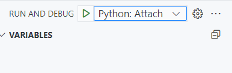

在 VS Code 左侧菜单栏的 Run and Debug 中，配置 launch.json文件。或者 ctrl+shift+p，输入 Debug: Add Configuration，根据提示，选择 Python Debugger，随后可以选择 Python File 或 Python File with Arguments 等。

需要给 Python 文件传入参数，选择 Python File with Arguments，在项目的 .vscode/launch.json 自动生成了如下：

```json
...
        {
            "name": "Python Debugger: Current File with Arguments",
            "type": "debugpy",
            "request": "launch",
            "program": "${file}",
            "console": "integratedTerminal",
            "args": "--config-name train_dexgraspvla_controller_workspace"
        }
...
```

args 部分可以自行传入参数。

## 命令行启动 vscode python debug

有时候在终端启动会更方便，比如传入环境变量的值，控制 CUDA_VISIBLE_DEVICES 等。配置 launch.json 如下：

```json
{
    // Use IntelliSense to learn about possible attributes.
    // Hover to view descriptions of existing attributes.
    // For more information, visit: https://go.microsoft.com/fwlink/?linkid=830387
    "version": "0.2.0",
    "configurations": [
        {
            "name": "Python: Attach",
            "type": "python",
            "request": "attach",
            "connect": {
              "host": "localhost",
              "port": 5678
            }
          }
    ]
}
```

安装 debug 库，pip install debugpy。通过命令行调用：

```bash
python -m debugpy --listen 5678 --wait-for-client tools/train.py \
configs/rotated_retinanet/rotated-retinanet-hbox-le135_r50_fpn_1x_dota.py
```

此时，终端不会运行，而是等着 VS Code 的 Debug and Run 处点击开始。



简化操作，可以在 ~/.zshrc 中配置：alias pdb="python -m debugpy --listen 5678 --wait-for-client"，在终端可以使用：

```py
CUDA_VISIBLE_DEVICES=0 pyd tools/train.py configs/rotated_retinanet/rotated-retinanet-hbox-le135_r50_fpn_1x_dota.py
```

实战中，如果运行 Python 出现错误，需要调试断点等，还可以使用 ctrl+p/n，或者上下键，`!!` 命令使得终端自动填充上一个命令。在前面加上 pdb 即可。

还可以扩充为 shell 函数：

```bash
pyd() {
    if [ "$1" = "python" ]; then
        shift
        python -m debugpy --listen 5678 --wait-for-client "$@"
    else
        echo "Unsupported debug command"
    fi
}
```

## Ref and Tag

https://code.visualstudio.com/docs/python/debugging

vscode python设置debug ? - 古月闻星的回答 - 知乎
https://www.zhihu.com/question/35022733/answer/2943314390