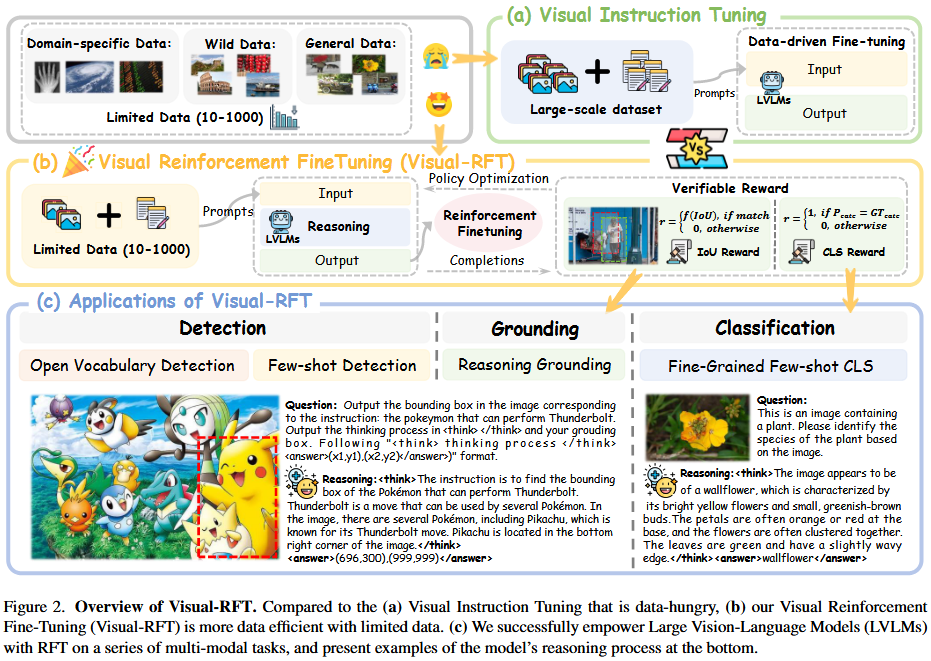
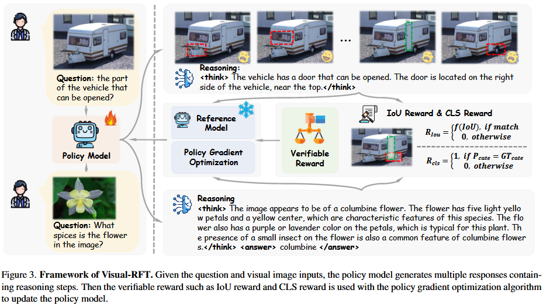

## Insight

关键在于奖励函数的提出。DeepSeek R1 基于两个简单的奖励，能够有效地落地推理模型。作者提出了物体检测设计的交并比 (Intersection over Union, IoU) 奖励函数，



图2. Visual-RFT概览。与（a）数据需求量大的视觉指令微调相比，（b）我们的视觉强化微调（Visual-RFT）在数据有限的情况下更具数据效率。（c）我们成功地在一系列多模态任务中为大型视觉语言模型（LVLMs）赋予了强化微调（RFT）的能力，并在底部展示了模型推理过程的示例。

## 方法

可验证奖励的强化学习 (Reinforcement Learning with Verifiable Rewards)。强化学习主要最大化如下目标函数：

$$
\max _ { \pi _ { \theta } } \mathbb { E } _ { o \sim \pi _ { \theta } ( q ) } \left [ R _ { \mathbf { R L V R } } ( q , o ) \right ] \\
= \left [ R ( q , o ) - \beta \mathbf { K L } [ \pi _ { \theta } ( o | q ) \parallel \pi _ { \mathrm { r e f } } ( o | q ) ] \right ]
$$

输入问题 q，πθ 是需要训练的策略模型，生成响应 o，R 是奖励函数，得到奖励 R(q, o)。$\pi_{ref}$ 是参考模型，β 是超参数。

$$
R(q, o) = \begin{cases} 
1, & \text{if } o = \text{ground truth}, \\
0, & \text{otherwise}.
\end{cases}
$$



如图 3，策略模型生成多个回复，包含推理步骤。IoU 奖励和 CLS 奖励用于结合策略梯度优化算法来更新策略模型。

### 奖励

#### 检测任务中的交并比 (IoU) 奖励

检测任务，输出包括边界框 (bbox) 和置信度。奖励函数应充分考虑交并比 (Intersection over Union, IoU)，评估平均精度均值 (mean Average Precision, mAP)。作者设计基于 IoU 和置信度的奖励函数 $R_d$：

模型输出 bbox 和置信度，我们根据置信度排序 bbox，得到 $\{b_1, b_2, \cdots, b_n\}$，每个 $b_i$ 与真实边界框 $\{b^g_1, b^g_2, \cdots, b^g_m\}$ 匹配，计算 IoU，并且设置 IoU 阈值 τ，低于的部分视作无效。并且，不匹配的 IoU 为 0。匹配后，初始集合中的每个边界框的 IoU 和置信度记为 $\{iou_1 : c_1, iou_2 : c_2, \cdots, iou_n : c_n\}$，计算奖励如下：

奖励包含三部分：IoU 奖励，置信度奖励和格式奖励。

$$
R_{d} = R_{\mathrm{IoU}} + R_{\mathrm{conf}} + R_{\mathrm{format}} \\
R_{\mathrm{IoU}} = \frac{iou_1 + iou_2 + \ldots + iou_n}{n} \\
r_{ci} = \left\{
\begin{array}{ll}
c_i & \text{, if } iou_i \neq 0, \\
1 - c_i & \text{, if } iou_i = 0.
\end{array}
\right. \\
R_{\mathrm{conf}} = \frac{\sum_{i=1}^{n} r_{ci}}{n}
$$

格式奖励要求预测符合在标签内。标签为 `<think>` 和 `<answer>`。

#### 分类任务的奖励 (CLS reward)

正确分类得 1 分，错误分类得 0 分。

$$
R_{cls} = R_{acc} + R_{format}
$$

## 数据准备

作者设计了提示格式，阴道模型在输出最终答案之前展示推理过程。检测和分类任务的提示格式如：

### 检测的提示词 (Detection Prompt)

```
Detect all objects belonging to the category ’{category}’ in the image, and provide the bounding boxes (between 0 and 1000, integer) and confidence (between 0 and 1, with two decimal places). If no object belonging to the category ’{category}’ in the image, return ’No Objects’. Output the thinking process in <think> </think> and final answer in <answer> </answer> tags. The output answer format should be as follows: <think> ... </think><answer>[’Position’: [x1, y1, x2, y2], ’Confidence’: number, ...]</answer> Please strictly follow the format.
```

### 分类的提示词 (Classification Prompt)

```
This is an image containing a plant. Please identify the species of the plant based on the image. Output the thinking process in <think> </think> and final answer in </think> </answer> tags. The output answer format should be as follows: <think> ... </think> </think>species name</answer> Please strictly follow the format.
```

## 实验


## Ref and Tag

[Github](https://github.com/Liuziyu77/Visual-RFT)
[Arxiv](https://arxiv.org/abs/2503.01785)

论文翻译：Visual-RFT 视觉强化微调 - wangwlj的文章 - 知乎
https://zhuanlan.zhihu.com/p/28124490367