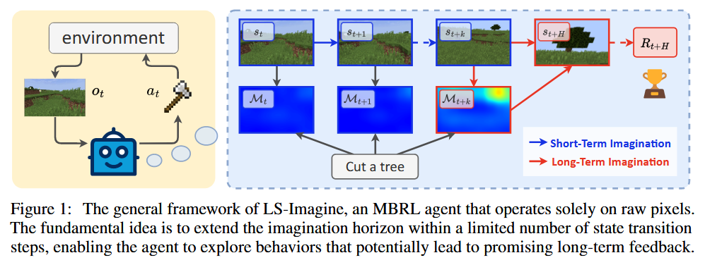
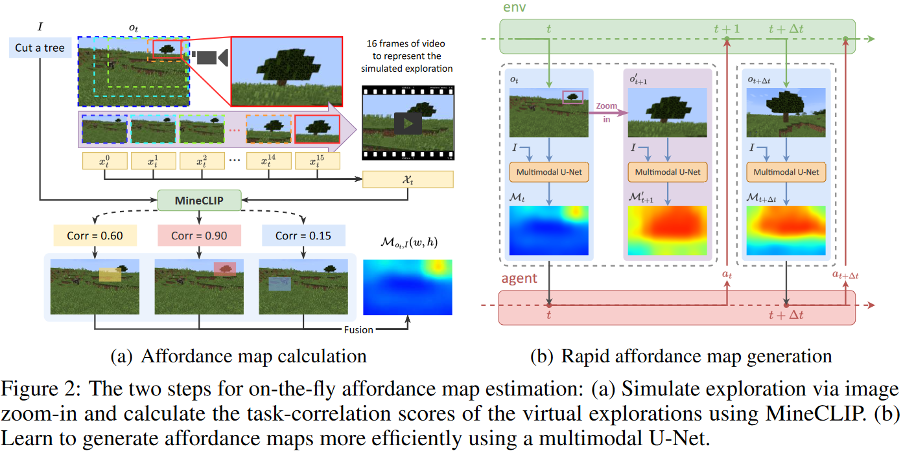
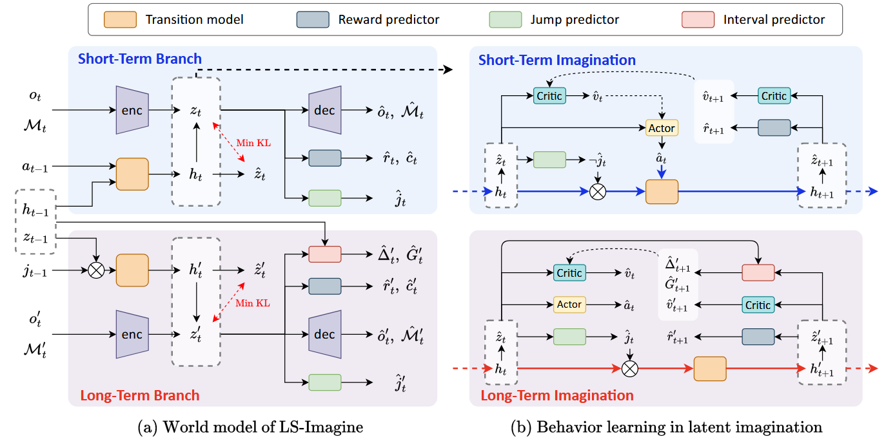
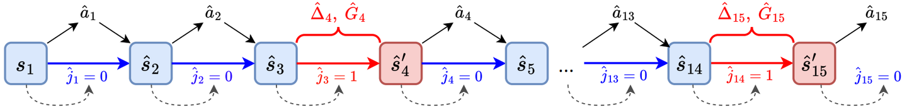
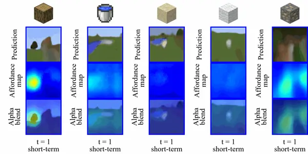

ICLR oral: Open-World Reinforcement Learning over Long Short-Term Imagination. https://qiwang067.github.io/ls-imagine, https://arxiv.org/pdf/2410.03618

训练 visual RL agent 时，model-based methods 通常是 short-sighted。作者提出 LS-Imagine，根据有限数量的状态转移步，扩展了 imagination horizon,，使得 agent 去探索行为，以到可能的长期反馈 (long-term feedback)。核心在于建立长短期世界模型 (long short-term world model)。作者模拟了以目标为条件的 jumpy 状态转移，并通过放大单张图像的具体区域来计算对应的 affordance map。

## Reading

现有基于模型的RL方法（如 DreamerV3）因短期想象力（15步）受限，导致探索效率低下，难以处理长时程回报任务。LS-Imagination 扩展 imagination horizon，预测限定步数内的状态转移。作者构建了一个长短期世界模型。为了实现，作者使用以目标为条件的跳跃状态转移，计算对应的 affordance map。

LS-Imagination 使得世界模型高效学习并模拟特定行为的长期影响，并且不需要重复地 rollout step。模型学习后，能够预测即时状态转移（不跳步），也可以预测 jumpy state transition (可以跳步)。

Jumpy state transition: 允许 agent 绕过中间状态，使用一步来直接模拟一个任务相关的未来状态 $s_{t+H}$。此概念通常出现在世界模型。



如图，右侧蓝色箭头是预测的即时状态转移，红色箭头预测长期的状态转移。

| 数据类别       | 符号 | 描述                                   | 示例值或生成方法                 |
| -------------- | ---- | -------------------------------------- | -------------------------------- |
| 视觉观测       | `oₜ` | 64×64像素图像                          | Minecraft第一人称视角截图        |
| Affordance Map | `Mₜ` | 任务相关区域的热力图                   | U-Net预测或MineCLIP生成          |
| 跳转标志       | `jₜ` | 是否触发长时程想象                     | `True`若`P_{jump} >动态阈值`     |
| 跳转间隔       | `Δₜ` | 预测到目标的步数                       | 从真实交互数据匹配               |
| 复合奖励       | `rₜ` | $rₜ^{env} + rₜ^{MineCLIP} + αrₜ^{int}$ | α=1，高斯矩阵参数(σₓ=128, σᵧ=80) |

## 核心思路
- **关键思想**：  
  - **长短期世界模型**：融合短期单步转移和长期跳转状态模拟（如从当前状态直接预测接近目标的未来状态）。  
  - **Affordance Maps**：通过图像缩放和 MineCLIP 生成任务相关的空间先验，指导探索方向。  
  - **混合想象力训练**：在策略优化中联合使用长短期想象序列，直接估计长时程价值。  



### AFFORDANCE MAP AND INTRINSIC REWARD

核心思想是引导 agent 的注意力到视觉观察中，与任务相关的区域，提高探索效率。$\mathcal{M}_{o_{t,I}}(w,h)$ 代表 affordance map 中的值，代表观测图像位置 (w,h) 处与任务描述 $I$ (比如 "cut a tree") 的相关性。

#### 虚拟探索（virtual exploration）

- ​**滑动窗口裁剪**：在单张观测图像上，用尺寸为图像宽高15%的滑动边界框遍历所有区域（水平和垂直各分9步）。  
- ​**连续缩放生成伪视频**：对每个滑动窗口内的区域进行 16 次连续缩放（缩小视野模拟接近目标），生成伪视频帧序列 $\mathcal{X}_t = [x_t^0, x_t^1, \ldots, x_t^{15}]$。  
- ​**MineCLIP 相关性评估**：利用预训练的 MineCLIP 模型计算伪视频帧与任务文本指令（如“cut a tree”）的语义相关性得分，作为该区域的探索价值（affordance value）。

#### 快速生成：RAPID AFFORDANCE MAP GENERATION

- ​**原始方法缺陷**：  
  通过滑动窗口裁剪图像生成伪视频帧，并用MineCLIP计算任务相关性生成affordance map，存在**计算成本高**​（需遍历9×9窗口）和**实时性差**的问题。
- ​**核心目标**：  
  设计轻量模型替代原始流程，实现**实时生成高精度affordance map**，支撑强化学习的在线交互。

**网络架构**:
- ​**基础框架**：基于Swin-Unet（Cao et al., 2022）的U型编解码结构，适应高分辨率输出。  
- ​**多模态输入处理**：  
  - ​**图像分支**：Swin Transformer编码器提取多尺度特征（4×4 Patch → 线性嵌入 → 分层下采样）。  
  - ​**文本分支**：MineCLIP文本编码器生成512维文本特征。  
- ​**跨模态融合**：  
  - ​**TIA模块**​（Text-Image Attention）：以文本特征为Query，图像特征为Key/Value，通过多头注意力实现特征对齐。  
  - ​**桥接层**​（Bridge Layer）：融合编码器各阶段的多模态特征，传递至解码器。

**训练策略**
- ​**数据生成**：  
  - 随机策略采集2000张环境图像，通过原始滑动窗口方法生成affordance map作为标签。  
  - 构建数据集 $\{(o_t, I, \mathcal{M}_{o_t,I})\}$，其中$\mathcal{M}_{o_t,I}$为平滑后的affordance map。  
- ​**损失函数**：像素级L1损失 + 结构相似性损失（SSIM），约束输出与标签的一致性。  
- ​**优化细节**：  
  - 初始学习率：$5×10^{-4}$，每50轮衰减至0.1倍，共训练200轮。  
  - 输入图像分辨率：64×64，输出affordance map同分辨率。

#### AFFORDANCE-DRIVEN INTRINSIC REWARD

- ​**问题背景**：  
  开放世界中，稀疏奖励和长周期任务导致探索效率低下。传统方法（如MineCLIP奖励）依赖历史表现，难以直接捕捉未来目标的潜在价值。
- ​**核心目标**：  
  通过**空间先验知识**引导智能体关注任务相关区域，加速目标发现与策略优化。基于 affordance map和高斯分布设计奖励函数，鼓励目标居中。

**内在奖励公式**：  
$$
r_{t}^{\text{intr}} = \frac{1}{WH} \sum_{w=1}^{W} \sum_{h=1}^{H} \mathcal{M}_{o_t, I}(w,h) \cdot \mathcal{G}(w,h)
$$  
- $\mathcal{M}_{o_t, I}$：Affordance Map，表示图像$o_t$中各像素对任务指令$I$的关联性（值域$[0,1]$）。  
- $\mathcal{G}$：中心高斯矩阵，峰值在图像中心，标准差 (超参数) $\sigma_x, \sigma_y$控制分布宽度（图16）。作者的工作选择了（128,80）。
  - 目的：鼓励智能体将目标物体保持在视野中央，便于后续操作。

**总奖励合成**
$$
r_t = r_t^{\text{env}} + r_t^{\text{MineCLIP}} + \alpha r_t^{\text{intr}}
$$  
- $r_t^{\text{env}}$：环境稀疏奖励（如任务完成时+1）。  
- $r_t^{\text{MineCLIP}}$：基于视频-文本对齐的预训练奖励（评估动作序列与任务相关性）。  
- $\alpha$：超参数（默认1），平衡内在奖励的权重。

### 长短期世界模型

长短期世界模型是 ​**LS-Imagine** 的核心组件，旨在同时建模 ​**短时单步转移** 和 ​**长时跳跃转移**，以平衡即时反馈与长期目标的权衡。其架构基于DreamerV3改进，新增 ​**跳跃标志预测** 和 ​**长时状态间隔预测** 模块。

#### LEARNING JUMPING FLAGS

根据当前状态，决定下一次应当预测长期状态转移还是短期状态转移，并且选择对应的转移分支。引入 jumping flags $j_t$，指出在时间步 $t$，应该使用长期或短期状态转移。当观察图像中，远处出现了任务相关的目标，affordance map 应当出现峰值，jumpy state transition 使得 agent 想象未来靠近目标的状态。定义 affordance map 中的相对峰度和绝对峰度如下：

$$
\begin{align*}
K_r &= \frac{1}{WH} \sum_{w=1}^{W} \sum_{h=1}^{H} \left[ \left( \frac{\mathcal{M}_{o,I}(w,h) - \mathrm{mean}(\mathcal{M}_{o,I})}{\mathrm{std}(\mathcal{M}_{o,I})} \right)^4 \right], \\
K_a &= \max(\mathcal{M}_{o,I}) - \mathrm{mean}(\mathcal{M}_{o,I}).
\end{align*}
$$

为了归一化相对峰度，使用如下：

$$
P_{\mathsf{jump}} = \mathrm{sigmoid}(K_r) \times K_a
$$

跳跃概率衡量了置信度。设置一个阈值，当 $P_{jump}$ 大于它时，设置 $j_t$ 为 True，开始 imagination phase。

#### LEARNING JUMPY STATE TRANSITIONS



状态转移模型，包含了短期和长期分支。大多数基于 DreamerV3。

- ​**短时分支**：  
  建模单步转移：  
  $$h_t = f_\phi(h_{t-1}, z_{t-1}, a_{t-1})$$  
  - 输入：历史状态 $h_{t-1}$、随机状态 $z_{t-1}$、动作 $a_{t-1}$  
  - 输出：下一确定性状态 $h_t$，w
- ​**长时分支**：  
  建模跳跃转移：  
  $$h_t' = f_\phi(h_{t-1}, z_{t-1})$$  
  - ​**无需动作输入**：直接预测未来多步后的状态（如从当前位置直接跳到树附近）  
  - ​**附加预测器**：  
    - ​**间隔预测器**：预测跳跃所需环境步数 $\Delta_t$  
    - ​**累积奖励预测器**：预测跳跃期间的累积奖励 $G_t$

下标 $t$ 在真实环境下，不是时间步，而是序列的顺序。

#### 模型组成

**短时分支**（Short-Term Transition）
- ​**输入**：历史状态 $(h_{t-1}, z_{t-1})$ 和动作 $a_{t-1}$  
- ​**动态方程**：  
  $$h_t = f_\phi(h_{t-1}, z_{t-1}, a_{t-1})$$  
- ​**功能**：  
  模拟单步状态转移（类似传统MBRL），预测下一时刻的确定性状态 $h_t$ 和随机状态 $z_t$。

**长时分支**（Long-Term Imagination）
- ​**输入**：历史状态 $(h_{t-1}, z_{t-1})$  
- ​**动态方程**：  
  $$h_t' = f_\phi(h_{t-1}, z_{t-1})$$  
- ​**功能**：  
  不依赖动作 $a_{t-1}$，直接预测跳跃后的状态 $(h_t', z_t')$，模拟智能体接近目标后的未来状态。

#### 具体模型组成

$$
\begin{aligned}
& \text{Short-term transition model:} & h_t &= f_\phi(h_{t-1}, z_{t-1}, a_{t-1}) \\
& \text{Long-term transition model:} & h'_t &= f_\phi(h_{t-1}, z_{t-1}) \\
& \text{Encoder:} & z_t &\sim q_\phi(z_t \mid h_t, o_t, \mathcal{M}_t) \\
& \text{Dynamics predictor:} & \hat{z}_t &\sim p_\phi(\hat{z}_t \mid h_t) \\
& \text{Reward predictor:} & \hat{r}_t, \hat{c}_t &\sim p_\phi(\hat{r}_t, \hat{c}_t \mid h_t, z_t) \\
& \text{Decoder:} & \hat{o}_t, \hat{\mathcal{M}}_t &\sim p_\phi(\hat{o}_t, \hat{\mathcal{M}}_t \mid h_t, z_t) \\
& \text{Jump predictor:} & \hat{j}_t &\sim p_\phi(\hat{j}_t \mid h_t, z_t) \\
& \text{Interval predictor:} & \hat{\Delta}'_t, \hat{G}'_t &\sim p_\phi(\hat{\Delta}'_t, \hat{G}'_t \mid h_{t-1}, z_{t-1}, h'_t, z'_t)
\end{aligned}
$$

可以看到，短期和长期转移模型参数都是一致的。只是传入的参数有无 $a_{t-1}$。输入和输出，参考上述模型即可。比如，Encoder 模型接收 recurrent state $h_{t}$，还有观察和 Affordance map $o_t, \mathcal{M}_t$，输出后验状态 $z_t$。

作者设计了多个预测器，方便想象。比如，Interval predictor 预测交互的步数 $\hat{\Delta}'_t$，和期望累积奖励 $\hat{G}'_t$。

训练时，收集根据当前策略与环境交互得到的短期元组 $\mathcal{D}_t=(o_t,a_t,\mathcal{M}_t,r_t,c_t,j_t,\Delta_t,G_t)$。$c_t$ 决定是否继续与环境持续交互，即是否终止。当 $j_t=1$，额外构建长期元组 $\mathcal{D}'_{t+1}=(o'_{t+1},a'_{t+1},\mathcal{M}'_{t+1},r'_{t+1},c'_{t+1},j'_{t+1},\Delta'_{t+1},G'_{t+1})$。 

在表征学习过程中，从 replay buffer $\mathcal{B}$，采样短期元组 $\{\mathcal{D}_t\}^T_{t=1}$，和其紧随着的长期元组对应的跳跃转移 $\{\mathcal{D}'_{t+1}\}^T_{t\in\mathcal{T}}$，$\mathcal{T}$ 代表需要长期状态转移的时间步集合。

疑问：一个模型如何能够预测两个分支？比如短期/长期转移模型根据参数不同预测不同时期的模型，在实现时如何做到？使用一个特殊的 action 作为占位，标志着执行长期预测？

### BEHAVIOR LEARNING OVER MIXED LONG SHORT-TERM IMAGINATIONS

如图 (b) 部分，采用了 Actor-Critic 算法：
- ​**Actor**：策略网络 $\pi_\theta(\hat{a}_t \mid \hat{s}_t)$ 生成动作 $\hat{a}_t$，优化目标为最大化折扣累积奖励 $R_t$。
- ​**Critic**：价值网络根据当前状态 $\hat{s}_t \doteq \{h_t,\hat{z}_t\}$，$v_\psi(\hat{R}_t \mid \hat{s}_t)$ 预测状态价值 $\hat{R}_t^\lambda$，用于评估策略效果。

从采样的观察 $o_1$ 和 affordance map $\mathcal{M}_1$ 编码后的初始状态 $z_1$ 出发，根据跳跃预测器预测的跳跃标志 $\hat{j}_1$，动态地选择长期或短期状态转换模型。对于想像范围为 L 的序列，预测 $\hat{r}_t,\hat{c}_t,\hat{\Delta}_t,\hat{G}_t$ 等信息。

注意，t 不代表具体时间步，仅代表顺序。比如，对于跳跃状态转移，需要的步数为 $\hat{\Delta}'_t$，对应从 $\hat{s}'_{t-1}$ 到 $\hat{s}'_t$ 所需的步数。可能的折扣累积奖励 $\hat{G}'_t$ 对应步数 $\hat{\Delta}'_t$。对于短期想象，执行单步转移，设置 $\hat{\Delta}_t=1$ 和 $\hat{G}_t=\hat{r}_t$，此时保持了符号一致。最终，对于一条 episode，我们得到一系列步骤区间 $\hat{\Delta}_{2:L}$ 和预测的累积折扣奖励 $\hat{G}_{2:L}$，注意，奖励也要预测。



图 7：动态选择使用长期转移模型或短期转移模型预测长短期想象序列。

使用改进的 boostrap λ-returns 结合长期和短期想象，计算每个状态的折扣累积奖励：

$$
\mathit{R_t^\lambda} \doteq 
\begin{cases}
\hat{c}_t \left\{ \hat{G}_{t+1} + \gamma^{\hat{\Delta}_{t+1}} \left[ (1 - \lambda) v_\psi(\hat{s}_{t+1}) + \lambda R_{t+1}^\lambda \right] \right\} & \text{if } t < L \\
v_\psi(\hat{s}_L) & \text{if } t = L
\end{cases}.
$$

### 实验

在 图 10 中展示了基于长短期想象状态序列重建的观测图像和功用性图的可视化结果。其中第一行显示了跳跃式状态转换前后的潜在状态，并将其解码回像素空间，以直观呈现状态变化；第二行可视化了由潜在状态重建的功用性图，以更清晰地理解功用性图如何促进跳跃式状态转换，以及它们是否能够提供有效的目标导向指导；最后一行通过透明叠加的方式将功用性图覆盖在重建的观测图像上，从而更直观的凸显出智能体关注的区域。



解码与编码，也许可以考虑扩散的策略。

---

Buffer 中的每条轨迹包含相邻相邻时间步和长距离间隔时间步的状态。

- **跳转标志（Jumping Flag）**：通过 affordance map 的峰度和均值动态触发跳转。  
- **双分支架构**：  
  - **短期分支**：单步状态转移（如 DreamerV3）。  
  - **长期分支**：预测跳转后的状态、步长间隔（Δₜ）和累积奖励（Gₜ）。  

## Code

Short-term transition model 和 Long-term transition model 共享参数吗？

​**​参数部分共享​**​：
- ​**​共享参数​**​：状态转移的核心循环单元（GRU/Mamba）与编码器  
- ​**​独立参数​**​：长时分支特有的跳跃步数预测头和累积奖励预测头  

networks.py:class RSSM 是世界模型的核心组件。在强化学习中，RSSM 通常指 Recurrent State-Space Model，即递归状态空间模型。主要负责：
- ​**​状态表征学习​**​：将原始观测（图像/传感器数据）编码为低维隐状态
- ​**​动态预测​**​：建模状态转移规律 $p(s_{t+1}|s_t,a_t)$
- ​**​长期依赖建模​**​：通过递归结构捕捉时序关系

训练代码在 expr.py 文件。

Short-term transition model（短时转移模型） 和 Long-term transition model（长时转移模型） 并不完全共享同一模型，而是通过 同一动态模型的不同分支 实现不同模式的转移。

###  动态模型的基础结构（RSSM 类）

- 代码位置：models.py 中的 WorldModel 类初始化部分。
- 核心模块：self.dynamics = networks.RSSM(...) 定义了基础的递归状态空间模型。

共享参数：基础动态模型（如 LSTM 或 GRU 单元）的参数是共享的，用于处理状态的历史信息。

###  转移分支的区分逻辑

动作标记区分转移模式：在长时转移中，动作的最后一维被设为 1（如 new_action[:, -1] = 1），触发跳跃式转移逻辑。

```python
# models.py - _jumpy 函数
new_action = torch.zeros(...)
new_action[:, -1] = 1  # 标记为跳跃动作
succ = dynamics.img_step(state, new_action)  # 执行跳跃转移
```

动态模型的条件处理：动态模型根据输入动作的最后一维是否为 1，内部选择不同的转移逻辑（如调整状态预测的步长或目标）。

### 独立的预测头（Heads）

短时转移预测头：预测单步的奖励（reward）、终止标志（end）等。

```python
# models.py - WorldModel 类
self.heads["reward"] = networks.MLP(...)  # 单步奖励预测
self.heads["end"] = networks.MLP(...)     # 终止标志预测
```

长时转移预测头：预测跳跃步数（jumping_steps）、累积奖励（accumulated_reward）和跳跃标志（jump）。

```python
# 跳跃标志预测
self.heads["jump"] = networks.MLP(...)
# 跳跃步数 Δ_t 预测
self.heads["jumping_steps"] = networks.MLP(...)
# 累积奖励 G_t 预测
self.heads["accumulated_reward"] = networks.MLP(...)
```

## insight

作者提出了长短期世界模型。也许我们可以不用长短期世界模型，使用长短期想象，再加以验证。世界模型类似 RL 的 Value-Based，我们使用 Rule-based 的方法，毕竟任务只有一个，找到伤员。

可以使用探索，想象来作为启发式的 hint。以 VLM 给出图像哪个方向最有可能存在伤员，VLM 作为“大脑”来思考和决策。小模型则探索。解决世界模型可能难以泛化和训练的问题。

## Tag
#Paper
#RL