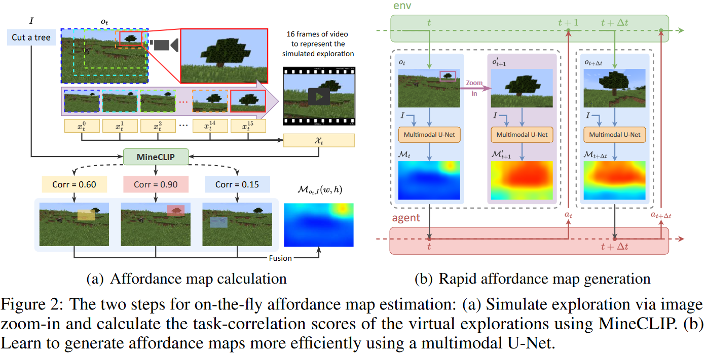

ICLR oral: Open-World Reinforcement Learning over Long Short-Term Imagination. https://qiwang067.github.io/ls-imagine, https://arxiv.org/pdf/2410.03618

insights: 做 US 时候，潜意识里人是能够估计人体的 affordance 图，知道大致范围。是否可以弄个 WorldModel？LLM 只能生成下一个 token，当做 short，嵌入另一个小模型来做 long term imagination。

训练 visual RL agent 时，model-based methods 通常是 short-sighted。作者提出 LS-Imagine，根据有限数量的状态转移步，扩展了 imagination horizon,，使得 agent 去探索行为，以到可能的长期反馈 (long-term feedback)。核心在于建立长短期世界模型 (long short-term world model)。作者模拟了以目标为条件的 jumpy 状态转移，并通过放大单张图像的具体区域来计算对应的 affordance map。

RL 中，instant state transitions（瞬时状态转移） 和 jumpy state transitions（跳跃状态转移） 是描述环境动态特性的两种现象。
* Instant State Transitions。智能体执行动作后，环境状态立即发生变化，且这种变化在时间上是**离散的**或**瞬间完成**的。无中间过程和中间状态。这是大多数强化学习问题的默认假设。比如棋类游戏，做出动作立刻更新棋盘。
* Jumpy State Transitions。状态变化在时间或空间上表现出不连续性或突变性。这种转移可能是由于环境动态的复杂性、传感器噪声或数据采样率不足引起的。不连续性：状态转移可能跳过某些中间状态，导致智能体观察到“跳跃”现象。时间或空间突变：状态可能在短时间内发生剧烈变化。挑战性：增加了智能体学习环境动态的难度。

最开始，需要一些成功的数据启动来学习 (是否需要模仿学习一部分，然后再强化学习探索式的学习增强泛化)，提供一些好的例子。就像 OS 的 Boostrap，需要嵌入一个启动 OS 的引导程序，再来启动 OS 以控制硬件。这也和 DeepSeek R1，基于强大的模型 V3 才能成功。就像鸡生蛋蛋生鸡问题，先加入一组数据，驱动这个循环启动就可以。

具体做法：先从一张图片，不断 Zoom in 得到一系列图片，作为成功的例子。

### 3.1 Overview
#### 3.2 AFFORDANCE MAP AND INTRINSIC REWARD
根据视觉观察和文本任务定义，引导 agent 的注意力聚焦于任务相关的区域。Affordance map 突出了区域与任务的关联性。

Affordance map computation via virtual exploration. 使用滑动边框扫描各个图片，不断在边框内放大，取出这些图片作为伪视频帧，以此对应长距离状态转移。随后根据文本描述的具体任务的目标，使用 MineCLIP 的奖励模型，评估视频切片与任务的相关性，生成 affordance map。

## Tag
#Paper