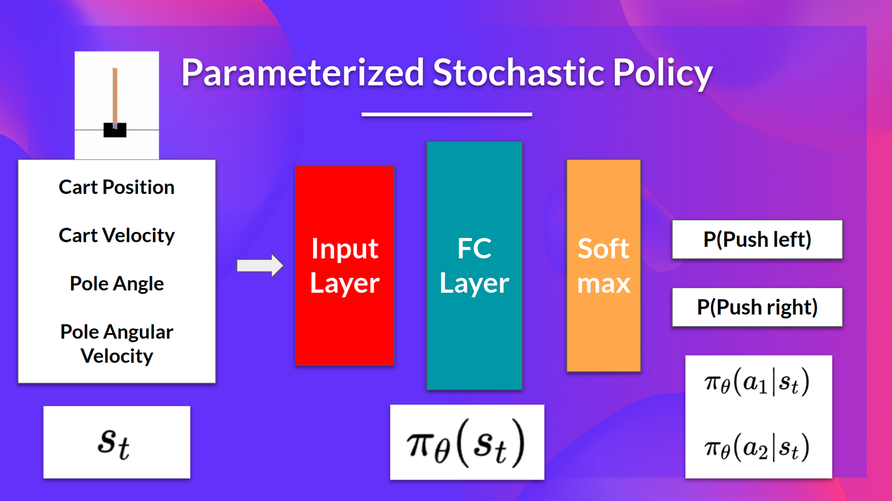
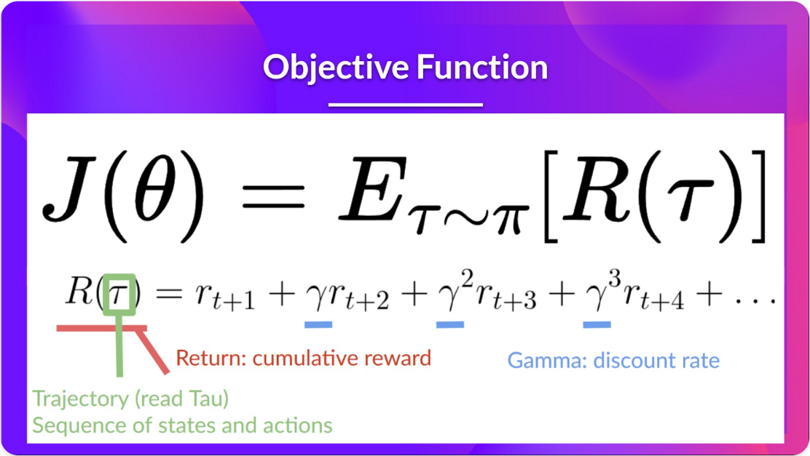
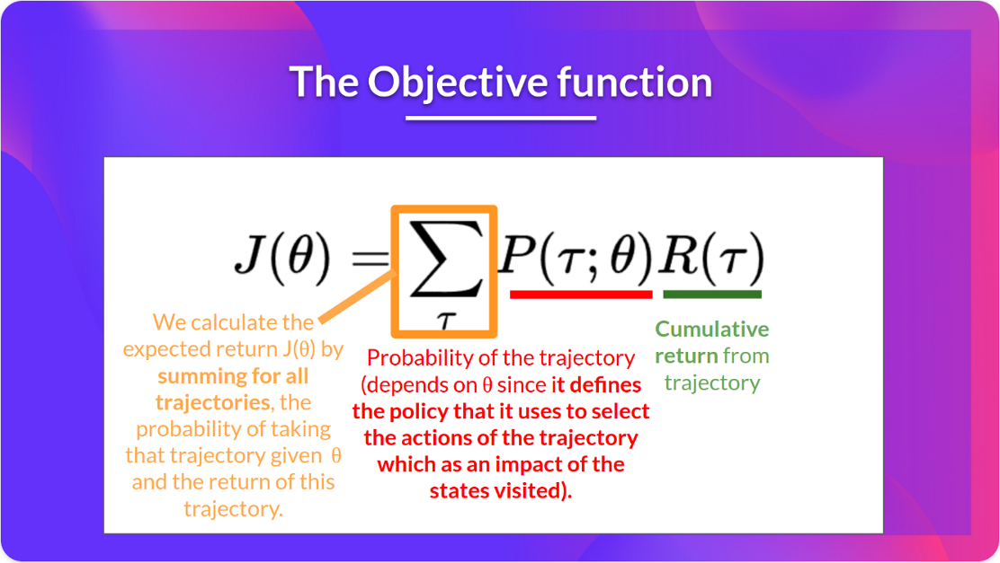
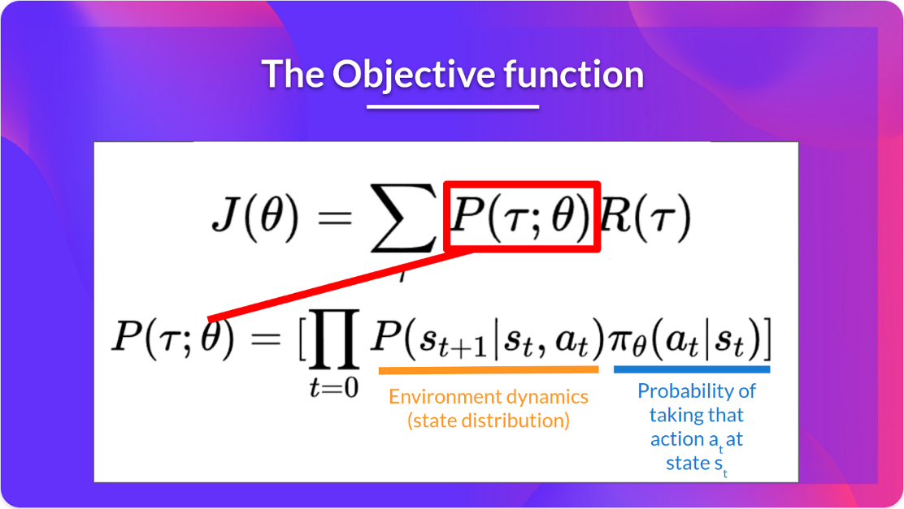
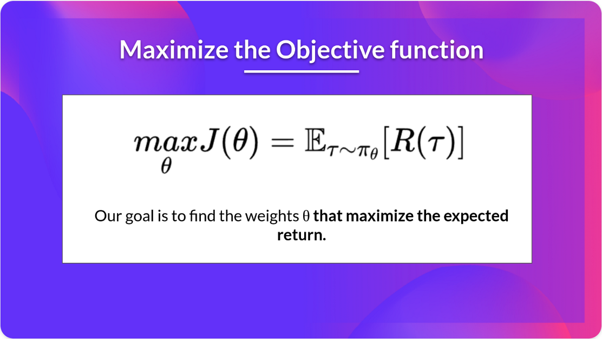
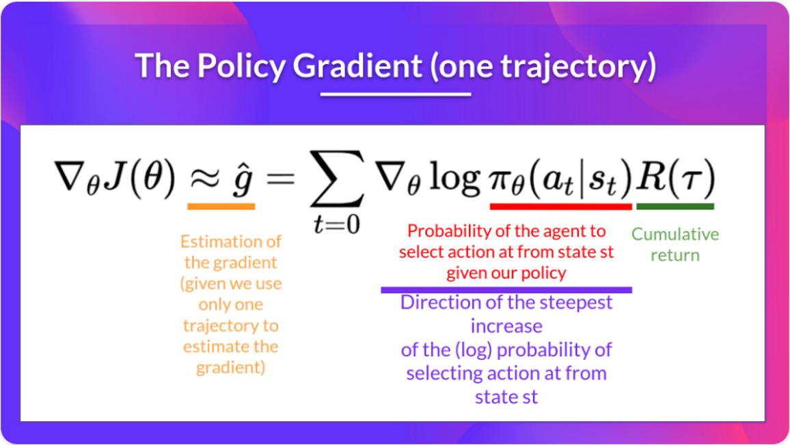
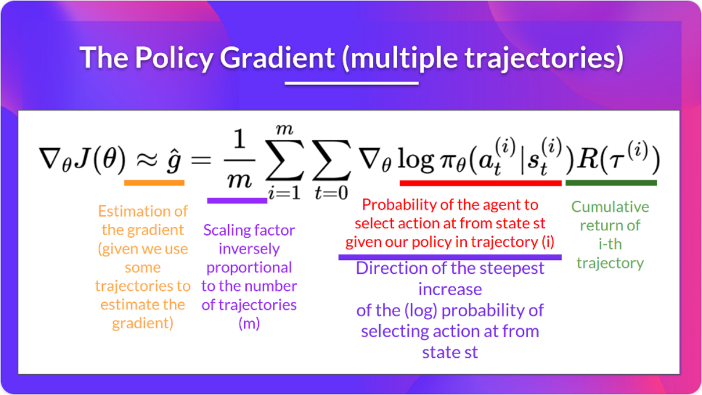

## 策略梯度：Policy Gradient

基于值的方法，最优的策略根据状态 s 生成的 a，即对应值函数中，根据当前 s，找到 a 来使得值在 s 下最大。即 $ \pi^*(s) = \arg\max_a Q^*(s, a) $。

### Stochastic Policy

基于策略的方法，不需要值函数来找到最优策略。目的使得满足 the expected cumulative reward 最大化即可。把策略看做一堆参数。使用神经网络的策略 $\pi_\theta$，根据状态 $s$ 输出的是关于动作的概率分布。即执行某个动作的概率是多少。$ \pi_\theta(s) = \mathbb{P}[A \mid s; \theta] $。可以使用 softmax 函数处理，挑选最合适的候选者，即概率最高的动作。

例如，小车上维持杆站立的场景中，状态 $s_t$ 代表位置，速度，杆的角度和角速度。Stochastic Policy 的策略 $\pi_\theta(s_t)$ 输出两个 logits，经过 softmax 后，对应向左和向右的概率。

### Policy Gradient

在训练时，agent 与环境交互，得到一个 episode 的数据，包含每个时间步的状态-动作对。最终正确 (positive return)，增加整个 episode 的每 (state, action) 对的概率。反正，降低。

如何评价策略好坏？使用得分/目标函数 $J(\theta)$，评估 agent 的一个轨迹 (状态和动作对的序列) 的好坏。目标函数输出 the expected cumulative reward。

$\tau$ 代表状态和动作序列的随机变量，可以看做 $\tau$ 就是状态和动作对的抽象。比如，状态可以使小车角速度、位置等状态，动作可以是向左和向右。

通常，根据 episode 得到状态-动作对的数据，还有奖励的数据。因此，可以计算目标函数的值。

目的是求参数，使得目标函数最大。可以看到期望的下标，状态动作对 $\tau$ 服从策略 $\pi_\theta$ 的分布，表示 $\tau$ 是取自此策略的状态动作对，求对应奖励的期望。

### 梯度上升和策略梯度定理

使用梯度上升解决找到最大值问题，与梯度下降正好相反。但是，计算目标函数的梯度是困难的：
1. 每个 trajectory 计算梯度困难；
2. 求状态分布的微分困难。特别是难以对环境建模。比如目标函数右侧，折扣累积奖励 $R(\tau)$ 容易计算，但是状态和动作的分布难以计算，这需要对环境建模，是困难的。

引入策略梯度定理 (The Policy Gradient Theorem)，近似表达对策略的参数求微分:

$ \nabla_\theta J(\theta) = \mathbb{E}_{\pi_\theta}[\nabla_\theta \log \pi_\theta(a_t | s_t) R(\tau)] $

即对策略输出的结果求对数，并对各个参数求梯度。最后再乘以奖励，求期望。求梯度在 PyTorch 等框架十分方便，简化了问题。

## MC 方法计算策略梯度

使用梯度上升来更新参数：$\theta \leftarrow \theta + \alpha \hat{g}$

$ \nabla_\theta J(\theta) = \mathbb{E}_\pi [G_t \nabla_\theta \log \pi_\theta(A_t | S_t)] $

## Ref and Tag