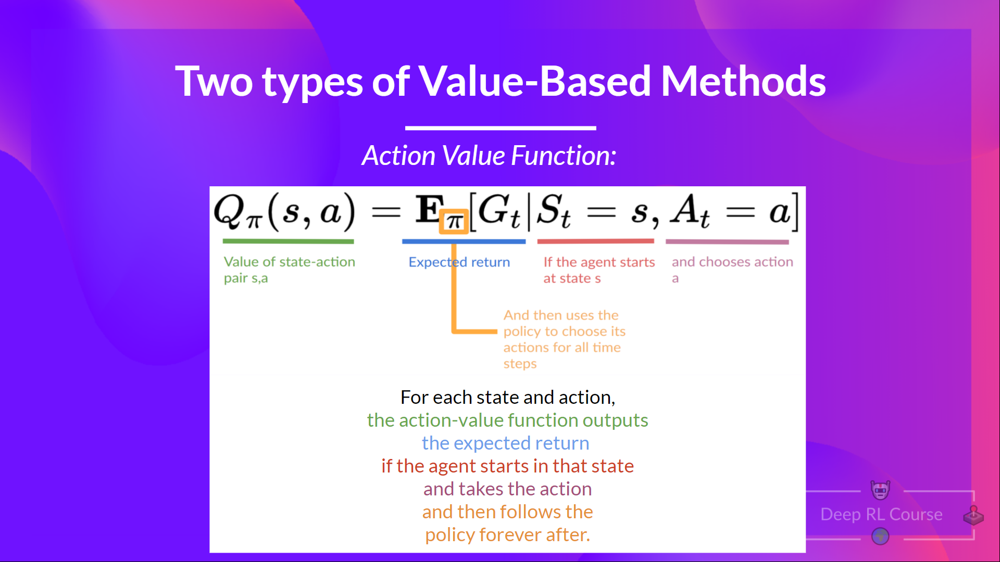
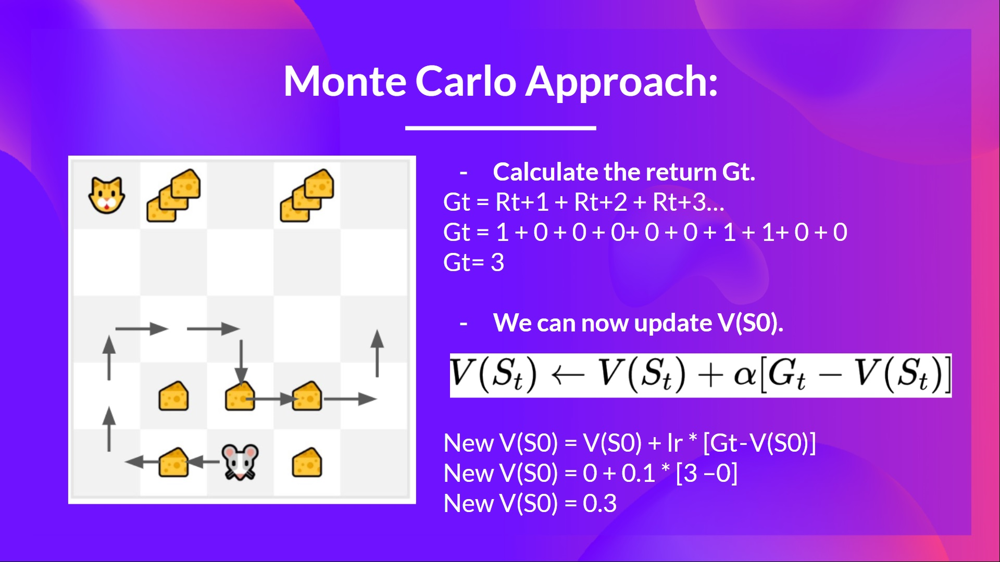
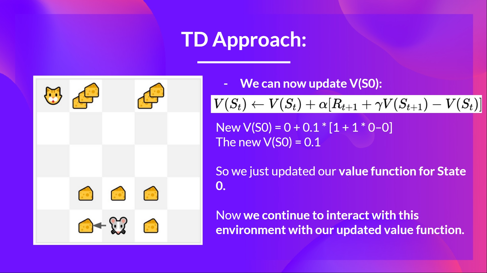

目标是最大化返回值。用最大化返回值的期望的方式来建模。

## Monte Carlo Approach

执行完后，再根据最终返回 Gt，即 t 时候的返回值来更新查找表。

$$
V(s_t) \leftarrow V(s_t) + \alpha [ G_t - V(s_t)]
$$

如图，老鼠一共迟到三个奶酪，每个奶酪设计为奖励 1。最后更新查找表时，如图计算的 V(s0)。

## Temporal Difference Learning

与 Monte Carlo Approach 不同，每一个时间步都会更新查找表的 $V(s_t)$ 项。但是，每一步更新，我们都没有 return Gt，根据每步的 state, aciton, reward 和 next state 来计算和更新查找表。比如老鼠走迷宫，遇到奶酪还是毒药得到奖励 1 和负数。根据执行一步后得到奖励 $R_{t+1}$ 和下一状态的折扣值来估计 Return。这种思路称为 bootstrapping。更新如下：

$$
V(s_t) \leftarrow V(s_t) + \alpha [R_{t+1} + \gamma V(s_{t+1}) - V(S_t)]
$$

式子左侧为需要更新的查找表的 $s_t$ 项。右侧是当前查找表对应项的状态 $V(s_t)$。$\alpha$ 是学习率，$\gamma$ 是折扣率 (discount rate)。

计算 V(s0) 的样例如图：

在时间步 t = 0 时，状态为 0，下一步得到奖励 1，并且下一步位置所在查找表处的值 V(s_t+1) 为 0，于是计算得到 V(s_0) = 0.1

## Ref and Tag