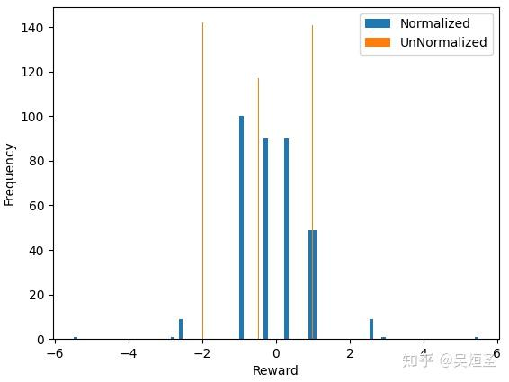

奖励模型预测的 reward 在实数域。尽管训练时引入了 sigmoid 函数，实际上大部分集中在 $[-4,4]$，但还是连续且平滑。

很多具体场景下，reward 可以给予规则清晰定义。比如数学和 coding 任务，正确则 +1，否则 -1 奖励。这些 rule-based reward 最大问题在于分布离散 (不连续，不平滑)。我们无法定义大量规则穷举 -1 到 1 之间的所有情况。离散的奖励作为监督信号，可能导致模型快速收敛到某些鞍点，使得训练失效。

作者在 23 年春夏，尝试 rule-based reward 对 RLHF 生成高质量合成数据。发现，模型收敛又快又好，但是生成数据出现无意义的模板 (trivial patterns)。如此失败的原因，可能是设计规则后，没有作适当的平滑，模型快速学习了 shortcuts 来 hack 奖励。

24 秋，OpenAI 论文《Rule Based Rewards for Language Model Safety》指出，针对每条规则，构造正负样本数据集，用标注数据集训练一个分类模型。RLHF 阶段，每个分类模型输出分值为对应奖励。作者认为，他们训练了一个连续的模型拟合离散的奖励分布，得到平滑的奖励。但也有问题，比如监督学习，需要每个规则都有标注数据，从而限制次方法应用场景。比如，采集数学和编程任务时，其推理规程的负样本的获取成本极高。其次，训练的模型可以理解为真是奖励分布的近似，意味着它总是有噪声或偏移。

25 春，DeepSeek-R1 给出无监督方案解决离散奖励平滑问题，就是 normalization。基于 inference time scaling law，假设模型生成的大量回答包含各种 reward 的答案。换句话说，可以采样到大量的样本，对于基于规则奖励所对应的非常离散且稀疏的分布来说，足以覆盖。类似 ML 课程所学，当样本量足够大，normalization 就是最简单且有效的平滑方法。

此 normalization 如何起作用？假设给予规则奖励如此定义：
1. 如果模型回答格式正确且回答答案正确得+1分；
2. 如果模型回答格式正确但回答答案不正确得-0.5分；
3. 如果模型回答格式错误得-2.0分。对于单条题目，我们假设总是采样100条模型回答。

那么在每个模型训练阶段可以假设这么一个分布：
1. 模型刚开始训练啥也不会（1条+1回答，9条-0.5回答，90条-2.0回答）；
2. 模型逐渐学习到格式（1条+1回答，49条-0.5回答，50条-2.0回答）；
3. 模型熟练掌握了格式并且逐渐学习到做题思路（49条+1回答，50条-0.5回答，1条-2.0回答）；
4. 模型熟练掌握了格式及做题思路（90条+1回答，9条-0.5回答，1条-2.0回答）。

下图统计四个阶段总的 normalized (比如用了 GRPO) 和 unnormalized (比如没有经过任何处理，直接使用奖励) 的奖励分布图。

分析：可以看到，unnormalized 版本按照定义，严格分布在三个具体数值，较为离散。normalized 版本取值更多，更加平滑。normalized 奖励出现的最大最小值为 5.5 和 -5.5，显著区别于原始奖励的极值 +1 和 -2。实际上，normalized 奖励最大值出现在模型刚开始瞎蒙的答案，最小值出现在训练结束时偶然出现格式错误 -2 回答。于是，normalized reward 可以自适应地帮助模型捕捉 inference time scaling law 里偶然出现的有效正信号，同事自适应地惩罚模型在稳定状态的不好输出。

Takeaway Message：GRPO 是一种通过 normalization 来平滑离散的基于规则奖励的方法。

这种发现异常情况，随后探究的写作思路，根据时间线的推进梳理解决方案，很像物理领域的论文，极具故事性。

[从DeepSeek GRPO聊聊平滑对于Rule-based Reward设计的重要性 - 吴烜圣的文章 - 知乎](https://zhuanlan.zhihu.com/p/24935854061)

## Tag and ref
[[llm.GRPO_DeepSeekMath]]

#GPRO
#RL
#Tricks
#Normalization