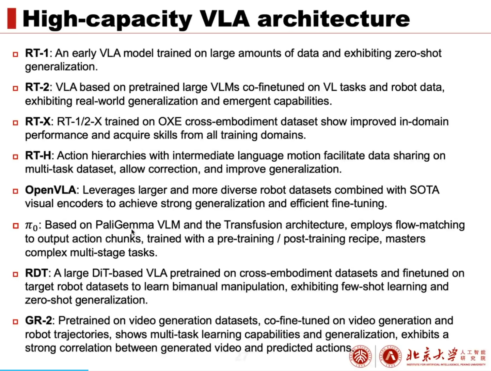
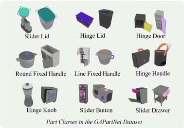

Robot manipulation，机器人目前难以完成灵活的，变化的任务，需要适应性的任务，这是亟待解决的问题。

夹爪，

什么是 vision-language-action models. 

A3VLM, CoRL: https://arxiv.org/html/2406.07549v1

ManipLLM, CVPR: https://arxiv.org/abs/2312.16217

EmbodiedGPT, NIPS: https://arxiv.org/abs/2305.15021

A3VLM 聚焦物体的关节结构 (articulation structure) 和 action afordances.

ManipLLM 把动作简化为一个吸取式的 gripper，并找到接触点和 gripper 的方位角。数据在仿真环境手机，解决了现实难以收集大量数据的痛点。
把焦点从直接学习动作，转移到学习以物体为中心的表征，并且与机器人配置无关，这些内容可以简易地转换到底层操作的动作中。

# Related Work

Manipulation of Articulated Objects. 操作关节式的结构，通常先确定关节结构，随后使用预定义的原子动作操作。罗列了一系列研究关于关节式物体识别和操作的工作[15,20,33,10,38,13]. 比如 GaPartNet[13] 将物体的关节原型分类为 9 种，每种对应典型姿态（pose）和操作性（affordance）。

A3VLM 简化了问题，仅考虑 GaPartNet 中九种原型中的滑动式（prismatic）和旋转式（revolute）。点云在实际场景可能不准确和存在噪声，A3VLM 使用强大的 VLM 作为 backbone，使用单张 RGB 图像，不需要深度数据。

使用 LLMs/VLMs 进行操作通常分为三个类型：
1. 比如 Code-as-Polices[22] 等，使用 LLMs/VMLs 生成高层语义的动作规划，形式为纯文本或代码。此类系统高度依赖外部的底层动作模型或是手写的 APIs 来执行规划的任务。系统局限于简单任务，比如拿和防（pick-and-place）。
2. RT-1, RT-2 ManipLLM[21] 系列工作直接生成机器人动作，能够处理更加复杂场景，比如开柜子和关门等。缺点：1）需要大量机器人-环境的交互数据来训练；2）特定类型的机器人训练数据难以泛化到不同类型机器人。
3. 使用 LLMs/VLMs 生成中间表征（比如VoxPoser[18] 的 cost maps），还有 A3VLM，随后使用机器人所对应的原子操作或控制来执行。

# Method
RT-1，RT-2 和 ManipLLM 等工作以机器人为中心的动作表征，而 A3VLM 使用以物体为中心的表征，预测物体中所有的可操作部分，并定位合适的部分给机器人执行操作。

对于object-centric的各种grouding大模型，我们需要关注两个点：一是数据格式及构建，二是模型的搭建。

### 3.2 Instruction-following Dataset Construction
困境：训练模型需要大量资源和数据，所以不会从头开始训练A3VLM，而是微调VLM。构建instruction-following dataset，如何构建dataset，在LLM中十分重要，是值得**总结**和关注的部分。

输入时图片和提示文本，回答是结构化的文本。

#### Raw A3 Annotation Generation
首先，创建object-level raw annotations。使用PartNet-Mobility工作提供的环境，根据URDF文件设置轴A和bounding box B等。

使用的机器人技能库来源于RoboAgent工作，为了技能与对应links和objects一致，使用GPT-4选择技能。

Roboagent: Generalization and efficiency in robot manipulation via semantic augmentations and action chunking. arXiv preprint arXiv:2309.01918, 2023

仿真环境中，原始的PartNet-Mobility数据集没有纹理细节，为了解决Sim2Real差距，使用ControlNet生成更真实图像。

### 模型搭建
A3VLM主要基于SPHINX-X，同时采用LLaMA2作为语言backbone。同时BBox归一化到0-1，保留2为小数。训练按照标准的VQA流程进行训练。采用了两阶段微调的方式，第一阶段直接使用image catption的方式对visual projection layers进行微调，采用“This is a [OBJ]”模版来实现原本预训练模型generic natural imagery到specialized dataset （物体可动性）的对齐 ；第二阶段根据instruction-following同时对visual projection layers和LLm进行微调。

NavGPT 讨论 LLMs 是否能够理解交互世界、动作及其后果，利用这些信息解决导航任务。NavGPT旨在执行零样本VLN任务，以清晰地揭示LLMs在导航过程中的推理过程。

推理能力：如何理解物体，随后并操作。相比ALOHA-ACT等端到端，用好了推理能力。

相关工作

ManipVQA，Instruct2Act

Language-Guided，创新点在于利用自然语言瞄准跟踪目标物体: https://arxiv.org/pdf/2311.12751

Two stage:
图像不够清晰，需要调整。

检查此处是否有异常。

## Tag
#Robotics
#MLLM
#Paper