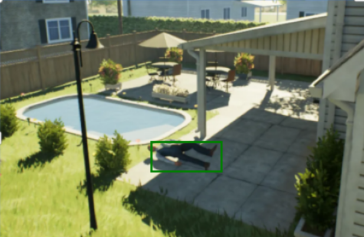

## 任务分析

智能体（由选⼿提供）将从环境中收到待救援对象的求救信号（周报环境图⽚及相应⽂本描述），智能体需要结合线索⾼效探索复杂三维场景，以尽可能短的时间找到待救援对象并将其送到指定担架上。

### 评测指标

移动到待救援目标附近触发动作 "carry" 获得积分 0.5；在救援担架 2m 内 "drop" 得 0.5。并返回触发到结束所需时长。drop 动作会直接结束任务测评。

官网：https://github.com/atecup/atec2025_software_algorithm

Agent 使用第一视角图像。

任务开始，给与一张图像和文本描述。图像包含待救援对象的位置信息。文本描述包含待救援对象的特征信息。需要开发一个 Agent，分析图像环境，找到线索来完成任务。找到类似的场景。

## 技术选型

分析能力，找到优势和短板。发挥优势，想办法补齐短板能力。再设计合理的 Agent 来完成任务，可能需要异步编程来提高表现。考虑使用 VLN 的思路。首先分析 VLM 各项能力。从识别人类，规划任务两方面入手。

### 识别能力

Qwen2.5VL 各个模型都有很强的识别能力，总结图像能力。比如，识别泳池旁的人，能够以 boundingbox 标出。

```py
from openai import OpenAI
from PIL import Image
import matplotlib.pyplot as plt
from matplotlib.axis import Axis
from base64 import b64encode

def show_box(box: tuple[int, int, int, int], ax: Axis):
    x0, y0 = box[0], box[1]
    w, h = box[2] - box[0], box[3] - box[1]
    ax.add_patch(
        plt.Rectangle((x0, y0), w, h, edgecolor="green", facecolor=(0, 0, 0, 0), lw=2)
    )

from base64 import b64encode

image_path = "/data1/wj_24/DexGraspVLA/local/garden_man.jpeg"
with open(image_path, "rb") as f:
    encoded_image_text =b64encode(f.read()).decode("utf-8")
messages = [
    {
        "role": "user",
        "content": [
            {
                "type": "image_url",
                "image_url": f"data:image;base64,{encoded_image_text}",
            },
            {
                "type": "text",
                "text": "There is a person lie in the graden of the house with a swimming pool nearby. Please locate the person in the image with its bbox coordinates and its name and output in JSON format.",
            },
        ],
    }
]
openai_api_key = "sk-68ab7a900621435cb2ba0261865d7f03"
openai_api_base = "https://dashscope.aliyuncs.com/compatible-mode/v1"

client = OpenAI(
    api_key=openai_api_key,
    base_url=openai_api_base,
)
chat_response = client.chat.completions.create(
    model="qwen2.5-vl-3b-instruct",
    messages=messages,
)
print(chat_response.choices[0].message.content)
# 输出
# ```json
# [
# 	{"bbox_2d": [180, 169, 263, 204], "label": "person lying in the graden"}
# ]
# ```
plt.imshow(Image.open(image_path))
show_box([180, 169, 263, 204], plt.gca())
plt.axis("off")
plt.show()
```



可以看到，识别人的能力比较强。更多空间识别例子参考 [spatial understanding](https://github.com/QwenLM/Qwen2.5-VL/blob/main/cookbooks/spatial_understanding.ipynb)。

### 规划方面能力

规划能力，待衡量和评估。此项能力难以界定，不像识别就是正确与否。

### 工具开发

如何利用这些工具来完成导航和搜索任务？

开发一个合理的 Agent。

### VLN

现在，没有既有的 VLN，需要启发式的 VLN。根据当前看到的，猜测最优可能得方向。要能够容错，发现死路，能够返回，重新找**新的**路径，不能困在原地。启发式地，那么需要想象？然后找到最匹配的，最有可能的场景。

总结和对比 VLN 常见方法，参考 [Vision-Language Models(VLM)在机器人导航中的应用：近期佳文赏析](https://mp.weixin.qq.com/s/IxN-aSiBnsTSReosZPBMzg), [10年VLN之路：详解具身智能「视觉-语言-导航」三大技术拐点！](https://mp.weixin.qq.com/s/pK_dvKxp_agzvEmLwPI9Kg)：

需要训练一个有基本能力的小模型，就像能够走向门口附近。随后使用 VLM 规划。VLM 思考是异步的。可以暂停等待思考完成，也可以在行进中思考，on-fly 地思考。思考需要左右摇头观看环境，获取广角视野，目的是获取更多信息。接着判断是否发现新的目标，然后靠近。

VLM 能够强制介入方向？强制左右转？

#### prompt

寻找担架。引导模型寻找担架。如果没有担架，可以查看视野里面是否出现救护车，走到救护车附近后，再搜索担架。

#### 启发式地探索

总结当前图像，首先，分析存在哪些可能得路径；其次，开始分析和想象，思考哪些路径最优可能达到目标场景。这可以总结为 prompt，可以强化学习，或者微调。

## Ref and Tag

https://github.com/QwenLM/Qwen2.5-VL/blob/main/cookbooks/spatial_understanding.ipynb