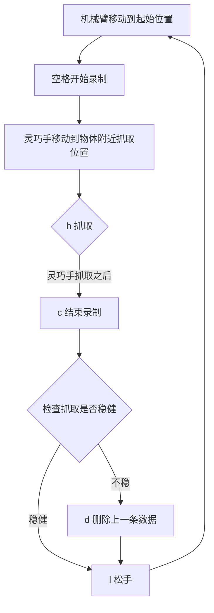

## 数据采集流程

### 软件部分

1. 运行 data_collection1.py，准备采集；
2. 查看终端输出，等待蓝牙连接成功。短暂时间后，终端显示 `[BLE] 初始化成功`；
3. 调出头部和腕部相机，**所有命令与交互都要在相机的窗口输入**，而非终端；
4. 在相机窗口使用命令，控制采集。命令细节：
    1. 空格键：启动一轮数据采集；
    2. h: hold 缩写，灵巧手抓取；
    3. l: loose 缩写，灵巧手松开；
    4. c: 记录此轮数据；
    5. d: 删除上轮数据，用于删除抓取不稳定场景；
    6. q: 退出程序。
5. 采集的命令流程：`空格开始录制` -> `灵巧手移动到合适位置后，h 抓取` -> `c 结束录制` -> `检查抓取是否稳健，不稳则 d 删除上一条数据` -> `l 松手，机械臂移动到新位置，准备下轮抓取` -> `空格开始录制` -> `...`。

异常处理：
1. 蓝牙连接不上或断开连接：点击灵巧手红色按钮，重启；还不能解决，同时重启数据采集脚本。
2. 当程序卡死，没有响应，可以使用 ctrl+alt+T 打开终端，执行 kill_data_collection 命令杀死数据采集进程，随后开始新的流程。注意，程序卡死时，记录了损坏的数据，需要找到损坏数据并手动删除。损坏数据从路径 ~/DexUVLA/humanoid_0528 下查看最近一条数据，通常是最后一个目录，删除即可。

### 机械臂部分

协同软件采集，关注移动到初始位置和抓取位置：
1. 移动到起始位置，与采集的同学确认开始流程；
2. 移动到待抓取物体附近，调整位置，确保灵巧手能够抓取；
3. 采集同学抓取并记录此轮数据后，可以晃动测试是否稳健，反馈给采集同学；
4. 重复步骤 1~3。