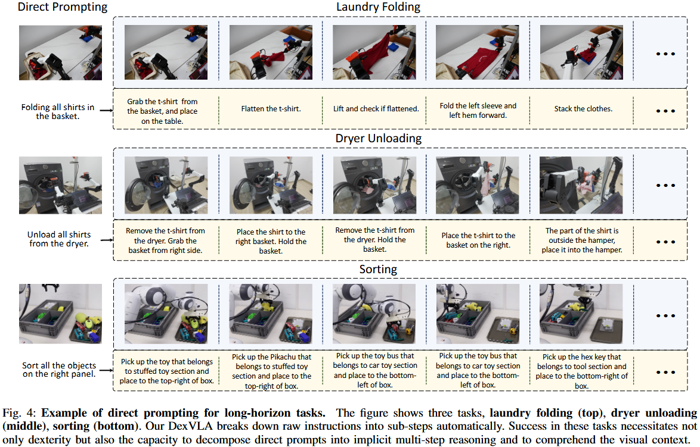

# DexVLA：面向通用机器人控制的插件式扩散专家VLM

[project web](https://dex-vla.github.io/)
[paper](https://arxiv.org/abs/2502.05855)

DexVLA 基于扩散的动作专家，可规模化到十亿个参数，为跨具身学习而设计。具身课程学习策略 (strategy) 促进有效的训练：(1) 从 VLA 分离扩散专家，并在跨具身数据上进行预训练这些专家；(2) 对齐 VLA 模型到特定具身；(3) 后训练以快速适应新任务。作者引入了实验，证明 DexVLA 能够在不同具身 (比如单臂、双臂和灵巧手) 上适应任务，不需要做任务适应的工作。

## 方法

如图展示了 DexVLA 架构和具身课程学习。模型采用三阶段训练。阶段一，独立地训练扩散专家，不训练 VLM。阶段二三，继承扩散专家到 VLM，丢弃专家的视觉和语言组件。扩散专家使用多个头来跨具身学习。

### 模型架构
DexVLA 模型主要基于 Transformer 语言模型主干。遵循 VLM 模型的通用框架，用图像编码器将机器人的图像观察结果投影到与语言tokens相同的嵌入空间中，即 embedding_dim 相同。对于多个摄像机视图，拼接这些视觉 tokens。VLM 组件生成两个输出：推理 tokens 和动作 tokens。
* 动作 tokens 通过投影模块传递，该模块由两个具有 LayerNorm 的线性层组成。该模块类似于 LLaVA 等视觉-语言模型中设计的连接器，用于转换 VLM 的嵌入空间以符合动作专家的输入要求。
* 推理 tokens 使用 FiLM 层注入策略模型，这些层缩放和漂移策略内投影层的参数。因此，该模型可以自主生成推理并利用扩散专家中的这种推理来指导动作生成。

按照标准的后融合 (late fusion) VLM 配方 (LLaVA 1.5 使用了两层 MLP 作为 projector)，图像编码器将机器人的图像观测嵌入到与语言 tokens 相同的嵌入空间中。进一步用机器人特定的输入和输出（即本体感受状态和机器人动作）增强这个主干。

构建扩散专家。由于动作专家主导机器人动作的学习过程，因此设计良好的神经架构对于更好的视觉运动策略学习至关重要。用 Scale Diffusion Policy (ScaleDP [63]) 作为扩散专家，它是 Transformer 架构中 Diffusion Policy 的变型，其中 ScaleDP 的最大版本最多有 1B 个参数。然而，简单的 ScaleDP 不是为跨具身预训练而设计的。本文设计一个多头输出，以便在具有各种机器人配置的 ScaleDP 上进行预训练。每个头负责一个机器人配置。此设置类似于 Octo。

训练目标。给定一批输入序列，整体训练损失定义为 ($L_{diff}$) 和下一个 token 预测 (NTP) 损失 ($L_{ntp}$) 的加权组合。

### 具身课程学习

课程学习 (curriculum learning) 是一种学习策略。三阶段训练策略实现了具身课程。第一阶段从跨具身数据学习可泛化运动技能，第二阶段适配特定物理形式，第三阶段改进特定任务行为。

精心设计的训练策略，对于优化深度神经网络至关重要。与网络固有训练动态相一致的方法可确保更高效、更有效的数据利用。框架 DexVLA 通过将视觉-语言模型 (VLM) 与扩散专家相结合，瞄准一般机器人控制。利用其模块化架构（结合两个不同的组件），提出一个三阶段训练策略，系统地解决：（1）学习灵巧的操作技能，使模型能够完成复杂的任务；（2）跨具身学习，使模型适应不同的机器人平台。

#### 阶段一：跨具身预训练

训练好的 VLM (比如 Qwen2-VL) 能够处理视觉和文本输入，但是缺乏与现实世界中不同目标交互的能力。为了有效训练动作专家，暂时将其与 VLM 组件分离 (就像鸡生蛋蛋生鸡需要先启动)。虽然 CNN 架构提取能力强大，但是 ViT 模型更契合 VLM 的主干 Transformer，所以用 ViT 架构做视频编码。语言嵌入使用 DistillBERT。再使用 FiLM 层将将生成的语言 embedding 集成到模型中。对扩散专家进行预训练的一个关键见解是，必须将长范围（例如，收拾桌子、折叠衣物）分解为子任务。这些长范围任务通常持续超过 2 分钟，而扩散专家要根据单条任务指令来高效学习，这是一个挑战。因此，在这些长范围中标注子步骤指令，以提供更结构化的学习信号。使用子步骤进行预训练对于获得强大的性能至关重要。根据观察的经验，如果没有对长任务标注子任务，VLA 训练后会跳过关键步骤。**每 5 秒界定一个子步骤**。

阶段一的预训练使用所有具身，各种不同机器人数据，来预训练扩散专家。

附录给出，基于 Transformer 的 DP 远远强于 UNet 的。

相比 VLA，扩散专家参数更少，1B 参数，训练更快。

#### 阶段二：微调对齐特定具身

阶段一的跨具身预训练学习的内容可能损害在目标具身上的表现，所以需要特定具身数据来训练模型，以此对齐 VLM 中的抽象视觉语言表示与扩散专家。首先，过滤数据集，只需要特定具身 (部署或产品的具身) 的数据，确保每个样本涉及单个具身。紧接着，借鉴 LLaVA 一类的 VLM 技术，此阶段关注于对齐目标具身的动作空间，并且伴随所需的相机视图和跟随的语言指令。具体而言，使用了特定具身的数据，联合地训练 VLM 模型、投影层和扩散专家，冻结 VLM 的视觉编码器。联合训练使得扩散专家有效的落地高层的 VL 理解到机器人特定的动机控制空间。

#### 阶段三：特定任务适配

改进模型熟练流畅地执行下游任务的能力，类似于大语言模型中的后训练阶段，在该阶段，模型根据特定域的数据进行**微调**。对于更简单、不太依赖泛化的任务，例如折叠衬衫、收拾桌子或使用训练的目标拾取箱子，由于模型已经表现良好，因此不需要进行特定任务的训练。但是，复杂、需要灵活性的任务需要模型学习细粒度、依赖于上下文的操作。因此，有效的后训练依赖于**高质量的专家演示数据集**，该数据集展示一致且流畅的任务执行策略，这些策略专注于促进成功完成任务的行为。注：在第 2 阶段和第 3 阶段都使用了带注释的子步骤语言数据。但是，不是直接使用这些子步骤推理作为指令输入，而是将它们用作**中间语言输出**，迫使模型学习和生成这些子步骤语言描述。这种方法已被证明**非常有效**，使模型能够执行复杂的长范围，例如折叠衣物。虽然其他 VLA（如 π0）也可以完成此类任务，但它们依赖于高级策略模型（如 SayCan）来识别任务状态并提供下一步指示。相比之下，本文框架利用 VLM 主干作为隐式高级策略模型。这允许模型内部解释任务的状态并将这种理解注入策略以指导动作生成，从而无需外部高级策略模块。

这里可以看到，中间语言输出的思想类似推理模型。但是，还是需要再次微调，阶段二还是没有达到想要效果，这里有改进空间。

#### 实施细节

使用了 Qwen-2-VL 作为基础 VLM。最多使用三个摄像机视图。扩散专家包含 10 亿个参数。两个 MLP 层（每个层后跟 LayerNorm）将视觉-语言模型连接到动作专家。用 FiLM 将视觉语言模型的最终嵌入注入扩散专家，并将其应用于两个 MLP 中的每一个。在第 1 阶段训练期间，用收集的数据集。第 2 阶段训练仅限于共享相同具身的数据。第 3 阶段后训练是有选择性的，仅针对明确提到的任务进行。预训练数据集共有 100 小时的数据，涉及 91 个不同的任务。

## 实验与评估
### Complex Long-Horizon Tasks with Direct Prompting

在实验中，通过结合特定任务的后训练和自生成推理能力来解决一系列具有挑战性的多阶段任务。对于其中一些任务，数据在预训练中存在，但需要进行微调才能掌握。对于一些任务，预训练中没有数据。本次评估中的任务如图 4 所示。

## 见解
是否可以独立地，直接地模仿学习或强化学习。随后嵌入到 VLA 中。

思路就像训练 LLaVA 的视觉的 projector？

另外地，数据增强的方式，是否可以在执行后，收集数据，通过分割视频或图片中的机械臂和操作的物体，随后换背景图片，以此扩充训练数据，得到在不同场景下泛化和抗干扰的能力。

VLM 输出 latent token，就像 CLIP Vision Encoder 输出 token 一样。VLM 作为任务规划器。

## 附录补充部分

### 视觉泛化

训练好的模型应当不仅仅在领域内表现出色，也要泛化到同类型的不同物和新场景。作者设计了实验验证，参考 Table 2 和 Fig. 12。

### 训练开销

Stage 1 的平均得分较差 0，Stage 2 的平均得分 。Q：为什么？Average Score 是如何定义的？

不分阶段，仅仅在 VLA 上训练，那么会导致近乎所有任务失败。并且对显卡要求高，8 卡 H100 训练一个 epoch 耗时 1h。仅训练扩散专家能够快 2.78 倍。而扩散专家大小仅为 VLA 三分之一。

### 消融实验

主要贡献是一个包含了扩散专家 (基于 diffusion transformer) 的 VLA 模型架构。 另外，提出了新的，高效的训练方案。还提出了子步骤标注 (substep annotation) 来训练扩散专家和 VLA，从而能够处理十分复杂的任务，比如叠衣服。

#### Large Diffusion Transformer 比小的 UNet 更强

1B DiT 和 93 M UNet 分别得分 0.92 和 0.17。

是否对比 1B DiT 和更小的 DiT？尽管有 Scaling law，但是没有实验。

#### 是否需要单独训练扩散专家

即是否应当把三阶段压缩为两阶段，不单独训练扩散专家。Q：关于验证预训练扩散专家的必要性，作者做了什么实验，得到什么结果。

为了验证**跨具身预训练（Stage 1）**的必要性，作者设计了消融实验，两个训练都排除了预训练扩散专家阶段：
- 压缩三阶段到两阶段：直接使用所有训练数据预训练 DexVLA，再微调到具身特定数据。
- 全阶段但数据调整：从头开始训练模型，但是只用了具身特定数据。

以上两个训练都在任务上失败了。作者猜测，扩散专家的参数太多，使得优化遇到挑战。所以，阶段 1 不仅仅让扩散专家学习动作，也能对模型 "warms up"，更好地理解复杂的视觉线索和语言指令。

#### 子步骤推理有帮助吗？

处理长且复杂的能力是此工作亮点，子步骤使得模型能够完成多阶段任务，比如叠衣服。设计了消融实验验证。
- 使用直接提示数据 (一个任务对应一条直接语言指令) 来训练扩散专家，不再拆分为子步骤。在训练 VLA-扩散专家 组合起来的模型时，使用子步骤推理训练。
- 阶段 1 和 2 都使用直接提示数据。

展示，移除子步骤导致任务完全失败。

## QA

### Q：阶段 2 使用的对齐数据是从阶段 1 过滤的吗

#### 数据来源

阶段 1：跨具身预训练：
- 数据来源：使用跨具身数据，即来自多种机器人形态（如单臂、双手、灵巧手等）的多样化数据。
- 数据特点：数据集中包含多种机器人形态的任务演示，目的是让扩散专家学习通用的动作模式。

阶段 2：具身特定对齐：
- 数据来源：使用具身特定数据，即针对特定机器人形态（如 Franka 机器人、UR5e 机器人等）的数据。
- 数据特点：数据集中仅包含单一机器人形态的任务演示，目的是将 VLM 的视觉-语言表示与特定机器人的动作空间对齐。

完成简单任务，相关的任务方面，得分表现从 0.92 到 0.07。如果不用子步骤推理，任务全部失败。分析：表明学习长范围任务，使用共享参数会导致冲突。作者猜测，子步骤避免模型陷入动作空间混乱的情况，类似投影连续动作空间到离散动作空间。所以，子步骤对泛化能力和表现至关重要。

#### 数据过滤与对齐

数据过滤：
- 阶段 1 到阶段 2：阶段 2 的数据并非直接从阶段 1 的数据中过滤得到，而是从具身特定数据集中选取。
- 过滤标准：阶段 2 的数据集仅包含与目标具身相关的任务演示。例如，如果目标具身是Franka机器人，则阶段 2 的数据集仅包含Franka机器人的任务演示。

数据对齐：
- 阶段 2 的目标：将VLM的视觉-语言表示与特定机器人的动作空间对齐。
- 对齐方法：在阶段 2 中，VLM、投影层和扩散专家联合训练，使用具身特定数据，同时冻结VLM的视觉编码器。

#### 数据使用示例

阶段 1：
- 数据来源：多种机器人形态的任务演示（如Franka机器人、UR5e机器人、灵巧手等）。
- 任务示例：抓取、放置、推拉等通用动作。

阶段 2：
- 数据来源：特定机器人形态的任务演示（如仅Franka机器人）。
- 任务示例：衬衫折叠、垃圾捡拾等特定任务。

#### 总结

| 阶段 | 数据来源 | 数据特点 | 数据过滤 |
|---|---|---|---|
| 阶段 1 | 跨具身数据（多种机器人形态） | 通用动作模式学习 | 不涉及过滤，使用所有跨具身数据 |
| 阶段 2 | 具身特定数据（单一机器人形态） | 特定具身任务适应 | 从具身特定数据集中选取，不直接从阶段 1 过滤 |

### Q：在评价表现时，消融实验中的 Average Score 是如何定义的，反应了什么能力水平？

消融实验中，Average Score 是通过对每个任务进行多次试验（通常为10次）的得分取平均得到的。每个任务的得分标准根据任务的具体要求设定，通常包括多个子任务的完成情况。以下是论文中提到的几个任务的评分标准示例：

衬衫折叠（Bimanual AgileX）的得分范围：0-3分。评分标准：
- 1分：完成垂直折叠。
- 1分：完成水平折叠。
- 1分：将折叠好的衬衫推到指定区域。

洗衣折叠（Bimanual AgileX），得分范围：0-4分。评分标准：
- 1分：从篮子中取出衣物并放到桌子上。
- 1分：将衣物展平。
- 1分：折叠衣物。
- 1分：将折叠好的衣物堆叠或放置到指定位置。

倒饮料（Franka with Dexterous Hand）得分范围：0-2分。 评分标准：
- 1分：抓住瓶子并倒入杯中。
- 1分：将瓶子放回原位。

装箱（Bimanual UR5e）得分范围：0-2分。评分标准：1分：正确抓取并放置一个物体。

#### 消融实验中，Average Score 反映的能力水平

扩散专家架构对比：
- UNet（93M参数）：在衬衫折叠任务中得分为0.17，表明其无法有效完成复杂任务。
- Transformer（1B参数）：在衬衫折叠任务中得分为0.92，表明其能够高效完成复杂任务。

预训练的必要性：
- 无预训练（仅Stage 2）：在衬衫折叠任务中得分为0，表明预训练对模型性能至关重要。
- 有预训练（Stage 1 + Stage 2）：在衬衫折叠任务中得分为0.92，表明预训练显著提升了模型性能。

子步骤推理的重要性：
- 无子步骤推理：在衬衫折叠任务中得分为0，表明子步骤推理对复杂任务的完成至关重要。
- 有子步骤推理：在衬衫折叠任务中得分为0.92，表明子步骤推理显著提升了模型在复杂任务中的表现。

### Q：为什么 Stage 1 和 2 单独训练效果不好，结合起来得到了显著提升，这反映了什么？

Stage 1 和 Stage 2 单独训练效果不佳，结合后显著提升的原因分析 (这一句是 DeepSeek 回答时的标题，将问题重新组织后回答可能更好)。

#### 训练目标

| 阶段 | 目标 | 数据 | 特点 |
|---|----|----|----|
| Stage 1：跨具身预训练 | 预训练扩散专家，使其学习低级的、与具身无关的运动技能。 | 使用跨具身数据（多种机器人形态的数据）。 | 不涉及视觉-语言模型（VLM），仅专注于动作生成。 |
| Stage 2：具身特定对齐 | 将VLM模型与特定具身的物理约束对齐，使模型能够将抽象的视觉-语言表示映射到具体机器人的动作空间。 | 使用特定具身的数据（单一机器人形态的数据）。 | 结合VLM和扩散专家，进行联合训练。 |

#### 单独训练效果不佳的原因

Stage 1 单独训练：
- 问题：仅预训练扩散专家，虽然能够学习到一些通用的动作模式，但由于缺乏与VLM的结合，无法将语言指令和视觉输入**有效映射到具体动作**。
- 结果：模型在特定具身任务上表现不佳，无法完成复杂任务（如衬衫折叠）。

Stage 2 单独训练：
-  问题：直接从具身特定数据开始训练，**缺乏对通用动作模式的学习**，导致模型在跨具身任务上的泛化能力不足。
-  结果：模型在跨具身任务上表现较差，难以适应新具身或新任务。

一个针对具体，一个针对泛化。

#### 结合训练显著提升的原因

分阶段学习的优势：
- Stage 1：通过跨具身预训练，扩散专家能够学习到通用的动作模式，为后续的具身特定对齐打下基础。
- Stage 2：在具身特定对齐阶段，模型能够将VLM的视觉-语言表示与扩散专家的动作生成能力结合，实现从抽象指令到具体动作的有效映射。

参数优化与模型容量：
- Stage 1：预训练扩散专家“预热”了模型的参数，使其在后续训练中更容易优化。
- Stage 2：结合VLM和扩散专家，充分利用了VLM的强大视觉-语言理解能力和扩散专家的动作生成能力，提升了模型的整体性能。

数据利用效率：
- Stage 1：利用跨具身数据，减少了特定具身数据的需求。
- Stage 2：在具身特定数据上进行微调，进一步提升了模型在特定任务上的表现。

#### 结合训练反映的核心思想

分阶段学习的重要性：
- 从简单到复杂：先学习通用的动作模式，再逐步适应特定具身的任务，符合人类学习的自然过程。
- 模块化设计：将VLM和扩散专家分开训练，再结合使用，提升了模型的灵活性和可扩展性。

数据与模型的协同优化：
- 跨具身数据：提供了丰富的动作模式，增强了模型的泛化能力。
- 具身特定数据：提供了具体的物理约束，使模型能够适应特定任务。

参数预热与优化：
- Stage 1：为扩散专家提供了良好的初始参数，使其在后续训练中更容易收敛。
- Stage 2：结合VLM和扩散专家，进一步优化了模型的整体性能。

#### 总结：结合训练的优势

| 维度 | Stage 1 单独训练 | Stage 2 单独训练 | 结合训练 |
| --- | --- | --- | --- |
| 数据利用 | 跨具身数据，缺乏具身特定数据 | 具身特定数据，缺乏跨具身数据 | 结合跨具身和具身特定数据，提升数据利用效率 |
| 模型性能 | 通用动作模式学习，但缺乏具身适应能力 | 具身适应能力较强，但泛化能力不足 | 兼具通用动作模式和具身适应能力，性能显著提升 |
| 参数优化 | 参数预热，但未结合VLM | 参数优化受限，缺乏通用动作模式支持 | 参数预热与VLM结合，优化效果显著 |
| 任务完成度 | 无法完成复杂任务 | 在特定任务上表现较好，但泛化能力有限 | 能够高效完成复杂任务，泛化能力强 |

## TODO

总结和梳理实验设计。

## Ref

ScaleDP arXiv:2409.14411, 2024.

## Tag and Ref
[[robotics.Helix：用于通才人形机器人控制的_VLM]]
[[llm.Qwen2_5-VL]]

#Paper
#Robotics
#VLA