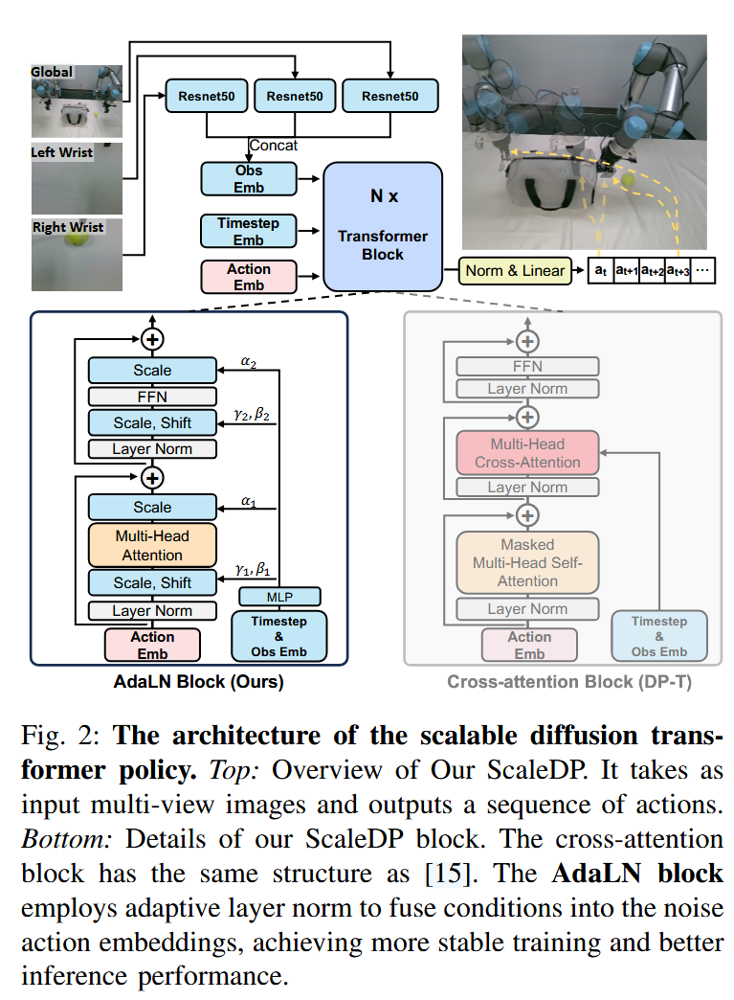

## 训练 Overview

目标：学习如何魔改 VLA，如何写 Trainer 子类。

训练 VLA 的文件参考 train_vla.py，阶段 2 和阶段 3 的训练都用到它。

首先加载配置，传给训练核心入口 train_vla.py:main()。train_vla.py 主要完成如下训练过程：
- **初始化与配置加载** —— 加载任务配置，设置随机种子。
- **数据加载与预处理** —— 加载数据集，使用 `Qwen2VLAProcess` 进行多模态数据预处理。
- **模型加载** —— 使用 `ml_utils.load_model` 加载预训练的视觉-语言模型和扩散专家。
- **训练器初始化与训练** —— 初始化 `QWen2VLATrainer`，调用 `trainer.train` 开始训练。
- **保存训练结果** —— 保存数据集的统计信息和训练后的模型状态。

### 配置加载

main() 执行前，需要准备 all_config 和 model_config。train_vla.py:parse_param() 解析和生成配置。

首先，解析关于参数的数据类 ModelArguments, DataArguments, TrainingArguments, ActionHeadArguments。随后，根据 ActionHeadArguments，使用 AutoConfig 从预训练模型加载参数。最后，如果量化，则设置 bnb_model_from_pretrained_args。

由于使用 transformers.HfArgumentParser 解析，所以可以从命令行传入参数，将脚本中指定的默认字段覆盖。比如，运行时指定 lora 训练：

```bash
  ...
  --lora_enable True \
  ...
  --freeze_vision_tower True \
  --freeze_backbone True \
```

返回参数为 tuple:
- model_args (ModelArguments): Model architecture and configuration arguments
- data_args (DataArguments): Dataset and data processing arguments
- training_args (TrainingArguments): Training hyperparameters and settings
- action_head_args (ActionHeadArguments): Action head model configuration
- config (AutoConfig): Complete model configuration object
- bnb_model_from_pretrained_args (dict): Quantization configuration for model loading

### 数据配置

训练数据通过 `TASK_CONFIGS` 加载配置。此字典在 aloha_scripts/constants.py 文件定义，可以通过添加条目来指定数据加载。

```py
TASK_CONFIGS = {
    'example_tasks': { # for local debug
        'dataset_dir': [
            "/media/rl/HDD/data/data/aloha_data/4_cameras_aloha/folding_shirt"
        ],
        'episode_len': 1000,  
        'camera_names': ['cam_high', 'cam_left_wrist', 'cam_right_wrist'] # replacing with your real keys in h5py formatted data
    }
}
...
```

`TASK_CONFIGS` 包括数据集路径 (dataset_dir)、任务时间步数 (episode_len)、相机视角 (camera_names) 等。

```py
def main():
    ...
    task_config = TASK_CONFIGS[all_config['data_args'].task_name] # 加载指定的任务数据
    dataset_dir = task_config['dataset_dir']
    episode_len = task_config['episode_len']
    camera_names = task_config['camera_names']
    ...
```

`all_config` 根据 `parse_param()` 解析，设置在 train_vla.py 开头的数据类 `ModelArguments`, `DataArguments`, `TrainingArguments`, `ActionHeadArgument`。在设计方面，这里应该单独梳理为一个文件更合适。回到 main()，`all_config['data_args'].task_name` 的 task_name 由 `DataArguments` 决定，可以看到注释，应当对应到 constants.py 文件：

```py
@dataclass
class DataArguments:
    ...
    task_name: str = field(default="stack_cube_2024_6_2") # task name corresponding to aloha_scripts/constants.py
    ...
```

### 数据加载

使用 `load_data` 函数加载训练和验证数据集。

```py
    # load dataset
    train_dataset, val_dataset, stats, sampler_params = load_data(
        dataset_dir,
        name_filter,
        camera_names,
        all_config["training_args"].per_device_train_batch_size,
        all_config["training_args"].per_device_eval_batch_size,
        all_config["data_args"].chunk_size,
        skip_mirrored_data=all_config["data_args"].skip_mirrored_data,
        config=all_config,
        stats_dir_l=stats_dir,
        rank0_print=rank0_print,
        policy_class=all_config["action_head_args"].policy_head_type,
        sample_weights=sample_weights,
        train_ratio=train_ratio,
        llava_pythia_process=vla_process,
    )
```

### 数据预处理

使用 `Qwen2VLAProcess` 对多模态数据（图像和语言指令）进行预处理。

```py
    vla_process = Qwen2VLAProcess(
        tokenizer=tokenizer,
        multimodal_processor=multimodal_processor,
        data_args=all_config["data_args"],
        camera_names=camera_names,
    )
```

### 模型加载

使用 `ml_utils.load_model` 加载预训练的视觉-语言模型（VLM）和扩散专家（Diffusion Expert）。

```py
def load_model(config=None, qwen2_vla_config=None, rank0_print=print, tokenizer=None):
    ...
    if training_args.load_pretrain: # loading pretrained weights
        # 用于加载阶段 3 的训练
        ...
        else:
            model = AutoModelForCausalLM.from_pretrained(
                model_base,
                config=qwen2_vla_config,
                cache_dir=config['training_args'].cache_dir,
                trust_remote_code=True,
                _fast_init=False,
                # attn_implementation="flash_attention_2",
            )
    else:
        # 加载阶段 2 的训练
        ...
        else:
            model = AutoModelForCausalLM.from_pretrained(
                config['model_args'].model_name_or_path,
                config=qwen2_vla_config,
                cache_dir=config['training_args'].cache_dir,
                trust_remote_code=True,
                _fast_init=False,
                # attn_implementation="flash_attention_2",
                # **kwargs, # specified device map and dtype may cause nan initialize
            )
    ...
```

```py
def main(...):
    ...
    # load qwen2_vl tokenizer
    tokenizer = transformers.AutoTokenizer.from_pretrained(
        all_config["model_args"].model_name_or_path,
    )
    # load qwen2_vl input processor
    multimodal_processor = AutoProcessor.from_pretrained(all_config["model_args"].model_name_or_path)
    # load dexvla model
    model, data_args = ml_utils.load_model(
        config=all_config, qwen2_vla_config=model_config, rank0_print=rank0_print, tokenizer=tokenizer
    )
```

### 训练器初始化与训练

接下来，模型调用 `train_bc()`，开始准备训练。

```py
def main(all_config=None, model_config=None):
    ...
    best_ckpt_info = train_bc(
        train_dataset=train_dataset,
        model=model,
        val_dataset=val_dataset,
        config=all_config,
        sampler_params=sampler_params,
        tokenizer=tokenizer,
        processor=multimodal_processor,
    )
    ...
```

使用 `Qwen2VLADataCollatorForSupervisedDataset` 对数据进行整理，生成模型输入。

```py
def train_bc(
    train_dataset=None, val_dataset=None, model=None, config=None, sampler_params=None, tokenizer=None, processor=None
):
    """
    Train a behavior cloning model using the QWen2VLA architecture.
    """
    ...
    data_collator = Qwen2VLADataCollatorForSupervisedDataset(
        multimodal_processor=processor, computed_type=compute_dtype, tokenizer=tokenizer, video=video
    )
```

使用 `QWen2VLATrainer` 初始化训练器，传入模型、数据整理器、训练参数等，开始训练。

```py
    model.config.use_cache = True
    model.config.save_pretrained(config["training_args"].output_dir)

    data_module = dict(train_dataset=train_dataset, data_collator=data_collator, eval_dataset=val_dataset)
    trainer = QWen2VLATrainer(
        model=model, tokenizer=tokenizer, args=config["training_args"], sampler_params=sampler_params, **data_module
    )

    trainer.train(resume_from_checkpoint=config["training_args"].resume_from_checkpoint)
```

### 保存训练结果

保存模型状态和检查点：

```py
def train_bc(...):
    ...
    trainer.save_state()

    model.config.use_cache = True
```

保存统计信息：

```py
def main(...):
    ...
    best_ckpt_info = train_bc(...)

    # exit(0)
    stats_path = os.path.join(all_config["training_args"].output_dir, f"dataset_stats.pkl")
    with open(stats_path, "wb") as f:
        pickle.dump(stats, f)
```

pickle 是标准库内容其一，用于序列化和反序列化 Python 对象。

## 参数配置

ModelArguments, DataArguments 和 ActionHeadArguments 是普通的标注了 `@dataclass` 的数据类，只有 TrainingArguments 除了标注 `@dataclass` ，还继承了 transformers.TrainingArguments。transformers.TrainingArguments 也是普通的类，标注 `@dataclass`。

### 任务参数和模型配置加载

加载任务参数和配置参考 parse_param()。在 main() 中根据参数来执行训练。训练的模型参数参考 all_config 和 model_config。例如，配置数据加载的参数 all_config["data_args"] 由 train_vla.py:class DataArguments 定义，由 transformers.HfArgumentParser() 解析，且命令行参数可以覆盖。以 data_args 为例：

```py
@dataclass
class DataArguments:
    ...
    task_name: str = field(
        default="stack_cube_2024_6_2"
    )  # task name corresponding to aloha_scripts/constants.py
    ...

def parse_param():
    ...
    parser = transformers.HfArgumentParser(
        (ModelArguments, DataArguments, TrainingArguments, ActionHeadArguments)
    )
    model_args, data_args, training_args, action_head_args = (
        parser.parse_args_into_dataclasses()
    )
    ...

if __name__ == "__main__":
    (
        model_args,
        data_args,
        training_args,
        action_head_args,
        model_config,
        bnb_model_from_pretrained_args,
    ) = parse_param()
    config = {
        "model_args": model_args,
        "data_args": data_args,
        "training_args": training_args,
        "action_head_args": action_head_args,
        "bnb_model_from_pretrained_args": bnb_model_from_pretrained_args,
    }
    ...
    main(all_config=config, model_config=model_config)
```

config["data_args"].task_name 可以获得 DataArguments.task_name，或者命令行参数覆盖的名字。

任务名 task_name 要求至少对应 constant.py:TASK_CONFIGS 字典中的一个 key。字典的每个 key 会再对应一个字典，其字典包含 `dataset_dir: list[str]`。dataset_dir 是列表，包含一个或多个目录。每个目录下，可能有多个 episodes 的 HDF5。训练时，选取其中一个任务训练，即一个 task，而 dataset_dir 便是一个 list。

```py
TASK_CONFIGS = {
    'example_tasks': { # for local debug
        'dataset_dir': [
            "/media/rl/HDD/data/data/aloha_data/4_cameras_aloha/folding_shirt"
        ],
        'episode_len': 1000,  
        'camera_names': ['cam_high', 'cam_left_wrist', 'cam_right_wrist'] # replacing with your real keys in h5py formatted data
    }
}
```

比如，dataset_dir 的列表可以包含如下目录，"data/dexvla_example_data"，下面有一个或多个 hdf5 文件。

```
data/dexvla_example_data
├── episode_47.hdf5
├── episode_48.hdf5
├── gitattributes
└── README.md
```

可以看到，任务字典中还有其他 key，比如 "episode_len" 和 "camera_names"。其中，任务配置字典必须要包含 key 为 "dataset_dir", "episode_len", "camera_names"。其余的参数，比如 stats_dir, name_filter 在解析时可以指定默认值。

### 根据任务名加载配置

在 train_vla.py:main() 中，根据 task_name 加载 TASK_CONFIGS[task_name] 的配置：

```py
def main(all_config=None, model_config=None):
    """
    Args:
        all_config (dict): Configuration dictionary containing:
        model_config (AutoConfig): Model configuration object for the Qwen2VLA model
    """
    task_config = TASK_CONFIGS[all_config["data_args"].task_name]
    dataset_dir = task_config["dataset_dir"]
    episode_len = task_config["episode_len"]
    camera_names = task_config["camera_names"]
    stats_dir = task_config.get("stats_dir", None)
    sample_weights = task_config.get("sample_weights", None)
    train_ratio = task_config.get("train_ratio", 0.999)
    name_filter = task_config.get("name_filter", lambda n: True)
    
    all_config["camera_names"] = camera_names
    all_config["episode_len"] = episode_len
    ...
```

all_config 由 ModelArguments, DataArguments, TrainingArguments, ActionHeadArguments 和命令行参数指定，model_config 由下载的预训练模型的配置文件加载，随后根据修改的 action head 来做出修改。

这些配置，会用来加载数据，加载模型。

## 数据加载

### 数据组织：使用 HDF5

与 act 工作的数据格式一致，使用 HDF5。需要准备的 HDF5 数据格式具体如下：

```angular2html
# h5 data structure
root
  |-action (100,10)
  |-language_raw (1,)
  |-substep_reasonings (100,)
  |-observations
      |-images # multi-view
          |-left (100,480,640,3)
          |-right (100,480,640,3)
          |-wrist (100,480,640,3)
      |-joint_positions (100,7)
      |-qpos (100,7)
      |-qvel (100,7)
```

具体解释如下。内容来自猜测和结合 DeepSeek：
- language_raw (1,) —— 原始语言指令，如折叠衬衫。所以当前是一个任务，有一个语言指令，如下每个时间步对应一个子步骤。即此任务的 horizon 为 100。
- substep_reasonings (100,) —— 子步骤推理，每个时间步对应每个子步骤描述。


| 字段               | 形状            | 描述                                   |
| ------------------ | --------------- | -------------------------------------- |
| action             | (100,10)        | 100 表示时间步数，10 表示动作维度。    |
| substep_reasonings | (100,)          | 每个时间步对应一个子步骤推理。         |
| observations       |                 | 表示时间步数，其他维度表示观测数据。   |
| - images           |                 | 表示时间步数，其他维度表示图像数据。   |
| -- left            | (100,480,640,3) | 表示时间步数，480x640 表示图像分辨率。 |
| -- right           | (100,480,640,3) | 表示时间步数，480x640 表示图像分辨率。 |
| -- wrist           | (100,480,640,3) | 表示时间步数，480x640 表示图像分辨率。 |
| - joint_positions  | (100,7)         | 表示时间步数，7 表示关节位置维度。     |
| - qpos             | (100,7)         | 表示时间步数，7 表示关节位置维度。     |
| - qvel             | (100,7)         | 表示时间步数，7 表示关节速度维度。     |

joint_positions 和 qpos 关系：

| 维度     | joint_positions              | qpos                                          |
| -------- | ---------------------------- | --------------------------------------------- |
| 定义     | 关节角度或关节位置。         | 广义坐标位置，可能包含更多自由度信息。        |
| 用途     | 描述机器人的关节状态。       | 描述机器人系统的完整状态。                    |
| 数据范围 | 通常仅包含关节角度。         | 可能包含关节角度、末端执行器位置等信息。      |
| 示例     | 7 自由度的机械臂的关节角度。 | 7 自由度的机械臂的关节角度 + 末端执行器位置。 |

作者使用 rlds_to_h5py 转换，可以参考如何组织为训练需要的 HDF5 文件。RLDS（Reinforcement Learning Dataset）格式是一种专为强化学习设计的数据存储和表示标准，统一了强化学习中的标准。

#### act-plus-plus 数据格式

为了了解数据格式，查看仿真环境下的 mobile aloha 如何数据如何组织。具体参考 record_sim_episodes.py。

```
For each timestep:
observations
- images
    - each_cam_name     (480, 640, 3) 'uint8'
- qpos                  (14,)         'float64'
- qvel                  (14,)         'float64'

action                  (14,)         'float64'
```
所以 14 对应双臂的 7*2。

#### 数据格式配置

在 train_vla.py 中，查看到 ActionHeadArguments 中，state_dim 和 action_dim 分别设置为 7 和 10。在 DataArguments 中，可以看到 image_size_stable 分别设置了相机的尺寸，480 和 56。

### Dataset 和 DataLoader

### 加载数据集：load_data()

加载数据参考 data_utils/utils.py:load_data()。签名如下：

```py
def load_data(
    dataset_dir_l,
    name_filter,
    camera_names,
    batch_size_train,
    batch_size_val,
    chunk_size,
    config,
    rank0_print=print,
    skip_mirrored_data=False,
    policy_class=None,
    stats_dir_l=None,
    sample_weights=None,
    train_ratio=0.99,
    llava_pythia_process=None,
):
    ...
```

调用 load_data() 函数，传入数据集目录、相机名称、批次大小、数据块大小、配置等参数。

```py
def main(all_config=None, model_config=None):
    ...
    # load qwen2_vl tokenizer
    tokenizer = transformers.AutoTokenizer.from_pretrained(
        all_config["model_args"].model_name_or_path,
    )
    # load qwen2_vl input processor
    multimodal_processor = AutoProcessor.from_pretrained(
        all_config["model_args"].model_name_or_path
    )
    # load dexvla model
    model, data_args = ml_utils.load_model(
        config=all_config,
        qwen2_vla_config=model_config,
        rank0_print=rank0_print,
        tokenizer=tokenizer,
    )

    rank0_print(f"{RED} Using Qwen2VLA as VLA backbone {RESET}")
    # load qwen2_vla processor
    vla_process = Qwen2VLAProcess(
        tokenizer=tokenizer,
        multimodal_processor=multimodal_processor,
        data_args=all_config["data_args"],
        camera_names=camera_names,
    )

    # load dataset
    train_dataset, val_dataset, stats, sampler_params = load_data(
        dataset_dir,
        name_filter,
        camera_names,
        all_config["training_args"].per_device_train_batch_size,
        all_config["training_args"].per_device_eval_batch_size,
        all_config["data_args"].chunk_size,
        skip_mirrored_data=all_config["data_args"].skip_mirrored_data,
        config=all_config,
        stats_dir_l=stats_dir,
        rank0_print=rank0_print,
        policy_class=all_config["action_head_args"].policy_head_type,
        sample_weights=sample_weights,
        train_ratio=train_ratio,
        llava_pythia_process=vla_process,
    )
    ...
```

接下来是各个参数的解读。

#### dataset_dir_l: 数据集目录

参数 dataset_dir_l 来自 aloha_scripts/constants.py:TASK_CONFIGS[all_config["data_args"].task_name]["dataset_dir"] 指定。

首先调用 find_all_hdf5，递归遍历指定目录，收集所有符合要求的 HDF5 数据集文件路径。dataset_path_list_list 包含了所有 HDF5 文件路径的字符串的列表。即 list[list[str]]。

第一个数据目录为主数据，其 episodes 数量记为 num_episodes_0.调用 np.random.permutation(num_episodes_0)，打乱主数据集 dataset_dir_l[0]。按 train_ration (default 0.99) 划分训练集和验证集。其他数据集的数据（如多任务数据），即 dataset_dir_l[1:]，直接全量加入训练。

使用一维的列表 num_episodes_l 记录每个任务的 episodes 数量。再使用 num_episodes_cumsum = np.cumsum(num_episodes_l)，计算每条 episodes 的 end 位置。紧接着，生成全局统一的训练集和验证集 Episode ID，确保数据索引的连贯性。id 即在展平后 episodes 列表下标。训练集的下标中，train_episode_id_l 是一维的 episodes 列表的下标。最后处理的 train_episode_ids 是一维的 np.Array，对应下标。

二维的 dataset_path_list_list 展平为一维的列表 dataset_path_list，调用 get_norm_states()，但是用到了计算每条 episodes 的长度。长度 all_episode_len 是一维的，标识了每条 episode 长度。随后再分别为训练和验证的 episode 计算各自的 len，参考记录的 id。最后得到 train_episode_len 等。最后，再调用 get_norm_stats() 统计 states_dir 内容的数据，states_dir 在 constants.py 的任务字典下，与 dataset_dir 平行。

创建 EpisodicDataset() 实例：将 HDF5 文件路径列表（可能有多个 hdf5 文件）、摄像头名称、标准化统计量等参数传入构造函数。在类中，完成从 HDF5 文件加载图像、状态、动作数据，进一步做图像增强、归一化等预处理。传入参数方面，传入的数据都是一维的 HDF5 对应的每条 episode 路径，长度等。

最后返回
- train_dataset, val_dataset: EpisodicDataset 对象，用于加载数据。
- norm_states 提供将动作、关节状态的全局统计信息，用于归一化到如 [-1, 1]，确保稳定性和可比性。一般包括各参数的 mean, std, min, ma,。
- sampler_params 定义训练和验证数据加载的配置参数，指导数据采样器，为生成批次准备。

## EpisodicDatase

构造函数传入的参数，重点关注：
- episode_len: list[int] 决定了每个 episode 的长度。

研究方式：从存储方式、获取数据（`__getitem__()`）的格式入手。

### 存储方式和采样数据

数据存储在 HDF5 文件中，使用 h5py 库加载。每次需要 getitem 时，都会从 HDF5 文件中读取数据，而不是保存一个 buffer 

如果使用基于 Transformer 的 diffusion policy，需要增强图像。

_locate_transition() 返回索引的 episode 中的一条时间步对应的数据。首先找到 index 对应的内容。

self.llava_pythia_process 使用了 Qwen2VLAProcess() 对象。

### getitem() 数据组织流程

1.  **定位与加载原始数据**:
    * 根据请求的全局索引 (`index`)，通过 `_locate_transition` 找到对应的 HDF5 文件 (`episode_id`) 和该文件内的起始时间步 (`start_ts`)。
    * 调用 `load_from_h5` 从 HDF5 文件加载以下原始数据：
        * `start_ts` 时刻的机器人状态 (`qpos`, `qvel`)。
        * `start_ts` 时刻的所有摄像头图像 (`image_dict`)，并进行初步 resize。
        * 该 episode 的完整动作序列 (`action`)。
        * 原始语言指令 (`raw_lang`)。
        * 如果需要，加载子步骤推理文本 (`reasoning`)。

2.  **初步处理与打包**:
    * **动作处理**:
        * 截取 `start_ts` 之后的相关动作序列。
        * 将动作序列填充或截断至固定长度 (`chunk_size`)。
        * 生成 `is_pad` 掩码，标记填充部分。
        * (可选) 如果 `delta_control` 为 True，将动作转换为差分形式 (`action[t] - action[t-1]`)。
    * **图像处理**: 将各摄像头图像堆叠 (`np.stack`)。
    * **Tensor 转换**: 将处理后的图像、状态 (`qpos`)、动作、掩码转换为 PyTorch Tensors。
    * **图像增强**: 如果 `self.augment_images` 为 True (通常用于 Diffusion Policy)，应用随机裁剪、旋转、颜色抖动等变换。
    * **数据标准化/归一化**:
        * 使用 `norm_stats` 对 `qpos_data` 进行 Z-score 标准化。
        * 使用 `norm_stats` 对 `action_data` 进行 Min-Max 归一化到 `[-1, 1]` 区间。
    * **创建中间 `sample` 字典**: 包含初步处理后的 `image`, `state` (qpos), `action`, `is_pad`, `raw_lang`, `reasoning`。

#### Qwen2VLAProcess

**调用 `Qwen2VLAProcess.forward_process()` 进行最终处理**:
* 将上一步得到的 `sample` 字典传递给 `forward_process`。
* **图像最终处理**:
    * 对 `sample['image']` 中的每个视角图像张量，调用 `qwen2_image_preprocess` 进行 Qwen2-VL 特定的预处理（包括转换回 PIL Image，根据相机类型 resize，应用 `Workspace_image` 处理）。
    * 收集处理后的图像列表 `images_list`。
* **文本与消息格式化**:
    * 调用 `datastruct_droid2llava` 将 `sample` 中的图像占位符和 `raw_lang` 格式化为 Qwen2-VL 对话模板所需的 `messages` 结构。
    * 使用 `multimodal_processor.apply_chat_template` 生成模型所需的文本提示部分 (`text`)。
* **构建多模态输入**:
    * 使用 `multimodal_processor` 将格式化的 `text` 和处理后的 `images_list` 整合为最终的模型输入 `model_inputs` (包含 `input_ids`, `attention_mask`, `pixel_values` 等)。
* **生成 LMM 训练标签 (`labels`)**:
    * 构建期望的回答文本 `answer`，可能包含 `reasoning` 和固定的 "Next action:<|im_end|>"。
    * 将 `answer` 分词。
    * 将 `model_inputs` 中的 `input_ids` 和 `attention_mask` 与 `answer` 的分词结果拼接。
    * 创建 `labels`：将 `-100` (忽略损失计算的 token) 组成的序列与 `answer` 的 `input_ids` 拼接。
* **构建最终输出字典 (`data_dict`)，这是模型最终需要的输入，DataLoader 最终会获取这些字典**:
    * 从输入的 `sample` 复制 `state`, `action`, `is_pad`。
    * 添加生成的 `labels`。
    * 将 `model_inputs` 字典中的所有内容 (如 `input_ids`, `attention_mask`, `pixel_values`) 添加到 `data_dict` 中。
* 返回包含模型所需全部输入的 `data_dict`。

这个 `data_dict` 就是最终输入 Qwen2VLA 模型进行训练的单一样本数据。具体格式参考如下，假设 DataLoader 组合为批次大小 B：
* **`input_ids`**:
    * **作用**: 模型的文本和图像位置编码输入序列。包含了格式化后的自然语言指令、图像占位符 token，以及用于监督学习的期望回答（推理文本 + "Next action:<|im_end|>") 的 token ID。
    * **Shape**: `(B, sequence_length)`
    * **数据类型**: `torch.int64`
    * **说明**: `sequence_length` 是整个输入序列（文本+图像标记+回答）的总长度，通常会被填充 (pad) 到模型的最大长度 (`model_max_length`, 默认 2048)。

* **`attention_mask`**:
    * **作用**: 指示模型在计算注意力时应该关注哪些 `input_ids` 中的 token (1 表示关注, 0 表示忽略，通常用于标记填充部分)。
    * **Shape**: `(B, sequence_length)`
    * **数据类型**: `torch.int64` (或 `torch.float32`, 取决于具体实现)
    * **说明**: 长度与 `input_ids` 相同。

* **`pixel_values`**:
    * **作用**: 经过预处理（缩放、归一化等）后的图像数据，作为视觉部分的输入。
    * **Shape**: `(B, num_cameras, num_channels, height, width)`
    * **数据类型**: `torch.float32`
    * **说明**:
        * `num_cameras` 是使用的摄像头数量 (由 `camera_names` 列表长度决定, 示例中为 3)。
        * `num_channels` 通常是 3 (RGB)。
        * `height` 和 `width` 是 Qwen2-VL 模型 Vision Tower 所期望的输入图像分辨率 (例如 448x448，具体值取决于 `qwen2_image_preprocess` 和 Qwen2-VL processor 的内部实现)。

* **`labels`**:
    * **作用**: 用于计算语言模型损失的目标标签。对于输入提示部分，标签通常设为 -100 (忽略计算损失)；对于期望的回答部分（推理文本 + "Next action:<|im_end|>"），标签是对应的 token ID。
    * **Shape**: `(B, sequence_length)`
    * **数据类型**: `torch.int64`
    * **说明**: 长度与 `input_ids` 相同。

* **`state`**:
    * **作用**: 归一化后的机器人状态（关节位置 `qpos`），作为 Diffusion Expert (动作头) 的条件输入之一。
    * **Shape**: `(B, state_dim)`
    * **数据类型**: `torch.float32`
    * **说明**: `state_dim` 在 `ActionHeadArguments` 中定义 (默认 7)。

* **`action`**:
    * **作用**: 归一化后的目标动作序列 (或动作差分序列)，用于计算 Diffusion Policy 的损失。
    * **Shape**: `(B, max_episode_len, action_dim)`
    * **数据类型**: `torch.float32`
    * **说明**:
        * `max_episode_len` 是预测的动作序列长度 (来自 `DataArguments`, 默认 16)。
        * `action_dim` 是动作空间的维度 (来自 `ActionHeadArguments`, 默认 10)。

* **`is_pad`**:
    * **作用**: 标记 `action` 序列中的哪些时间步是填充的 (因为原始 episode 可能比 `max_episode_len` 短)。其中，is_pad[action_len:] = 1。
    * **Shape**: `(B, max_episode_len)`
    * **数据类型**: `torch.bool`

**初始化**

最后获取字典 sample，并传递给 qwen2_vla/utils/robot_data_processor.py:class Qwen2VLProcessor.forward_process()。处理多模态输入，方便送入模型的训练。

Qwen2VLProcessor 构造时接受参数:
- tokenizer: 从预训练模型加载。
- multimodal_processor: 同上。
- data_args: 参考 all_config，即 DataArguments。
- camera_names: TASK_CONFIGS[task_name] 指定的配置。

```py
    # load qwen2_vl tokenizer
    tokenizer = transformers.AutoTokenizer.from_pretrained(
        all_config["model_args"].model_name_or_path,
    )
    # load qwen2_vl input processor
    multimodal_processor = AutoProcessor.from_pretrained(
        all_config["model_args"].model_name_or_path
    )
    # load dexvla model
    model, data_args = ml_utils.load_model(
        config=all_config,
        qwen2_vla_config=model_config,
        rank0_print=rank0_print,
        tokenizer=tokenizer,
    )

    rank0_print(f"{RED} Using Qwen2VLA as VLA backbone {RESET}")
    # load qwen2_vla processor
    vla_process = Qwen2VLAProcess(
        tokenizer=tokenizer,
        multimodal_processor=multimodal_processor,
        data_args=all_config["data_args"],
        camera_names=camera_names,
    )    
```

Qwen2VLAProcess 通过 datastruct_droid2llava() 方法组织多模态的 prompt。

```py
class Qwen2VLAProcess:
    ...
    def forward_process(self, sample, use_reasoning=True):
        ...
        text = self.multimodal_processor.apply_chat_template(
            messages, tokenize=False, add_generation_prompt=True
        )

        model_inputs = self.multimodal_processor(
            text=text,
            images=image_data,
            videos=video_inputs,
            padding=True,
            return_tensors="pt",
        )
        ...
```

其中，self.multimodal_processor 是 transformers.AutoProcessor.from_pretrained() 加载的。对应 Qwen2-VL 模型的预处理器。sample 是数据集返回的字典，包含了图像、状态、动作等信息。具体如下：

```py
        sample = {
            "image": image_data,
            "state": qpos_data,
            "action": action_data,
            "is_pad": is_pad,
            "raw_lang": raw_lang,
            "reasoning": reasoning,
        }
```

## 扩散专家：ScaleDP

注意，基于 Transformer 的扩散策略对训练参数敏感。

### 输入与输出

### Attention

自定义实现的 Attention 中，是一个自注意力机制的 Attention。实现时，指定类属性：

```py
class Attention(nn.Module):
    fused_attn: Final[bool]

    def __init__(self, ...) -> None:
        super().__init__()
        ...
        self.fused_attn = use_fused_attn()
        ...
```

use_fused_attn() 是 timm 库提供的环境兼容性检测函数，允许用户通过全局配置强制启用/禁用（如 timm 的 FUSED_ATTENTION 标志），减少硬编码依赖。self.fused_attn 是布尔值，动态选择是否启用融合优化的注意力计算。在支持优化的环境（最新 PyTorch 和 CUDA GPU），启用融合，可以提升性能。

如果 self.fused_attn，可以直接用 F.scaled_dot_product_attention()，通常**​​有高度优化的底层实现**。

输入格式：forward() 输入 x 为 shape (B, N, C)。attn_mask 中，-inf 代表遮掩。

### TimestepEmbedder

针对扩散时的时间步，嵌入标量的时间步到向量表示。参考了 OpenAI 的 [glide_text2im](https://github.com/openai/glide-text2im/blob/main/glide_text2im/nn.py)。作用是创建 sinusoidal timestep embeddings。将离散的时间步编码为连续向量表示，给模型提供时间感知能力。额外使用了 MLP 增强，兼顾平滑性与表达能力。正弦编码对时间步绝对位置不敏感，更关注相对位置关系。

$$
\mathrm{embedding}[i] = \left\{
\begin{array}{ll}
\sin\left(t \cdot \frac{1}{10000^{i/\dim}}\right) & \text{if } i \text{ 是偶数} \\
\cos\left(t \cdot \frac{1}{10000^{(i-1)/\dim}}\right) & \text{if } i \text{ 是奇数}
\end{array}
\right.
$$

注意，由于预测动作有 horizon，所以都会对 x 使用绝对编码，对扩散时间步才使用相对位置编码。

输入格式：forward() 输入 t 为 shape (B,)，对应扩散时间步。

### ScaleDPBlock



使用了多层的 ScaleDPBlock。借鉴了 ScaleDP 的工作，使用 Adaptive Layer Norm (DiT 也用到)。参考： <[[ScaledDP_Scaling_Diffusion_Policy_in_Transformer_to_1B|robotics.ScaledDP_Scaling_Diffusion_Policy_in_Transformer_to_1B#^arh7om3id148]]>

```py
def modulate(x, shift, scale):
    return x * (1 + scale.unsqueeze(1)) + shift.unsqueeze(1)

class ScaleDPBlock(nn.Module):
    """
    A ScaleDP block with adaptive layer norm zero (adaLN-Zero) conScaleDPioning.
    """
    def __init__(self, hidden_size, num_heads, mlp_ratio=4.0, **block_kwargs):
        super().__init__()
        self.norm1 = nn.LayerNorm(hidden_size, elementwise_affine=False, eps=1e-6)
        self.attn = Attention(
            hidden_size, num_heads=num_heads, qkv_bias=True, **block_kwargs
        )
        self.norm2 = nn.LayerNorm(hidden_size, elementwise_affine=False, eps=1e-6)
        mlp_hidden_dim = int(hidden_size * mlp_ratio)
        approx_gelu = lambda: nn.GELU(approximate="tanh")
        # Mlp [fc1, act, drop1, norm, fc2, drop2]
        self.mlp = Mlp(
            in_features=hidden_size,
            hidden_features=mlp_hidden_dim,
            act_layer=approx_gelu,
            drop=0,
        )
        self.adaLN_modulation = nn.Sequential(
            nn.SiLU(), nn.Linear(hidden_size, 6 * hidden_size, bias=True)
        )

    def forward(self, x, c, attn_mask=None):
        # c shape 为 (batch_size, horizon, cond_dim)，dim=1 代表逐维度的
        # modulate self attention 等 shift_*, scale_*, gatej_* 的 shape (B, N, 6 * C).chunk(6, dim=1)
        # chunk(6, dim=1) 代表前两个维度不变，在最后一个维度上，即列上拆分为 6 份。即：
        # (B, N, (C0 C1 C2 C3 C4 C5)) -> (B, N, C0) (B, N, C1), ..., (B, N, C5)
        shift_msa, scale_msa, gate_msa, shift_mlp, scale_mlp, gate_mlp = (
            self.adaLN_modulation(c).chunk(6, dim=1)
        )
        x = x + gate_msa.unsqueeze(1) * self.attn(
            # norm first
            modulate(self.norm1(x), shift_msa, scale_msa), attn_mask=attn_mask
        )  # norm, scale&shift, attn, scale,
        x = x + gate_mlp.unsqueeze(1) * self.mlp(
            modulate(self.norm2(x), shift_mlp, scale_mlp)
        )
        return x
```

最后一层 FinalLayer 则是经过一个 LayerNorm，接着用上 Adaptive 的 scale 和 shift 处理，最后由一个线性层输出。不同的是，没有了 gate 部分。

### 整合：ScaleDP

ScaleDP 配置默认 n_obs_steps 为 2，时间步为 T_cond = 1，obs_as_cond 默认 True。在网络部分，包含了：
- self.combine (三层的 MLP)
- self.x_embedders (nn.Linear)
- self.t_embedder (TimestepEmbedder)
- self.cond_obs_emb (nn.Linear)
- self.pos_embed (nn.Parameter)
- self.blocks (多层的 ScaleDPBlock)
- self.final_layer (FinalLayer)
- self.noise_scheduler (DDIMScheduler)

#### forward()

接收参数：
- actions (of shape (batch_size, action_horizon, action_dim))：学习时的目标动作。action_dim 配置于 config.output_dim，3+6+1=10。只使用前 num_queries 条参与训练，对应配置中 prediction_horizon。推理阶段传入 None 即可。
- hidden_states (of shape (batch_size, num_tokens, hidden_dim)): 在 VLA 中，VLM 最后一层 decoder layer 输出的 hidden_states，经过线性层 lm_head 输出为 logits，再传给 Fusion 模块后，shape (batch_size, hidden_dim)
- states (batch_size, states_dim)：通常是 14 维，包含机器人当前物理状态，比如关节状态（角度、速度和扭矩）、末端执行器状态等。
- is_pad (of shape (batch_size, Ta))：actions 小于 16 或开头部分长度不够 16，需要填充。is_pad 用于标识哪些部分是填充。
- 返回：训练时返回 loss，推理时返回动作。

#### model_forward()

预测 epsilon，接收参数：
- x (Tensor of shape (batch_size, T, input_dim)) noisy actions
- t (Union[Tensor of shape (batch_size,), int]) timesteps
- global_cond (Tensor of shape (batch_size, n_obs_steps, hidden_dim)): 图像嵌入等 action_hidden_states
- states

如果传入的 states 不是 None，那么在最后一维拼接 global_cond 与 states。经过 self.combine 网络处理，得到最后的 global_cond 条件。紧接着，处理动作的嵌入和时间步嵌入，位置编码，还有编码条件。最后把时间步编码与条件编码相加，感觉似乎过于简陋了。

### 配置文件 ScaleDPPolicyConfig

- prediction_horizon (int)：预测范围，默认 16。传入的 actions 小于时，需要 padding。大于则截断。

## VLM: Qwen2-VL

使用 [Qwen2-2B-VL](https://huggingface.co/Qwen/Qwen2-VL-2B-Instruct) 作为主干网络。也许可以尝试 [Qwen/Qwen2.5-VL-3B-Instruct](https://huggingface.co/Qwen/Qwen2.5-VL-3B-Instruct)。

模型结构，在 VLM 末尾增加一个 policy head；而 Helix 直接输出 token，当作 policy 模型的 latent vector。

作者把 transformers/models/qwen2_vl 目录下的文件都复制到乐项目中，改造以适应 DexVLA，包括 configs.json。

## 把扩散专家接到 Qwen2-VL 上

项目文件 qwen2_vla/models/modeling_qwen2_vla.py 和 qwen2_vla/models/configuration_qwen2_vla.py 改造了 Qwen2-VL 的源码和配置。两个文件都是从 huggingface 的 transformers 库中 transformers/models/qwen2_vl/modeling_qwen2_vl.py 和对应 configuration_qwen2_vla.py 复制而来，并根据需求做出修改。

### 扩散专家与 VLM 的连接

- 输入投影层：在 VLM 模型的输出部分，扩散专家通过一个输入投影层（input_action_proj）将 VLM 的隐藏状态（hidden states）映射到扩散专家的输入空间。这个投影层通常由两个线性层（MLP）组成，带有 LayerNorm 归一化。
- FiLM 层：如果启用了 FiLM（Feature-wise Linear Modulation）机制，扩散专家还会通过 FiLM 层将 VLM 的推理信息（reasoning tokens）注入到扩散专家的动作生成过程中。FiLM 层通过缩放和偏移参数来调整扩散专家的输出。

关键代码片段：

在文件末尾的 Qwen2VLForConditionalGenerationForVLA 中，作者做出了修改。原版千问模型的只有 self.visual, self.model, self.vocab_size, self.lm_head, self.rope_deltas 等 fields。作者添加了 self.padding_side, self.using_file, ...。

#### 结合扩散专家的 VLA 模型初始化

```py
class Qwen2VLForConditionalGenerationForVLA(Qwen2VLPreTrainedModel, GenerationMixin):
    """
    类属性。这是 Huggingface Transformers 库的特殊属性，要求指定模型需要绑定的权重。
    权重绑定是常见的优化技术，特别是语言模型，输入嵌入层和输出层的权重可以共享，减少模型参数，提高训练效率。
    库的权重绑定通过 `tie_weights()` 方法实现，模型初始化时，库自动查找 _tied_weight_keys，将权重绑定一起。
    本例中，"lm_head.weight" 与 "embedJ_tokens.weight" 绑定在一起。尽管 self.lm_head 定义为
            self.lm_head = nn.Linear(config.hidden_size, config.vocab_size, bias=False)
    实际并未只想新的 nn.Linear 模块，而是嵌入层的对应的权重。
    """
    _tied_weights_keys = ["lm_head.weight"]

    def __init__(self, config):
        ...
        # 初始化 policy_head，对应扩散专家
        # policy_head_config 配置参考 train_vla.py:class ActionHeadArguments，会被解析为类 dict 类型
        if isinstance(config.policy_head_config, dict):
            config.policy_head_config = AutoConfig.for_model(**config.policy_head_config)
        self.policy_head = AutoModel.from_config(config=config.policy_head_config)

        self.lm_head = nn.Linear(config.hidden_size, config.vocab_size, bias=False)

        self.post_init()
        if config.policy_head_config.model_type == "scale_dp_policy":
            self.policy_head.init_weights()
        # 输入投影层，来自于 Fusion 模块
        self.input_action_proj = ActionProjector(config.hidden_size, config.hidden_size)

        # 是否使用 film 来 fusion，默认使用 using_film
        if self.using_film:
            # Initialize projection layers and condition modulation layers
            # 嵌入 condition，即文本的 embedding。主要是放缩和偏移。
            self.reasoning_action_proj = ActionProjector(config.hidden_size, config.hidden_size)
            self.reasoning_film = FiLM(feature_dim=config.hidden_size, condition_dim=config.hidden_size)
```

#### 在 forward() 中调用扩散专家

`forward()` 在原版本上做出了修改。主要添加了衔接扩散专家部分。包含将 `hidden_states` 等信息传给扩散专家。注意，输入是 input_ids，ids 通常代表 IDs，identifiers 缩写。

```py
    def forward(
        self,
        input_ids: torch.LongTensor = None, 
        ...
        labels: Optional[torch.LongTensor] = None, 
        ...
    ) -> Union[Tuple, Qwen2VLCausalLMOutputWithPast]:
        ...
        outputs = self.model(
            input_ids=None,
            position_ids=position_ids,
            attention_mask=attention_mask,
            past_key_values=past_key_values,
            inputs_embeds=inputs_embeds,
            use_cache=use_cache,
            output_attentions=output_attentions,
            output_hidden_states=True,
            return_dict=return_dict,
        )

        # VLA 输出的内容，outputs[0] 代表最后一层影藏状态，即 hidden_states
        # 结构是 (batch_size, seq_len, hidden_size)
        hidden_states = outputs[0]
        if tinyvla: # dex-vla supports tinyvla-style VLA
            return hidden_states

        # 把隐藏状态传给嵌入层，得到 logits。到此 Qwen2-VL 已经完成文本生成。只需要 tokenizer decode 即可得到文本。
        logits = self.lm_head(hidden_states)
        logits = logits.float()

        llm_loss = None
        # 如果传入了 labels，那么与 label 求交叉熵，以训练 VLM
        # 未传入 labels 代表仅推理，loss 为 None
        if labels is not None:
            # Shift so that tokens < n predict n
            shift_logits = logits[..., :-1, :].contiguous()
            shift_labels = labels[..., 1:].contiguous()
            # Flatten the tokens
            loss_fct = CrossEntropyLoss()
            shift_logits = shift_logits.view(-1, self.config.vocab_size)
            shift_labels = shift_labels.view(-1)
            # Enable model parallelism
            shift_labels = shift_labels.to(shift_logits.device)
            llm_loss = loss_fct(shift_logits, shift_labels)
        ...
        # 使用 FiLM 融合
        if self.using_film:
            # DexVLA 需要使用 using_film，所以用此分支。
            # hidden_states 维度：(batch_size, hidden_dim)
            # 不用最后一层的 logits
            action_hidden_states = self.film_forward(
                labels=labels, input_ids=input_ids, hidden_states=hidden_states
            )
        else:
            # (batch_size, sequence_length, hidden_dim)
            action_hidden_states = hidden_states

        ret = self.policy_head(
            actions=actions,
            hidden_states=action_hidden_states,
            states=states,
            is_pad=is_pad,
        )
        loss = {'loss': ret['loss'] + self.llm_loss_weight * llm_loss,
                'llm_loss': llm_loss,
                'action_loss': ret['loss']}
        # 以 Tuple 返回
        if not return_dict:
            output = (logits,) + outputs[1:]
            return (loss,) + output if loss is not None else output
        ...
        return Qwen2VLCausalLMOutputWithPast(loss=loss, logits=logits, ...)
```

模型的输出中，`output[0]` 代表最后一层的 hidden_states。根据源码，在 `Qwen2VLModel:forward()` 中，参数 `return_dict` 默认为 None，所以返回 `Tuple`，具体如下：

```py
if not return_dict:
    return tuple(
        v
        for v in [hidden_states, next_cache, all_hidden_states, all_self_attns]
        if v is not None
    )
```

`all_hidden_states` 包含了最后一层的 `hidden_states`。

总结，扩散专家使用了动作、动作隐藏状态和状态 states 作为输入。其中，动作隐藏状态 (action_hidden_states) 使用了 Qwen2-VL 的 logits，可能进一步与 labels、输入进行 FiLM fusion，得到 action_hidden_states。

#### 使用 FiLM 集成 LLM 的 logits

如果指定了配置 `using_film`，则使用 `film_forward()` 把输入、labels 和隐藏状态一起编码，最后输出 action_hidden_states, shape (batch_size, 1, hidden_dim)，把 num_tokens 压缩为了 1，提取和融合了语言的信息。

计算掩码：

```py
    def film_forward(self, labels, input_ids, hidden_states):
        # input_ids, labels (B, N, D), hidden_states (B, N, D)
        # input_ids 是 forward() 传来的，是 Tokenizer 处理提示词后得到的 token id。shape 为 (batch_size, seq_len)
        # 关于标签与 -100 比较，为了获取掩码位置，用于 BERT 类型的方式来训练。
        # 创建布尔掩码，标记标签中需要忽略的位置。(B, N)
        inputs_index = labels[:, :] == -100
        inputs_index = inputs_index.int()
```

Qwen2VLForConditionalGeneration 类的 forward() 中，指出 labels 参数应该是 (batch_size, sequence_length) 的 torch.LongTensor。labels 用于计算 masked language modeling loss。内容应该是 [0, ..., config.vocab_size]，计算 loss；或 -100 (具体参考 input_ids 的 docstring) 代表 masked，不计算 loss。了解是掩码足矣。

检测序列变化边界:

```py
        # 比较相邻位置掩码，若不同为 1，相同为 0。用于定位序列中有效部分与填充部分边界。
        # 比如 [0, 0, 1, 1, 0, 1, 0]，异或比较如下：
        #      [0, 1, 1, 0, 1, 0]
        # 得到 [0, 1, 0, 1, 1, 1]
        xor_array = torch.bitwise_xor(inputs_index[:, :-1], inputs_index[:, 1:])
        # 得到的 indexs of shape (batch_size,)，每个位置代表第一个出现 1 的地方
        # indexs 用于找到样本中第一个发生变化的索引，即有效部分结束位置。
        # 比如 -100 掩码只加载到句子的中间，后面也会被截断，不考虑。
        indexs = torch.argmax((xor_array != 0).float(), dim=1)
```

分阶段提取特征:

```py
        input_embeddings = []
        reasoning_embeddings = []
        identity = []
        # indexs.shape[0] 代表 batch_size。最后，input_embeddings，identiy 和 reasoning_embeddings 包含了 B 个张量
        for i in range(indexs.shape[0]):
            end = indexs[i] + 1 # 有效部分结束位置
            temp = input_ids[i] == 151643  # pad token id for qwen2_vl
            start = sum(temp.int()) # 填充数量，对应有效部分起始下标
            input_embeddings.append(
                # ActionProjector()
                # 返回 (1, hidden_dim)
                self.input_action_proj(hidden_states[i, start:end, :])
            )
            # 有效部分的平均隐藏状态
            identity.append(
                # 提取身份、辨识信息，返回得到一维的张量 (hidden_dim,)
                # 注意看 dim=0，代表从 start:end 切片部分，按列计算均值
                torch.mean(hidden_states[i, start:end, :], dim=0)
            )
            # 
            reasoning_embeddings.append(
                # 剩余有效部分的隐藏状态用于投影推理部分，并且包含上下文信息，十分重要。
                # 猜测用 -100 作为掩码，界定输入的任务部分和推理子步骤部分
                # 返回 (1, hidden_dim)
                self.reasoning_action_proj(hidden_states[i, end:, :])
            )
```

self.input_action_proj 和 self.reasoning_action_proj 用于提取信息，输出 (1, hidden_dim)。

拼接与 FiLM 特征融合：

```py
        # 拼接与调制
        # (B, hidden_dim)
        input_embeddings = torch.cat(input_embeddings, dim=0)
        # (B, hidden_dim)
        reasoning_embeddings = torch.cat(reasoning_embeddings, dim=0)
        # 由于 identity 列表中全是 (hidden_dim,) 的 shape，所以用 stack
        # (B, hidden_dim)
        identity = torch.stack(identity)
        # FiLM 接受输入嵌入和推理嵌入，生成条件化特征表示。
        # 公式： output= x * (1 + scale) + shift
        # (B, 1, hidden_dim)
        action_hidden_states = self.reasoning_film(
            input_embeddings, reasoning_embeddings # both of shape (B, hidden_dim)
        ).unsqueeze(1)
        # (B, hidden_dim)
        action_hidden_states = action_hidden_states + identity.unsqueeze(1)
        return action_hidden_states
```

这样输出最后是 (batch_size, 1, hidden_dim) 的形状。把 num_tokens 压缩为 1 了。

#### Fusion 模块

```py
class ActionProjector(nn.Module):
    def __init__(self, in_dim, out_dim=1024):
        super(ActionProjector, self).__init__()
        self.global_1d_pool = nn.AdaptiveAvgPool1d(1)
        self.mlps = nn.ModuleList([
            # nn.LayerNorm(in_dim),
            nn.Linear(in_dim, in_dim),
            nn.GELU(),
            nn.Linear(in_dim, out_dim),
            nn.Dropout(0.0),
        ])

    def forward(self, x):
        x = self.global_1d_pool(x.permute(1, 0)).permute(1, 0)
        for mlp in self.mlps:
            x = mlp(x)
        return x
```

使用全局池化，self.global_1d_pool = nn.AdaptiveAvgPool1d(1) 将输入最后一维压缩为 1，提取输入特征的全局信息，减少序列长度对特征表示的影响。在 VLA 模型中，in_dim 和 out_dim 都是 hidden_size。输入的 x of shape (n, hidden_dim)，经过转置为 (hidden_dim, n)，输出 (hidden_dim, 1)，再转置，x 最终为 (1, hidden_dim)。再经过 self.mlps，得到 (1, hidden_dim)。

为什么需要设计 ActionProjector？ActionProjector 模块能够将输入维度的特征映射到目标维度。通过全局池化，再通过线性层和非线性激活函数 GELU，增强表达能力，保留非线性关系，从而提取全局信息，方便后续嵌入扩散专家。

TODO：研究 Fusion，为何有效。还有思路。

经过 ActionProjector 提取信息后，传入给 reasoning_film 的有 input_embeddings 和 reasoning_embeddings，前者用于输入，后者是条件推理。输入和推理的 token 界定，在 labels 处以掩码确定。再从 hidden_states 中找到对应的部分，输入和输出的部分。

#### evaluate() 方法

forward() 并没有返回生成的动作，而是 loss。这是由于训练扩散模型的要求。evalute() 方法则返回了动作和文本输出。

generate() 指定了 num_beams=1, return_dict_in_generate=True 和 output_hidden_states=True，返回更多输出。输出数据类 GenerateBeamDecoderOnlyOutput，包含一些字段。用到的包括字典中如下字段：
- sequences (torch.LongTensor of shape (batch_size*num_return_sequences, sequence_length)))：自回归生成的文本
- hidden_states (tuple(tuple(torch.FloatTensor)))：每层的隐藏状态。是一个元组，每个元素对应每个输出（比如批次大小乘以返回序列数）的 tokens，内部的元组对应每层 decoder 的输出（如果只需要最后的 logits，取 -1 下标即可），decoder 输出内容是 torch.FloatTensor of shape (batch_size * num_beams * num_return_sequences, generated_length, hidden_size)。

#### 对比原版文件，做出了哪些修改

##### forward() 参数

```py
class Qwen2VLForConditionalGenerationForVLA(Qwen2VLPreTrainedModel, GenerationMixin):
    ...
    def forward(
        self,
        input_ids: torch.LongTensor = None,
        attention_mask: Optional[torch.Tensor] = None,
        position_ids: Optional[torch.LongTensor] = None,
        past_key_values: Optional[List[torch.FloatTensor]] = None,
        inputs_embeds: Optional[torch.FloatTensor] = None,
        labels: Optional[torch.LongTensor] = None,
        use_cache: Optional[bool] = None,
        output_attentions: Optional[bool] = None,
        output_hidden_states: Optional[bool] = None,
        return_dict: Optional[bool] = None,
        pixel_values: Optional[torch.Tensor] = None,
        pixel_values_videos: Optional[torch.FloatTensor] = None,
        image_grid_thw: Optional[torch.LongTensor] = None,
        video_grid_thw: Optional[torch.LongTensor] = None,
        rope_deltas: Optional[torch.LongTensor] = None,
        actions: Optional[torch.LongTensor] = None,
        states: Optional[torch.FloatTensor] = None,
        is_pad: bool = False,
        is_eval: bool = False,
        tinyvla: bool = False,
    ) -> Union[Tuple, Qwen2VLCausalLMOutputWithPast]:        ...
        ret = self.policy_head(actions=actions, hidden_states=action_hidden_states, states=states, is_pad=is_pad)
        ...
```

对比 Qwen2VL 的 API，洞察修改部分。

```py
class Qwen2VLForConditionalGeneration(Qwen2VLPreTrainedModel, GenerationMixin):
    ...
    def forward(
        self,
        input_ids: torch.LongTensor = None,
        attention_mask: Optional[torch.Tensor] = None,
        position_ids: Optional[torch.LongTensor] = None,
        past_key_values: Optional[List[torch.FloatTensor]] = None,
        inputs_embeds: Optional[torch.FloatTensor] = None,
        labels: Optional[torch.LongTensor] = None,
        use_cache: Optional[bool] = None,
        output_attentions: Optional[bool] = None,
        output_hidden_states: Optional[bool] = None,
        return_dict: Optional[bool] = None,
        pixel_values: Optional[torch.Tensor] = None,
        pixel_values_videos: Optional[torch.FloatTensor] = None,
        image_grid_thw: Optional[torch.LongTensor] = None,
        video_grid_thw: Optional[torch.LongTensor] = None,
        rope_deltas: Optional[torch.LongTensor] = None,
        cache_position: Optional[torch.LongTensor] = None,
    ) -> Union[Tuple, Qwen2VLCausalLMOutputWithPast]:
        ...
```

VLA 的输入中，修改了 forward() 的 API，删去了最后一个参数，cache_position，添加了 actions, states, is_pad, is_eval, tinyvla 参数。

### 梯度是如何反向传播的

#### 交叉熵

如果传入 `labels` 给 `forward()`，说明正在训练，进一步计算交叉熵。否则，模型只需要推理，`loss` 为 `None`。

## 训练器：Qwen2VLATrainer

大部分参数来自 Trainer 源码。修改部分，作者用 `#######` 包围，指出修改部分。比如：

```py
                ####################################################
                with self.accelerator.accumulate(model):
                    tr_loss_step, all_loss = self.training_step(
                        model, inputs
                    )  # modified,return all_loss
                ####################################################
```

传入参数有 model=model, tokenizer=tokenizer, args=config["training_args"], sampler_params=sampler_params, **data_module。包含了传入的 train_dataset 等。

可以从 get_train_dataloader() 方法看出，大部分是复制 Trainer 的源代码，修改部分来适配当前任务。

### 需要更新权重的模块

原论文在 Stage 2 借鉴了 LLaVA 的多阶段训练方法，联合训练 VLM，MLP 和扩散专家，冻结 VLM 的 ViT 部分。需要更新参数的部分，参考 create_optimizer() 方法，只会更新 `require_grad=True` 的张量。具体参考 qwen2_vla/model_load_utils.py:load_model() 函数。

冻结参数由如下决定：

```py
def load_model(config=None, qwen2_vla_config=None, rank0_print=print, tokenizer=None):
    ...
    model_args.freeze_backbone = training_args.freeze_backbone
    if model_args.freeze_backbone:
        model.requires_grad_(False)
    else:
        model.requires_grad_(True)

    model.visual.requires_grad_(True) # set to true first
    model.config.freeze_vision_tower = model_args.freeze_vision_tower = training_args.freeze_vision_tower
    if model_args.freeze_vision_tower:
        for n,p in model.visual.named_parameters():
            if not 'lora' in n.lower():
                p.requires_grad = False
    else:
        for p in model.visual.parameters():
            p.requires_grad = True
    ...
    if not model_args.freeze_backbone:
        try:
            model.lm_head.requires_grad_(True)
        except Exception as e:
            print(e)
    # action head need to be trained
    model.policy_head.requires_grad_(True)

    if config['model_args'].using_film:
        model.input_action_proj.requires_grad_(True)
        model.reasoning_action_proj.requires_grad_(True)
        model.reasoning_film.requires_grad_(True)
```

首先根据 freeze_backbone 来设置整个模型更新梯度选项，后续根据冻结粒度重新设置需要更新和冻结的模块。在视觉部分，先设置所有视觉编码部分为可更新梯度。如果参数 freeze_vision_tower 为 True，仅仅更新 lora 部分；反之，全部更新视觉编码器部分。在 stage 2 & 3，传入 freeze_backbone 和 freeze_vision_tower 都为 False，全量更新参数。

需要更新参数的模块有 lm_head, policy_head, input_action_proj, reasoning_action_proj, reasoning_film。分别对应扩散专家，MLPs 和 FiLM 部分。

如果需要用 lora 微调，需要指定 freeze_backbone 和 freeze_vision_tower 为 True。

是否可以借鉴 Qwen VL 系列来多阶段训练，以达到更优对齐效果。

### dataset 设置流程


在初始化 Qwen2VLATrainer 时，将 train_dataset 传入并设置。

### get_train_dataloader()

以 DexVLA 为例，如果需要配合 Accelerate 使用，可以在最末尾部分，返回使用准备后的版本：

```py
    def get_train_dataloader(self) -> DataLoader:
        if self.train_dataset is None:
            raise ValueError("Trainer: training requires a train_dataset.")

        train_dataset = self.train_dataset
        data_collator = self.data_collator

        data_collator = self._get_collator_with_removed_columns(data_collator, description="training")

        dataloader_params = {
            "batch_size": self._train_batch_size,
            "collate_fn": data_collator,
            "num_workers": self.args.dataloader_num_workers,
            "pin_memory": self.args.dataloader_pin_memory,
            "persistent_workers": self.args.dataloader_persistent_workers,
        }
        from transformers.trainer_utils import seed_worker
        # 如果不是 IterableDataset，那么设置 shuffle，worker_init_fn，drop_last
        # 因为 IterableDataset 会正向遍历来生成结果，不适合 shuffle 等设置
        if not isinstance(train_dataset, torch.utils.data.IterableDataset):
            # dataloader_params["sampler"] = CustomBatchSampler(**self.sampler_params['train'], eval=False)
            # 处理最后一个不完整的批次(batch)，避免影响训练效果。在 TrainingArguments 中定义，默认 False
            dataloader_params["drop_last"] = self.args.dataloader_drop_last
            # 确保多进程数据加载时，每个进程的随机种子不同，避免数据重复。
            dataloader_params["worker_init_fn"] = seed_worker
            dataloader_params["shuffle"] = True
            # dataloader_params['prefetch_factor'] = self.prefetch_factor
        return self.accelerator.prepare(DataLoader(train_dataset, **dataloader_params))
```

self._get_collator_with_removed_columns() 方法来自父类 Trainer，移除不必要的列，减少显存消耗。Trainer 通过 inspect.signature(model.forward) 检查 model 的 forward() 方法签名，得到 signature_columns。如果数据的列不在签名中，将其移除。通常，signature_columns 包含 label 和 label_ids。另外，ignore_columns 中额外指出不必要的列，也会删除。

### create_optimizer()

`__init__()` 构造函数接受 optimizers，即一个 tuple，包含了 Optimizer 和学习率调度器，LambdaLR。默认 (None, None)。

Qwen2VLATrainer 实例化时，参数中没有指定优化器和调度器。在自定义的 TrainingArguments 中，指定如下：

```py
@dataclass
class TrainingArguments(transformers.TrainingArguments):
    ...
    optim: str = field(default="adamw_torch")
    adam_beta1: float = field(default=0.9)
    adam_beta2: float = field(default=0.98)
    adam_epsilon: float = field(default=1e-7)
    ...
```

self.create_optimizer() 中，使用 self.args 创建优化器。self.args=args，args 是数据类的 TrainingArguments，训练参数。在 train_vla.py 指定了 DataArguments 的 optim 为默认值 "adamw_torch"。learning_rate， weight_decay 等使用 TrainingArguments 默认的，没有修改。而其他则指出设置：

```py
    def create_optimizer(self):
        if is_sagemaker_mp_enabled():
            return super().create_optimizer()

        opt_model = self.model

        if self.optimizer is None:
            ...

        return self.optimizer
```

is_sagemaker_mp_enabled() 是用于检测当前是否启用了 ​​AWS SageMaker 的模型并行（Model Parallelism）​​ 功能的工具函数。我们通常不用 AWS SageMaker。一般返回 False。

如果传入 Trainer 的 `__init__()` 参数有 optimizers，那么 create_optimizer() 会直接返回此优化器。不进行额外设置。

如果没有传入 optimizers 参数，默认为 (None, None)，那么在 create_optimizer_and_scheduler() 方法调用 create_optimizer() 创建优化器。

**构造参数组**

首先构造优化器需要的参数 `optimizer_grouped_parameters`。参数从训练的模型，self.model 取出。定义一组不进行 LoRA 微调的模块名称，non_lora_modules。

```py
if self.optimizer is None:
    non_lora_modules = [
        "vision_resampler",
        "merger",
        "lm_head",
        "proj_to_action",
        "text_hidden_fcs",
        "external_vit",
        "input_action_proj",
        "gt_action_proj",
        "gt_film",
        "reasoning_action_proj",
        "reasoning_film",
        "channel_proj",
        "xattn",
    ]
    if "di_head" not in self.lora_module:
        non_lora_modules.append("policy_head")
    else:
        non_lora_modules.append("x_embedder")
        non_lora_modules.append("cond_obs_emb")
        non_lora_modules.append("norm_after_pool")
...
```

定义衰减参数：

```py
decay_parameters = get_parameter_names(opt_model, ALL_LAYERNORM_LAYERS)
decay_parameters = [name for name in decay_parameters if "bias" not in name]
```

get_parameter_names(opt_model, ALL_LAYERNORM_LAYERS)：获取所有与层归一化层（Layer Normalization Layers）相关的参数名称。

[name for name in decay_parameters if "bias" not in name]：从这些参数中排除偏置（bias）参数，因为通常不会对偏置参数应用权重衰减。

其他参数被视为非衰减参数。

如果 TrainingArguments 中设置了 non_lora_lr，默认为 None。仅在使用 Diffusionion-VLA 方式训练时使用。鉴于逻辑复杂，暂时不研究。直接查看 non_lora_lr 逻辑：

```py
optimizer_grouped_parameters = [
    {
        "params": [
            p
            for n, p in opt_model.named_parameters()
            if (n in decay_parameters and p.requires_grad)
        ],
        "weight_decay": self.args.weight_decay,
    },
    {
        "params": [
            p
            for n, p in opt_model.named_parameters()
            if (n not in decay_parameters and p.requires_grad)
        ],
        "weight_decay": 0.0,
    },
]
```

不同通过参数使用不同的 weight_decay。通常，bias 和 nn.LayerNorm 层不使用 weight_decay，而 matmuls + embeddings 的权重通常 decay。但是，在最后，传入的参数 weight_decay 也是 0. 通常可以选 1e-4。

**构造优化器实例**

传入了 optimizer_cls_and_kwargs，那么会使用 optimizer_cls_and_kwargs 中的参数创建优化器。
- 如果 optimizer_cls_and_kwargs 是 None，调用静态方法 get_optimizer_cls_and_kwargs() 获取优化器的类和参数。通常参数是 TrainingArguments 和训练的模型。根据 TrainingArguments.optim 参数，返回优化器的类，默认通常是 AdamW。返回参数部分是字典。包含如下关键字:
    - lr：学习率，根据 `TrainingArguments.learning_rate`
    - betas：动量参数，`(TrainingArguments.adam_beta1, TrainingArguments.adam_beta2)`
    - eps：数值稳定性参数，`TrainingArguments.adam_epsilon`

```py
optimizer_cls, optimizer_kwargs = Trainer.get_optimizer_cls_and_kwargs(
    self.args
)

self.optimizer = optimizer_cls(
    optimizer_grouped_parameters, **optimizer_kwargs
)
```

论文指出，第二阶段联合训练 VLM，投影层和扩散专家，冻结 visual encoder。可以从优化器查看，哪些部分冻结，哪些部分训练。

### training_step()

负责训练步骤，在 `_inner_training_loop()` 中调用。大部分复制与 Trainer 的 training_step() 方法，做了一些改动。主要完成如下工作：
- 将模型模式设置为训练模式。self.model.train()。
- 准备输入数据。使用父类的 Trainer._prepare_inputs(inputs) 方法。
- 计算 loss，使用父类的 compute_loss() 方法。
- 由 accelerator 反向传播后，处理梯度累积，最终返回 loss。

### _inner_training_loop(): 训练的核心

Trainer 的 train() 方法会调用 _inner_training_loop() 方法。大部分从 Trainer._inner_training_loop() 复制过来，做了一些修改。这个方法是训练的核心，负责处理训练循环的每个步骤。负责组织和执行整个训练流程：
- 准备 dataloader
- 创建优化器
- 模型包装，调用 _wrap_model()，以便使用 DDP、FSDP 或其他加速工具。
- 检查点恢复。如果指定了 resume_from_checkpoint，则从指定的检查点恢复模型、优化器和调度器的状态。如果存在已保存的 TRAINER_STATE_NAME 文件，加载训练状态并跳过已完成的训练步骤。
- 开始训练主循环：
    - 外层循环遍历每个 epoch。
    - 内层循环遍历每个 batch，执行以下操作：
        - 调用 training_step() 计算损失并反向传播。
        - 执行梯度累积、梯度裁剪和优化器更新。
        - 更新 EMA（如果启用了 EMA）。
        - 调用回调函数记录日志、保存检查点或执行评估。
- 日志记录和检查点保存。

#### 设置训练控制变量

加载 train_dataloader，设置最终训练的批次大小 total_train_batch_size。

```py
    def _inner_training_loop(
        self,
        batch_size=None,
        args=None,
        resume_from_checkpoint=None,
        trial=None,
        ignore_keys_for_eval=None,
    ):
        self.accelerator.free_memory()
        self._train_batch_size = batch_size
        ...
        train_dataloader = self.get_train_dataloader()
        ...

        total_train_batch_size = (
            self._train_batch_size * args.gradient_accumulation_steps * args.world_size
        )
```

训练时的最终 batch 大小，由传入参数决定。
- self._train_batch_size 来自 TraningArguments.per_device_train_batch_size
- args.gradient_accumulation_steps 通常设置为 1
- args.world_size 代表训练的进程数（通常对应 GPU 核心数）。在多 GPU 时，有用

```py
        ...
        # DataLoader 有 __len__ 方法，几乎总会返回 True
        if has_length(train_dataloader):
            len_dataloader = len(train_dataloader)
            num_update_steps_per_epoch = (
                len_dataloader // args.gradient_accumulation_steps
            )
            num_update_steps_per_epoch = max(num_update_steps_per_epoch, 1)
            num_examples = self.num_examples(train_dataloader)
            if args.max_steps > 0:
                max_steps = args.max_steps
                num_train_epochs = args.max_steps // num_update_steps_per_epoch + int(
                    args.max_steps % num_update_steps_per_epoch > 0
                )
                num_train_samples = args.max_steps * total_train_batch_size
                if args.include_tokens_per_second:
                    num_train_tokens = (
                        self.num_tokens(train_dataloader, args.max_steps)
                        * args.gradient_accumulation_steps
                    )
            elif ... else ... # 不需要
```

但是，在具体的项目中，设计不应该考虑那么多的扩展性了。Trainer 框架需要扩展性，所以牺牲了可读性，写得复杂。项目明确使用 EpisodicDataset，get_train_dataload() 返回 DataLoader 有 `__len__` 方法，所以 if has_length() 分支总是会被执行。此段逻辑主要初始化 `num_train_epochs, num_update_steps_per_epoch, num_examples, num_train_samples, epoch_based, len_dataloader, max_steps` 等变量，控制后续控制训练过程。这段 if has_length() 的逻辑来自 set_initial_training_values()。

```py
# Trainer._inner_training_loop()
        (
            num_train_epochs,
            num_update_steps_per_epoch,
            num_examples,
            num_train_samples,
            epoch_based,
            len_dataloader,
            max_steps,
        ) = self.set_initial_training_values(args, train_dataloader, total_train_batch_size)
```

注意，训练时，传入的参数中，比如：
- gradient_accumulation_steps: 都传入 1，梯度累积步数，在有限显存下模拟更大批次训练。显存受限通常调整为小批次，不需要设置为大的值。通常为 1 即可。
- max_steps: 更新梯度次数。在 stage2 传入 100000， stage 3 传入 80000。

直接参考 Training.set_initial_training_values() 方法会更直观，隐藏了此项目没有用到的分支，仅查看了 DataLoader 有 `__len__()` 方法的情况，传入了 max_steps 大于 0 的情况：

```py
class Trainer:
    def set_initial_training_values(
        self, args: TrainingArguments, dataloader: DataLoader, total_train_batch_size: int
    ):
        # Case 1: we rely on `args.max_steps` first。通常设置 80000, 100000
        max_steps = args.max_steps
        len_dataloader = len(dataloader) if has_length(dataloader) else None
        # Case 2: We have a dataloader length and can extrapolate
        if len_dataloader is not None:
            # gradient_accumulation_steps 为 1，等于 len_dataloader
            num_update_steps_per_epoch = max(len_dataloader // args.gradient_accumulation_steps, 1)
            ... # 不执行的分支
               # Now we figure out `num_examples`, `num_train_epochs`, and `train_samples`
        if len_dataloader:
            num_examples = self.num_examples(dataloader)
            if args.max_steps > 0:
                num_train_epochs = max_steps // num_update_steps_per_epoch + int(
                    max_steps % num_update_steps_per_epoch > 0
                )
                # May be slightly incorrect if the last batch in the training dataloader has a smaller size but it's
                # the best we can do.
                num_train_samples = max_steps * total_train_batch_size 
            ... # 不执行的分支
        ...
        return (
            num_train_epochs,
            num_update_steps_per_epoch,
            num_examples,
            num_train_samples,
            epoch_based,
            len_dataloader,
            max_steps,
        )
```

返回控制变量的作用：
- num_train_epochs: 以每个 epoch 更新梯度的次数为参考，根据需要更新梯度的次数 max_steps，总结得出需要多少轮 epoch。最后余数整，多加一次 epoch。
- num_update_steps_per_epoch: 每 epoch 更新次数，在梯度累积时侯有用。梯度累积大于 1，则小于批次数量。但此项目设置的梯度累计步数为 1，此值等于 dataloader 长度，即每个 epoch 中批次数量。
- num_examples: dataloader 中，其 dataset 包含的数量
- num_train_samples: max_steps * 总训练批次，代表总共训练的批次。在多卡训练时有参考意义
- epoch_based: False，因为 max_steps 大于 0
- len_dataloader: 批次数量，不丢弃最后一个不完整批次
- max_steps: 更新梯度的次数。80000 或 100000

#### 设置日志、保存相关参数

将原版本的 self.state.compute_steps(args, max_steps) 展开为上面的三个 if 逻辑。

```py
        ...
        # Compute absolute values for logging, eval, and save if given as ratio
        if args.logging_steps is not None:
            if args.logging_steps < 1:
                self.state.logging_steps = math.ceil(max_steps * args.logging_steps)
            else:
                self.state.logging_steps = args.logging_steps
        if args.eval_steps is not None:
            if args.eval_steps < 1:
                self.state.eval_steps = math.ceil(max_steps * args.eval_steps)
            else:
                self.state.eval_steps = args.eval_steps
        if args.save_steps is not None:
            if args.save_steps < 1:
                self.state.save_steps = math.ceil(max_steps * args.save_steps)
            else:
                self.state.save_steps = args.save_steps
        ...
```


#### 包装模型

接下来，包装模型，以适应 DeepSpeed 或 FSDP。

```py
        # Activate gradient checkpointing if needed
        if args.gradient_checkpointing:
            self.model.gradient_checkpointing_enable(
                gradient_checkpointing_kwargs=args.gradient_checkpointing_kwargs
            )

        model = self._wrap_model(self.model_wrapped)
```

#### 加载 checkpoint

接下来，检查是否需要从检查点加载训练：

```py
        # Check if continuing training from a checkpoint
        if resume_from_checkpoint is not None and os.path.isfile(
            os.path.join(resume_from_checkpoint, TRAINER_STATE_NAME)
        ):
            ...
```

#### 设置 callback_handler

给 callback 传入训练所需的字段：

```py
        self.callback_handler.model = self.model
        self.callback_handler.optimizer = self.optimizer
        self.callback_handler.lr_scheduler = self.lr_scheduler
        self.callback_handler.train_dataloader = train_dataloader
```

callback_handler 是一个回调处理器，负责处理训练过程中的各种事件，比如日志记录、模型保存等。维护了一个回调列表。

self.callback_handler.callbacks 维护了默认的 callback。参考 trainer.py:DEFAULT_CALLBACKS。

回调会在以下场景触发：
- 训练开始前： self.callback_handler.on_train_begin()
- epoch 开始前： self.callback_handler.on_epoch_begin()
- 具体步骤开始前： self.callback_handler.on_step_begin()
- 优化器更新前： self.callback_handler.on_pre_optimizer_step()
- 优化器更新后： self.callback_handler.on_optimizer_step()
- 批次训练步骤结束后： self.callback_handler.on_step_end()
- 如果使用了梯度累积，没有更新梯度，子步骤结束后： self.callback_handler.on_substep_end()
- epoch 结束： self.callback_handler.on_epoch_end()
- 训练结束： self.callback_handler.on_train_end()

其中，参数 self.control 包含了几个标志位。初始化时，参考 dataclass TrainingControl()。包含了
- should_training_stop: bool = False
- should_epoch_stop: bool = False
- should_save: bool = False
- should_evaluate: bool = False
- should_log: bool = False

在每个训练阶段（如 epoch 开始、步骤开始等），self.control 会被传递给回调函数（例如 on_epoch_begin）。不同的回调可以根据需要修改 self.control 的值，从而影响训练流程。例如，某个回调可能检测到异常情况，并将 should_training_stop 设置为 True，从而终止训练。

#### callback 调用时机和训练大致流程

关注何时调用 training_step()，优化器更注意。training_step() 包含了 loss 的 backward() 调用，所以此时逻辑直接是优化器更新。

```py
        self.control = self.callback_handler.on_train_begin(
            args, self.state, self.control
        )
        ...
        for epoch in range(epochs_trained, num_train_epochs):
            epoch_iterator = train_dataloader
            ...
            self.control = self.callback_handler.on_epoch_begin(
                args, self.state, self.control
            )
            ...
            for step, inputs in enumerate(epoch_iterator):
                total_batched_samples += 1
                ...
                if step % args.gradient_accumulation_steps == 0:
                    self.control = self.callback_handler.on_step_begin(
                        args, self.state, self.control
                    )
                ####################################################
                with self.accelerator.accumulate(model):
                    tr_loss_step, all_loss = self.training_step(
                        model, inputs
                    )  # modified,return all_loss
                ####################################################
                ...
                if ...:
                    self.control = self.callback_handler.on_pre_optimizer_step(
                        args, self.state, self.control
                    )
                    self.optimizer.step()
                    self.control = self.callback_handler.on_optimizer_step(
                        args, self.state, self.control
                    )
                    ...
                    self.control = self.callback_handler.on_step_end(
                        args, self.state, self.control
                    )
                    ...
                else:
                    self.control = self.callback_handler.on_substep_end(
                        args, self.state, self.control
                    )
            ...
            self.control = self.callback_handler.on_epoch_end(
                args, self.state, self.control
            )
        ...
        self.control = self.callback_handler.on_train_end(
            args, self.state, self.control
        )
```

### lora

使用了 peft，关注 _is_peft_model() 方法。

### scripts/train_dexvla_stage2.sh

```bash
deepspeed --master_port 29604 --num_gpus=8 --num_nodes=1 ./train_vla.py \
  --deepspeed scripts/zero2.json \
  --use_reasoning True \
  --lora_enable False \
  --action_dim 14 \
  --state_dim 14 \
  --flash_attn True \
  --chunk_size 50 \
  --load_pretrain_dit True \
  --pretrain_dit_path $DIT_PRETRAIN \
  --policy_head_type $ACTION_HEAD \
  --policy_head_size "ScaleDP_H" \
  --image_size_stable "(320,240)" \
  --image_size_wrist "(320,240)" \
  --task_name ${TASKNAME} \
  --model_name_or_path $MNOP \
  --version v0 \
  --tune_mm_mlp_adapter True \
  --freeze_vision_tower False \
  --freeze_backbone False \
  --mm_use_im_start_end False \
  --mm_use_im_patch_token False \
  --image_aspect_ratio pad \
  --bf16 True \
  --output_dir $OUTPUT \
  --max_steps 100000 \
  --per_device_train_batch_size 12 \
  --gradient_accumulation_steps 1 \
  --save_strategy "steps" \
  --save_steps 10000 \
  --save_total_limit 50 \
  --learning_rate 2e-5 \
  --weight_decay 0. \
  --warmup_ratio 0.01 \
  --lr_scheduler_type "constant" \
  --logging_steps 50 \
  --tf32 True \
  --model_max_length 2048 \
  --gradient_checkpointing True \
  --dataloader_num_workers 8 \
  --lazy_preprocess True \
  --policy_class $ACTION_HEAD \
  --concat "token_cat" \
  --report_to tensorboard \
  --logging_dir $OUTPUT/log | tee $OUTPUT/log.log
```

### 计算 loss

使用默认实现的 compute_loss()，也就是从 VLA 返回的 outputs = model(**inputs) 的 outputs[0]，把它当做 loss。

## TODO
制作 PPT，复现此项目。

Figure 的 Helix 思路与此十分相似。Helix 使用了较大的 VLM (7B) 作为主干，使用较小的策略模型 (80M) 生成动作。解耦了大模型和小模型。大模型

Helix 和 HiRT 并未开源代码和模型，DexVLA 开源了代码，复现可能更大。但是，在动作生成方面，还是使用了 action head 层动作学习的网络接在 VLM 模型，VLM 使用 Qwen2-3B-VL。

HiRT 发表了论文，解决了 VLM 模型与策略模型生成速度不匹配的情况。主要使用异步的方案，把 VLM 当做一个大型的编码器，编码视觉和自然语言指令。

问题分析：大模型生成较慢，动作策略的小模型生成较快，DexVLA 并没有解决此问题，还是使用同步的方案；泛化场景问题。

可行性：DexVLA 开源，有框架遵循，有复现可能。使用的 VLM 模型是 2B，最近，千问发表了 Qwen2.5-VL 系列。可以使用可能更优秀的 Qwen2.5-3B-Instruct，使用 DeepSpeed，两张显卡猜测能够微调。在数据收集方面，有 pny 做过数据收集，使用的数据格式类似。

下一步打算：先复现，后修改，不断逼近 Helix 的方案。


## 借助 DeepSeek 的 QA

上传论文后，Q 如下：

### Q：分析 train_vla.py Q

- 以下代码是训练阶段 2 和阶段 3 的入口，请总结数据是如何加载和传入训练的。<粘贴了文件内容>
- 请总结 main 函数做了哪些工作

#### Q：以下代码是 DexVLA 项目的 VLA 模型相关文件，作者做出了修改，请问扩散专家是如何接到 VLM 模型的。
- 配置文件qwen2_vla/models/configuration_qwen2_vla.py如下：<文件内容>
- 配置文件qwen2_vla/models/modeling_qwen2_vla.py如下：<文件内容>

#### Q：在 class Qwen2VLForConditionalGenerationForVLA 中，扩散专家是怎么调用的

#### Q：forward() 中的 hidden_states 是什么

## Insights

这些本质还是 VLM 生成子推理，与使用了 logits 转化为子推理语句后的文本内容并无差别。我认为还是应该使用输出后的文本作为条件输入，通过 prompt 要求输出短文本。

比如，在 DexGraspVLA，想要实现远处由主相机抓取，接近后由腕部相机抓取，那么可以使用 VLM 判断机械臂是否接近，输出的文字作为 condition，来训练。

需要一个有一定能力的小模型，对齐大模型。

使用 VLM 的输出当做门控的两阶段思路：
1. 手臂距离较远时，文本应当是“关注头部图像”，注意力应当聚焦在头部图像，然后机械臂抓取。
2. 靠近时，文本应当是“关注腕部相机”，这样达到注意力机制是关注腕部相机部分更多，然后再慢慢靠近并抓取。但是，需要提供抓取的 hint，才更有效吧。hint 应当是 SAM2 + Cuitie 的分割。

通过机械手和物体的 bbox 判断机械臂是否靠近？

运用 MoE 激活参数的思路，如何可视化 MoE 激活的部分？这是需要做的。MoE 来完成这样的工作，关注不同区域。当条件时关注头部图像时，SAM2 分割头部图像；关注腕部，分割腕部头像。分割部分的 hint 模块是灵活的。

需要注意小模型的掩码构造？

训练思路也是先分阶段训练：训练头部相机机械臂靠近，再训练关注腕部相机时协同靠近和抓取。

创新点：
1. 小模型两阶段训练；
2. 大模型动态分析注意力部分，对齐。
3. 小模型 MoE；

## Tag and Ref

[[robotics.DexVLA]]
[[robotics.Helix：用于通才人形机器人控制的_VLM]]
[[robotics.HiRT_使用分层机器人Transformer提示机器人控制]]
[[robotics.ACT]]
[[insights.Robotics]]

#复现
