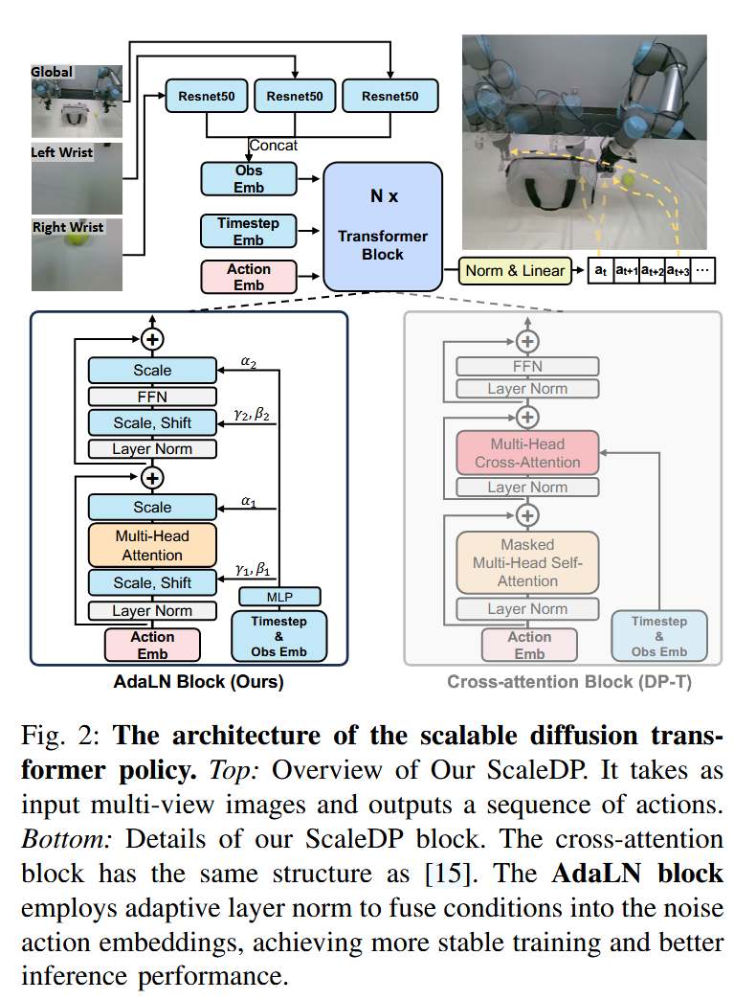

## 训练 Overview

训练 VLA 的文件参考 train_vla.py，阶段 2 和阶段 3 的训练都用到它。

首先加载配置，传给训练核心入口 train_vla.py:main()。train_vla.py 主要完成如下训练过程：
- **初始化与配置加载** —— 加载任务配置，设置随机种子。
- **数据加载与预处理** —— 加载数据集，使用 `Qwen2VLAProcess` 进行多模态数据预处理。
- **模型加载** —— 使用 `ml_utils.load_model` 加载预训练的视觉-语言模型和扩散专家。
- **训练器初始化与训练** —— 初始化 `QWen2VLATrainer`，调用 `trainer.train` 开始训练。
- **保存训练结果** —— 保存数据集的统计信息和训练后的模型状态。

### 配置加载

main() 执行前，需要准备 all_config 和 model_config。train_vla.py:parse_param() 解析和生成配置。

首先，解析关于参数的数据类 ModelArguments, DataArguments, TrainingArguments, ActionHeadArguments。随后，根据 ActionHeadArguments，使用 AutoConfig 从预训练模型加载参数。最后，如果量化，则设置 bnb_model_from_pretrained_args。

由于使用 transformers.HfArgumentParser 解析，所以可以从命令行传入参数，将脚本中指定的默认字段覆盖。比如，运行时指定 lora 训练：

```bash
  ...
  --lora_enable True \
  ...
  --freeze_vision_tower True \
  --freeze_backbone True \
```

返回参数为 tuple:
- model_args (ModelArguments): Model architecture and configuration arguments
- data_args (DataArguments): Dataset and data processing arguments
- training_args (TrainingArguments): Training hyperparameters and settings
- action_head_args (ActionHeadArguments): Action head model configuration
- config (AutoConfig): Complete model configuration object
- bnb_model_from_pretrained_args (dict): Quantization configuration for model loading

### 数据配置

训练数据通过 `TASK_CONFIGS` 加载配置。此字典在 aloha_scripts/constants.py 文件定义，可以通过添加条目来指定数据加载。

```py
TASK_CONFIGS = {
    'example_tasks': { # for local debug
        'dataset_dir': [
            "/media/rl/HDD/data/data/aloha_data/4_cameras_aloha/folding_shirt"
        ],
        'episode_len': 1000,  
        'camera_names': ['cam_high', 'cam_left_wrist', 'cam_right_wrist'] # replacing with your real keys in h5py formatted data
    }
}
...
```

`TASK_CONFIGS` 包括数据集路径 (dataset_dir)、任务时间步数 (episode_len)、相机视角 (camera_names) 等。

```py
def main():
    ...
    task_config = TASK_CONFIGS[all_config['data_args'].task_name] # 加载指定的任务数据
    dataset_dir = task_config['dataset_dir']
    episode_len = task_config['episode_len']
    camera_names = task_config['camera_names']
    ...
```

`all_config` 根据 `parse_param()` 解析，设置在 train_vla.py 开头的数据类 `ModelArguments`, `DataArguments`, `TrainingArguments`, `ActionHeadArgument`。在设计方面，这里应该单独梳理为一个文件更合适。回到 main()，`all_config['data_args'].task_name` 的 task_name 由 `DataArguments` 决定，可以看到注释，应当对应到 constants.py 文件：

```py
@dataclass
class DataArguments:
    ...
    task_name: str = field(default="stack_cube_2024_6_2") # task name corresponding to aloha_scripts/constants.py
    ...
```

### 数据加载

使用 `load_data` 函数加载训练和验证数据集。

```py
    # load dataset
    train_dataset, val_dataset, stats, sampler_params = load_data(
        dataset_dir,
        name_filter,
        camera_names,
        all_config["training_args"].per_device_train_batch_size,
        all_config["training_args"].per_device_eval_batch_size,
        all_config["data_args"].chunk_size,
        skip_mirrored_data=all_config["data_args"].skip_mirrored_data,
        config=all_config,
        stats_dir_l=stats_dir,
        rank0_print=rank0_print,
        policy_class=all_config["action_head_args"].policy_head_type,
        sample_weights=sample_weights,
        train_ratio=train_ratio,
        llava_pythia_process=vla_process,
    )
```

### 数据预处理

使用 `Qwen2VLAProcess` 对多模态数据（图像和语言指令）进行预处理。

```py
    vla_process = Qwen2VLAProcess(
        tokenizer=tokenizer,
        multimodal_processor=multimodal_processor,
        data_args=all_config["data_args"],
        camera_names=camera_names,
    )
```

### 模型加载

使用 `ml_utils.load_model` 加载预训练的视觉-语言模型（VLM）和扩散专家（Diffusion Expert）。

```py
    # load qwen2_vl tokenizer
    tokenizer = transformers.AutoTokenizer.from_pretrained(
        all_config["model_args"].model_name_or_path,
    )
    # load qwen2_vl input processor
    multimodal_processor = AutoProcessor.from_pretrained(all_config["model_args"].model_name_or_path)
    # load dexvla model
    model, data_args = ml_utils.load_model(
        config=all_config, qwen2_vla_config=model_config, rank0_print=rank0_print, tokenizer=tokenizer
    )
```

### 训练器初始化与训练

接下来，模型调用 `train_bc()`，开始准备训练。

```py
def main(all_config=None, model_config=None):
    ...
    best_ckpt_info = train_bc(
        train_dataset=train_dataset,
        model=model,
        val_dataset=val_dataset,
        config=all_config,
        sampler_params=sampler_params,
        tokenizer=tokenizer,
        processor=multimodal_processor,
    )
    ...
```

使用 `Qwen2VLADataCollatorForSupervisedDataset` 对数据进行整理，生成模型输入。

```py
def train_bc(
    train_dataset=None, val_dataset=None, model=None, config=None, sampler_params=None, tokenizer=None, processor=None
):
    """
    Train a behavior cloning model using the QWen2VLA architecture.
    """
    ...
    data_collator = Qwen2VLADataCollatorForSupervisedDataset(
        multimodal_processor=processor, computed_type=compute_dtype, tokenizer=tokenizer, video=video
    )
```

使用 `QWen2VLATrainer` 初始化训练器，传入模型、数据整理器、训练参数等，开始训练。

```py
    model.config.use_cache = True
    model.config.save_pretrained(config["training_args"].output_dir)

    data_module = dict(train_dataset=train_dataset, data_collator=data_collator, eval_dataset=val_dataset)
    trainer = QWen2VLATrainer(
        model=model, tokenizer=tokenizer, args=config["training_args"], sampler_params=sampler_params, **data_module
    )

    trainer.train(resume_from_checkpoint=config["training_args"].resume_from_checkpoint)
```

### 保存训练结果

保存模型状态和检查点：

```py
def train_bc(...):
    ...
    trainer.save_state()

    model.config.use_cache = True
```

保存统计信息：

```py
def main(...):
    ...
    best_ckpt_info = train_bc(...)

    # exit(0)
    stats_path = os.path.join(all_config["training_args"].output_dir, f"dataset_stats.pkl")
    with open(stats_path, "wb") as f:
        pickle.dump(stats, f)
```

pickle 是标准库内容其一，用于序列化和反序列化 Python 对象。

## 参数配置

ModelArguments, DataArguments 和 ActionHeadArguments 是普通的标注了 `@dataclass` 的数据类，只有 TrainingArguments 除了标注 `@dataclass` ，还继承了 transformers.TrainingArguments。transformers.TrainingArguments 也是普通的类，标注 `@dataclass`。

## 数据加载

### 数据组织：使用 HDF5

与 act 工作的数据格式一致，使用 HDF5。作者使用 rlds_to_h5py 转换，格式具体如下：
```angular2html
# h5 data structure
root
  |-action (100,10)
  |-language_raw (1,)
  |-substep_reasonings (100,)
  |-observations
      |-images # multi-view
          |-left (100,480,640,3)
          |-right (100,480,640,3)
          |-wrist (100,480,640,3)
      |-joint_positions (100,7)
      |-qpos (100,7)
      |-qvel (100,7)
```

具体解释如下。内容来自猜测和结合 DeepSeek：
- language_raw (1,) —— 原始语言指令，如折叠衬衫。所以当前是一个任务，有一个语言指令，如下每个时间步对应一个子步骤。即此任务的 horizon 为 100。
- substep_reasonings (100,) —— 子步骤推理，每个时间步对应每个子步骤描述。相比 language_raw，


| 字段               | 形状            | 描述                                 |
| ------------------ | --------------- | ------------------------------------ |
| action             | (100,10)        | 100 表示时间步数，10 表示动作维度。  |
| substep_reasonings | (100,)          | 100                                  | 每个时间步对应一个子步骤推理。         |
| observations       |                 | 表示时间步数，其他维度表示观测数据。 |
| - images           |                 | 表示时间步数，其他维度表示图像数据。 |
| \|- left           | (100,480,640,3) | 100                                  | 表示时间步数，480x640 表示图像分辨率。 |
| \|- right          | (100,480,640,3) | 100                                  | 表示时间步数，480x640 表示图像分辨率。 |
| \|- wrist          | (100,480,640,3) | 100                                  | 表示时间步数，480x640 表示图像分辨率。 |
| - joint_positions  | (100,7)         | 100                                  | 表示时间步数，7 表示关节位置维度。     |
| - qpos             | (100,7)         | 100                                  | 表示时间步数，7 表示关节位置维度。     |
| - qvel             | (100,7)         | 100                                  | 表示时间步数，7 表示关节速度维度。     |

joint_positions 和 qpos 关系：

| 维度     | joint_positions              | qpos                                          |
| -------- | ---------------------------- | --------------------------------------------- |
| 定义     | 关节角度或关节位置。         | 广义坐标位置，可能包含更多自由度信息。        |
| 用途     | 描述机器人的关节状态。       | 描述机器人系统的完整状态。                    |
| 数据范围 | 通常仅包含关节角度。         | 可能包含关节角度、末端执行器位置等信息。      |
| 示例     | 7 自由度的机械臂的关节角度。 | 7 自由度的机械臂的关节角度 + 末端执行器位置。 |

#### act-plus-plus 数据格式

为了了解数据格式，查看仿真环境下的 mobile aloha 如何数据如何组织。具体参考 record_sim_episodes.py。

```
For each timestep:
observations
- images
    - each_cam_name     (480, 640, 3) 'uint8'
- qpos                  (14,)         'float64'
- qvel                  (14,)         'float64'

action                  (14,)         'float64'
```
由于是双臂，所以是 14 对应 7*2。

TODO: 查看 act-plus-plus 仓库收集数据后如何准备。

#### 数据格式配置

在 train_vla.py 中，查看到 ActionHeadArguments 中，state_dim 和 action_dim 分别设置为 7 和 10。在 DataArguments 中，可以看到 image_size_stable 分别设置了相机的尺寸，480 和 56。

### Dataset 和 DataLoader

#### 生成 h5 格式数据

data_preprocess_scripts/rlds_to_h5py.py 从 replay 中创建 HDF5 文件，组织为需要的格式。

### 输入与输出格式

输入给模型的格式分别为：

## 扩散专家：ScaleDP

注意，基于 Transformer 的扩散策略对训练参数敏感。

### 输入与输出

格式分别为：

### Attention

自定义实现的 Attention 中，是一个自注意力机制的 Attention。实现时，指定类属性：

```py
class Attention(nn.Module):
    fused_attn: Final[bool]

    def __init__(self, ...) -> None:
        super().__init__()
        ...
        self.fused_attn = use_fused_attn()
        ...
```

use_fused_attn() 是 timm 库提供的环境兼容性检测函数，允许用户通过全局配置强制启用/禁用（如 timm 的 FUSED_ATTENTION 标志），减少硬编码依赖。self.fused_attn 是布尔值，动态选择是否启用融合优化的注意力计算。在支持优化的环境（最新 PyTorch 和 CUDA GPU），启用融合，可以提升性能。如果 self.fused_attn，可以直接用 F.scaled_dot_product_attention()，有优化实现。否则，只能手动实现传统注意力。

输入格式：forward() 输入 x 为 shape (B, N, C)。attn_mask 中，-inf 代表遮掩。

### TimestepEmbedder

针对扩散时的时间步，嵌入标量的时间步到向量表示。参考了 OpenAI 的 [glide_text2im](https://github.com/openai/glide-text2im/blob/main/glide_text2im/nn.py)。作用是创建 sinusoidal timestep embeddings。将离散的时间步编码为连续向量表示，给模型提供时间感知能力。额外使用了 MLP 增强，兼顾平滑性与表达能力。正弦编码对时间步绝对位置不敏感，更关注相对位置关系。

$$
\mathrm{embedding}[i] = \left\{
\begin{array}{ll}
\sin\left(t \cdot \frac{1}{10000^{i/\dim}}\right) & \text{if } i \text{ 是偶数} \\
\cos\left(t \cdot \frac{1}{10000^{(i-1)/\dim}}\right) & \text{if } i \text{ 是奇数}
\end{array}
\right.
$$

注意，由于预测动作有 horizon，所以都会对 x 使用绝对编码，对扩散时间步才使用相对位置编码。

输入格式：forward() 输入 t 为 shape (B,)，对应扩散时间步。

### ScaleDPBlock



使用了多层的 ScaleDPBlock。借鉴了 ScaleDP 的工作，使用 Adaptive Layer Norm (DiT 也用到)。参考： <[[Scaling_Diffusion_Policy_in_Transformer_to_1B|robotics.Scaling_Diffusion_Policy_in_Transformer_to_1B#^arh7om3id148]]>

```py
def modulate(x, shift, scale):
    return x * (1 + scale.unsqueeze(1)) + shift.unsqueeze(1)

class ScaleDPBlock(nn.Module):
    """
    A ScaleDP block with adaptive layer norm zero (adaLN-Zero) conScaleDPioning.
    """
    def __init__(self, hidden_size, num_heads, mlp_ratio=4.0, **block_kwargs):
        super().__init__()
        self.norm1 = nn.LayerNorm(hidden_size, elementwise_affine=False, eps=1e-6)
        self.attn = Attention(
            hidden_size, num_heads=num_heads, qkv_bias=True, **block_kwargs
        )
        self.norm2 = nn.LayerNorm(hidden_size, elementwise_affine=False, eps=1e-6)
        mlp_hidden_dim = int(hidden_size * mlp_ratio)
        approx_gelu = lambda: nn.GELU(approximate="tanh")
        # Mlp [fc1, act, drop1, norm, fc2, drop2]
        self.mlp = Mlp(
            in_features=hidden_size,
            hidden_features=mlp_hidden_dim,
            act_layer=approx_gelu,
            drop=0,
        )
        self.adaLN_modulation = nn.Sequential(
            nn.SiLU(), nn.Linear(hidden_size, 6 * hidden_size, bias=True)
        )

    def forward(self, x, c, attn_mask=None):
        # c shape 为 (batch_size, horizon, cond_dim)，dim=1 代表逐维度的
        # modulate self attention 等 shift_*, scale_*, gatej_* 的 shape (B, N, 6 * C).chunk(6, dim=1)
        # chunk(6, dim=1) 代表前两个维度不变，在最后一个维度上，即列上拆分为 6 份。即：
        # (B, N, (C0 C1 C2 C3 C4 C5)) -> (B, N, C0) (B, N, C1), ..., (B, N, C5)
        shift_msa, scale_msa, gate_msa, shift_mlp, scale_mlp, gate_mlp = (
            self.adaLN_modulation(c).chunk(6, dim=1)
        )
        x = x + gate_msa.unsqueeze(1) * self.attn(
            # norm first
            modulate(self.norm1(x), shift_msa, scale_msa), attn_mask=attn_mask
        )  # norm, scale&shift, attn, scale,
        x = x + gate_mlp.unsqueeze(1) * self.mlp(
            modulate(self.norm2(x), shift_mlp, scale_mlp)
        )
        return x
```

最后一层 FinalLayer 则是经过一个 LayerNorm，接着用上 Adaptive 的 scale 和 shift 处理，最后由一个线性层输出。不同的是，没有了 gate 部分。

### 整合：ScaleDP

ScaleDP 配置默认 n_obs_steps 为 2，时间步为 T_cond = 1，obs_as_cond 默认 True。在网络部分，包含了：
- self.combine (三层的 MLP)
- self.x_embedders (nn.Linear)
- self.t_embedder (TimestepEmbedder)
- self.cond_obs_emb (nn.Linear)
- self.pos_embed (nn.Parameter)
- self.blocks (多层的 ScaleDPBlock)
- self.final_layer (FinalLayer)
- self.noise_scheduler (DDIMScheduler)

#### forward()

接收参数：
- actions (of shape (batch_size, action_horizon, action_dim))：学习时的目标动作。action_dim 配置于 config.output_dim，3+6+1=10。只使用前 num_queries 条参与训练，对应配置中 prediction_horizon。
- hidden_states (of shape (batch_size, num_tokens, hidden_dim)) 在 VLA 中，配置 config.using_film 经过 Fusion 模块后，shape (batch_size, hidden_dim)
- states (batch_size, states_dim)：通常是 14 维，包含机器人当前物理状态，比如关节状态（角度、速度和扭矩）、末端执行器状态等。
- is_pad (of shape (batch_size, Ta))：actions 小于 16 或开头部分长度不够 16，需要填充。is_pad 用于标识哪些部分是填充。
- 返回：训练时返回 loss，推理时返回动作。

#### model_forward()

预测 epsilon，接收参数：
- x (Tensor of shape (batch_size, T, input_dim)) noisy actions
- t (Union[Tensor of shape (batch_size,), int]) timesteps
- global_cond (Tensor of shape (batch_size, n_obs_steps, hidden_dim)): 图像嵌入等 action_hidden_states
- states

如果传入的 states 不是 None，那么在最后一维拼接 global_cond 与 states。经过 self.combine 网络处理，得到最后的 global_cond 条件。紧接着，处理动作的嵌入和时间步嵌入，位置编码，还有编码条件。最后把时间步编码与条件编码相加，感觉似乎过于简陋了。

### 配置文件 ScaleDPPolicyConfig

- prediction_horizon (int)：预测范围，默认 16。传入的 actions 小于时，需要 padding。大于则截断。

## 训练器 QWen2VLATrainer

参考 qwen2_vla/train/qwen2_vla_trainer.py。

## VLM: Qwen2-VL

使用 [Qwen2-2B-VL](https://huggingface.co/Qwen/Qwen2-VL-2B-Instruct) 作为主干网络。也许可以尝试 [Qwen/Qwen2.5-VL-3B-Instruct](https://huggingface.co/Qwen/Qwen2.5-VL-3B-Instruct)。

模型结构，在 VLM 末尾增加一个 policy head；而 Helix 直接输出 token，当作 policy 模型的 latent vector。

作者把 transformers/models/qwen2_vl 目录下的文件都复制到乐项目中，改造以适应 DexVLA，包括 configs.json。

## 把扩散专家接到 Qwen2-VL 上

项目文件 qwen2_vla/models/modeling_qwen2_vla.py 和 qwen2_vla/models/configuration_qwen2_vla.py 改造了 Qwen2-VL 的源码和配置。两个文件都是从 huggingface 的 transformers 库中 transformers/models/qwen2_vl/modeling_qwen2_vl.py 和对应 configuration_qwen2_vla.py 复制而来，并根据需求做出修改。

### 扩散专家与 VLM 的连接

- 输入投影层：在 VLM 模型的输出部分，扩散专家通过一个输入投影层（input_action_proj）将 VLM 的隐藏状态（hidden states）映射到扩散专家的输入空间。这个投影层通常由两个线性层（MLP）组成，带有 LayerNorm 归一化。
- FiLM 层：如果启用了 FiLM（Feature-wise Linear Modulation）机制，扩散专家还会通过 FiLM 层将 VLM 的推理信息（reasoning tokens）注入到扩散专家的动作生成过程中。FiLM 层通过缩放和偏移参数来调整扩散专家的输出。

关键代码片段：

在文件末尾的 Qwen2VLForConditionalGenerationForVLA 中，作者做出了修改。原版千问模型的只有 self.visual, self.model, self.vocab_size, self.lm_head, self.rope_deltas 等 fields。作者添加了 self.padding_side, self.using_file, ...。

#### 结合扩散专家的 VLA 模型初始化

```py
class Qwen2VLForConditionalGenerationForVLA(Qwen2VLPreTrainedModel, GenerationMixin):
    """
    类属性。这是 Huggingface Transformers 库的特殊属性，要求指定模型需要绑定的权重。
    权重绑定是常见的优化技术，特别是语言模型，输入嵌入层和输出层的权重可以共享，减少模型参数，提高训练效率。
    库的权重绑定通过 `tie_weights()` 方法实现，模型初始化时，库自动查找 _tied_weight_keys，将权重绑定一起。
    本例中，"lm_head.weight" 与 "embedJ_tokens.weight" 绑定在一起。尽管 self.lm_head 定义为
            self.lm_head = nn.Linear(config.hidden_size, config.vocab_size, bias=False)
    实际并未只想新的 nn.Linear 模块，而是嵌入层的对应的权重。
    """
    _tied_weights_keys = ["lm_head.weight"]

    def __init__(self, config):
        ...
        # 初始化 policy_head，对应扩散专家
        # policy_head_config 配置参考 train_vla.py:class ActionHeadArguments，会被解析为类 dict 类型
        if isinstance(config.policy_head_config, dict):
            config.policy_head_config = AutoConfig.for_model(**config.policy_head_config)
        self.policy_head = AutoModel.from_config(config=config.policy_head_config)

        self.lm_head = nn.Linear(config.hidden_size, config.vocab_size, bias=False)

        self.post_init()
        if config.policy_head_config.model_type == "scale_dp_policy":
            self.policy_head.init_weights()
        # 输入投影层，来自于 Fusion 模块
        self.input_action_proj = ActionProjector(config.hidden_size, config.hidden_size)

        # 是否使用 film 来 fusion，默认使用
        if self.using_film:
            # Initialize projection layers and condition modulation layers
            # 嵌入 condition，即文本的 embedding。主要是放缩和偏移。
            self.reasoning_action_proj = ActionProjector(config.hidden_size, config.hidden_size)
            self.reasoning_film = FiLM(feature_dim=config.hidden_size, condition_dim=config.hidden_size)
```

#### 在 forward() 中调用扩散专家

`forward()` 在原版本上做出了修改。主要添加了衔接扩散专家部分。包含将 `hidden_states` 等信息传给扩散专家。注意，输入是 input_ids，ids 通常代表 IDs，identifiers 缩写。

```py
    def forward(
        self,
        input_ids: torch.LongTensor = None, 
        ...
        labels: Optional[torch.LongTensor] = None, 
        ...
    ) -> Union[Tuple, Qwen2VLCausalLMOutputWithPast]:
        ...
        outputs = self.model(
            input_ids=None,
            position_ids=position_ids,
            attention_mask=attention_mask,
            past_key_values=past_key_values,
            inputs_embeds=inputs_embeds,
            use_cache=use_cache,
            output_attentions=output_attentions,
            output_hidden_states=True,
            return_dict=return_dict,
        )

        # VLA 输出的内容，outputs[0] 代表最后一层影藏状态，即 hidden_states
        # 结构是 (batch_size, seq_len, hidden_size)
        hidden_states = outputs[0]
        if tinyvla: # dex-vla supports tinyvla-style VLA
            return hidden_states

        # 把隐藏状态传给嵌入层，得到 logits。到此 Qwen2-VL 已经完成文本生成。只需要 tokenizer decode 即可得到文本。
        logits = self.lm_head(hidden_states)
        logits = logits.float()

        llm_loss = None
        # 如果传入了 labels，那么与 label 求交叉熵，以训练 VLM
        # 未传入 labels 代表仅推理，loss 为 None
        if labels is not None:
            # Shift so that tokens < n predict n
            shift_logits = logits[..., :-1, :].contiguous()
            shift_labels = labels[..., 1:].contiguous()
            # Flatten the tokens
            loss_fct = CrossEntropyLoss()
            shift_logits = shift_logits.view(-1, self.config.vocab_size)
            shift_labels = shift_labels.view(-1)
            # Enable model parallelism
            shift_labels = shift_labels.to(shift_logits.device)
            llm_loss = loss_fct(shift_logits, shift_labels)
        ...
        # 使用 FiLM 融合
        if self.using_film:
            # (batch_size, hidden_dim)
            action_hidden_states = self.film_forward(
                labels=labels, input_ids=input_ids, hidden_states=hidden_states
            )
        else:
            # (batch_size, sequence_length, hidden_dim)
            action_hidden_states = hidden_states

        ret = self.policy_head(
            actions=actions,
            hidden_states=action_hidden_states,
            states=states,
            is_pad=is_pad,
        )
        loss = {'loss': ret['loss'] + self.llm_loss_weight * llm_loss,
                'llm_loss': llm_loss,
                'action_loss': ret['loss']}
        # 以 Tuple 返回
        if not return_dict:
            output = (logits,) + outputs[1:]
            return (loss,) + output if loss is not None else output
        ...
        return Qwen2VLCausalLMOutputWithPast(loss=loss, logits=logits, ...)
```

模型的输出中，`output[0]` 代表最后一层的 hidden_states。根据源码，在 `Qwen2VLModel:forward()` 中，参数 `return_dict` 默认为 None，所以返回 `Tuple`，具体如下：

```py
if not return_dict:
    return tuple(
        v
        for v in [hidden_states, next_cache, all_hidden_states, all_self_attns]
        if v is not None
    )
```

`all_hidden_states` 包含了最后一层的 `hidden_states`。

总结，扩散专家使用了动作、动作隐藏状态和状态 states 作为输入。其中，动作隐藏状态 (action_hidden_states) 使用了 Qwen2-VL 的 logits，可能进一步与 labels、输入进行 FiLM fusion，得到 action_hidden_states。

#### 使用 FiLM 集成 LLM 的 logits

如果指定了配置 `using_film`，则使用 `film_forward()` 把输入、labels 和隐藏状态一起编码，最后输出 action_hidden_states, shape (batch_size, 1, hidden_dim)，把 num_tokens 压缩为了 1，提取和融合了语言的信息。

计算掩码：

```py
    def film_forward(self, labels, input_ids, hidden_states):
        # input_ids, labels (B, N, D), hidden_states (B, N, D)
        # input_ids 是 forward() 传来的，是 Tokenizer 处理提示词后得到的 token id。shape 为 (batch_size, seq_len)
        # 关于标签与 -100 比较，为了获取掩码位置，用于 BERT 类型的方式来训练。
        # 创建布尔掩码，标记标签中需要忽略的位置。(B, N)
        inputs_index = labels[:, :] == -100
        inputs_index = inputs_index.int()
```

Qwen2VLForConditionalGeneration 类的 forward() 中，指出 labels 参数应该是 (batch_size, sequence_length) 的 torch.LongTensor。labels 用于计算 masked language modeling loss。内容应该是 [0, ..., config.vocab_size]，计算 loss；或 -100 (具体参考 input_ids 的 docstring) 代表 masked，不计算 loss。了解是掩码足矣。

检测序列变化边界:

```py
        # 比较相邻位置掩码，若不同为 1，相同为 0。用于定位序列中有效部分与填充部分边界。
        # 比如 [0, 0, 1, 1, 0, 1, 0]，异或比较如下：
        #      [0, 1, 1, 0, 1, 0]
        # 得到 [0, 1, 0, 1, 1, 1]
        xor_array = torch.bitwise_xor(inputs_index[:, :-1], inputs_index[:, 1:])
        # 得到的 indexs of shape (batch_size,)，每个位置代表第一个出现 1 的地方
        # indexs 用于找到样本中第一个发生变化的索引，即有效部分结束位置。
        # 比如 -100 掩码只加载到句子的中间，后面也会被截断，不考虑。
        indexs = torch.argmax((xor_array != 0).float(), dim=1)
```

分阶段提取特征:

```py
        input_embeddings = []
        reasoning_embeddings = []
        identity = []
        # indexs.shape[0] 代表 batch_size。最后，input_embeddings，identiy 和 reasoning_embeddings 包含了 B 个张量
        for i in range(indexs.shape[0]):
            end = indexs[i] + 1 # 有效部分结束位置
            temp = input_ids[i] == 151643  # pad token id for qwen2_vl
            start = sum(temp.int()) # 填充数量，对应有效部分起始下标
            input_embeddings.append(
                # ActionProjector()
                # 返回 (1, hidden_dim)
                self.input_action_proj(hidden_states[i, start:end, :])
            )
            # 有效部分的平均隐藏状态
            identity.append(
                # 提取身份、辨识信息，返回得到一维的张量 (hidden_dim,)
                # 注意看 dim=0，代表从 start:end 切片部分，按列计算均值
                torch.mean(hidden_states[i, start:end, :], dim=0)
            )
            # 
            reasoning_embeddings.append(
                # 剩余有效部分的隐藏状态用于投影推理部分，并且包含上下文信息，十分重要。
                # 猜测用 -100 作为掩码，界定输入的任务部分和推理子步骤部分
                # 返回 (1, hidden_dim)
                self.reasoning_action_proj(hidden_states[i, end:, :])
            )
```

self.input_action_proj 和 self.reasoning_action_proj 用于提取信息，输出 (1, hidden_dim)。

拼接与 FiLM 特征融合：

```py
        # 拼接与调制
        # (B, hidden_dim)
        input_embeddings = torch.cat(input_embeddings, dim=0)
        # (B, hidden_dim)
        reasoning_embeddings = torch.cat(reasoning_embeddings, dim=0)
        # 由于 identity 列表中全是 (hidden_dim,) 的 shape，所以用 stack
        # (B, hidden_dim)
        identity = torch.stack(identity)
        # FiLM 接受输入嵌入和推理嵌入，生成条件化特征表示。
        # 公式： output= x * (1 + scale) + shift
        # (B, 1, hidden_dim)
        action_hidden_states = self.reasoning_film(
            input_embeddings, reasoning_embeddings # both of shape (B, hidden_dim)
        ).unsqueeze(1)
        # (B, hidden_dim)
        action_hidden_states = action_hidden_states + identity.unsqueeze(1)
        return action_hidden_states
```

这样输出最后是 (batch_size, 1, hidden_dim) 的形状。把 num_tokens 压缩为 1 了。

#### Fusion 模块

```py
class ActionProjector(nn.Module):
    def __init__(self, in_dim, out_dim=1024):
        super(ActionProjector, self).__init__()
        self.global_1d_pool = nn.AdaptiveAvgPool1d(1)
        self.mlps = nn.ModuleList([
            # nn.LayerNorm(in_dim),
            nn.Linear(in_dim, in_dim),
            nn.GELU(),
            nn.Linear(in_dim, out_dim),
            nn.Dropout(0.0),
        ])

    def forward(self, x):
        x = self.global_1d_pool(x.permute(1, 0)).permute(1, 0)
        for mlp in self.mlps:
            x = mlp(x)
        return x
```

使用全局池化，self.global_1d_pool = nn.AdaptiveAvgPool1d(1) 将输入最后一维压缩为 1，提取输入特征的全局信息，减少序列长度对特征表示的影响。在 VLA 模型中，in_dim 和 out_dim 都是 hidden_size。输入的 x of shape (n, hidden_dim)，经过转置为 (hidden_dim, n)，输出 (hidden_dim, 1)，再转置，x 最终为 (1, hidden_dim)。再经过 self.mlps，得到 (1, hidden_dim)。

为什么需要设计 ActionProjector？ActionProjector 模块能够将输入维度的特征映射到目标维度。通过全局池化，再通过线性层和非线性激活函数 GELU，增强表达能力，保留非线性关系，从而提取全局信息，方便后续嵌入扩散专家。

TODO：研究 Fusion，为何有效。还有思路。

经过 ActionProjector 提取信息后，传入给 reasoning_film 的有 input_embeddings 和 reasoning_embeddings，前者用于输入，后者是条件推理。输入和推理的 token 界定，在 labels 处以掩码确定。再从 hidden_states 中找到对应的部分，输入和输出的部分。

#### evaluate() 方法

forward() 并没有返回生成的动作，而是 loss。这是由于训练扩散模型的要求。evalute() 方法则返回了动作和文本输出。

generate() 指定了 num_beams=1, return_dict_in_generate=True 和 output_hidden_states=True，返回更多输出。输出数据类 GenerateBeamDecoderOnlyOutput，包含一些字段。用到的包括字典中如下字段：
- sequences (torch.LongTensor of shape (batch_size*num_return_sequences, sequence_length)))：自回归生成的文本
- hidden_states (tuple(tuple(torch.FloatTensor)))：每层的隐藏状态。是一个元组，每个元素对应每个输出（比如批次大小乘以返回序列数）的 tokens，内部的元组对应每层 decoder 的输出（如果只需要最后的 logits，取 -1 下标即可），decoder 输出内容是 torch.FloatTensor of shape (batch_size * num_beams * num_return_sequences, generated_length, hidden_size)。

#### 对比原版文件，做出了哪些修改

##### forward() 参数

```py
class Qwen2VLForConditionalGenerationForVLA(Qwen2VLPreTrainedModel, GenerationMixin):
    ...
    def forward(
        self,
        input_ids: torch.LongTensor = None,
        attention_mask: Optional[torch.Tensor] = None,
        position_ids: Optional[torch.LongTensor] = None,
        past_key_values: Optional[List[torch.FloatTensor]] = None,
        inputs_embeds: Optional[torch.FloatTensor] = None,
        labels: Optional[torch.LongTensor] = None,
        use_cache: Optional[bool] = None,
        output_attentions: Optional[bool] = None,
        output_hidden_states: Optional[bool] = None,
        return_dict: Optional[bool] = None,
        pixel_values: Optional[torch.Tensor] = None,
        pixel_values_videos: Optional[torch.FloatTensor] = None,
        image_grid_thw: Optional[torch.LongTensor] = None,
        video_grid_thw: Optional[torch.LongTensor] = None,
        rope_deltas: Optional[torch.LongTensor] = None,
        actions: Optional[torch.LongTensor] = None,
        states: Optional[torch.FloatTensor] = None,
        is_pad: bool = False,
        is_eval: bool = False,
        tinyvla: bool = False,
    ) -> Union[Tuple, Qwen2VLCausalLMOutputWithPast]:        ...
        ret = self.policy_head(actions=actions, hidden_states=action_hidden_states, states=states, is_pad=is_pad)
        ...
```

对比 Qwen2VL 的 API，洞察修改部分。

```py
class Qwen2VLForConditionalGeneration(Qwen2VLPreTrainedModel, GenerationMixin):
    ...
    def forward(
        self,
        input_ids: torch.LongTensor = None,
        attention_mask: Optional[torch.Tensor] = None,
        position_ids: Optional[torch.LongTensor] = None,
        past_key_values: Optional[List[torch.FloatTensor]] = None,
        inputs_embeds: Optional[torch.FloatTensor] = None,
        labels: Optional[torch.LongTensor] = None,
        use_cache: Optional[bool] = None,
        output_attentions: Optional[bool] = None,
        output_hidden_states: Optional[bool] = None,
        return_dict: Optional[bool] = None,
        pixel_values: Optional[torch.Tensor] = None,
        pixel_values_videos: Optional[torch.FloatTensor] = None,
        image_grid_thw: Optional[torch.LongTensor] = None,
        video_grid_thw: Optional[torch.LongTensor] = None,
        rope_deltas: Optional[torch.LongTensor] = None,
        cache_position: Optional[torch.LongTensor] = None,
    ) -> Union[Tuple, Qwen2VLCausalLMOutputWithPast]:
        ...
```

VLA 的输入中，修改了 forward() 的 API，删去了最后一个参数，cache_position，添加了 actions, states, is_pad, is_eval, tinyvla 参数。

### 梯度是如何反向传播的

#### 交叉熵

如果传入 `labels` 给 `forward()`，说明正在训练，进一步计算交叉熵。否则，模型只需要推理，`loss` 为 `None`。

## 训练

## TODO
制作 PPT，复现此项目。

Figure 的 Helix 思路与此十分相似。Helix 使用了较大的 VLM (7B) 作为主干，使用较小的策略模型 (80M) 生成动作。解耦了大模型和小模型。大模型

Helix 和 HiRT 并未开源代码和模型，DexVLA 开源了代码，复现可能更大。但是，在动作生成方面，还是使用了 action head 层动作学习的网络接在 VLM 模型，VLM 使用 Qwen2-3B-VL。

HiRT 发表了论文，解决了 VLM 模型与策略模型生成速度不匹配的情况。主要使用异步的方案，把 VLM 当做一个大型的编码器，编码视觉和自然语言指令。

问题分析：大模型生成较慢，动作策略的小模型生成较快，DexVLA 并没有解决此问题，还是使用同步的方案；泛化场景问题。

可行性：DexVLA 开源，有框架遵循，有复现可能。使用的 VLM 模型是 2B，最近，千问发表了 Qwen2.5-VL 系列。可以使用可能更优秀的 Qwen2.5-3B-Instruct，使用 DeepSpeed，两张显卡猜测能够微调。在数据收集方面，有 pny 做过数据收集，使用的数据格式类似。

下一步打算：先复现，后修改，不断逼近 Helix 的方案。


## 借助 DeepSeek 的 QA

上传论文后，Q 如下：

### Q：分析 train_vla.py Q

- 以下代码是训练阶段 2 和阶段 3 的入口，请总结数据是如何加载和传入训练的。<粘贴了文件内容>
- 请总结 main 函数做了哪些工作

#### Q：以下代码是 DexVLA 项目的 VLA 模型相关文件，作者做出了修改，请问扩散专家是如何接到 VLM 模型的。
- 配置文件qwen2_vla/models/configuration_qwen2_vla.py如下：<文件内容>
- 配置文件qwen2_vla/models/modeling_qwen2_vla.py如下：<文件内容>

#### Q：在 class Qwen2VLForConditionalGenerationForVLA 中，扩散专家是怎么调用的

#### Q：forward() 中的 hidden_states 是什么

## Tag and Ref

[[robotics.DexVLA]]
[[robotics.Helix：用于通才人形机器人控制的_VLM]]
[[robotics.HiRT_使用分层机器人Transformer提示机器人控制]]
[[robotics.ACT]]
[[insights.Robotics]]

#复现
