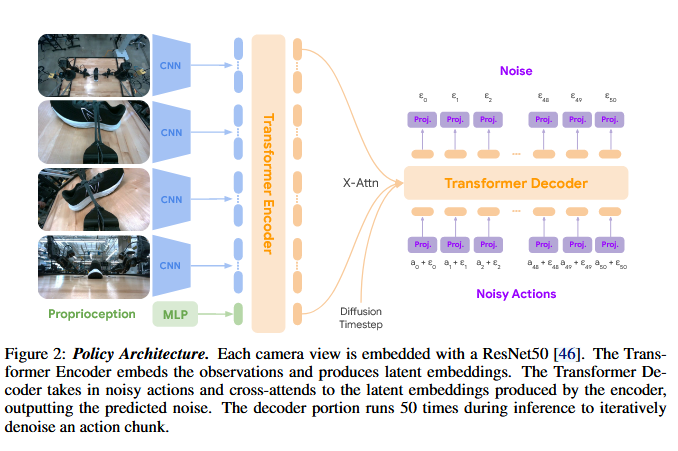

## 项目实现

以 pusht_real 数据集为例，以它来拓展。应当关注如下几个部分，修改为我们的抓取：
- 配置文件 diffusion_policy/config/task/real_pusht_image.yaml: 

### Action Chunk 的概念

Action chunking 将连续的动作序列划分为固定长度的“块”（chunk），每个块对应未来一段时间执行的动作序列。

Action Chunk 是 Action Chunking 中划分的连续动作序列，即策略一次性预测的 k 个时间步的动作集合。例如，若 k=100，策略会直接生成接下来 100 帧的机器人关节目标位置，而非逐帧生成。

## ALOHA Unleashed

### Policy

策略生成绝对关节角位置。使用长度为 50 的 action chunks，策略生成张量的形状为 (50,14)。

The diffusion timestep 作为独热向量，也会被交叉注意力机制插入。

4 个 RBG 图像 resize 为 480x640x3，送到 ResNet50，提取

## Ref and Tag

