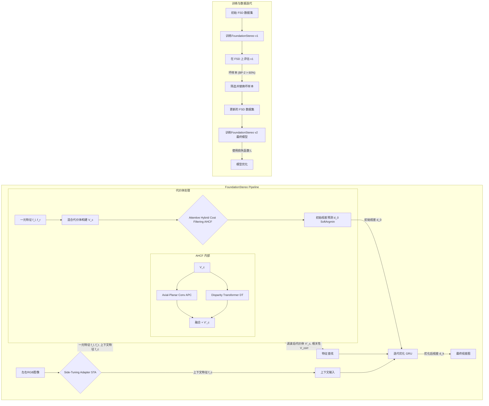

好的，这是对论文 "FoundationStereo: Zero-Shot Stereo Matching" 的总结。

## 论文总结

### 作者、团队信息、论文标题、论文链接、项目主页

*   **作者：** Bowen Wen, Matthew Trepte, Orazio Gallo, Joseph Aribido, Stan Birchfield, Jan Kautz
*   **团队信息：** NVIDIA
*   **论文标题：** FoundationStereo: Zero-Shot Stereo Matching
*   **论文链接：** [https://arxiv.org/abs/2501.09898](https://arxiv.org/abs/2501.09898) (请注意，提交版本 v4 的日期为 2025 年 4 月 4 日，这可能是一个预印本的特殊标记)
*   **项目主页：** [https://nvlabs.github.io/FoundationStereo/](https://nvlabs.github.io/FoundationStereo/)

### 主要贡献

1.  **提出 FoundationStereo：** 一个专为实现强大零样本泛化能力而设计的立体匹配基础模型，在未进行目标域微调的情况下，其性能可与甚至超越在目标域微调过的先前SOTA方法。
2.  **构建大规模合成数据集 FSD：** 创建了一个包含 100 万对立体图像的大规模、高保真度、高多样性的合成数据集 (FoundationStereo Dataset, FSD)，并设计了自动化的自迭代数据筛选流程 (self-curation pipeline) 来移除模糊样本，提升数据质量。
3.  **设计 Side-Tuning Adapter (STA)：** 提出一种侧向微调适配器，用于将视觉基础模型 (如 DepthAnythingV2) 中丰富的单目先验知识适配到立体匹配任务中，有效缓解模拟到真实 (sim-to-real) 的差距。
4.  **开发 Attentive Hybrid Cost Filtering (AHCF) 模块：** 包含 3D Axial-Planar Convolution (APC) 和 Disparity Transformer (DT) 两个组件。APC 用于增强代价体特征聚合的感受野，DT 在视差维度上执行自注意力机制，提供长程上下文进行全局推理，从而实现更有效的代价体滤波。

### 研究背景

*   **研究问题：**
    深度学习在立体匹配领域取得了巨大进展，尤其是在特定基准数据集上通过领域微调能达到极高精度。然而，实现强大的零样本泛化能力——即模型在未经特定训练的未知领域依然表现良好——仍然是一个巨大挑战。这与计算机视觉其他领域中基础模型通过扩展定律展现出的强大泛化能力形成对比。

*   **研究难点：**
    1.  **数据限制：** 现有训练数据集（如 Scene Flow）规模相对较小，多样性不足，难以支撑模型学习到足够通用的特征。真实世界数据集的标注稀疏或获取成本高。
    2.  **模型泛化性：** 现有网络架构虽然在特定数据集上表现优异，但难以有效收集非局部信息或扩展到更大的数据集。一些基于 Transformer 的方法可能缺乏代价体和迭代优化等专用结构带来的高精度。
    3.  **Sim-to-Real Gap：** 主要依赖合成数据训练的模型在迁移到真实世界图像时，性能往往会下降。
    4.  **长程上下文和计算效率：** 在高分辨率图像和大视差范围内，有效聚合长程上下文信息同时保持计算效率是一个挑战。

*   **相关工作：**

    | 领域研究 (Field of Research)           | 已有方法 (Existing Methods)                                                                       | 局限性 (Limitations)                                                   | 本文改进 (Our Improvement)                                                                                                                  |
    | :------------------------------------- | :------------------------------------------------------------------------------------------------ | :--------------------------------------------------------------------- | :------------------------------------------------------------------------------------------------------------------------------------------ |
    | 基于代价聚合 (Cost Volume Aggregation) | 使用 3D CNN 对一元特征构建的代价体进行滤波 (如 PSMNet [9], CFNet [53])。                          | 内存消耗大，难以直接应用于高分辨率图像。                               | Attentive Hybrid Cost Filtering (AHCF)，特别是 Axial-Planar Convolution (APC) 提高效率和感受野，Disparity Transformer (DT) 引入长程上下文。 |
    | 基于迭代优化 (Iterative Refinement)    | 使用循环模块 (如 GRU) 迭代优化视差图 (如 RAFT-Stereo [36], CREStereo [34])。                      | 更新过程可能耗时，且缺乏有效的长程上下文推理。                         | AHCF 中的 DT 提供长程上下文用于初始视差预测，GRU 模块进行后续优化。                                                                         |
    | 基于 Transformer 架构                  | 将 Transformer 用于一元特征提取阶段 (如 STTR [35], CroCo [68])。                                  | 可能缺乏代价体等专用结构带来的高精度，或代价体滤波步骤被忽略。         | Side-Tuning Adapter (STA) 融合 ViT 特征作为单目先验，DT 模块直接作用于代价体进行滤波。                                                      |
    | 跨域泛化研究                           | 探索学习领域不变特征，通常在 Scene Flow [43] 等数据集上训练 (如 HVT-RAFT [10], DSMNet [82])。     | 训练数据量和多样性不足，泛化能力仍难以匹敌领域内微调方法。             | 构建大规模、高多样性的 FSD 合成数据集，并结合更强的网络组件 (STA, AHCF) 提升泛化。                                                          |
    | 立体匹配训练数据                       | Scene Flow [43], KITTI [20, 45], Middlebury [51], ETH3D [52], CREStereo [34], TartanAir [66] 等。 | 真实数据标注稀疏或规模小；合成数据真实感、多样性不足，或存在模糊样本。 | FSD：100 万对图像，高多样性，高真实感，通过 NVIDIA Omniverse 生成，并采用自迭代数据筛选流程。                                               |

    **Mermaid 总结相关工作:**
    ```mermaid
    graph TD
        A[立体匹配研究] --> B(基于代价聚合);
        A --> C(基于迭代优化);
        A --> D(基于Transformer);
        A --> E(跨域泛化研究);
        A --> F(训练数据);

        B --> B1[方法: 3D CNN处理代价体];
        B1 --> B2[局限性: 内存消耗大, 难处理高分辨率];
        B2 --> B3[本文改进: AHCF APC+DT 高效聚合];

        C --> C1[方法: GRU等循环模块];
        C1 --> C2[局限性: 耗时, 缺乏长程上下文];
        C2 --> C3[本文改进: DT提供长程上下文, GRU优化];

        D --> D1[方法: Transformer提取一元特征];
        D1 --> D2[局限性: 缺乏专用代价体结构];
        D2 --> D3[本文改进: STA整合ViT特征, DT作用于代价体];

        E --> E1[方法: 探索领域不变特征];
        E1 --> E2[局限性: 常基于小数据集, 性能不佳];
        E2 --> E3[本文改进: 大规模FSD数据集, 强力网络组件];

        F --> F1[已有: SceneFlow等];
        F1 --> F2[局限性: 规模小, 真实感/多样性不足];
        F2 --> F3[本文改进: FSD，1M对, 高多样性/真实感, 自迭代];
    ```

### 方法

FoundationStereo 的整体架构如图 2 所示，主要包含以下几个模块：

1.  **单目基础模型适配 (Monocular Foundation Model Adaptation - STA)：**
    *   **目的：** 缓解 sim-to-real gap，并引入强大的单目几何先验。
    *   **过程：**
        *   使用一个预训练并冻结的 ViT-based 单目深度估计模型 (DepthAnythingV2 [79]) 提取左右图像的特征。
        *   设计一个轻量级 CNN (EdgeNeXt-S [40]) 作为 Side-Tuning Adapter (STA)。该 CNN 学习将 DepthAnythingV2 提取的特征（论文中选择在最终输出头之前的特征图）与自身从图像中提取的多尺度特征相结合，生成用于立体匹配的一元特征 (unary features) `f_l`, `f_r`。STA 权重在左右图之间共享。
        *   同时，STA 也提取上下文特征 (context features) `f_c` 用于后续的迭代优化。

在 DepthAnythingV2 最终输出头之前，使用 4x4，stride 为 4 的 CNN downscale 特征。此特征随后与同层 CNN 拼接起来。此 side CNN 网络因此学习到了适配 ViT 特征，随后完成立体匹配任务。作者发现此架构适应得很好。

**对机器人的启发**：
机械臂上的镜头每次移动，就是新的视角，这是与固定双目最大的不同之处。通过双目提供信息纠正关节角位置。训练时，制作数据集。使用 DP 生成动作，用 mask 跟踪机械臂位置，判读机械臂是否接近物体，给与惩罚。或者分为两阶段训练。
- 一阶段：replay 关节角数据，重播动作，训练固定视角和移动视角的辨别能力。也许添加一个 Side-Tuning Adapter，思路会类似微调大模型，加入场景细节的理解，让视觉编码器适应机械臂移动的视角。
- 二阶段：replay，训练 DiT 或者 DP

可以借鉴 Qwen2.5-VL 的训练模式，对齐视觉、甚至语言（umT5 编码器）到动作。

**DinoV2 用法**：

通常使用 DinoV2 最后一层。

2.  **注意力混合代价滤波 (Attentive Hybrid Cost Filtering - AHCF)：**
    *   **混合代价体构建 (Hybrid Cost Volume Construction)：**
        *   将 STA 输出的一元特征 `f_l`, `f_r` (在 1/4 分辨率) 通过两种方式组合构建 4D 代价体 `V_c`：
            1.  **分组相关 (Group-wise Correlation `V_gwc`)：** 将特征通道分组，计算对应组特征的点积。
            2.  **特征拼接 (Concatenation `V_cat`)：** 对左右特征图进行降维（1x1 卷积）后，在不同视差下进行拼接。
        *   最终代价体 `V_c` 是 `V_gwc` 和 `V_cat` 的拼接。

    *   **轴向-平面卷积滤波 (Axial-Planar Convolution (APC) Filtering)：**
        *   **动机：** 标准 3D 卷积在处理大视差范围时计算量和内存消耗巨大。
        *   **方法：** 将标准的 3x3x3 卷积分解为两个独立的卷积：一个在空间维度 (kernel `K_s x K_s x 1`)，另一个在视差维度 (kernel `1 x 1 x K_d`)。APC 应用在一个 3D CNN 沙漏网络中进行代价体滤波。

    *   **视差 Transformer (Disparity Transformer - DT)：**
        *   **动机：** 进一步增强代价体滤波中的长程上下文推理能力。
        *   **方法：**
            1.  对代价体 `V_c` 进行下采样（如使用 4x4x4 stride=4 的 3D 卷积）。
            2.  将下采样后的代价体重塑为 token 序列，每个 token 对应一个视差平面。
            3.  应用位置编码，并通过一系列 Transformer Encoder 模块（使用 FlashAttention [18]）在视差维度上进行自注意力计算。
            4.  将 DT 的输出上采样并与 APC 沙漏网络的输出相加，得到最终滤波后的代价体 `V'_c`。

3.  **初始视差预测 (Initial Disparity Prediction)：**
    *   对滤波后的代价体 `V'_c` 应用 soft-argmin [30] 操作，得到初始视差图 `d_0` (在 1/4 分辨率)。

4.  **迭代优化 (Iterative Refinement)：**
    *   使用多个 GRU (Gated Recurrent Unit) 模块对初始视差图 `d_0` 进行由粗到细的迭代优化。
    *   在每次迭代中，GRU 的输入包括：
        *   从滤波后的代价体 `V'_c` 和相关性代价体 `V_corr` (通过当前视差 `d_k` 进行查找) 中获取的特征。
        *   当前视差 `d_k`。
        *   上下文特征 `f_c` (来自 STA)。
    *   GRU 输出视差残差，更新得到 `d_{k+1}`。最终通过凸组合上采样 (convex upsampling) 得到全分辨率视差图。

5.  **合成训练数据集 (FSD) 与自迭代筛选：**
    *   **FSD 构建：** 使用 NVIDIA Omniverse 创建包含 100 万对立体图像的大规模数据集。通过领域随机化 (domain randomization) 增强多样性（随机基线、焦距、相机视角、光照、物体配置等），并使用高质量 3D 资产和路径追踪渲染保证真实感。
    *   **迭代自筛选 (Iterative Self-Curation)：**
        1.  使用初始 FSD 训练 FoundationStereo 模型。
        2.  在 FSD 上评估模型，将 Bad Pixel (BP-2) > 60% 的样本视为模糊或有问题的样本。
        3.  移除这些坏样本，并重新生成等量的新样本替换它们。
        4.  使用更新后的 FSD 重新训练模型。此过程迭代进行 (论文中为 2 次)。

6.  **损失函数 (Loss Function)：**
    *   初始视差 `d_0` 与真值 `d` 之间使用 Smooth L1 损失。
    *   迭代优化后的每个视差 `d_k` 与真值 `d` 之间使用 L1 损失，并采用指数加权策略 `γ^(K-k)`，其中 `γ=0.9`。

**Mermaid 流程图:**


### 实验与结论

*   **实验设置：**
    *   训练数据：混合数据集，包括本文提出的 FSD、Scene Flow、Sintel、CREStereo、Falling Things、InStereo2K 和 Virtual KITTI 2。
    *   评估数据集：Scene Flow (合成), Middlebury, ETH3D, KITTI (真实世界)。
    *   评估指标：EPE (平均终点误差), BP-X (坏点率，误差 > X像素), D1 (误差 > 3像素且 > 5%真值)。

*   **主要实验结果：**
    1.  **零样本泛化能力 (Zero-Shot Generalization)：**
        *   在 Middlebury, ETH3D, KITTI-12, KITTI-15 数据集上，FoundationStereo (即使只在 Scene Flow 上训练的版本) 的零样本性能也显著优于其他仅在 Scene Flow 上训练的方法 (表 2 第一部分)。
        *   当允许使用除目标域外的任何现有数据集进行训练时 (更实际的零样本设置)，FoundationStereo 依然大幅领先 (表 2 第二部分)。例如，在 Middlebury (BP-2) 上达到 1.1%，ETH3D (BP-1) 上达到 0.5%。
        *   在野外图像 (In-the-Wild) 的定性比较中 (图 5)，FoundationStereo 表现出对复杂场景 (反射、透明、弱纹理、薄结构) 的鲁棒性。

    2.  **领域内性能 (In-Domain Comparison)：**
        *   在 Scene Flow 测试集上，FoundationStereo 取得了 SOTA 性能，EPE 从之前的 0.41 降至 0.33 (表 3)。
        *   在 ETH3D 排行榜上，微调后的 FoundationStereo 排名第一；其零样本性能也与之前经过微调的 SOTA 方法相当甚至更好 (表 4)。
        *   在 Middlebury 排行榜上，微调后的 FoundationStereo 也排名第一。

    3.  **消融实验 (Ablation Study)：**
        *   **STA 模块：** DepthAnythingV2-L 作为单目先验效果最好；论文中提出的 STA 设计 (c) 优于其他变体；冻结 ViT 的权重至关重要。
        *   **AHCF 模块：** DT 中的余弦位置编码、仅对视差维度进行注意力以及 APC 和 DT 并行处理效果更佳；APC 的视差维度卷积核大小在 17 左右达到饱和。
        *   **FSD 数据集：** 将 FSD 加入训练数据能显著提升模型性能。
        *   **自迭代数据筛选：** 该策略能有效提升数据质量，从而提高模型性能。

*   **结论：**
    FoundationStereo 通过结合大规模高保真合成数据、有效的单目先验适配机制和先进的代价体滤波模块，成功地构建了一个具有强大零样本泛化能力的立体匹配基础模型。该模型在多个基准数据集上取得了领先的零样本和领域内性能，为立体匹配技术在实际应用中的广泛部署奠定了基础。

### 不足

1.  **效率：** 当前模型尚未针对效率进行优化，在 NVIDIA A100 GPU 上处理 375x1242 大小的图像耗时 0.7 秒。未来可以探索蒸馏、剪枝等技术提升效率。
2.  **数据覆盖范围：** FSD 数据集中包含的透明物体种类有限。通过增加更多样化的全透明物体进行数据增强，可以进一步提升模型的鲁棒性。

## CodeBase

### 样例代码

安装环境后，运行 demo：

```bash
python scripts/run_demo.py \
 --left_file ./assets/left.png \
 --right_file ./assets/right.png \
 --ckpt_dir ./pretrained_models/23-51-11/model_best_bp2.pth \
 --out_dir ./test_outputs/
```

### 代码分析

core/foundation_stereo.py 文件下的 FoundationStereo 类是关键。

```py
class FoundationSetero(...):
    def forward(self, image1, image2, iters=12, flow_init=None, test_mode=False, low_memory=False, init_disp=None):
        ...
```

iters 参数代表 GRU 迭代次数，run_demo.py 默认使用 32 次。

## Ref and Tag