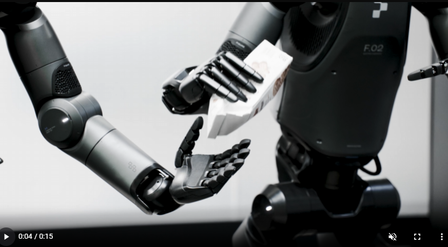

笔记关注技术部分。

[Helix](https://www.figure.ai/news/helix) 是一个 VLA，将感知、语言理解和学习控制统一起来。创新点：
1. 全上身控制：第一个输出整个人形上身 (手腕、躯干、头部和各个手指) 的控制的 VLA，并且高速率且连续的控制。
2. 多机器人协作：第一个同时在两个机器人上运行的 VLA，能够解决共享的、长期操作任务，处理未见过的目标。
3. 拿起任何东西：拿起几乎任何小型家具，包括从未见过的，只需要遵循自然语言提示。
4. 一个神经网络：使用一组 NN 权重学习所有行为，无需特定任务的微调。
5. 商业就绪：在低功耗 GPU 上运行的 VLA，可立即投入商业部署。

## 场景：人形机器人的规范化
家庭是机器人面临最大挑战。家中堆满无数物品，各式各样。机器人需要掌握即时泛化，从 VLM 捕获丰富语义知识，转化为机器人动作。

## Helix：用于整个上半身控制的“系统 1”“系统 2” VLA

VLM 主干是通用的，但是速度不快。而机器人视觉运动策略 (Visuomotor policy) 是快速的，但不通用。Helix 通过两个互补的系统解决，两系统经过端到端训练，可以通信：
- 系统 2 (S2)：互联网数据预训练的 VLM，以 7-9 Hz 运行，用于场景理解和语言理解，实现跨目标和上下文的泛化。
- 系统 1 (S1)：快速反应的视觉运动策略，将 S2 产生的潜语义表征 (latent semantic representations) 转换为 200 Hz 精确连续机器人动作。

解耦架构，允许每个系统在最佳时间尺度上运行。S2 可以慢思考，S1 可以快执行。Helix 优点：
1. 速度和泛化：与专门任务的克隆策略匹配，将零样本泛化到数千个新测试目标。
2. 可规模化：Helix 直接输出高维动作空间的连续控制，避免以前的 VLA 的复杂动作 token 化。token 化的方案在高维的人形控制面临规模化挑战。
3. 架构简单：系统 2 是开源的模型，S1 基于简单的 Transformer 的视觉运动策略。
4. 关注点分离：解耦 S1 和 S2，能分别迭代。

## 模型训练细节
### 数据
手机高质量的多机器人、多操作员数据集，包括要操作行为，总计约 500 小时。为了生成自然语言条件训练对，用自动标注 VLM 生成事后指令 (hindsight instructions)。VLM 处理来自记载机器人摄像头的分段视频片段，提示 "What instruction would you have given the robot to get the action seen in this video?" 训练期间处理所有项目均排除评估之外，避免污染。

### 架构
S2, a VLM backbone, and S1, a latent-conditional visuomotor transformer. S2 建立在 7B 开源的 VLM，将单目机器人图像和机器人状态信息 (手腕姿势和手指位置) 投影到视觉语言嵌入空间后进行处理。结合指定行为的自然语言命令，S2 将所有语义任务相关信息提炼为单个连续潜在向量 (a single continuous latent vector)，传给 S1 以调节低级操作。

S1 是 80 M 参数的交叉注意力 encoder-decoder Transformer，用于低级控制。依靠全卷积、多尺度视觉主干 (multi-scale vision backbone) 进行视觉处理，此主干由完全在模拟 (Simulation) 中完成的预训练初始化。虽然 S1 接收与 S2 相同的图像和状态输入，但处理频率更高。S2 的潜向量被投射到 S1 的 token 空间，并沿序列维度与 S1 视觉主干的视觉特征链接，提供任务调节。

S1 以 200 Hz 输出完整上半身人形控制，包括所需的手腕姿势、手指屈曲和外展控制以及躯干和头部方向目标。在动作空间中附加一个合成的“任务完成百分比”动作，当作终止条件，从而容易排序多个学东西的行为。

### 训练
Helix 完全是端到端啊训练的，将原始像素和文本命令映射到具有标准回归损失 (starndard regression loss) 的连续动作 (continuous)。通过用于调节 S1 行为 (condition S1's behavior) 的潜通信向量 (latent communication vector)，梯度从 S1 反向传播为到 S2，从而允许对这两个组件联合优化 (joint optimization)。Helix 不需要特定任务的适配，保持单个训练阶段和单个神经网络权重集，无需单独动作头或每个任务的微调。

训练时，在 S1 和 S2 输入之间添加时间偏移 (offset)。此偏移经过标定，以匹配 S1 和 S2 部署推理延迟之间差距，确保部署期间的实时控制要求准确反映。

### 优化的流式推理 (Optimized Streaming Inference)
Helix 的训练设计，使得其中高效的模型可在 Figure Robot 部署，每个机器人配备双低功耗嵌入式 GPU。推理流水线分为 S2 (高级潜规划) 和 S1 (低级控制) 模型，两个模型在各自 GPU 运行。S2 为异步运行，使用最新的观察结果和自然语言命令推理，不断更新编码高级行为意图的共享内存潜向量 (shared memory latent vector)。

S1 在单独的实时进程执行，保持平稳整个上身动作所需的关键 200 Hz 控制回路。采用最新观察结果和最新的 S2 潜向量。

部署策略可以反映训练中引入的时间偏移，最大限度减少训练推理分布差距，更加契合异步部署的场景。

## 结果
### 细粒度 VLA 整个上身控制

Helix 以 200 Hz 协调 35 DoF 的动作空间，控制从单个手指运动到末端执行器轨迹、头部注视和躯干姿态等一切。头部和躯干控制带来独特的挑战——移动时，改变机器人可以触及的范围和可以看到的范围，产生反馈循环，会在历史上导致不稳定。比如，机器人用头部平稳地跟踪双手，同时调整躯干以获取最佳触及范围，同时保持精确的手指控制来抓握。从历史上来说，在高维的动作空间实现如此精度水平，挑战极大，即使对于单个任务来说也是。

无需对机器人训练或明确角色分配，通过自然语言提示，两个机器人会自动协调传递物品。

涌现了“拾取任何东西”能力。只需要发出“拾起 [X]”的命令即可。

## 讨论
### Helix 的训练效率极高
以极少的资源实现强大的目标泛化。约 500 小时的高质量监督数据来训练 Helix，数据量远远小于 VLA 数据集，且不依赖多机器人具身手机或多阶段训练。这种手机规模更接近现代单任务模仿学习数据集。尽管数据需求少，但是可以扩展到更具挑战的全上身人形控制空间。

### 一组权重
不需要微调。

## Insights
启动之后，是否可以继续像 LLM 一样强化学习？LLM 的预训练预料来自网络，VLA 来自 LLM 和模仿学习的人类数据。

## Tag and Ref
[[robotics.DexVLA]]
[[llm.Qwen2_5-VL]]
[[robotics.Insights]]
[[robotics.HiRT_使用分层机器人Transformer提示机器人控制]]

#Robotics
#VLA