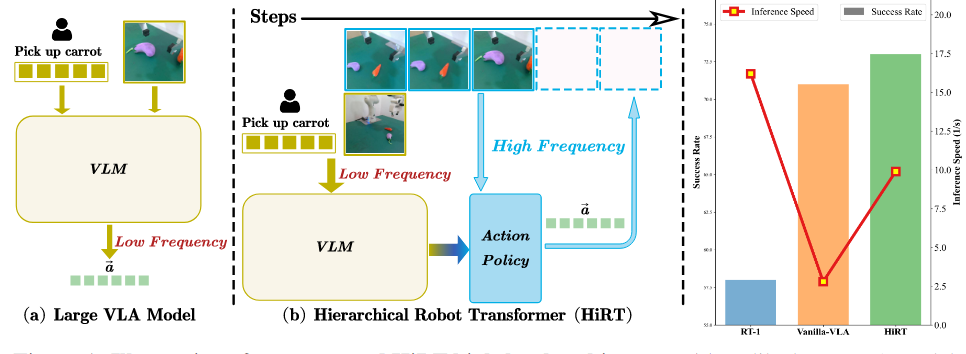
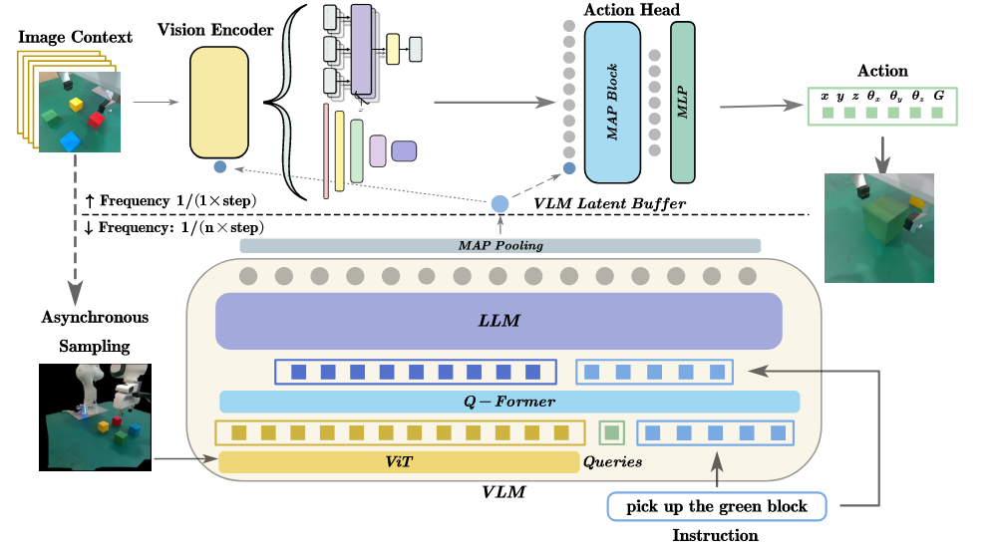

通过异步处理，VLM 低频思考，清凉的动作策略模型高频响应，解决时延不匹配问题。

如图，常规的 VLA 模型直接输出动作，频率低。HiRT 是基于 VLM 的分层策略。给定任务描述，VLM 编码观察得到特征，随后轻量的动作策略以此为条件，异步地生成动作。

HiRT 有两个主要组件：理解模块和执行模块。
- 理解模块是一个 InstructBLIP (7B) 的 VLM，将视觉语言变换为潜特征 (latent feature)。可以认为 VLM 是一个大的语言诗句编码器，编码得到一个 token，即潜特征。用于长期场景理解和任务规划、错误纠正。
- 执行模块是一个紧凑的基于视觉的动作策略，处理短期场景认知，并且使用了从 VLM 传来的先验观察潜特征。为了提升聚焦全局指令和视觉数据的效果，在执行模块引入新颖的条件层。

架构如图。变换指令到一个连续的潜在空间 (continuous latent)，并且与 VLM 给出的视觉观察一并结合起来，随后缓存在 latent buffer。每个推理步中，预训练的视觉编码器编码伴随最新的 latent 的视觉观察，随后，精简后的视觉-语言 tokens 与条件动作头 (conditioned action head) 一同被低级动作解码。

### 多模态编码（VLM 部分）
- 视觉编码：通过 ViT 将图像转换为视觉 token，经 Q-Former 与语言指令融合，输入 LLaMA 生成语义特征。
- 特征提取：使用 MAP（Multi-head Attention Pooling），一个单层的注意力块，聚合 VLM 输出，生成紧凑的语义嵌入，用于指导动作策略。

### 潜在条件策略
跟随 BC-Z [15] 和 RT-1 [13] 工作，以指令和视频作为任务嵌入，作者使用轻量级的视觉编码器 (比如 EfficientNet 和 ViT) 嵌入图像上下文到视觉 tokens。随后，使用 MAP 块聚合所有 token 到连续动作空间。为了集成 VLM 生成的有信息的任务嵌入，作者使用如下条件策略，作用在视觉编码器或动作头：
- FiLM-Condition (Feature-wise Linear Modulation)。CNN 的视觉编码器中，潜在层利用了 VLM 潜变量 $x_{t_k}$ 作为条件。对于 EfficientNet，使用 FiLM 层计算条件特征：$\^{H}=W_\gamma x_{t_k} \cdot H + W_{\beta}x_{t_k}$，$H$ 是潜特征，$W_\gamma,W_\beta$ 是 FiLM 层的可学习参数。
- 使用交叉注意力层的条件。Transformer 的每个自注意力层中，插入额外的交叉注意力层来引入条件：$\^{H}=CrossAttn(H,W_h x_{t_k}) + H$，$W_h$ 代表可学习参数，映射潜变量到潜 token H 空间。
- Condition with Prefix Tuning。为了使 VLM 管理底层动作，利用 VLM 潜变量作为前缀提示给动作头的 MAP 块。动作计算为 $a_t = MLP(MAP([x_{t_k},X^{v}_{:t}]))$。

以上内容参考架构图虚线上部分，分别对应视觉编码器、交叉注意力、动作头 (Action Head，包含 MAP 块和 MLP)。

### 训练和推理策略
- 异步采样：训练时随机选择历史图像作为 VLM 输入，提升策略对延迟特征的鲁棒性。
- 目标函数：通过均方误差（MSE）回归末端位姿，二元交叉熵（BCE）分类夹持器状态。
- 微调策略：VLM 部分使用 LoRA 适配器微调，轻量策略端到端训练。

## Tag and link
[[robotics.DexVLA]]
[[robotics.Helix：用于通才人形机器人控制的_VLM]]
[[robotics.Insights]]

#VLA
#Robotics