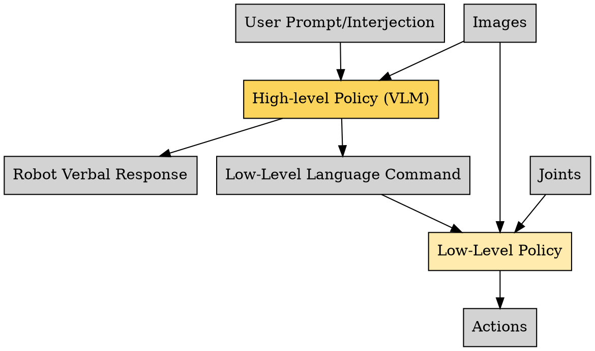
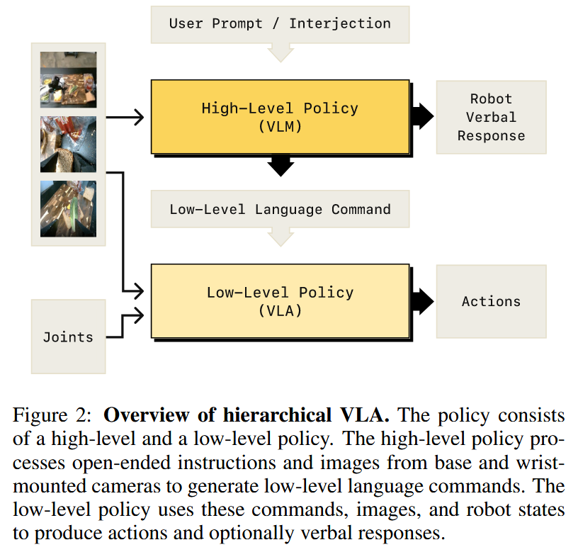

人类解决问题时依赖两种思维模式：
- 系统1（本能系统）：快速、自动化的反应（如熟练烹饪）；
- 系统2（推理系统）：有意识的分步思考（如学习新菜谱）。

Hi Robot 通过分层架构模拟这两种系统：
- 系统1（低级策略）：基于预训练的 VLA（如π₀），执行原子动作（如“拿起番茄”），依赖直觉式反应；
- 系统2（高级策略）：使用视觉-语言模型（VLM）进行复杂推理，将任务分解为小的步骤（如“先切菜，再炒制”），并实时响应用户反馈（如“别放盐！”）。

高级的 policy 能够实时获取场景反馈，比如用户说出“that's not trash”，模型能够理解，并且即使规划动作，即使纠正中间步骤。

高级策略 (Hi Robot Policy) 首先分解复杂的 prompts 到多个简单的步骤，低级的 π0 模型能够执行这些步骤。

π0 训练简单的操作。但是在此工作中，pi0 可以适应复杂的 prompt，遵循 Hi Robot 推理并发出的命令。Hi Robot 与 pi0 通过自然语言的方式通信，于是我们可以看到机器人“与自己对话”并执行任务。

## 论文笔记

作者提出了分层的 VLM。首先，根据复杂 prompts 和用户反馈，推理得到合适的下一步任务，由低级动作来执行。直接指令跟随的方法可以直接执行简单命令，但是作者的工作可以通过复杂 prompts 推理，可以根据任务执行时的反馈调整。

处理用户反馈的精髓在于，高级策略与低级策略之间的通信是**自然语言**，所以用户能够自然地用语言介入。

### 1. 作者和团队信息
- **主要作者**：Lucy Xiaoyang Shi, Brian Ichter, Michael Equi 等
- **机构**：
    - Physical Intelligence（主机构，位于旧金山）
    - 斯坦福大学、加州大学伯克利分校（部分作者联合任职）
- **研究领域**：通用机器人控制、视觉-语言-动作模型（VLA）、人机交互

### 2. 背景和动机
- **问题**：现有机器人系统多局限于执行简单指令（如“拿起杯子”），无法处理复杂开放指令（如“做一个素食三明治，不加番茄”）或动态反馈（如“这不是垃圾”）。
- **需求**：开放环境下，机器人需具备多阶段任务推理、语言反馈整合和动态行为调整能力。
- **核心动机**：通过结合视觉-语言模型（VLMs）的语义理解与机器人动作生成，实现更灵活、可交互的通用机器人系统###。

### 3. 相关研究
- **VLA模型**（如RT-2、π₀）：直接训练视觉-语言模型输出动作，但仅支持简单指令。
- **分层方法**（如SayCan、OLAF）：使用语言模型分解任务，但缺乏视觉情境理解能力。
- **反馈整合方法**（如YAY Robot、RACER）：支持实时修正，但泛化性受限。
- **局限性**：现有方法难以同时满足复杂指令解析、视觉情境推理和物理动作生成。

### 4. 核心思路
- **分层架构**：
    - **高层策略**（VLM）：解析复杂指令与反馈，生成原子化低层命令（如“拿起生菜”）。
    - **低层策略**（VLA，基于π₀）：将命令转化为具体动作，高频执行。
- **关键创新**：通过合成数据增强高层策略的泛化能力，支持开放指令与动态交互。

### 5. 方案与技术

- **分层推理流程**：
    - **高层模型**（VLM）：接收多摄像头图像、用户指令和机器人状态，生成低层命令（如“移动右臂”）。
    - **低层模型**（π₀ VLA）：基于命令和实时观测，通过流匹配生成连续动作序列（如关节轨迹）。
- **合成数据生成**：
    - 利用预训练VLM生成多样化用户指令与反馈（如“请勿加番茄”），覆盖开放场景。
    - 结合真实演示数据（如遥控操作轨迹）训练高层模型。

### 6. 实验与结论
- **任务场景**：清理餐桌、制作三明治、购物（图4）。
- **基线方法**：GPT-4o高层模型、平面VLA（π₀）、专家人工指令。
- **评价指标**：
    - **指令准确性**（IA）：高层命令与用户意图的匹配度。
    - **任务进度**（TP）：目标完成比例（如正确放置的物品数）。
- **结果**：
    - Hi Robot的IA比GPT-4o高40%，TP接近专家水平。
    - 合成数据与分层设计是关键：移除后性能显著下降（图7、8）。

### 7. 贡献
- **分层VLA架构**：首次将VLMs同时用于高层推理与低层控制，支持开放指令与动态反馈。
- **合成数据生成方法**：通过VLM生成多样化交互数据，提升模型泛化性。
- **跨平台验证**：在单臂、双臂和移动机器人上验证通用性。

### 8. 不足
- **模型解耦**：高层与低层独立训练，未联合优化。
- **数据依赖**：合成数据生成依赖提示工程，需人工设计场景分类。
- **推理频率固定**：高层模型按固定频率调用，未自适应调整。
- **物理限制**：低层策略（π₀）对精细操作（如易碎物品）仍存在误差。

## Ref and Tag

[Physical Intelligence 最新的 Hi Robot：基于分层的 VLA 模型的开放式指令遵循。](http://www.pi.website/research/hirobot)