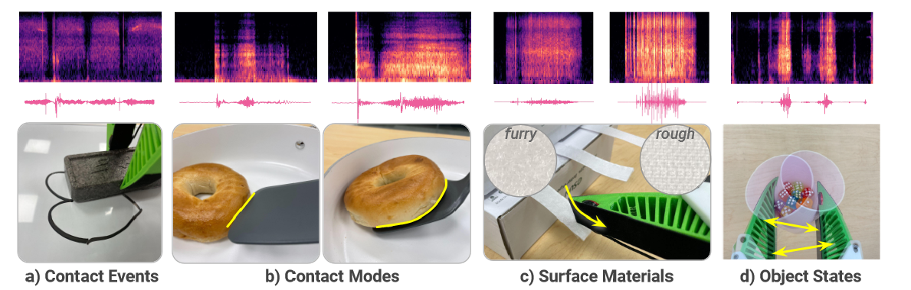
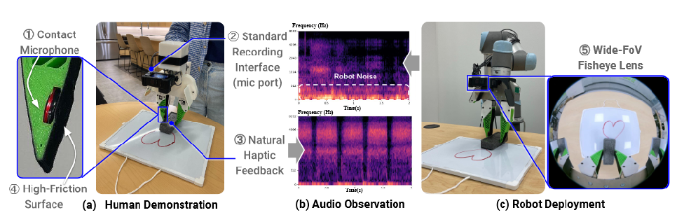
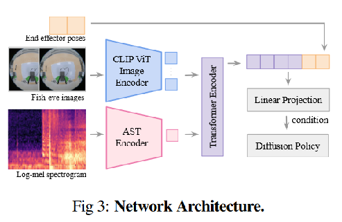
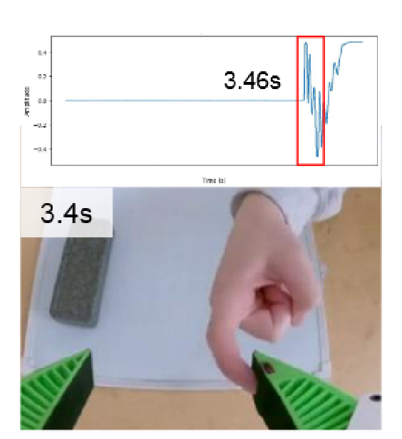

开脑洞：把接触时的声音反馈作为一个模态，用在机器人操作领域。

机器人领域，模仿学习是当前研究热点。基于视觉的方式，学习接触操作较多的技能时，音频信号信息能够极大地增强学习能力。

展示了四种接触较多的操作任务，此类任务包含被动感知接触事件和模式，和主动感知物体表面材料与状态。

paper:https://arxiv.org/abs/2406.19464

主页：https://maniwav.github.io/

ManiWAV利用夹爪接触物体时的音频信息，学习关于交互和物体属性的关键信息，包括接触事件和模式，物体表面材料，物体状态和物理性质。

# Intro
大多数基于视觉的机器人在感知和利用接触信息方面存在局限性。音频模态尚未用在机器人操作领域，作者提出了一种基于音频的机器人操作方法。第一个 insight：音频信号提供丰富的接触信息。

Contact events and modes: 音频反馈可以检测接触事件，描述接触模式（比如锅铲戳菜和铲菜）。

Surface materials: 音频信号用于描述表面材料。基于视觉的策略需要高分辨率的信息才能获取细微的纹理差距。

物体状态和属性：理解物体状态和物理性质方面，音频信息作为补充信息时，表现优于视觉观察。

# Method
## Era-In-Hand Hardware Design

沿用UMI设计的夹爪，嵌入一个压电式接触麦克风（piezoelectric contact microphone），与GoPro相机一并采集视频音频数据。

## Policy Design

输出10个自由度机器人动作，包含3D的末端执行器的位置，6D的末端执行器方向，1D的夹爪开合状态。

音频数据增强：手持夹具收集的演示数据，与实际部署在机械臂上时有很大区别。差距主要来源于机器人执行时电机发出的声音，机器人与物体交互的声音（比如碰撞等）。解决方案：训练模型时，引导模型关注不变的任务相关信号，忽略不可预测的噪声。特别地，从 ESC-50 随机采样音频作为背景噪声。记录 10 个机器人电机噪声。背景噪声和电机噪声一并叠加到数据收集时的音频中，每部分按照 0.5 的概率采样。

视觉编码器：CLIP-pretrained ViT-B/16 模型编码 RGB 图像。图像按照 20Hz 采样，每次选取两个时间步的图像作为输入。

音频编码器：使用 the audio spectrogram transformer (AST) 编码音频输入。AST 类似 ViT，基于 Transformer 的模型比 CNN 模型更有效。任务最后 2 到 3 秒，进行音频信号重采样，从 48kHz 到 16kHz 能够过滤高频噪声，增加任务相关信号的频率分辨率。使用 FFT 转换波形为对数梅尔频谱图（log mel spectrogram），将对数梅尔频谱图被线性归一化到范围 [-1, 1]。

感知融合（Sensory Fusion）：使用 Transformer Encoder 融合视觉和音频模态数据。注意力机制能够适应地调整不同特征权重（比如视觉信息对于移动物体比较重要，音频信息对于接触物体比较重要）。

策略学习：使用扩散策略（Diffusion Policy）。使用 UNet 作为 encoder 的扩散模型作为策略头（policy head），使用前面的 Linear Projection 的输出结果作为每一步去噪的条件。

音频延迟匹配：校准思路与UMI一直。数据收集时，音频与视频同时收集。部署时，需要校准与视觉间延迟。通过轻敲夹爪，观察声音与视觉间延迟。如图，发现音频在图像信息收到后的0.06s才收到。校准一个相当的偏移量。

# Tag
#Paper