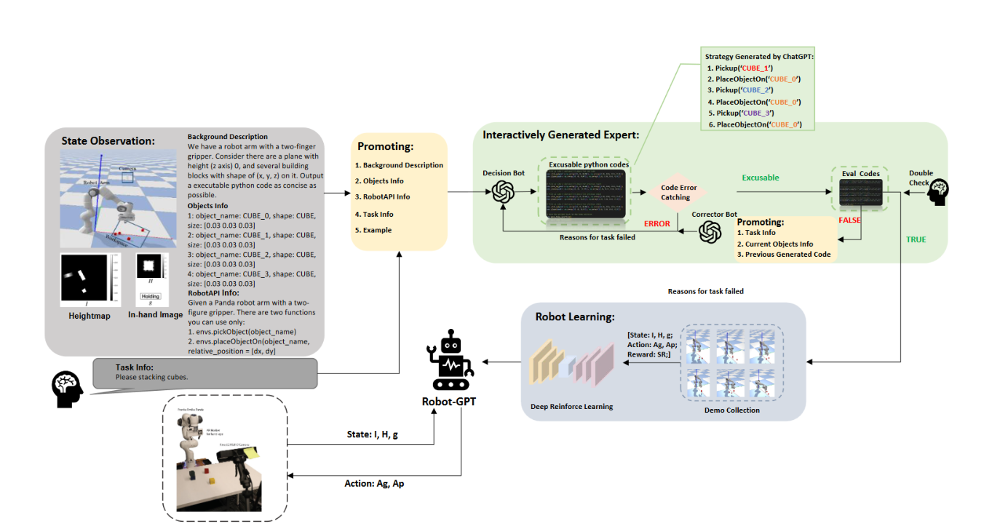
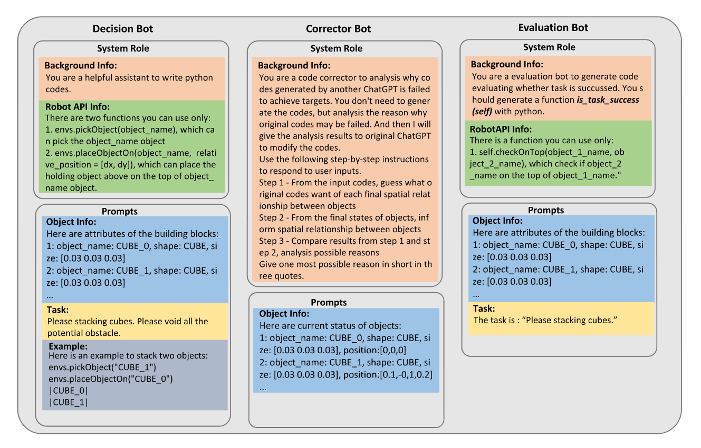
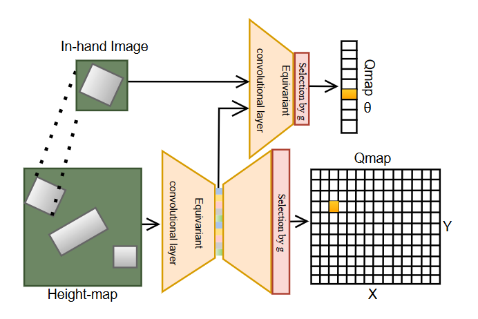

# RobotGPT: Robot Manipulation Learning from ChatGPT
2024 RAL 
https://arxiv.org/abs/2312.01421

ChatGPT 生成的执行代码不能保证在系统方面具有稳定性和安全性。对于相同任务，ChatGPT 会提供不同回答，导致不可预测。尽管设置 temperature 为 0 能够得到一致的输出，但是失去了多样性和创造性。目标是发挥 ChatGPT 的问题解决能力，作者提出了一个框架，包含高效的 prompt 结构和健壮的学习模型。此外，引入了衡量任务难度的尺度，评估 ChatGPT 在机器人操作上的表现。

本论文主要贡献在于：1）发现了高效的 prompts 结构，此结构使用了一个自我纠正模块 (self-correction module)，根据任务复杂度测试来探索 ChatGPT 在机器人任务的能力边界；2）提出了一个新颖的框架，系统并不直接执行 ChatGPT 生成的代码，使用一个 agent 来学习 ChatGPT 生成的规划策略，提升系统稳定性。尽管微调可以提升准确度，但是训练数据难以获取。

LLMs for robotics: 通过自然语言控制机器人，是一种更适合普通人而非专家的方式。（主打“使用 LLMs for robotics”，普通人也能自己做 XXX，比如腰椎间盘突出初步自查）。稳定性和泛化能力是使用语言控制机器人时的关心部分，主要包含高层次的解释性（比如语义解析和规划）和低层次的策略（比如 model-based 方法，模仿学习或强化学习）。[9] 提出了 LLMs 可以高效的分解高层次任务到中层次任务，并且不需要训练。[2] 通过 LLMs 构建了几何方面的易用的规划。[10] 使用值函数评估每次 LLMs 生成的内容，选择最优轨迹。[11] 构建基于 LLMs 的系统来学习特定某个人的偏好。[4] 使用 LLMs 生成以机器人为中心的程序。但是，从 LLMs 生成的内容中，稳定性依然值得探索。

ChatGPT 不能分析视觉输入和操作机器人，作者使用仿真环境和基于语言的机器人的 API 来发挥 ChatGPT 的通用问题解决能力。最后，我们期望训练后的 agent RobotGPT 吸收了 ChatGPT 的任务规划层面的知识。

## A. ChatGPT prompts for robot manipulation
最近，使用 LLMs 作高层次的动作来直接控制机器人是火热的。但是此方法不太合适，有几个原因。首先，ChatGPT 生成的动作可能不安全、不稳定，主要在于物理限制和机器人方面的限制没有被考虑进来。其次，ChatGPT 缺乏相关能力，不能判断因果关系和临时的依赖关系，这项能力在复杂机器人系统至关重要。因此，

作者提供了一个与 ChatGPT 交互的框架，包含两部分：代码生成和错误纠正。代码纠正阶段，用户描述任务并提供样例，这样可以帮助 ChatGPT 输出合适和相关的内容。在错误纠正阶段，考虑两种需要纠正的情况：运行时错误和任务失败。

### 提示描述 (prompting description)
[1] 指出当前提示 LLMs 来处理机器人操作的挑战为：1) 需要完整和准确的问题描述；2）允许使用自然语言描述的 API；3）偏置 (biasing) 回答结构。作者提出 5 部分的提示方法：
* 背景描述部分：描述环境的基本信息，比如布局、相关实体等。
* 对象信息部分：描述对象名字、形状、位姿和其他有用信息。
* 环境信息部分：描述机器人和 API 函数，ChatGPT 可以用它们执行任务。
* 任务信息部分：给与 ChatGPT 具体任务，通常是生成 Python 代码来完成工作。
* 样例部分：提供样例让 ChatGPT 更好地理解环境和 API 用法。

### 自我纠正 (self-correction)
作者提出交互式的方法修改 ChatGPT 输出的轻微 bug 或语法错误。首先在仿真环境执行生成的代码，评估运行结果。逐行执行代码，代码错误捕捉模块 (the Code Error Catching module) 捕捉运行时错误的错误信息和位置，将这些信息送给 ChatGPT 决策机器人 (the ChatGPT decision bot) 进一步分析。对于结果错误，纠正机器人 (the corrector bot) 分析错误的提示中潜在错误原因并生成解释。最后，原来的 ChatGPT 决策机器人重新生成代码。目标是提升 ChatGPT 响应的准确性和可依赖性。

如图 1 所示，展示了系统架构。ChatGPT 作为三个角色出现，分别是决策机器人 (decision bot)，评估机器人 (evaluation bot) 和纠正机器人 (corrector bot)。给出命令后，基于环境信息和人类指令生成自然语言提示，于是决策机器人生成可执行代码，并逐行执行。如果出现运行时错误，错误原因和错误行号会提供给决策机器人修改，如此直到代码成功运行。评估机器人生成评估代码模型 (the Eval Code model)，可执行的代码由它测试。测试不通过，则纠正机器人分析原因并发送信息给决策机器人以修改。随后，代码满足评估条件。训练之后的 agent 可以完美地到部署到实际机器人上。

人类扮演双重检查的角色。如果评估不正确，人类干预并及时纠正。

## B. Robot learning
使用 BulletArm [20] 框架训练基于 ChatGPT 生成演示的 agent。

动作，状态空间和奖励。ChatGPT 驱动的专家演示需要在仿真环境里配置一个 Panda 机器人，相机挂在工作空间顶端。状态空间包含自顶向下的高度图 H，一个手持图像 I，夹爪状态 $g\in\{HOLDING,EMPTY\}$。动作空间包含机器人技能 $A_s\in\{PICK,PLACE\}$，目标状态 $A_s \in A^{xy\theta}$。x,y,θ 代表末端执行器位置和沿着 z 轴的旋转角。使用稀疏奖励函数，当状态-动作对满足目标状态时给与奖励 1，否则 0.

算法。BluuetArm[20] 证明 SDQfD[22] 更优。ASR[14] 在所有环境下性能最优。作者采用了 SDQfD 算法，使用 ASR 网络结构。损失函数使用 n 阶 TD 损失和严格大裕度损失之和。

# 实验

评估系统在仿真和实际环境的表现，主要集中在：
1. 是否高效和安全地收集演示数据，进一步跨越 sim-to-real gap，部署到现实世界的机器人。
2. 关于手动编码和非 LLM 的方法难以定位的问题，LLM 驱动的机器人是否能够解决问题。

# 总结
LLM 扮演的角色：Subgoals Manager and Corrector

当前的方法是通过语言描述图片，再输入给 LLM，得到代码，再执行。是否可以自己总结图片？我们只关心其中重点，比如患者，直接提取图片所有信息会导致冗余，扰乱我们想要的结果。

2023 CVPR，文本生成动作的工作 Motion VQ-VAE 和 T2M-GPT

优势，对比扩散模型。

# Tag
#Paper