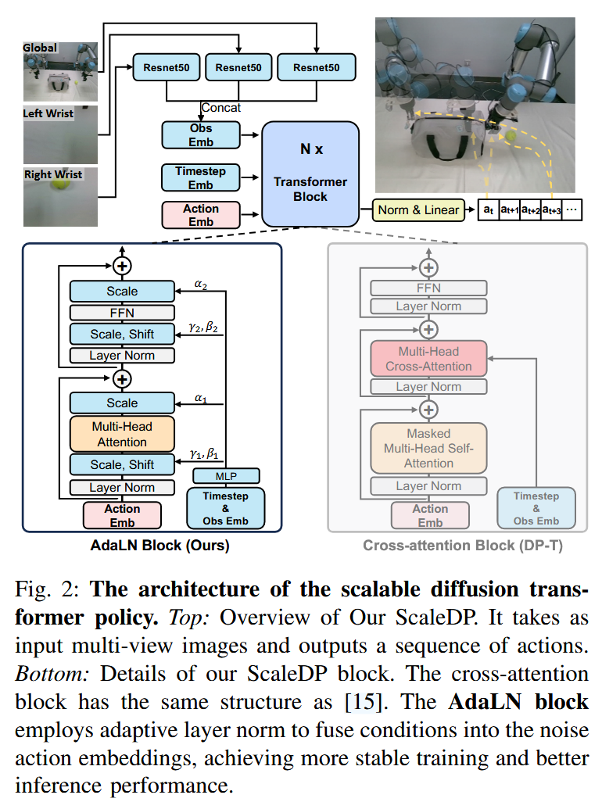

arXiv:2409.14411.

## Method

AdaLN Blocks。其中，在图像生成方面，使用 adaptive normalization 是一种普遍的方案。于是作者把标准 Transformer 的 layer norm 层替换为 adaptive layer norm (AdaLN)。具体来说，替换为直接学习 dimension-wise 的 scale 和 shift 可学习参数 γ 和 β。用回归方法（比如线性层）从嵌入（包括时间步嵌入和位置嵌入）后的时间步 k 和观测输入 o，生成 γ 和 β。具体计算如下： ^arh7om3id148

$$
AdaLN(x)=(\gamma (k,o) + 1) \cdot x + \beta (k, o)
$$

$\gamma, \beta$ 是神经网络，输入为推理时间步 timestep $k$ 和观察 $o$。

具体来说，在每个 LayerNorm 后面添加一个 Scale 和 Shift，在 MHA 和 FFN 之后添加 Scale。

与原作使用了因果掩码的注意力不同，作者认为单向的注意力机制会隐藏了动作表示。所以，不适用因果掩码，使得动作与左右动作更一致。

代码参考 DexVLA 的部分。

## 对比 DiT，孰优孰劣？

## Ref and Tag

[[robotics.DexVLA]]

#Robotics