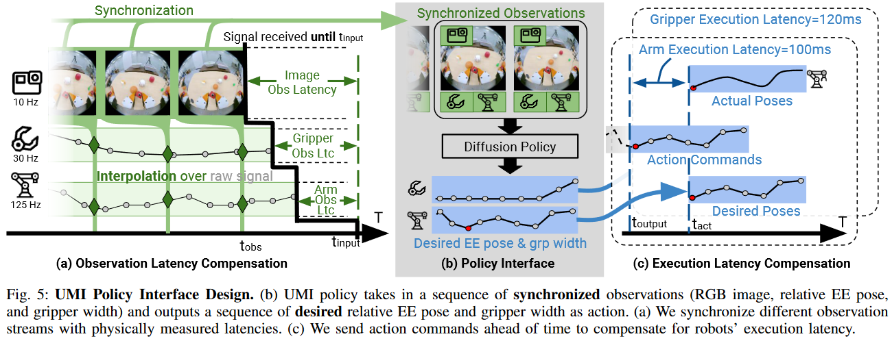

提供了一个框架，使用手持夹爪方便地收集数据，训练能够推广到不同的机器人平台。

## Method
### A Demonstration 
* HD1 使用一个 3D 打印的夹爪，手腕部分搭载唯一传感器 GoPro 相机。双臂操作使用另一个相同的 Gripper。
* HD2 155 度的鱼眼相机提供足够广的的视觉信息。
* HD3 旁侧镜子提供隐式立体信息。
* HD4 IMU-感知追踪路径，使用 GoPro 能够与 mp4 视频文件一同记录 IMU 数据 (加速度计和陀螺仪)。作者的 Inertial-monocular SLAM system 基于 ORB-SLAM3，记录了短期的轨迹，在视觉轨迹失败 (比如动作模糊) 后能够起作用。
* HD5 连续地控制夹爪能够明显地扩展完成任务能力。
* HD6 数据收集后，基于运动学来筛选有效数据。

### B Policy Interface Design
收集演示数据后，使用同步后的数据 (RGB images, 6 DoF end-effector pose, and gripper width)，训练基于视觉运动的策略，生成一系列动作 (end-effector pose and gripper width)。作者使用了 Diffusion Policy。

UMI 的目的是保证 interface 在无需知晓底层机器人硬件平台的情况下，任然能够适用，即只用手持夹爪来收集数据并训练。挑战：
* 具体硬件延迟。系统存在各种延迟，比如相机数据流，机器人控制和工业夹爪的控制流。不过 GoPro 采集的各种数据直接没有延迟，包括视频、IMU 数据和基于视觉的夹爪宽度评估。
* 具体具身的自身感知。通常，关节角和 EE pose 等自身感知 (proprioception)，仅仅对具体机械臂有明确定义。因此，UMI 需要解决泛化不同机器人具身的挑战。



策略接口设计需要处理如下挑战：

PD1. 推理时间的延迟匹配 (Inference-time latency maching)。接口假定同步的观测流和立即执行的动作同步，但实体机器人系统并非如此。不处理延迟会严重影响表现。
1. 观测延迟匹配。实体系统中，不同观测流 (RGB image, EE pose, gripper width) 由不同的控制器获取，存在延迟。分别测量延迟 (附录 A1-A3)，在推理时对齐所有观测到延迟最大者 (通常是相机)。首先，下采样 RGB 相机观察到指定的频率 (通常 10-20Hz)，随后使用获取的每张相片的时间戳 $$t_{obs}$$，线性插值 gripper 和 EE pose。双臂情况下，软同步两个相机，即找到最接近的 frame，通常在六十分之一秒内。最后得到同步后的观测，如 Fig. 5(a) 中绿色菱形部分。
2. 动作延迟匹配。策略假定输出是同步的 EE pose 和 gripper widths，但是，实际上，机械臂和 gripper 只能记录目标 pose 序列到一个执行延迟 (execution latency)，此延迟在不同机器人硬件平台不尽相同。为了保障机器人和 gripper 在指定时间内完成策略生成的动作 (执行后达到指定状态)，需要提前发送命令来抵偿，如 Fig. 5(c)，细节见附录 A4。

### A 延迟测量：
1. 相机延迟测量。记录一个计算机屏幕上的周期 (rolling) QR code，每个视频帧都显示了当前系统的 timestamp $$t_{display}$$。为了避免多次检测 QR codes (主要是计算机显示器上展示 GoPro 拍到的内容包含了 QR code)，遮掩相机录像部分的 QR code。通过减去接收到每个视频帧的 timestamp $$t_{recv}$$，和解码 QR code 时间戳 $$t_{display}$$ 和现实刷新的延迟 $$l_{display}$$，得到了相机延迟：$$l_{camera}=t_{recv}-t_{display}-l_{display}$$
2. 本体感知测量。接收到 policy 输出的时间戳 $$t_{recv}$$ 减去发送到机器人的时间戳 $$t_{robot}$$，得到本体感知延迟：$$l_{obs}=t_{recv}-t_{robot}$$。注意，机器人硬件时间戳难以获取，近似为 1/2 的 ICMP 报文的 round-trip time。
3. Gripper 执行延迟测量。端到端延迟 $$l_{e2e}$$，发送一系列正弦位置信号，记录 gripper 何时感知。于是得到：$$l_{action}=l_{e2e}-l_{obs}$$。
4. 机器人执行延迟测量。最终使用 $$l_{e2e}$$。

### B Data Collection Protocol
在新环境收集数据时，需要遵循以下四个步骤：
1. 时间同步。比如双臂场景，同步两个 GoPro 相机。
2. Gripper 标定。
3. 建图。关于每个新场景，通过缓慢移动 gripper 来扫描环境，得到高质量地图，这对健壮的 SLAM 记录十分重要。
4. 演示 。

PD2 相对 EE pose。为了避免依赖于具体的具身平台，作者提出了所有的 EE pose 都是相对于 gripper 当前的 EE pose。
1. 相对 EE 轨迹作为动作的表达。有工作 (Diffusion Policy) 对比了绝对位置相关的动作与增量动作 (delta actions)。具体来说，对于从时间点 $$t_0$$ 开始的动作序列，将其定义为一系列 SE(3) 变换来表示相对于初始时间点 $$t_0$$ 的末端执行器姿态在时间点 $$t$$ 的期望姿态的相对轨迹表示法，可以使系统在数据收集过程中对跟踪误差以及相机位移更加鲁棒。
2. 相对 EE 轨迹表示作为自我感知。使用相对轨迹表达自我感知的历史 EE poses。比如 obs horizon 设为 2，便能够提供速度信息了，作差即可。结合腕部挂在相机，使得我们不需要标定。并且，执行动作期间，移动机器人的 base 也不会影响任务表现，如 Fig. 10 (a)，使得 UMI 框架对于移动机器人操作也使用。
3. 相对 girpper 间的自我感知。在双臂场景，policy 提供两个 gripper 的相对 pose 对双臂协作的任务成功率至关重要。gripper 间感知通过建地图-再定位的数据，根据 IMU 构建场景级别的坐标系统。每个新场景下，首先收集视频，并用于建图。随后，收集的演示数据会重定位到相同的地图，并分享同一坐标系统。

Insight：是否可以把这种相对融合为部分相对和部分绝对？就像在中间位置，设置锚点，相对则考虑动作增量，绝对考虑初始位置与目标的距离关系。在动作序列中，**随机**采样动作序列中的几个位置，作为绝对位置参考，就像 Long Short-Term 的 Long，而**相对**轨迹则贯穿始终，就像 Short-Term 部分。

## Repo
[github](https://github.com/real-stanford/universal_manipulation_interface)

## 环境配置
注意，根据 conda_environment.yaml 来配置。注意，需要使用 Python 3.9，其他版本可能难以解决依赖问题。

## 数据准备 pipeline
我们的项目使用了动捕，不需要 SLAM 的部分。数据准备脚本运行示例：
```sh
(umi)$ wget --recursive --no-parent --no-host-directories --cut-dirs=2 --relative --reject="index.html*" https://real.stanford.edu/umi/data/example_demo_session/
(umi)$ python run_slam_pipeline.py example_demo_session
# 数据准备之后，生成 replay buffer，得到 dataset.zarr.zip，作为训练策略的输入
(umi)$ python scripts_slam_pipeline/07_generate_replay_buffer.py -o example_demo_session/dataset.zarr.zip example_demo_session
```

数据收集细节参考 [link](https://swanky-sphere-ad1.notion.site/UMI-Data-Collection-Instruction-4db1a1f0f2aa4a2e84d9742720428b4c)

数据保存：
```py
# scripts_slam_pipeline/07_generate_replay_buffer.py
```

### ReplaceBuffer 设计
根据 diffusion_policy/config/task/umi_bimanual.yaml，使用了 diffusion_policy/dataset/umi_dataset.py:UmiData 类：
```yaml
dataset_path: &dataset_path data_workspace/fold_cloth/20231226_mirror_swap.zarr.zip
...
dataset:
  _target_: diffusion_policy.dataset.umi_dataset.UmiDataset
  dataset_path: *dataset_path
  ...
```

```py
class UmiDataset(BaseDataset):
    def __init__(self,
        ...
        dataset_path: str,
        ...
    ):
        ...
        if cache_dir is None:
            # load into memory store
            with zarr.ZipStore(dataset_path, mode='r') as zip_store:
                replay_buffer = ReplayBuffer.copy_from_store(
                    src_store=zip_store, 
                    store=zarr.MemoryStore()
                )
```
UmiDataset 收到 dataset_path 之后，得到了 zarr.zip 文件，于是使用 zarr.ZipStore 打开，初始化 ReplayBuffer：

```py
# diffusion_policy/common/replay_buffer.py
class ReplayBuffer:
    def __init__(self, root: Union[zarr.Group, Dict[str,dict]]):
        """ Dummy constructor. Use copy_from* and create_from* class methods instead.  """
        ...
        # 注意，zarr 2.16 的 zarr.Group 才有 items() 接口，3.0.3 版本没有
        # 只有 keys 方法
        # 此方法主要验证 root 数据的 episode 是否长度正确。
        for key, value in root["data"].items():
            assert value.shape[0] == root["meta"]["episode_ends"][-1]
        self.root = root
```

属性和初始化、保存和加载，都只关注与 Zarr 的情况，暂时不考虑 NumPy 保存的情况。

#### 属性和类 dict API
```py
class ReplayBuffer:
    ...
    @cached_property
    def data(self):
        return self.root["data"]

    @cached_property
    def meta(self):
        return self.root["meta"]

    @property
    def episode_ends(self):
        return self.meta["episode_ends"]
    
    # buffer 保存的框架
    @property
    def backend(self):
        backend = "numpy"
        if isinstance(self.root, zarr.Group):
            backend = "zarr"
        return backend

    # =========== our API ==============
    # 以下内容提供给 Dataset 访问。
    @property
    def n_steps(self):
        if len(self.episode_ends) == 0:
            return 0
        return self.episode_ends[-1]

    @property
    def n_episodes(self):
        # zarr 3.0，Group 无 __len__ 属性，要用 size
        return len(self.episode_ends)

    @property
    def chunk_size(self):
        if self.backend == "zarr":
            return next(iter(self.data.arrays()))[-1].chunks[0]
        return None

    @property
    def episode_lengths(self):
        ends = self.episode_ends[:]
        ends = np.insert(ends, 0, 0)
        lengths = np.diff(ends)
        return lengths

    # =========== dict-like API ==============
    def __repr__(self) -> str:
        if self.backend == "zarr":
            return str(self.root.tree())
        else:
            return super().__repr__()

    def keys(self):
        return self.data.keys()

    def values(self):
        return self.data.values()

    def items(self):
        return self.data.items()

    def __getitem__(self, key):
        return self.data[key]

    def __contains__(self, key):
        return key in self.data
```

#### episode_ends 细节
episode_ends 记录每条 episode 数据的末尾 index，并且是 exclusive 的。在 data 下，每条 episode 的观察和动作数据都堆叠拼接在第一维度。考察初始化时，缓冲区没有 episode，所以长度为 0，即 shape (0,)，没有任何元素：
```py
episode_ends = meta.zeros("episode_ends", shape=(0,), dtype=np.int64, compressor=None, overwrite=False)
```

扩散策略的示例数据：
data/pusht_cchi_v7_replay.zarr
 ├── data
 │   ├── action (25650, 2) float32
 │   ├── img (25650, 96, 96, 3) float32
 │   ├── keypoint (25650, 9, 2) float32
 │   ├── n_contacts (25650, 1) float32
 │   └── state (25650, 5) float32
 └── meta
     └── episode_ends (206,) int64

关注 action，img，keypoint 等数据第一维，其实是多条 episodes 数据在第一维度堆叠拼接起来。meta/episode_ends 记录每个 episode 在第一维的末尾 index。注意，是 exclusive 的。

#### 初始化：创建空的 ReplayBuffer
```py
    @classmethod
    def create_empty_zarr(cls, storage=None, root=None):
        if root is None:
            if storage is None:
                storage = zarr.MemoryStore()
            root = zarr.group(store=storage)
        data = root.require_group("data", overwrite=False)
        meta = root.require_group("meta", overwrite=False)
        if "episode_ends" not in meta:
            episode_ends = meta.zeros("episode_ends", shape=(0,), dtype=np.int64, compressor=None, overwrite=False)
        return cls(root=root)
```

#### 保存到 Store
把当前 ReplayBuffer 对象的内容拷贝到 store 中。
```py
    def save_to_store(
        self,
        store,
        chunks: Optional[Dict[str, tuple]] = dict(),
        compressors: Union[str, numcodecs.abc.Codec, dict] = dict(),
        if_exists="replace",
        **kwargs,
    ):
        root = zarr.group(store)
        if self.backend == "zarr":
            # 拷贝 meta 的内容
            n_copied, n_skipped, n_bytes_copied = zarr.copy_store(
                source=self.root.store, dest=store, source_path="/meta", dest_path="/meta", if_exists=if_exists
            )
        else:
            ...

        # 接下来拷贝 data 部分 Group 的内容。
        data_group = root.create_group("data", overwrite=True)
        for key, value in self.root["data"].items():
            cks = self._resolve_array_chunks(chunks=chunks, key=key, array=value)
            cpr = self._resolve_array_compressor(compressors=compressors, key=key, array=value)
            if isinstance(value, zarr.Array):
                if cks == value.chunks and cpr == value.compressor:
                    # copy without recompression
                    this_path = "/data/" + key
                    n_copied, n_skipped, n_bytes_copied = zarr.copy_store(
                        source=self.root.store,
                        dest=store,
                        source_path=this_path,
                        dest_path=this_path,
                        if_exists=if_exists,
                    )
                else:
                    # copy with recompression
                    n_copied, n_skipped, n_bytes_copied = zarr.copy(
                        source=value, dest=data_group, name=key, chunks=cks, compressor=cpr, if_exists=if_exists
                    )
            else:
                # numpy
                _ = data_group.array(name=key, data=value, chunks=cks, compressor=cpr)
        return store
```

#### 加载保存的数据：训练时 Dataset 初始化
```py
    @classmethod
    def copy_from_store(
        cls,
        src_store,
        store=None,
        keys=None,
        chunks: Dict[str, tuple] = dict(),
        compressors: Union[dict, str, numcodecs.abc.Codec] = dict(),
        if_exists="replace",
        **kwargs,
    ):
        """
        Load to memory.
        """
        src_root = zarr.group(src_store)
        root = None
        if store is None:
            ...
        else:
            root = zarr.group(store=store)
            # copy without recompression
            n_copied, n_skipped, n_bytes_copied = zarr.copy_store(
                source=src_store, dest=store, source_path="/meta", dest_path="/meta", if_exists=if_exists
            )
            data_group = root.create_group("data", overwrite=True)
            if keys is None:
                keys = src_root["data"].keys()
            for key in keys:
                value = src_root["data"][key]
                cks = cls._resolve_array_chunks(chunks=chunks, key=key, array=value)
                cpr = cls._resolve_array_compressor(compressors=compressors, key=key, array=value)
                if cks == value.chunks and cpr == value.compressor:
                    # copy without recompression
                    this_path = "/data/" + key
                    n_copied, n_skipped, n_bytes_copied = zarr.copy_store(
                        source=src_store, dest=store, source_path=this_path, dest_path=this_path, if_exists=if_exists
                    )
                else:
                    # copy with recompression
                    n_copied, n_skipped, n_bytes_copied = zarr.copy(
                        source=value, dest=data_group, name=key, chunks=cks, compressor=cpr, if_exists=if_exists
                    )
        buffer = cls(root=root)
        return buffer
```
需要使用 copy_from* 和 create_from* 构建 ReplayBuffer 对象，ctor 只是一个 dummy。

#### episode 数据添加、删除、查询
```py
    def add_episode(
        self,
        data: Dict[str, np.ndarray],
        chunks: Optional[Dict[str, tuple]] = dict(),
        compressors: Union[str, numcodecs.abc.Codec, dict] = dict(),
    ):
        assert len(data) > 0
        is_zarr = self.backend == "zarr"

        # episode_ends 有多少个元素
        curr_len = self.n_steps
        episode_length = None
        for key, value in data.items():
            # 至少第一维是 episode 的长度
            assert len(value.shape) >= 1
            if episode_length is None:
                episode_length = len(value)
            else:
                # 保证一个 episode 的各个数据必须有相同的 episode_length
                # 比如 action, img, keypoint 等等
                assert episode_length == len(value)
        new_len = curr_len + episode_length

        # 逐个添加到 ReplayBuffer 的 data 中，并修改 meta/episode_ends
        for key, value in data.items():
            # new_len 是 episode 长，后面便是维度
            new_shape = (new_len,) + value.shape[1:]
            # create array
            if key not in self.data:
                if is_zarr:
                    cks = self._resolve_array_chunks(chunks=chunks, key=key, array=value)
                    cpr = self._resolve_array_compressor(compressors=compressors, key=key, array=value)
                    arr = self.data.zeros(name=key, shape=new_shape, chunks=cks, dtype=value.dtype, compressor=cpr)
                else:
                    ...
            else:
                arr = self.data[key]
                assert value.shape[1:] == arr.shape[1:]
                # same method for both zarr and numpy
                if is_zarr:
                    # 扩张，随后复制后面部分
                    arr.resize(new_shape)
                else:
                    arr.resize(new_shape, refcheck=False)
            # copy data
            arr[-value.shape[0] :] = value

        # append to episode ends
        episode_ends = self.episode_ends
        if is_zarr:
            episode_ends.resize(episode_ends.shape[0] + 1)
        else:
            episode_ends.resize(episode_ends.shape[0] + 1, refcheck=False)
        episode_ends[-1] = new_len

        # rechunk
        if is_zarr:
            if episode_ends.chunks[0] < episode_ends.shape[0]:
                # 按照 1.5 倍扩张 chunks 大小，会重新拷贝和复制 self.meta
                rechunk_recompress_array(self.meta, "episode_ends", chunk_length=int(episode_ends.shape[0] * 1.5))

    def drop_episode(self):
        is_zarr = self.backend == "zarr"
        episode_ends = self.episode_ends[:].copy()
        assert len(episode_ends) > 0
        start_idx = 0
        if len(episode_ends) > 1:
            start_idx = episode_ends[-2]
        for key, value in self.data.items():
            new_shape = (start_idx,) + value.shape[1:]
            if is_zarr:
                value.resize(new_shape)
            else:
                value.resize(new_shape, refcheck=False)
        if is_zarr:
            self.episode_ends.resize(len(episode_ends) - 1)
        else:
            self.episode_ends.resize(len(episode_ends) - 1, refcheck=False)
```

## 数据预处理：保存训练数据
### 保存数据为 ReplayBuffer
在 scripts_slam_pipeline/07_generate_replay_buffer.py 中，首先创建空的 zarr：
```py
def main(input, output, out_res, out_fov, compression_level, 
         no_mirror, mirror_swap, num_workers):
    ...
    # 创建空的 ReplayBuffer，子 Group 中，data 为空，meta 有 arrays episode_ends，也是空的。
    # root.tree()
    # /
    # ├── data
    # └── meta
    #     └── episode_ends (0,) int64
    out_replay_buffer = ReplayBuffer.create_empty_zarr(
        storage=zarr.MemoryStore())
```

## 数据加载
```py
class UmiDataset(BaseDataset):
    def __init__(self,
        # 配置文件，比如 diffusion_policy/config/task/umi_bimanual.yaml:shape_meta: &shape_meta
        shape_meta: dict,
        dataset_path: str,
        cache_dir: Optional[str]=None,
        pose_repr: dict={},
        action_padding: bool=False,
        temporally_independent_normalization: bool=False,
        repeat_frame_prob: float=0.0,
        seed: int=42,
        val_ratio: float=0.0,
        max_duration: Optional[float]=None
    ):
        if cache_dir is None:
        # load into memory store
        with zarr.ZipStore(dataset_path, mode='r') as zip_store:
            replay_buffer = ReplayBuffer.copy_from_store(
                src_store=zip_store, 
                store=zarr.MemoryStore()
            )
        # 读取 yaml 配置文件到内存
        self.num_robot = 0
        rgb_keys = list()
        ...
        obs_shape_meta = shape_meta['obs']
        for key, attr in obs_shape_meta.items():
            # solve obs type
            type = attr.get('type', 'low_dim')
            if type == 'rgb':
            # rgb 格式通常是高纬的数据，比如 (3, 224, 224)
                rgb_keys.append(key)
            elif type == 'low_dim':
            # low_dim 通常是维度较低的内容，比如 pose 数据，远小于图像的维度，比如 (3,)
                lowdim_keys.append(key)
            # 根据 key 是否为 eef_pos 来判断末端执行器数量，确定机器人数量
            if key.endswith('eef_pos'):
                self.num_robot += 1
            # solve obs_horizon
            horizon = shape_meta['obs'][key]['horizon']
            key_horizon[key] = horizon
            # 其他部分
            ...
        # action 部分设置
        key_horizon['action'] = shape_meta['action']['horizon']
        ...
        
        # 遮盖，部分 episode 充当验证集的角色
        # val_mask 是 shape 为 (n_episodes,) 的 np.array，类型为 bool
        # 比如 [False, False, ..., True, ...] 的类型
        val_mask = get_val_mask(...)
        # 验证集即取反
        train_mask = ~val_mask

        self.sampler_lowdim_keys = list()
        for key in lowdim_keys:
            if not 'wrt' in key:
                self.sampler_lowdim_keys.append(key)
    
        for key in replay_buffer.keys():
            if key.endswith('_demo_start_pose') or key.endswith('_demo_end_pose'):
                self.sampler_lowdim_keys.append(key)
                query_key = key.split('_')[0] + '_eef_pos'
                key_horizon[key] = shape_meta['obs'][query_key]['horizon']
                key_latency_steps[key] = shape_meta['obs'][query_key]['latency_steps']
                key_down_sample_steps[key] = shape_meta['obs'][query_key]['down_sample_steps']

        sampler = SequenceSampler(
            shape_meta=shape_meta,
            replay_buffer=replay_buffer,
            rgb_keys=rgb_keys,
            lowdim_keys=self.sampler_lowdim_keys,
            key_horizon=key_horizon,
            key_latency_steps=key_latency_steps,
            key_down_sample_steps=key_down_sample_steps,
            episode_mask=train_mask,
            action_padding=action_padding,
            repeat_frame_prob=repeat_frame_prob,
            max_duration=max_duration
        )
        # 保存在对象的 field
        self.shape_meta = shape_meta
        self.replay_buffer = replay_buffer
        self.rgb_keys = rgb_keys
        ...
        self.sampler = sampler
        ...
```

魔法函数 __getitem__ 用到了 self.sampler，根据 keys 从 replay_buffer 中索引对应 index 的数据，并且组织为了 horizon 的情况。

### SequenceSampler
diffusion_policy/common/sampler.py:SequenceSampler
```py
class SequenceSampler:
    def __init__(self,
        shape_meta: dict,
        replay_buffer: ReplayBuffer,
        rgb_keys: list,
        lowdim_keys: list,
        key_horizon: dict,
        key_latency_steps: dict,
        key_down_sample_steps: dict,
        episode_mask: Optional[np.ndarray]=None,
        action_padding: bool=False,
        repeat_frame_prob: float=0.0,
        max_duration: Optional[float]=None
    ):
        episode_ends = replay_buffer.episode_ends[:]
        ...
        # 创建索引，用于后续从 buffer 读取数据。包括 (current_idx, start_idx, end_idx)
        # start_idx 和 end_idx 则是确定了 episode 的起始区间
        # current_idx 则属于 [start_idx, end_idx)
        # 总体来说，indices 包含了 buffer 中所有条目。current_idx 则是从 0 到 最后一个。
        indices = list()
        for i in range(len(episode_ends)):
            # before_first_grasp = True # initialize for each episode
            if episode_mask is not None and not episode_mask[i]:
                # 此 episode 不需要
                continue
            # 第一个特殊处理
            start_idx = 0 if i == 0 else episode_ends[i-1]
            end_idx = episode_ends[i]
            ...
            for current_idx in range(start_idx, end_idx):
                if not action_padding and end_idx < current_idx + (key_horizon['action'] - 1) * key_down_sample_steps['action'] + 1:
                    continue
                # if gripper_width[current_idx] < gripper_width_threshold:
                #     before_first_grasp = False
                indices.append((current_idx, start_idx, end_idx))
        # load low_dim to memory and keep rgb as compressed zarr array
        self.replay_buffer = dict()
        self.num_robot = 0
        for key in lowdim_keys:
            if key.endswith('eef_pos'):
                # 记录 buffer 中包含机器人的数量
                self.num_robot += 1

            if key.endswith('pos_abs'):
                # 处理细节
                ...
            elif key.endswith('quat_abs'):
                ...
            else:
                # 简单加载
                self.replay_buffer[key] = replay_buffer[key][:]
        for key in rgb_keys:
            self.replay_buffer[key] = replay_buffer[key]
        
        if 'action' in replay_buffer:
            # 一般都是 replay
            self.replay_buffer['action'] = replay_buffer['action'][:]
        else:
            # 第一次加载时，没有 action 的 key，所以需要准备好 action
            # 根据 eef_pos，即末端执行器 pose 来准备即可。
            # construct action (concatenation of [eef_pos, eef_rot, gripper_width])
            actions = list()
            for robot_idx in range(self.num_robot):
                for cat in ['eef_pos', 'eef_rot_axis_angle']:
                    key = f'robot{robot_idx}_{cat}'
                    if key in self.replay_buffer:
                        # 比如 robot0_eef_pos, robot0_eef_rot_axis_angle，这两者在 yaml 配置为 shape: [3]，
                        # 分别得到 (n, 3) 的 zarr.core.Array
                        actions.append(self.replay_buffer[key])
            # 最后，self.num_robot 为 2 时，actions 是 [(n, 3), (n, 3), (n, 3), (n, 3)]
            # 拼接后得到 (n, 12)
            self.replay_buffer['action'] = np.concatenate(actions, axis=-1)

        # 保存到对象中
        self.action_padding = action_padding
        self.indices = indices
        ...
```

如果有 action_padding，那么在 start_idx 时，horizon 可能囊括的动作不够填充 horizon，所以拷贝填充到首处。

最后得到的 self.replay_buffer 的 meta 包含了 episode_ends；而 data，即类字典的接口中， self.replay_buffer.data 中，包含了 action (n, 12) 和 原来的部分（参考 yaml 配置文件中的 shape_meta.obs 的内容。注意，obs 中的 key 可能并不会全部存在于 buffer，而是）。

```py
    def sample_sequence(self, idx):
        current_idx, start_idx, end_idx = self.indices[idx]

        result = dict()

        obs_keys = self.rgb_keys + self.lowdim_keys
        if self.ignore_rgb_is_applied:
            obs_keys = self.lowdim_keys

        # observation
        for key in obs_keys:
            input_arr = self.replay_buffer[key]
            this_horizon = self.key_horizon[key]
            this_latency_steps = self.key_latency_steps[key]
            this_downsample_steps = self.key_down_sample_steps[key]
            
            if key in self.rgb_keys:
                assert this_latency_steps == 0
                num_valid = min(this_horizon, (current_idx - start_idx) // this_downsample_steps + 1)
                slice_start = current_idx - (num_valid - 1) * this_downsample_steps

                output = input_arr[slice_start: current_idx + 1: this_downsample_steps]
                assert output.shape[0] == num_valid
                
                # solve padding
                if output.shape[0] < this_horizon:
                    padding = np.repeat(output[:1], this_horizon - output.shape[0], axis=0)
                    output = np.concatenate([padding, output], axis=0)
            else:
                idx_with_latency = np.array(
                    [current_idx - idx * this_downsample_steps + this_latency_steps for idx in range(this_horizon)],
                    dtype=np.float32)
                idx_with_latency = idx_with_latency[::-1]
                idx_with_latency = np.clip(idx_with_latency, start_idx, end_idx - 1)
                interpolation_start = max(int(idx_with_latency[0]) - 5, start_idx)
                interpolation_end = min(int(idx_with_latency[-1]) + 2 + 5, end_idx)

                if 'rot' in key:
                    # rotation
                    rot_preprocess, rot_postprocess = None, None
                    if key.endswith('quat'):
                        rot_preprocess = st.Rotation.from_quat
                        rot_postprocess = st.Rotation.as_quat
                    elif key.endswith('axis_angle'):
                        rot_preprocess = st.Rotation.from_rotvec
                        rot_postprocess = st.Rotation.as_rotvec
                    else:
                        raise NotImplementedError
                    slerp = st.Slerp(
                        times=np.arange(interpolation_start, interpolation_end),
                        rotations=rot_preprocess(input_arr[interpolation_start: interpolation_end]))
                    output = rot_postprocess(slerp(idx_with_latency))
                else:
                    interp = si.interp1d(
                        x=np.arange(interpolation_start, interpolation_end),
                        y=input_arr[interpolation_start: interpolation_end],
                        axis=0, assume_sorted=True)
                    output = interp(idx_with_latency)
                
            result[key] = output

        # repeat frame before first grasp
        # if self.repeat_frame_prob != 0.0:
        #     if before_first_grasp and random.random() < self.repeat_frame_prob:
        #         for key in obs_keys:
        #             result[key][:-1] = result[key][-1:]

        # aciton
        input_arr = self.replay_buffer['action']
        action_horizon = self.key_horizon['action']
        action_latency_steps = self.key_latency_steps['action']
        assert action_latency_steps == 0
        action_down_sample_steps = self.key_down_sample_steps['action']
        slice_end = min(end_idx, current_idx + (action_horizon - 1) * action_down_sample_steps + 1)
        output = input_arr[current_idx: slice_end: action_down_sample_steps]
        # solve padding
        if not self.action_padding:
            assert output.shape[0] == action_horizon
        elif output.shape[0] < action_horizon:
            padding = np.repeat(output[-1:], action_horizon - output.shape[0], axis=0)
            output = np.concatenate([output, padding], axis=0)
        result['action'] = output

        return result
```

## 训练
```sh
# Single-GPU
(umi)$ python train.py --config-name=train_diffusion_unet_timm_umi_workspace task.dataset_path=example_demo_session/dataset.zarr.zip
# Multi-GPU
(umi)$ accelerate --num_processes <ngpus> train.py --config-name=train_diffusion_unet_timm_umi_workspace task.dataset_path=example_demo_session/dataset.zarr.zip
```

配置文件 train_diffusion_unet_timm_umi_workspace 在目录 diffusion_policy/config 下；数据源修改 task.dataset_path 覆盖配置文件的路径即可。或者到 diffusion_policy/config 下的具体任务配置中修改默认路径为自己手机的数据。

### 查看数据格式
```py
store = zarr.storage.ZipStore("dataset.zarr.zip", mode="r")
root = zarr.group(store)
for k, v in root.items():
    print(f"k: v is {k}: {v}")
data
meta
```
data 和 meta 都是 Group，对应的 keys 如下：

```
data:
	camera0_rgb
	robot0_demo_end_pose
	robot0_demo_start_pose
	robot0_eef_pos
	robot0_eef_rot_axis_angle
meta
	episode_ends
```

考察具体的数据：
```py
data["robot0_eef_pos"]
<zarr.core.Array '/data/robot0_eef_pos' (33755, 3) float32>
```
文件组织为所有 episode 都拼接在第一维度。每个 eef_pose 使用 3 维向量表达。与配置文件 diffusion_policy/config/task/umi_bimanual.yaml 一致：
```yaml
shape_meta: &shape_meta
  obs:
    camera0_rgb:
      shape: [3, 224, 224]
      ...
      type: rgb
      ...
    robot0_eef_pos:
      shape: [3]
      ...
```

推测，camera0_rgb 应该是 zarr.Array，shape 为 (33755, 3, 224, 224)。

```py
meta.tree()
meta
 └── episode_ends (128,) int64
```
meta 部分，可以看到有 128 条 episode_ends，指出了 128 条 episode 的位置。

## 部署
### 硬件设置


## Tag
#Paper