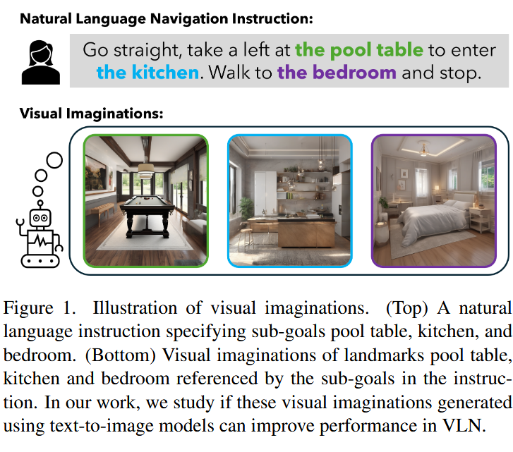

## 论文总结

使用扩散模型的思路压缩 token？其中，语言作为条件。

### 作者、团队信息、论文标题、论文链接、项目主页
- ​**​作者​**​: Akhil Perincherry, Jacob Krantz, Stefan Lee  
- ​**​团队​**​: Oregon State University  
- ​**​论文标题​**​: Do Visual Imaginations Improve Vision-and-Language Navigation Agents?  
- ​**​论文链接​**​: [ArXiv](https://arxiv.org/abs/2503.16394)  
- ​**​项目主页​**​: [VLN-Imagine](https://www.akhilperincherry.com/VLN-Imagine-website/)  

### 主要贡献
1. ​**​生成视觉想象数据集的流程​**​: 提出基于文本到图像扩散模型的 pipeline ，生成与导航指令中地标对应的视觉想象（visual imaginations），并发布包含 41k+ 图像的 R2R-Imagine 数据集。  
2. ​**​模型无关的集成方法​**​: 设计通用的视觉想象集成框架，通过 imagination encoder 和辅助对齐损失（auxiliary alignment loss）提升现有 VLN 模型的性能。辅助对齐损失是作者提出的显示跨模态对齐机制，强化视觉想象（generated imaginations）与对应文本子指令（sub-instructions）之间的语义关联。其核心思想是通过约束视觉想象的编码与文本描述的嵌入空间对齐，帮助模型更精准地关联语言指令中的地标描述与环境观测。
3. ​**​系统性消融实验​**​: 验证了视觉想象的序列化生成、跨模态对齐损失、编码器设计等关键设计选择的有效性。  

### 研究背景
#### 研究问题
- ​**​核心问题​**​: 通过文本生成的视觉想象（如地标图像）是否能作为导航线索提升 VLN 代理的性能？  
- ​**​现有难点​**​:  
  1. 传统方法依赖跨模态对齐机制隐式关联文本与视觉地标，但下游任务训练可能导致语义对齐能力退化；  
  2. 长尾分布地标（如 “蝴蝶雕塑”）难以通过有限训练数据充分学习。  

#### 相关工作
- ​**​VLN 模型​**​: HAMT（层次化 Transformer）、DUET（双尺度拓扑图编码）等基于预训练跨模态对齐的模型。  
- ​**​图像生成与 VLN​**​:  
  - ADAPT（检索训练集图像）受限于封闭环境；  
  - Pathdreamer（预测未来观测）未利用指令文本生成图像。  
- ​**​认知科学启发​**​: 人类通过心理意象（mental imagery）辅助导航决策。  

### 方法

VLN 任务中，agent 接收一个自然语言导航指令，根据视觉观察做出一系列的动作来导航。L 个单词的指令记为 $W = (w_1, w_2, \cdots, w_L)$。时间步 t 处的全景视觉观察 $O_t$ 包含 K 个视图的图像，有 $O_t = (I_1^t, I_2^t, \cdots, I_K^t)$。延续以前工作，取 K=36，包含 12 个方向，并且各自有 3 个俯仰角的图像。

使用子集 $\mathcal{A}_t \subset O_t$ 表示 Navigable directions。在每步，agent 选择动作 $a_t \in \mathcal{A}_t \cup \{\text{stop}\}$ 来决定移动或终止 episode。通常，Agent 是策略网络 $\pi_\theta(a_t \mid W, O_{\leq t})$，根据 W 和 $O_t$ 生成动作 a_t。θ 代表参数，可以预训练或模仿学习，强化学习。

1. ​**​视觉想象生成​**​:
   - ​**​指令分割​**​: 一些指令包含视觉地标 (visual landmark)。比如 "go past the couch"，一些则不包含，比如 "go straight then left"。使用 FG-R2R 分割指令为子指令（在 R2R 数据集中，平均每条指令包含 3.66 条子指令）；每个指令 W 分解为 m 段 (segments)，
   - ​**​子指令过滤​**​: 在生成图像想象前，移除无名词短语或模糊指代（如 “左转”）；  
   - ​**​图像生成​**​: 过滤后的子指令作为条件，传递给扩散模型。使用 SDXL 扩散模型生成室内场景图像，添加正/负提示词（如 “室内” / “人类”）。  

2. ​**​模型集成​**​:  
   - ​**​编码器设计​**​: 使用预训练 ViT + MLP 编码想象图像，拼接至语言嵌入；  
   - ​**​辅助损失​**​: 通过余弦相似度损失对齐子指令名词短语与视觉想象嵌入；  
   - ​**​微调策略​**​: 分阶段训练（冻结→联合→全参数）缓解灾难性遗忘。  

### 实验与结论
#### 实验结果
- ​**​R2R 数据集​**​:  
  - HAMT-Imagine: Val-Unseen SR↑1.0（66.24→67.26），SPL↑0.5（61.51→62.02）；  
  - DUET-Imagine: Test-Unseen SR↑2.0（69→71）。  
- ​**​REVERIE 数据集​**​: DUET-Imagine SR↑1.3（46.98→48.28），RGS↑0.82。  
- ​**​关键发现​**​:  
  1. 想象需与指令对齐（错误想象降低性能）；  
  2. 序列化想象优于仅目标想象（SR↑0.5）；  
  3. 辅助损失提升跨模态对齐（SPL↑0.4）。  

#### 定性分析
- ​**​注意力可视化​**​: 想象图像在跨模态 Transformer 中优先关注语义匹配的观测（如 “斑马床背板” 想象关注真实斑马图案）。  

### 不足
1. ​**​计算成本​**​: 生成和编码想象增加推理开销（单图像生成需 3.2s / H100 GPU）；  
2. ​**​环境未接地性​**​: 想象未与具体环境绑定，无法处理个性化指代（如 “客厅的蓝色沙发”）；  
3. ​**​扩展方向​**​: Sim2Real 迁移、基于想象的 VLN 世界模型等。  

## insight

使用

## Ref and Tag

主页：https://www.akhilperincherry.com/VLN-Imagine-website/