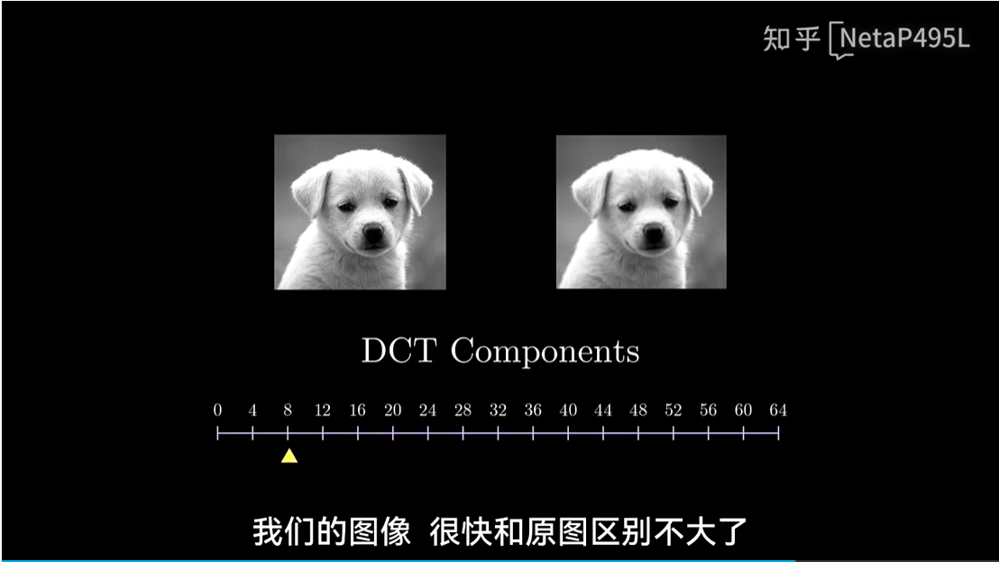

## 以 JPEG 算法应用为例

选取图像中的区域，像素值的分布就像信号一样。

以频率的视角来理解这样的曲线，变换通常较为平缓，所以可以舍弃部分不重要的，变换激进的部分，实现算法的压缩。DCT 便是如此的算法。

我们有信号的曲线，根据这些像素点，显然不能解出曲线真正的方程，即信号真正的含义。DCT 将像素值的点形成的曲线，表示为余弦波的样本点的和，思想类似傅里叶级数来表示函数。输入多少信号（样本点），DCT 输出对应数量的点。

 

从简单的例子出发，对理解复杂的例子很有帮助。比如简单的余弦波 cos(x) 的表示：

可以看到，只有第 1 个余弦波起作用，所以仅 X1 为 1，其他为 0。同样地，改变余弦波振幅，右侧的值 X1 也会对应增大和减小。信号符合频率 k 的余弦波，则 DCT 输出对应 Xk 的值为非 0。X0 代表偏移。当然，如果需要使用余弦波表示信号，最好先将信号偏移到正负两端大致对称，方便余弦波更好地映射。

DCT 的核心是分解各个基本模式（类似部分 VLA 提到的原子技能的思想），通常比例子中更复杂。各个像素值的排列组合，总能用对应数量的余弦波之和表示。比如，八个像素值的排列组合，总能用八个余弦波之和表示。

$$
X_k=\Sigma_{n=0}^{N-1}x_n\cos(\frac{\pi}{2N}(2n+1)k)
$$

用向量的形式表示，右侧分子部分是奇数。X_k 可以表示为向量点乘的形式，以 N=8 为例：

$$
X_k=\vec{C_k^T}\vec{x} \\
\vec{C}_k =
\begin{bmatrix}
\cos\left(\frac{\pi}{16} \cdot 1 \cdot k\right) \\
\cos\left(\frac{\pi}{16} \cdot 3 \cdot k\right) \\
\cos\left(\frac{\pi}{16} \cdot 5 \cdot k\right) \\
\vdots \\
\cos\left(\frac{\pi}{16} \cdot 15 \cdot k\right)
\end{bmatrix}
$$

不同的 k 之间的行向量 $\vec{C}_k$ 是正交的，点乘的结果为 0，代表此系数下标对应频率不会对其他频率有贡献。

DCT 具有可逆性，可以无损地还原信号，与逆矩阵相乘即可。

JPEG 将图像分割 8x8 小矩阵，各元素减去 128，使得值域中心为 0；对每行做 DCT 变换，得到八组系数；对每列做相同变换，得到八组系数。得到 DCT 2D 变换。得到 64 个系数，各系数对应 8x8 图案权重。

可以看到，任何 8x8 的图像格式，可以根据基本模式的权重来表达。

参数权重越高，代表影响越大。作者指出，DCT 2D 得到的 64 个系数中，低频部分的系数贴合图像的能力更强。实验，根据图像得到的 64 个系数中，将所有频率设为 0，从低频到高频的系数以此添加。观察到图像在中间部分，比如添加到 48 个系数时，图像就能很好地恢复了，说明高频部分是可以舍弃的。就算只加入小部分的频率，信号和图像与原图相差无几。

图像越亮，像素值越大。右图的 z 轴代表像素值。DCT 2D 系数集中在低频部分的性质，称为 Energy Compaction。这使得我们在不降低观感时，压缩图像。

可以看到，使用低频都能够较好地还原轮廓。在 16 时，即四分之一时，肉眼难以分辨了。

JPEG 丢弃高频部分的操作，称为量化。

量化表中，右下部分代表高频，通常是想要舍弃的部分，所以设置较大值，使得除法操作通常得到 0。

此思路十分契合 Huffman Code 的压缩算法。

## Ref and Tag

【离散余弦变换可视化讲解】 https://www.bilibili.com/video/BV1bc411q7YG/?share_source=copy_web&vd_source=fe1db0b3f565b5940b244b9c7f7b4fa1